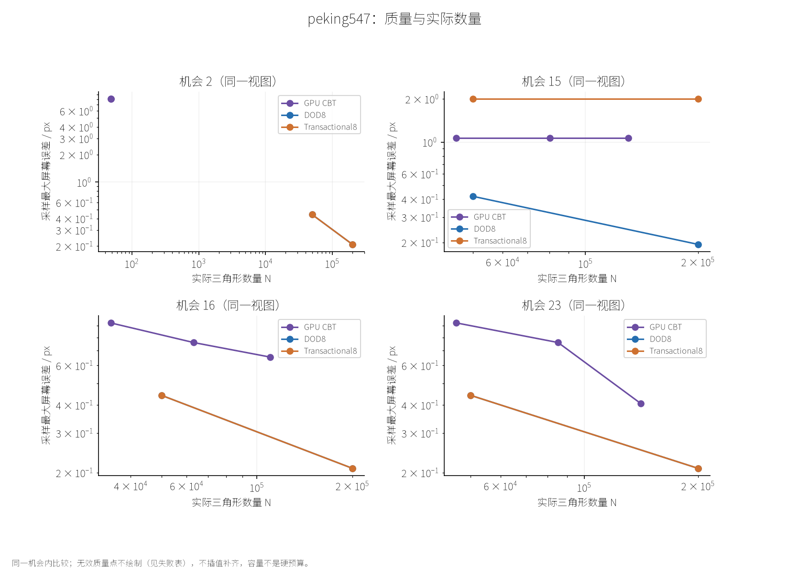
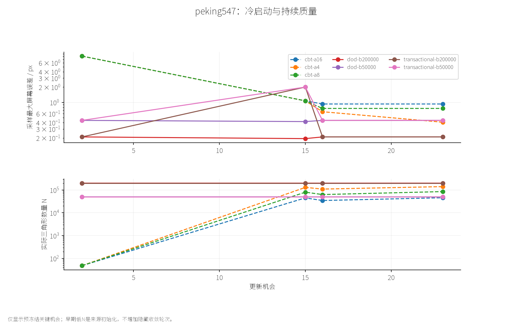
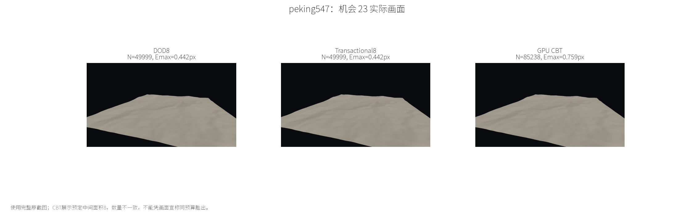
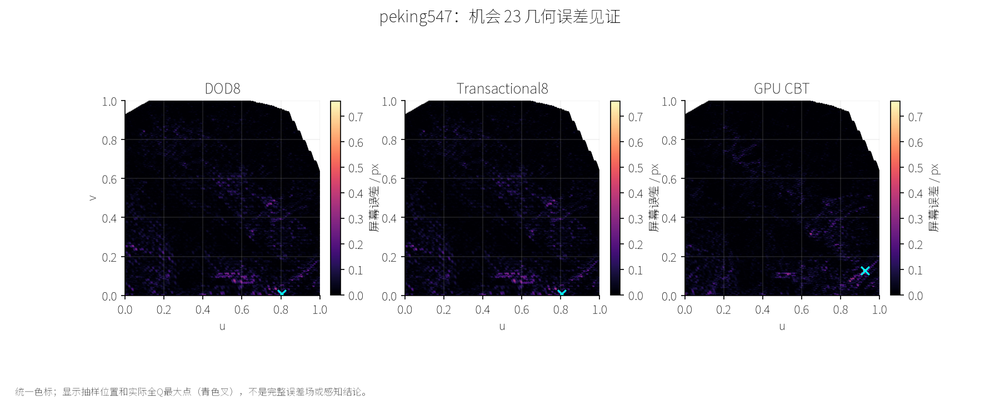
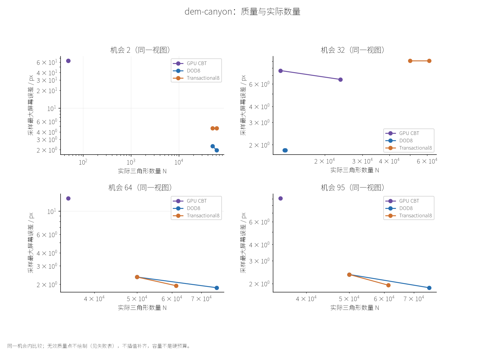
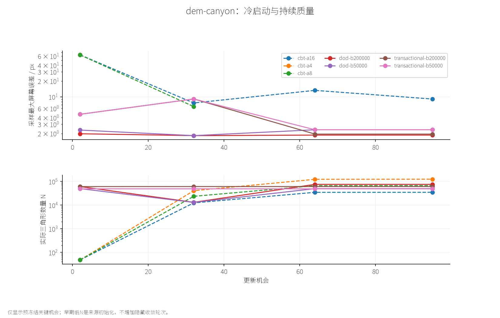
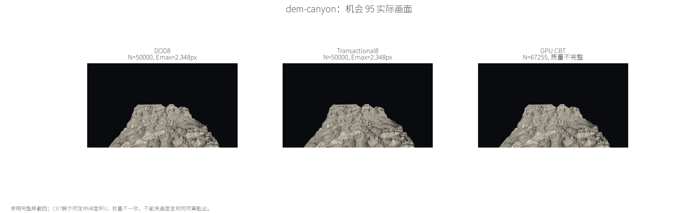
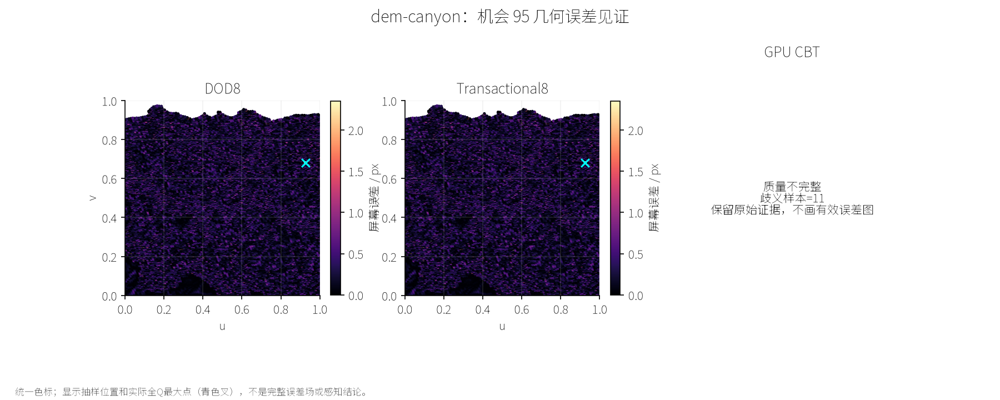

# CBT 接入后的首轮有限比较

本报告来自预冻结的两个资产和14个配置，每配置一次独立timing/visual进程；帧不是独立统计重复。

28个运行完成；56个关键帧中51个质量评价有效，5个CBT canyon点因覆盖歧义无效。有限比较已收口，不能解释为全部质量门禁通过。

平台接入与同代GPU质量证据已建立。下表描述实际N与采样几何误差，不把槽池容量当预算，不将不同N自动判成公平性能胜出。

## 协议与来源

原始证据：/mnt/d/CPP-Projects/WorkloadAwareROAM/benchmark-output/cbt-2024/cbi-04。协议及程序SHA见 [protocol.json](cbi_04/protocol.json)；CSV和图可由保存的原始结果重建。

CPU固定使用CBI-02程序，CBT使用CBI-03程序；CBI-03的CPU工程回归仍OPEN。当前性能列是不同执行/二进制的描述，不能用于论文speedup主张。

CBT面积16/8/4，动态512K，off/modified；CPU预算50k/200k，DOD8与固定旧点+flip恢复的Transactional8。D3D12 1280×720，路线/尺度沿原FER。

## 末机会质量与数量

| 资产 | 配置 | 实际 N | Emax / px | RMS / px | Hmax | 最坏 UV / 状态 |
|---|---|---:|---:|---:|---:|---|
| peking547 | peking547-cbt-a16 | 45844 | 0.9280 | 0.0529 | 0.2448 | (0.921245, 0.124542) |
| peking547 | peking547-cbt-a8 | 85238 | 0.7589 | 0.0309 | 0.2448 | (0.923993, 0.128205) |
| peking547 | peking547-cbt-a4 | 140913 | 0.4070 | 0.0181 | 0.1676 | (0.905983, 0.114774) |
| peking547 | peking547-dod-b50000 | 49999 | 0.4419 | 0.0358 | 0.1676 | (0.804029, 0.007326) |
| peking547 | peking547-transactional-b50000 | 49999 | 0.4419 | 0.0356 | 0.1676 | (0.804029, 0.007326) |
| peking547 | peking547-dod-b200000 | 200000 | 0.2092 | 0.0112 | 0.1676 | (0.613553, 0.097985) |
| peking547 | peking547-transactional-b200000 | 200000 | 0.2092 | 0.0110 | 0.1676 | (0.613553, 0.097985) |
| dem-canyon | dem-canyon-cbt-a16 | 34973 | 9.0697 | 0.6628 | 2.4980 | (0.129557, 0.932292) |
| dem-canyon | dem-canyon-cbt-a8 | 67255 | — | — | — | 质量不完整 |
| dem-canyon | dem-canyon-cbt-a4 | 125407 | — | — | — | 质量不完整 |
| dem-canyon | dem-canyon-dod-b50000 | 50000 | 2.3482 | 0.2990 | 1.1659 | (0.925781, 0.681641) |
| dem-canyon | dem-canyon-transactional-b50000 | 50000 | 2.3482 | 0.2992 | 1.1659 | (0.925781, 0.681641) |
| dem-canyon | dem-canyon-dod-b200000 | 75764 | 1.8569 | 0.2010 | 1.1659 | (0.237305, 0.915039) |
| dem-canyon | dem-canyon-transactional-b200000 | 61278 | 1.9417 | 0.2490 | 1.1659 | (0.289062, 0.240234) |

## 无效质量证据

以下点保留原始输出，质量指标留空，不进入Dmax或质量优势判断。没有放宽评价器容差，也没有调参数替换失败点。

| 配置 | 机会 | 实际N | 歧义样本 | 缺失样本 |
|---|---:|---:|---:|---:|
| dem-canyon-cbt-a8 | 64 | 66756 | 11 | 0 |
| dem-canyon-cbt-a8 | 95 | 67255 | 11 | 0 |
| dem-canyon-cbt-a4 | 32 | 40956 | 1 | 0 |
| dem-canyon-cbt-a4 | 64 | 123986 | 123 | 0 |
| dem-canyon-cbt-a4 | 95 | 125407 | 123 | 0 |

有限定位见 [vertex-coherence-audit.json](cbi_04/vertex-coherence-audit.json)：对canyon末机会三个CBT网格，按实际世界XZ归并后，未发现同位置不同高度、同位置不同UV、边重数大于2或未配对内部边。它排除了这几种直接输出破损现象，不能证明完整共形性或评价器有误。歧义来自几何、参数域还是数值判定仍为UNCERTAIN；本轮不改shader和容差。

最近数量参考若无效，Dmax仍留空；不会改选另一个有效但更远的CBT点。

完整四关键机会数值见 [observations.csv](cbi_04/observations.csv)。最大误差是固定Q上的sampled maximum；RMS是可见参数域样本等权，不是屏幕面积加权。

## 逐点退化与数量匹配

Dmax定义为同一可见参考域上逐点误差差的最大值，正值说明至少一个点Transactional更差；负值才说明所有可见采样点均更好。它不替代绝对Emax。

| 资产/机会 | Transactional配置 | 参考配置 | N比值 | 近数量≤10% | Dmax / px |
|---|---|---|---:|---|---:|
| peking547/2 | peking547-transactional-b50000 | peking547-cbt-a4 | 1041.646 | 否 | 0.3231 |
| peking547/2 | peking547-transactional-b50000 | peking547-dod-b50000 | 1.000 | 是 | 0.0000 |
| peking547/15 | peking547-transactional-b50000 | peking547-cbt-a16 | 1.108 | 否 | 1.9030 |
| peking547/15 | peking547-transactional-b50000 | peking547-dod-b50000 | 1.000 | 是 | 1.9774 |
| peking547/16 | peking547-transactional-b50000 | peking547-cbt-a8 | 0.792 | 否 | 0.3898 |
| peking547/16 | peking547-transactional-b50000 | peking547-dod-b50000 | 1.000 | 是 | 0.1011 |
| peking547/23 | peking547-transactional-b50000 | peking547-cbt-a16 | 1.091 | 是 | 0.3282 |
| peking547/23 | peking547-transactional-b50000 | peking547-dod-b50000 | 1.000 | 是 | 0.1011 |
| peking547/2 | peking547-transactional-b200000 | peking547-cbt-a4 | 4166.667 | 否 | 0.1600 |
| peking547/2 | peking547-transactional-b200000 | peking547-dod-b200000 | 1.000 | 是 | 0.0000 |
| peking547/15 | peking547-transactional-b200000 | peking547-cbt-a4 | 1.535 | 否 | 1.9720 |
| peking547/15 | peking547-transactional-b200000 | peking547-dod-b200000 | 1.000 | 是 | 1.9919 |
| peking547/16 | peking547-transactional-b200000 | peking547-cbt-a4 | 1.818 | 否 | 0.1911 |
| peking547/16 | peking547-transactional-b200000 | peking547-dod-b200000 | 1.000 | 是 | 0.0749 |
| peking547/23 | peking547-transactional-b200000 | peking547-cbt-a4 | 1.419 | 否 | 0.1888 |
| peking547/23 | peking547-transactional-b200000 | peking547-dod-b200000 | 1.000 | 是 | 0.0749 |
| dem-canyon/2 | dem-canyon-transactional-b50000 | dem-canyon-cbt-a4 | 1041.667 | 否 | 1.6983 |
| dem-canyon/2 | dem-canyon-transactional-b50000 | dem-canyon-dod-b50000 | 1.000 | 是 | 4.6369 |
| dem-canyon/32 | dem-canyon-transactional-b50000 | dem-canyon-cbt-a4 | 1.221 | 否 | — |
| dem-canyon/32 | dem-canyon-transactional-b50000 | dem-canyon-dod-b50000 | 3.841 | 否 | 9.1048 |
| dem-canyon/64 | dem-canyon-transactional-b50000 | dem-canyon-cbt-a16 | 1.434 | 否 | 1.8223 |
| dem-canyon/64 | dem-canyon-transactional-b50000 | dem-canyon-dod-b50000 | 1.000 | 是 | 1.7298 |
| dem-canyon/95 | dem-canyon-transactional-b50000 | dem-canyon-cbt-a16 | 1.430 | 否 | 1.8223 |
| dem-canyon/95 | dem-canyon-transactional-b50000 | dem-canyon-dod-b50000 | 1.000 | 是 | 1.7298 |
| dem-canyon/2 | dem-canyon-transactional-b200000 | dem-canyon-cbt-a4 | 1271.042 | 否 | 1.4583 |
| dem-canyon/2 | dem-canyon-transactional-b200000 | dem-canyon-dod-b200000 | 0.996 | 是 | 4.6369 |
| dem-canyon/32 | dem-canyon-transactional-b200000 | dem-canyon-cbt-a4 | 1.495 | 否 | — |
| dem-canyon/32 | dem-canyon-transactional-b200000 | dem-canyon-dod-b200000 | 4.658 | 否 | 9.1048 |
| dem-canyon/64 | dem-canyon-transactional-b200000 | dem-canyon-cbt-a8 | 0.918 | 是 | — |
| dem-canyon/64 | dem-canyon-transactional-b200000 | dem-canyon-dod-b200000 | 0.809 | 否 | 1.9417 |
| dem-canyon/95 | dem-canyon-transactional-b200000 | dem-canyon-cbt-a8 | 0.911 | 是 | — |
| dem-canyon/95 | dem-canyon-transactional-b200000 | dem-canyon-dod-b200000 | 0.809 | 否 | 1.9417 |

CBT参考仅按同机会实际N最近选择，与误差结果无关；数量不近时保留不匹配，不插值或追加阈值。DOD参考固定同CPU预算。

## 分边界时间

| 配置 | CPU update ms | 帧包络 ms | CPU上传 ms | GPU计算 ms | GPU绘制 ms | GPU计算/绘制样本 |
|---|---:|---:|---:|---:|---:|---:|
| peking547-cbt-a16 | 0.0506 | 1.0100 | 0.0000 | 0.0793 | 0.0143 | 19/19 |
| peking547-cbt-a8 | 0.0350 | 0.2079 | 0.0000 | 0.0866 | 0.0189 | 19/19 |
| peking547-cbt-a4 | 0.0322 | 0.1999 | 0.0000 | 0.0957 | 0.0228 | 19/19 |
| peking547-dod-b50000 | 42.9208 | 44.5658 | 1.0618 | — | — | 0/0 |
| peking547-transactional-b50000 | 34.8522 | 35.3641 | 0.0103 | — | — | 0/0 |
| peking547-dod-b200000 | 196.8642 | 200.8273 | 3.2246 | — | — | 0/0 |
| peking547-transactional-b200000 | 706.4193 | 707.0435 | 0.0341 | — | — | 0/0 |
| dem-canyon-cbt-a16 | 0.0337 | 0.1660 | 0.0000 | 0.0745 | 0.0130 | 91/91 |
| dem-canyon-cbt-a8 | 0.0349 | 0.1777 | 0.0000 | 0.0780 | 0.0181 | 91/91 |
| dem-canyon-cbt-a4 | 0.0403 | 0.8172 | 0.0000 | 0.0840 | 0.0251 | 91/91 |
| dem-canyon-dod-b50000 | 18.5553 | 19.5757 | 0.3480 | — | — | 0/0 |
| dem-canyon-transactional-b50000 | 17.4928 | 18.2272 | 0.0070 | — | — | 0/0 |
| dem-canyon-dod-b200000 | 22.9117 | 24.5923 | 0.9626 | — | — | 0/0 |
| dem-canyon-transactional-b200000 | 27.2036 | 29.1003 | 1.2119 | — | — | 0/0 |

去3预热；GPU样本按资源/采样代去重并映射其实际机会，尾部缺失不补轮次。计算与绘制不跨代相加。CBT CPU update只包含主机命令记录，不能除以CPU算法时间称并行加速。捕获/质量成本不计入timing。

## 结果解释

### Peking：返回视图存在近数量优势，转向帧存在反例

机会23，Transactional为49,999面、Emax=0.441886px；CBT面积16为45,844面、Emax=0.927970px。前者多约9.06%的三角形、最大误差低约52.38%，属于预声明的近数量描述点。它不是精确同N证明，也不是逐点支配：对应Dmax仍为+0.328234px。

机会15不能省略：Transactional两预算点的Emax均为1.996557px，CBT三个面积点为1.069818px，DOD约0.42/0.19px。当前Transactional没有跨视图统一质量优势；返回后误差下降也不能仅凭全局Emax解释成困难区域已经恢复。

200k末机会的0.209150px低于CBT面积4的0.407000px，但双方实际N为200,000和140,913，相差41.93%，不足以判断同数量优势。Transactional与DOD末帧Emax相同仍不代表逐点质量相同：50k/200k的Dmax分别为+0.101125/+0.074878px。也不能把相同Emax完全归因于新事务算法，初始DOD种子是持续状态的一部分。

### Canyon：有效比较覆盖不足，保留质量失败与实际预算利用率

面积16末机会34,973面、9.069726px；CPU 50k点为50,000面、2.348193px。数量相差约42.97%，不能据此宣布同预算优于CBT。面积8/4的末机会质量无效，尤其最接近Transactional 200k配置的面积8点不能参与胜负判断。

CPU的200k是预算上限：末机会DOD实际75,764面，Transactional实际61,278面，利用率约37.88%和30.64%。两者Emax为1.856884和1.941665px，不能把差异全部解释为排序策略；数量利用不同必须一并报告。机会32，Transactional约9px而有效CBT点约6～8px、DOD约1.8px，同样不支持持续质量普遍占优。

### 时间：GPU参考已有低计算成本，CPU完整收益仍未成立

有效GPU计算样本均值约0.074～0.096ms，绘制另计；这建立了参考的实际设备成本。CPU主机记录、GPU完成时间和帧包络不同，不能直接互除获得同任务加速比。

本轮CPU描述也不是统一正结果：Peking 50k的Transactional/DOD约34.85/42.92ms，200k则约706.42/196.86ms。后者表明现有大配置仍很昂贵，本阶段没有新增归因探针，不能从总时间推定全部由reservation造成。CBI-03 CPU工程回归独立保持OPEN；不同程序、单次进程及不同质量/实际N共同限制性能结论。

## 图与视觉证据

## 状态与适用范围

- 平台持续接入：通过有限设备/生命周期检查。
- 同代实际GPU质量证据：通过，未用CPU重建替代。
- 有限面板执行与报告：完成；51/56质量点有效，5点明确无效。
- Canyon部分CBT采样覆盖：FAIL，原因待查，不扩张为全部CBT输出失效。
- CPU工程性能：CBI-03回归待查，不能宣布无回归。
- 跨算法同质量性能与论文竞争性：未由本轮证明。

CBT与CPU的初始化、目标函数和预算语义不同；早期收敛/末帧质量必须共同阅读。单轮结果不支持总体显著性、人眼可接受阈值或连续曲面误差保证。

复现脚本与命令见[执行事实](../../codebase/cbt_2024/comparison_workflow.md)。数值归约：[时间CSV](cbi_04/timings.csv)、[逐点配对CSV](cbi_04/pairs.csv)、[完整分析JSON](cbi_04/analysis.json)。原始运行身份与归档摘要见[证据索引](cbi_04/evidence-manifest.json)。
