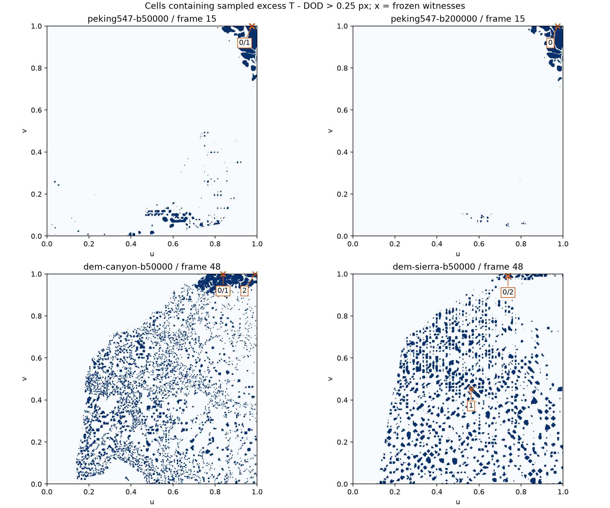
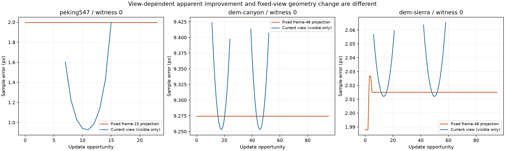

# QPC-01：质量来源与恢复阻塞审计结果

2026-09-16。基线`01c0583`；[小规划](../../plans/cpu_refinement/qpc_01_quality_recovery_audit_plan.md)、[代码事实](../../codebase/cpu_refinement/qpc_01_quality_recovery_facts.md)、[审查](../../reviews/cpu_refinement/qpc_01_quality_recovery_review.md)。状态：**诊断闭环完成，等待用户验收；持续质量未修复，不进入QPC-02。**

## 1. 结论与适用范围

本轮发现三个不同的恢复阻塞，不能统一解释为prefix不足。

1. **Peking与峡谷的所选外边界残差来自种子，并被当前原语集合锁定。** 固定旧点＋E/F/H＋内部删点＋内部翻边都保留外边界折线。即使增大预算、增加轮数或让该根进入prefix，也不能改变边界上的高度。Peking50k与200k的最坏点确实落在同一条种子边上，不是“最大值恰好一样”。
2. **山地最坏近边界点同时包含种子误差、新点拟合退化和目录/前缀阻塞。** 固定frame48投影下，种子1.987960px，frame3升至2.026711px，frame5降至2.015012px，之后保持。它不是域边界点，不能套用第一项不变量。
3. **山地另外几处内部残差主要受候选阈值约束。** 问题帧的全部覆盖根均低于4px priority门槛；有空预算也不会自动产生细分请求。DOD在同点误差很小，不能因此说当前策略违反了自己的阈值；这暴露的是相同数字阈值不等于相同质量策略。

本轮没有新增质量原语、修改高度政策、放宽形状约束、扩大prefix、增加恢复轮数或优化性能。有限代表点不能解释全部误差簇；局部目录失败也不等于任意局部重构数学不可行。

## 2. 实验身份与证据

复用FER-02原始resolved、height、camera、D3D12 ZO矩阵与8线程设置。Peking24机会，峡谷/山地96机会；实际执行240机会。四条trace逐帧与FER的hash、面数、候选/需求/可行/执行/配对/冲突/复用/样本触及账本，以及五项flip计数完全一致。额外追溯在Plan冻结batch后只读执行，使用独立诊断账本。

| 轨迹 | B / prefix | 末面数 | 预算交换 / 空额细分 / 翻边 | 暖段零拓扑机会 | 追溯进程耗时 |
|---|---:|---:|---:|---:|---:|
| Peking50k | 50000 / 160 | 49999 | 145 / 0 / 1 | 10/21 | 4.65s |
| Peking200k | 200000 / 640 | 200000 | 522 / 0 / 1 | 9/21 | 25.19s |
| canyon50k | 50000 / 160 | 50000 | 77 / 0 / 1 | 76/93 | 15.33s |
| sierra50k | 50000 / 160 | 8976 | 0 / 92 / 2 | 80/93 | 4.50s |

追溯耗时包含种子、全域只读定位/检查与日志，不是算法update时间，更不能与FER平台CPU-ready直接比较。四条共49.67s，没有触及180s/8GiB上限，没有因慢或失败删样。

原始产物：`benchmark-output/cpu-refinement/qpc-01/run-01/`。可审计精简产物：

- [summary.json](data/qpc_01_quality_recovery/summary.json)：执行身份、见证、目标帧所有覆盖根、恢复原因和兼容检查。
- [selection.json](data/qpc_01_quality_recovery/selection.json)：运行前选样规则、全部所选ordinal/UV和原始Q/source/view/文件身份。
- [witnesses.csv](data/qpc_01_quality_recovery/witnesses.csv)：真实seed、每机会批前/批后高度，当前/固定未来/返回投影。
- [root-decisions.csv](data/qpc_01_quality_recovery/root-decisions.csv)：全部覆盖根的rank、priority、阈值、实际目录尝试和预留解释。
- [geometry-events.json](data/qpc_01_quality_recovery/geometry-events.json)：确实改变见证高度的事务、新旧几何和未拟合反事实。
- [clusters.csv](data/qpc_01_quality_recovery/clusters.csv)：全部预选误差簇，不只保存正例或最大簇。

## 3. 误差区域与预先冻结的选点

用已有完整误差数组计算共同可见Q上的`eT(q)-eDOD(q)>0.25px`。样本映射原raster cell，域边界clamp到末cell，按占用cell八邻域分簇；这是诊断分组，不是连续曲面连通性证明，也不是屏幕面积占比。

每个问题帧选择原Emax点、最大样本簇内最大excess点、全局最大excess所属簇的代表点，重复合并。最后冻结2/1/3/5个见证条目；山地同UV可在两个固定未来投影组中重复。本轮不根据新trace结果换点。

| 输入/问题帧 | 超额样本/共同可见样本 | 比例 | 簇数 | 最大簇样本 | 最大簇占超额样本 |
|---|---:|---:|---:|---:|---:|
| Peking50k/15 | 35179/1712379 | 2.0544% | 141 | 7932 | 22.55% |
| Peking200k/15 | 22498/1712379 | 1.3138% | 42 | 7705 | 34.25% |
| canyon50k/48 | 131219/1114577 | 11.7730% | 1988 | 20454 | 15.59% |
| sierra50k/48 | 145425/1155480 | 12.5857% | 1004 | 1398 | 0.96% |
| sierra50k/95 | 141377/1503180 | 9.4052% | 1324 | 1267 | 0.90% |



**数据修正。** FER的`locations.csv`是稀疏可视化记录，并不是全Q坐标表。本次依照`TerrainMeshBuilder`的float UV及`EvaluateSamples(k=0)`的首次顶点/边/重心发射顺序重建坐标；与各保存位置逐条严格一致，另以三个小矩形网格的独立逐项枚举检查。没有把可视化子集当成全量分布。两算法的Q/source/pose/projection身份及输入文件SHA均先核对。

## 4. Peking：边界恢复能力缺失，不是200k仍不够

主见证`qP=(0.9743589758872986,1)`。50k与200k种子在该处都使用：

```text
id=110: (u,v,h)=(0.9375,1,1.731403112411499)
id=3:   (u,v,h)=(1,1,1.7395284175872803)
```

见证高度`1.736194959252316`，bilinear reference高度`1.9037766066970527`，差`-0.16758164744473669`。两个预算的真实seed、全部批前/批后都相同。固定frame15误差始终`1.9965571109865088px`。同点DOD50k为`.020611510px`，DOD200k为`.004685191px`；这些是同点误差，不是DOD全局Emax。

50k另一个最大簇/excess代表`q=(.976190447807312,1)`也在此边上：seed→问题帧始终`1.980858078px`，同点DOD`.003488760px`。

恢复链并非全程没有工作：

- frame7该区域存在可认证E请求，诊断中本根未选中时是被更高优先事务占用阻挡；没有未解释的可用exchange。
- 后续覆盖根发生变化，但边界两端点与整条折线没有变化。修改相邻内部面不等于恢复边界几何。
- frame15，50k根rank192，超过160；200k根rank104，已经进入640。200k实际尝试是E形状失败、另一E拟合失败、F/H形状失败。**200k已经消除了这个时刻的prefix障碍，却没有消除原语表达能力障碍。**
- 原`IntentResult=shape_infeasible`是最后目录结果，不代表所有尝试都是形状失败；报告保留完整Attempts，不把混合失败误写成统一形状证明。

## 5. 外边界不变量：限定到当前生产事务语言

以合法种子、immutable surviving heights、当前生产生成且经提交核查的事务为前提，记域外边界分段线性高度为`h∂,t`。

| 现有操作 | 对域外边界的作用 |
|---|---|
| E | ReceiverCursor仅枚举Count=2的内部共享边；新点不在域外边界 |
| F | 在根面严格内部或重心插点，保留三条旧边 |
| H | 跳过boundary中心；immutable下旧点没有自由高度，面内插点不细分域外边 |
| donor | BuildOrders及局部索引修复排除boundary顶点；删内部点，耳切保留one-ring环边和旧点高度 |
| R翻边 | 只处理双侧内部边；两面外接口和四个旧点几何不变 |
| batch publish | 只合成获批的上述局部替换，不另行生成边界细分 |

逐个事务保留外边界线段集合及端点几何，因此批量应用与跨批归纳得到：

`h∂,t(u,v)=h∂,0(u,v)`。

它支持的结论是：**在当前事务语言下，种子外边界上的表示误差没有恢复操作。** 增prefix、换donor、增加预算/轮数都不能单独改变这个事实。它不证明ROAM、任意事务算法或所有局部重构不能恢复边界，也不是Lean验证的新定理。

本轮每帧另外比较完整外边界边集合、稳定身份、UV和高度；四条分别401/766/316/162条边，全程不变。有限验证支持代码论证，但不冒充所有状态穷举。

## 6. 峡谷：高误差根已进入前缀，仍无法改变边界

frame48主点`(.837890625,1)`来自种子边`u∈[.8125,.875]`。seed固定未来误差就是`9.274476737px`，整个96机会不变；同点DOD`.487557671px`。

最大簇代表`(.8359375,1)`的`8.889741298px`与最大excess代表`(.98828125,1)`的`8.972328616px`也全程不变；后两者DOD同点分别约`2.11e-7px`与`1.71e-6px`。

主覆盖根在frame6真正执行过E，但边界高度保持。frame48根rank65，已进入160；E/F/H实际全部形状失败，翻边目录出现非凸/既存对角线、quality_infeasible、flip_not_interior，恢复耗尽。主点在96次根观察中有59次flip_exhausted、30次outside_prefix，另有初期形状失败和一次实际E。

最大excess点在frame48为rank223，确有prefix障碍；但它同样位于固定外边界。不能据此推断扩大prefix就能降低其误差。也不能把所选边界点的结论推广到131219个超额样本——最大簇也只占15.59%，内部点尚无逐点因果覆盖。

## 7. 山地：种子、拟合、目录与阈值四层分开

### 7.1 frame48最坏点

`qS=(.73828125,.9921875)`，不是域边界。

| 状态/事件 | 见证高度 | 固定frame48误差 | 该时刻见证可见性 |
|---|---:|---:|---|
| 真实seed | 6.640109062194824 | 1.987960088px | seed另列 |
| frame3：E新点拟合 | 6.644357368334812 | 2.026711412px | 不可见 |
| frame5：E新点拟合 | 6.6430747523428595 | 2.015011667px | 不可见 |
| frame6–95 | 保持 | 保持 | 随相机变化 |

frame3增加`.038751324px`，frame5恢复`.011699745px`，净增加`.027051578px`。两次局部反事实中，把新点高度改回拟合前的旧曲面插值，则见证高度恰好回到各自批前值；连接变化在此见证的这两次事件中没有引入额外高度差。旧点没有改高，也没有donor作用——山地整条轨迹`D_need=0`。

frame6/7覆盖根在prefix内，E/F/H形状失败，flip的合法候选未通过质量接受；frame8后开始有prefix障碍。frame48该点同时属于两个面：一个priority4.936132、rank1849；另一个priority3.107538，低于4px门槛。前者没进160，后者根本不在候选集合。**如果只取一个owner，就会漏掉另一条恢复分支。**

### 7.2 广泛内部残差的代表

| 问题帧/见证 | seed固定未来误差→问题帧 | 所有覆盖根在问题帧的priority | 结论 |
|---|---:|---|---|
| 48，最大簇`(.5625,.453125)` | .780734486→.780734486 | 2.678836、2.690301 | 均低于4，未形成请求 |
| 48，最大excess`(.73828125,.98828125)` | 1.963647903→1.955867070 | 3.013522、3.107538 | frame5略改善，问题帧均低于4 |
| 95，Emax/excess`(.05859375,.55078125)` | 1.133568443→1.133568443 | 1.489287、1.489287 | 种子几何不变，问题帧均低于4 |
| 95，最大簇`(.5625,.453125)` | .694446853→.694446853 | 2.191396、2.162593 | 相同UV、不同固定未来投影 |

这些点的误差大于DOD同点，不意味着超过当前算法的4px筛选门槛。生产priority为`max(sampleError², .04*longestProjectedEdge²)`，且仅有限值严格大于`SplitPixels²`才进入索引。不能把`rank=0`误写成“排名在160之后”，也不能通过扩大prefix激活尚未达到门槛的根。

山地末面数8976，预算余41024；169个已认证普通receiver中92个空额执行、77个因冲突未执行，另有2次翻边。没有donor需求。它同时体现了候选/认证流失和预留损失，但**不能用闲置预算证明某个低于阈值的区域理应被当前策略自动细分**。

### 7.3 山脊只复用历史数据

未重跑山脊。FER原记录：末5747面，`D_need=0`，246个receiver中152个空额执行、94次conflict，暖段46/93机会无拓扑更新；frame48/95超额>.25px样本分别3.5455%/4.0518%。

这排除“山脊主要卡在donor预算交换”的解释，但没有山脊见证trace，**不能把山地的具体阈值/形状原因直接移植过去**。是否可复用失败证据、哪些反复尝试必须重算，仍留给独立成本阶段，不在本轮实现缓存。

## 8. 当前视图下降不等于几何恢复



蓝线只画当前可见机会，缺段不是误差为0；橙线始终用固定问题帧投影，包括该时刻不可见的诊断位置。各子图纵轴不同。

Peking/峡谷的当前视图误差可以下降或退出可见域，而固定未来误差和高度完全不变。山地frame5后同理。返回视图Emax下降不能再次被解释成这些见证几何恢复。当前/未来/返回三种投影在CSV中独立保留。

内部double状态与FER实际float输出在11个目标见证条目上的最大屏幕误差差约`9.93e-8px`，远小于讨论量级；这不等于所有样本逐bit一致。实际输出mesh身份则逐帧严格一致。

## 9. 工程核查与费用

- 只构建实验CPU入口及原PQ provenance目标；没有跑全CTest、完整平台矩阵或新增GPU实验。
- 普通Peking50k修改前/后各一个独立进程，24帧hash/工作量一致；暖均值39.1208→38.5578ms（−1.44%）。这是未观察到诊断关闭路径退化的短筛查，不是性能提升统计结论。
- 历史PQ默认两见证的`witnesses.csv/transactions.jsonl/recovery.jsonl`前后逐字节一致，兼容进程5.02/4.84s；原追加见证分支保留。
- 7项输入拒绝检查覆盖空表、越界/非有限UV、越界帧、超配额、输出覆盖和额外未知参数；前五项未创建输出。
- 核心`src/algorithms/greedy_transactional_lod/*`全部文件SHA前后不变。Plan/Apply仍执行真实当前算法，seed之后没有再调用DOD获得目标。
- 初建和末态结构验证、逐帧硬预算/混合计数、全部存活旧点高度、外边界集合以及每个局部预测与批后见证高度均核对。
- 没有未完成trace或被资源上限截断的见证。`fit_bound_failed`、`no_screen_samples`、目录耗尽、冲突分别记录；本轮没有把它们提升为全操作空间无解证明。

**构建限制如实保留。** 现有原生构建最初关闭tests；打开后发现CPU工具在CBT全局runtime宏打开时会经Registry引入D3D12/SDL依赖，无法独立编译。此次CPU诊断构建临时`BUILD_TESTS=ON, ENABLE_CBT_2024=OFF`，相机仍读取原D3D12矩阵；没有修改CBT/Registry或重建应用，末尾恢复原缓存开关。该已有构建组合问题不属于质量审计修复范围，不能宣称本工具已验证CBT-on CPU链接。

## 10. 后续决策所需证据，当前不实施

| 对象 | 已确认的必要问题 | 不能作为充分修复的做法 |
|---|---|---|
| 域外边界残差 | 若要从同一种子恢复，事务语言必须能改变边界表示，或明确重新定义种子/边界质量契约 | 仅扩大prefix/预算/轮数；仅限制新点拟合 |
| 山地内部质量差 | 明确独立质量目标与priority门槛的关系、候选生成何时必须继续 | 以相同4px数字宣称和DOD同质量；用闲置预算自动推导请求 |
| 近边界新点退化 | 区分旧种子占主导的残差与新点拟合净增加；恢复目录和进展另算 | 把全部误差归因于HeightGuard或Fit |
| 执行流失 | 同一质量政策下再分析认证/冲突/无更新成本 | 先优化现有失败重试成本，再默认质量问题自然消失 |

如果后续采用外边界细分，单边分裂通常是净+1面，与现有+2/−2、named credits、事务类型不同，需要独立设计、预算证明和用户Review。本轮没有预先选择这个实现，也没有改变大规划的阶段顺序。

阶段状态：`Diagnostic provenance = complete`；`current catalog boundary = established within stated assumptions`；`general persistent quality = unresolved`；`quality repair = not attempted`。提交本阶段后等待用户验收，后续小规划不自动启动。
