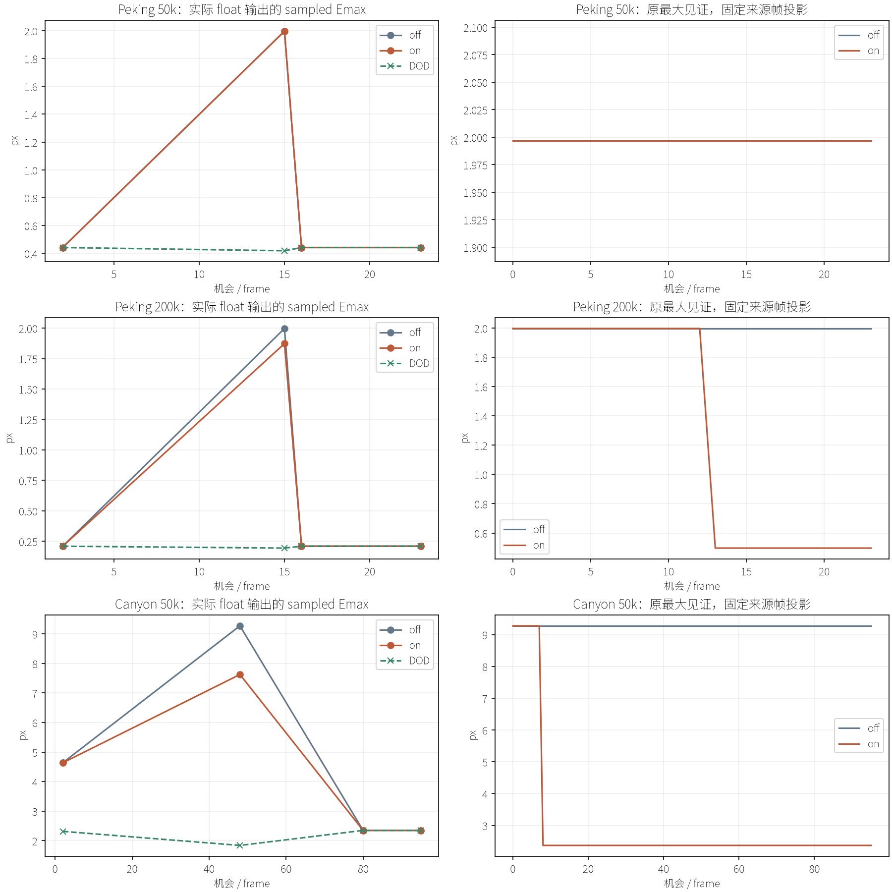
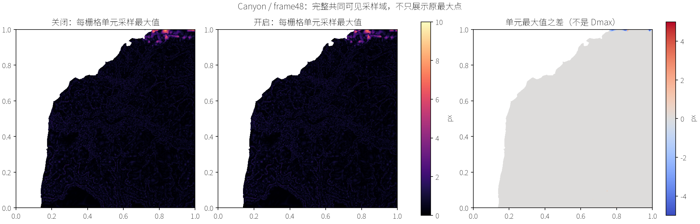

# QPC-04B：外边界事务接入与持续验证结果

日期：2026-09-16。对应[小规划](../../plans/cpu_refinement/qpc_04b_boundary_integration_plan.md)、[代码事实](../../codebase/cpu_refinement/qpc_04b_boundary_integration_facts.md)和[架构审查](../../reviews/cpu_refinement/qpc_04b_boundary_integration_review.md)。源码基线 `b1174d4`；原始证据保留在 `benchmark-output/cpu-refinement/qpc-04b/run-01`，精简数据见 [summary.json](data/qpc_04b/summary.json)。

## 1. 阶段结论

**单侧源高细分已成为真实可续接的生产事务；有限质量结果为混合，默认开关继续关闭。** 本阶段完成后停下交用户验收，不进入后续 QPC 阶段。

| Gate | 结果 | 准确含义 |
|---|---|---|
| 原语/硬预算/局部续接 | PASS | +1 接收、−2 捐赠、净−1发布、边界关联、样本/网格与 Pending 均可继续 |
| 关闭政策兼容性 | PASS | 三输入共144机会的原决策、网格、工作量与边界逐字节保持历史结果 |
| 同政策串并行 | PASS，有限自然证据 | Peking50k完整24机会1/8线程结果及边界账本相同，包含2次B |
| 原边界表达限制解除 | 有限成立 | Peking200k与峡谷原最大见证真实改善；Peking50k原目标仍未兑现 |
| 冻结的有限质量出口 | 未通过 / MIXED | Emax/RMS改善与其他样本退化并存，没有修改预注册接受规则 |
| 默认政策准入 | 不批准 | `EnableBoundaryRefinement=false` 保持；启用属于显式实验选择 |
| Agent视觉检查 | 已完成 | 12组实际同相机前后图及完整误差分布；用户视觉签收仍待验收 |
| 性能竞争性 | 未评价 | 本轮完整计费，不以不同质量/不同事务人口宣称胜过DOD |

此次没有修改前缀、轮数、形状界、旧拟合、捐赠池、预留算法或默认生产政策。

## 2. 实现范围与契约

新增 `TransactionalBoundaryRefinement`，只负责单位域单侧边中点：原三个点固定，唯一新点取 raw U16 双线性源高；旧一面替换为两面。新子边至少为一个源栅格间隔，新点标为边界且不进入回收池。每根仍不超过八项身份，按原稳定边序混合 E/B，随后 F/H；第一个认证成功项锁定接收方。

预算依实际接收成本命名：B为1面、原接收为2面、翻边为0。完整成本不足时走单个−2捐赠方；失败空额不回流，配对B释放的一面到下一批才可用。按真实替换面数量独立验证：

\[
N_{next}=N_{old}+\mathrm{ConsumedFreeFaces}-\mathrm{ReleasedFaces}\le B.
\]

目录、预留、提交、样本、网格仍分属原所有者。Commit 从 Pipeline 临时借用唯一源数据，重新核对结构与源高证书，不把全部源复制进状态。新旧事务使用同一准备与发布路径。正常旁表 `boundary-refinement.csv` 分离面数和接收数量，原共同CSV含义不变。

实现中另外修复了既有适配器的分配异常边界：MSVC空工作账本容器构造可能分配，而原位置在try外；现在在原异常保护内构造。未移除故障注入测试，也未增加生产状态副本。

## 3. 冻结实验与证据身份

| 输入 | 机会 / 线程 | 预算 / 前缀及捐赠池 | 实际 float 质量帧 |
|---|---|---|---|
| Peking50k | 24 / 8；另1线程24机会 | 50,000 / 160 | 2、15、16、23 |
| Peking200k | 24 / 8 | 200,000 / 640 | 2、15、16、23 |
| 峡谷50k | 96 / 8 | 50,000 / 160 | 2、48、80、95 |

沿FER-02的D3D12、1280×720、neutral材质、原相机与资产、前三机会预热。Peking尺度80/12；峡谷原尺度/阈值不变。所有QPC-01见证保留，并加入04A已知最大新增退化位置。新政策从第一机会启用，不在坏帧局部注入。

- 旧平台SHA256：`e34f860ac14971a49d8932b46d664c49b1311591bd31fb4fb0fe6317d20f17b2`。
- 新平台：`e0150ace4a83cb03ecdd2e258a2b09e8dfdf1257ac7fe985f7330aba777e8627`。
- 新CPU追溯入口：`9ccecab0808fcbb93fcf2a371217595c5083b03e6840574e195032078f8c3041`。
- 独立质量程序沿用FER同一二进制：`3bbc626c16199fb6c7a9a0a75507dbd345e247b17d2ca2f293118efdf86029a1`。

运行清单保留源快照、资产/相机/投影与程序身份。关闭轨迹实际mesh哈希与历史质量及截图一致后才复用旧证据。开启的正常/视觉/诊断结果一致；离线质量只对12份新实际float输出重算。评价仍是算法无关k=0采样最大值、参数域等权可见样本RMS及全域高度最大误差，不是连续严格误差界或屏幕面积加权RMS。

自动主采集约260.35秒，12次独立评价合计17.50秒。历史计时差异出现后补两次当前环境关闭政策正常运行，共约27.72秒；没有性能重复矩阵。所有进程均未到180秒/8GiB限制。原失败、构建和测试日志分别保留，不覆盖失败记录。

## 4. 真实执行、预算与边界生命周期

| 输入 | B尝试 / 认证 | B空额 / 配对执行 | 边界点 初始→最终 | 实际面数范围 / 最终 |
|---|---:|---:|---:|---:|
| Peking50k | 528 / 4 | 1 / 1 | 401→403 | 49,999～50,000 / 49,999 |
| Peking200k | 981 / 16 | 5 / 6 | 766→777 | 199,998～200,000 / 199,999 |
| 峡谷50k | 2,429 / 7 | 1 / 4 | 316→321 | 49,998～50,000 / 49,999 |

同一候选跨快照可重复尝试/认证，上表不是独立几何人口。200k出现20次源尺度拒绝；另外两输入为0。B分支冲突拒绝计数为154、3,240、242，是实际配对检查事件，不是失败根数量。

总配对交换由关闭政策的145/522/77变为145/535/83；总空额接收为1/5/2，翻边每条路线仍各1次。峡谷两次空额接收中只有一次B，另一项为原+2接收。因此接收数量不能直接代替面数；配对B累计释放1/6/4面，而实际消费还包括之后快照的新命名。

没有边界预算锁死证据，也不证明长期不会锁死。所有边界点不可回收；解析夹具仅证明源尺度有限终止（四条边共12次细分后停止），不把它解释为长期质量保障。

## 5. 原见证：哪些能力真正兑现

### Peking50k：原目标仍未兑现

真实B发生于frame6、9，但不覆盖原两个边界见证。frame15原最大根排名仍194，位于前160之外；结束时根虽排到2，B/E均没有当前可见样本，F/H形状失败。不能把它写成整条轨迹都仅受前缀限制。

原最大见证及第二点的固定frame15投影分别保持 `1.996557px`、`1.980858px`，直到frame23。全域frame15 RMS从0.115327降至0.112106，说明其他区域有改善，但不能替代本阶段原目标验收。

### Peking200k：frame13已解除原边界表达限制

frame13真实B将原见证高度 `1.736194959→1.862107719`。固定frame15投影误差 `1.996557111→0.496757713px`，到frame23仍保持。这里是几何变化，不是返回视图造成的误差回落。

04A预先登记的内部退化位置同时从 `0.012125244→0.052123414px`，增加约0.039998px。原语能力成立并不等于每点安全；整条路线相对关闭政策的最大新增逐点误差更大，见下一节。

### 峡谷：多个原边界见证改善，但邻近内点变差

frame3先改变第三见证覆盖补丁；frame8的B改变前两个见证。固定frame48投影的三个原见证分别：

| 见证UV | 关闭 | 开启，frame48与结束保持 |
|---|---:|---:|
| (0.837890625,1) | 9.274477 | 2.371741 |
| (0.8359375,1) | 8.889741 | 2.513713 |
| (0.98828125,1) | 8.972329 | 2.718276 |

04A已知新增退化点 `(0.86328125,0.9990234375)` 在frame8被同一个B影响，之后frame10等事务部分修正。固定frame48投影由关闭政策0.068657px变为frame48的2.921003px，末帧仍2.918153px。不能用原三个见证改善掩盖这个代价。

## 6. 全域质量和分布：仍是混合出口

所有12份输出均无missing、ambiguous、invalidGeometry或invalidProjection。下表Emax为同一参考可见域的sampled maximum，Hmax为全域高度误差。

| 输入 / 帧 | Emax 关闭→开启 px | Hmax 关闭→开启 | RMS 关闭→开启 | Dmax(开启,关闭) px |
|---|---:|---:|---:|---:|
| Peking50k / 2 | .441886→.441886 | .167582→.167582 | .035832→.035832 | 0 |
| / 15 | 1.996557→1.996557 | .167582→.167582 | .115327→.112106 | .876592 |
| / 16、23 | .441886→.441886 | .167582→.167582 | .035622→.035622 | 0 |
| Peking200k / 2 | .209150→.209150 | .167582→.167582 | .011188→.011188 | 0 |
| / 15 | 1.996557→1.872770 | .167582→.152926 | .099599→.088221 | .707951 |
| / 16、23 | .209150→.209150 | .167582→.152926 | .011030719→.011030376 | .014446 |
| 峡谷 / 2 | 4.636925→4.636925 | 1.165875→1.165875 | .302821→.302821 | 0 |
| / 48 | 9.274477→7.626984 | 1.165875→1.165875 | .479200→.446275 | 2.852345 |
| / 80、95 | 2.348193→2.348193 | 1.165875→1.165875 | .299160083→.299168512 | 1.110805 |

Dmax是两个完整持续运行输出的逐点误差差最大值，包含后续选择变化，不能全部归因于某一个B。与DOD的独立Dmax也保留于精简数据，没有用DOD网格充当参考地形。

预注册的绝对误差超出 `.1/.25/.5/1px` 计数：

| 输入 / 帧 | >.1 关闭→开启 | >.25 | >.5 | >1 |
|---|---:|---:|---:|---:|
| Peking50k / 15 | 128,792→128,756 | 39,496→39,020 | 16,699→15,454 | 5,332→4,983 |
| Peking200k / 15 | 44,919→45,000 | 22,880→22,568 | 13,545→12,271 | 4,985→3,529 |
| 峡谷 / 48 | 737,846→737,903 | 420,983→420,952 | 161,110→160,959 | 23,728→23,386 |
| 峡谷 / 80、95 | 922,570→922,624 | 488,716→488,736 | 152,438→152,446 | 6,020→6,021 |

其余关键帧计数不变。200k的>.1增加81个、峡谷frame48增加57个；峡谷返回后的四档均增加。按冻结的“任一档增加归混合”规则，不能事后只挑>.25或Emax宣告通过。微小RMS变化不是唯一判据，峡谷已有约1.11px新增逐点退化。

峡谷frame48相对DOD的 `excess>.25px` 从131,219/1,114,577（约11.773%）变为131,134/1,114,577（约11.766%）；八邻域栅格簇从1,988变1,989，最大簇20,454→20,361样本。原边界最大点改善没有解决广泛质量政策差异。

## 7. 成本与回归边界

观察单位是一个独立进程，暖帧均值使用排除前三机会及冷启动后的完整轨迹；不报告置信区间，不把相关帧当独立重复。CPU-ready包括完整发现、认证、预留、提交、续接和适配。

| 输入 | 当前关闭均值 ms | 开启均值 / 中位数 ms | 开启P95 / 最大 ms | 开启预留均值 ms |
|---|---:|---:|---:|---:|
| Peking50k | 37.086 | 37.336 / 28.626 | 131.173 / 133.198 | 10.692 |
| Peking200k | 637.884 | 641.130 / 133.048 | 4,055.489 / 4,634.735 | 559.915 |
| 峡谷50k | 20.869 | 22.518 / 23.362 | 51.799 / 77.575 | .682 |

关闭政策的修改前/后Peking50k均值为42.903→37.086ms，语义/工作量相同，未出现工程回归证据；不把这个单进程差值包装成优化收益。新政策Peking50k/200k的均值差约0.25/3.25ms，均低于5%量级，不继续追微小差值。

200k历史FER关闭均值502.470ms，与本轮641.130ms不可直接作新增B成本。一次同环境关闭对照得到637.884ms，且预留为558.883ms；开启为559.915ms。主要慢项在原预留路径中已经存在，本阶段没有修复它。开启预留约占CPU-ready的87.3%，个别机会超过4秒，全部慢样本保留。

峡谷开启较当前关闭均值增加约1.649ms（7.9%），属于应记录的成本取舍，但当前两者任务已经不同：PairChecks从15,154增到17,506（15.5%），交换77→83，额外B尝试2,429。阶段均值变化：view约+.728ms、receiver约+.700ms、donor约+.123ms、reservation约+.097ms、sample repair约+.050ms。部分view变化可能是环境与派生工作共同造成，单进程不能精确归因；不能称同任务工程回归，也不能声称这些成本已被充分优化。保持默认关闭，后续质量/性能归属交用户决定，本轮不扩展修复。

开启冷启动CPU-ready为1,628.034 / 5,485.676 / 4,515.675ms；种子与初始化单列于数据。暖上传均值约.482 / .036 / .005ms，帧包络38.348 / 641.914 / 22.993ms，不从更新成本中扣除初始化、输出或上传后再混称整帧收益。

Peking50k同政策1线程暖均值137.767ms、8线程37.336ms，有限轨迹约3.69×；完整结果和账本相同且包含B。它证明此政策能沿既有多核路径执行，不证明B本身贡献了3.69×，也不推广为200k扩展性。

## 8. 视觉检查

Agent已查看三输入各四个关键帧的真实平台前后图、固定投影曲线与峡谷全域误差图。未见新增孔洞、可见裂缝、缺面或明显法线翻转；峡谷已有的面片化外观仍存在。全画面差异较小不能代替数值质量判断，以上Dmax/分布退化完整保留。

- [Peking50k实际画面](figures/qpc_04b/peking547-b50000-transactional-t8-actual.png)
- [Peking200k实际画面](figures/qpc_04b/peking547-b200000-transactional-t8-actual.png)
- [峡谷实际画面](figures/qpc_04b/dem-canyon-b50000-transactional-t8-actual.png)

结构、样本/邻接与输出镜像由程序化检查负责；Agent观图只是有限画面核查。用户视觉签收：**待验收**。

## 9. 验证、偏离与停止位置

完成边界原语夹具、原翻边测试、适配器测试；没有跑全部CTest。覆盖真实认证、四向边/错误根/内部单侧边、源尺度、篡改结构/高度/种类、有限成本/空额组合、共享只读点反序、连续两批Pending、满预算配对净−1、全量样本/网格oracle、源尺度终止和政策Reset。预算枚举为243种成本序列×9种空额，共2,187组。

共同schema默认/合法/非法组合及suite继承已检查，C++入口拒绝不合法B政策。注释覆盖率 `src 5116/33669=15.2%`，既有子模块门槛保持。源码严格浮点构建；恢复原CBT开启、测试关闭的D3D12应用缓存配置，未改渲染器。

实现偏离仅有必要schema接线、纯预算命名入口和已复现的适配器异常保护修复。诊断trace与视觉捕获无法合并同一入口，因此各运行一次并核对输出；关闭质量/截图与DOD直接复用已匹配历史。因历史成本明显漂移增加两次当前环境off正常计时，没有新场景、新轮数或参数追优。

本阶段的准确收口是：**边界原语接入成立；Peking200k/峡谷局部表达能力改善；整体有限质量仍为混合，默认关闭。** Peking50k目标未兑现与峡谷广泛质量差异继续保留。没有将其中任一结果扩张成长期质量解决、普遍优于DOD或新性能准入。

复现入口：`scripts/run_transactional_boundary_integration.py collect|quality|report|visuals --output ...`，collect提供 `--app/--probe`，quality提供独立Linux `--probe`。已有冻结文件不覆盖，程序变化必须使用新目录。构建、正常计时与诊断成本分开；运行后按本阶段验收结果停下。
