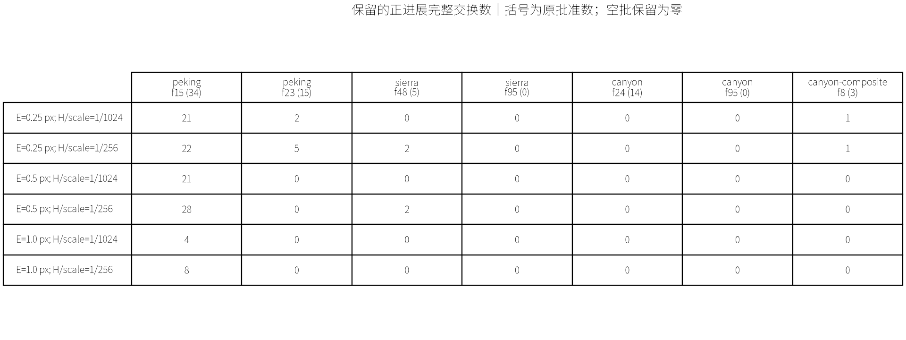
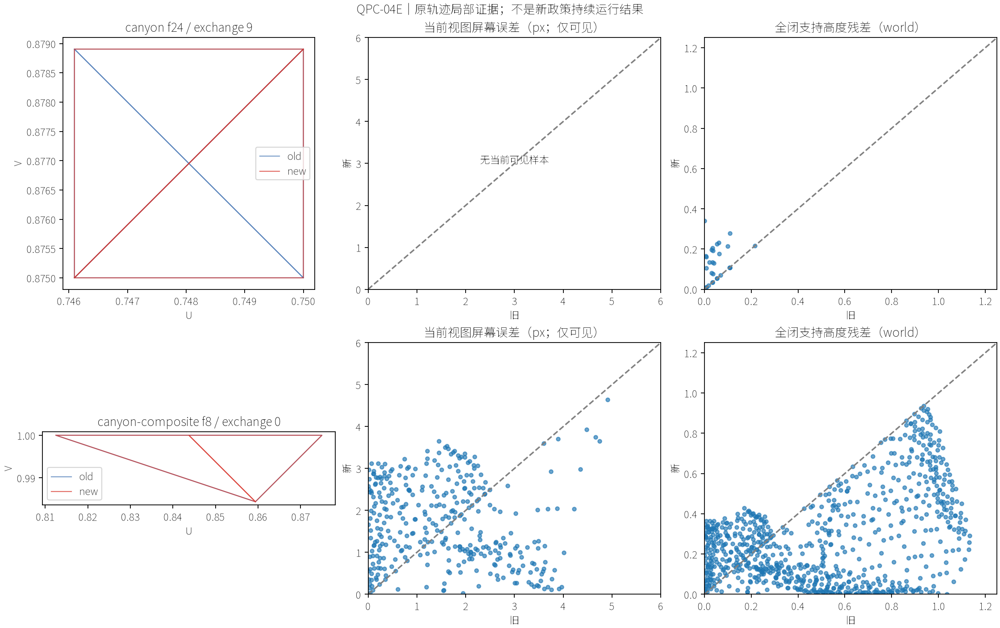

# QPC-04E：逐点质量契约的形式检查与原批次审计

日期：2026-09-17。基线 `54fa2b2`；对应[小规划](../../plans/cpu_refinement/qpc_04e_quality_contract_optimization_plan.md)、[推导](quality_contract_derivation.md)、[源码事实](../../codebase/cpu_refinement/qpc_04e_quality_contract_facts.md)、[实施审查](../../reviews/cpu_refinement/qpc_04e_quality_contract_review.md)。全部参数、输入和完整交换分母在采集前冻结，见[清单](data/qpc_04e_quality_contract/freeze.json)。

## 1. 结论与本阶段出口

**QPC-04E实施完成，条件验证获得有限正面证据；持续质量修复未实施。** 六组参数均能挡住两个指定坏例；其中三组在至少两个原批次中各保留两个以上正进展完整交换。这个结果足以支持继续讨论质量政策的持续接入，却不足以把新约束直接当生产默认。

主要限制不是数值不确定：71个原获批交换都完成独立有理核查，没有未知、删失或闭支持不匹配。真正的限制是场景差异和请求语义：Canyon frame24的14个交换全部因高度约束失败；Sierra frame95的质量需求全部在旧资格之外。**避免坏更新和产生足够恢复更新仍是两件事。**

| 出口 | 结果 | 边界 |
|---|---|---|
| 契约自洽 | PASS | 固定Q、E/H、完整支持；不能推出任意未来视图的小像素误差 |
| 抽象机械检查 | PASS | QC-01～03核心、15个辅助/主引理；不是生产几何或C++证明 |
| 两个已知坏例阻断 | PASS，6/6操作点 | 只审计冻结坏例，不等于全部质量风险已排除 |
| 有用提案保留 | 有条件PASS，3/6操作点 | 两批各至少2个；不是重新规划或跨帧恢复实验 |
| 请求覆盖 | 诊断完成，生产缺口仍在 | Sierra/Canyon大量目标超标根不能成为旧请求 |
| 工作可计费 | PASS | 初建局部证据与全根诊断都计费，无运行时性能收益主张 |
| 默认兼容 | 输出/公共工作一致；未发现稳定版本相关性能回归 | 一次快验加一次受控复测，不是正式统计性能实验 |
| 视觉 | Agent完成局部图核查；用户验收待定 | 图是原轨迹局部条件审计，不是修复后截图 |
| 持续质量、生产接入、同质量性能 | 未验证 | 不进入QPC-05，不预设默认参数 |

## 2. 数学对象与实际检查的对应

本轮检查的条件是：当前可见样本满足 `a_new≤max(a_old,E*²)`；完整闭补丁满足 `u_new≤max(u_old,H*²)`，包括离屏点；完整交换还须有正的平方超标量进展 `ΔΨ>0`。`a=e_screen²`，`u=|h−h*|²`。

固定H的单步条件通过归纳给出 `u_t≤max(u_0,H*²)`。它不允许逐轮把容许误差累加，也不自动消除种子超标。屏幕条件只给出 `E_new≤max(E_old,E*)`，不能把目标以下的允许损伤描述成无条件Emax不增。

[QualityContract.lean](formal/quality_contract/QualityContract.lean)使用显式线性序、加法保序与减法平移保序前提。没有把目标命题列作公理，没有自然数误差量化、`sorry`或`admit`。五个主要声明的内核依赖均仅为 `propext / Classical.choice / Quot.sound`；完整输出、程序/源码SHA和命令见[机械检查记录](data/qpc_04e_quality_contract/lean-verification.json)。**未另外机械构造Rat/Real实例，未形式化投影或生产支持对应。**

运行时对应由独立检查补充：

1. C++只导出Plan之后、Apply之前的原批准批次；旧批次随后完整照常提交。
2. 几何与矩阵以17位十进制往返实际double；Q保留整数分子/分母；参考由原始U16及双线性规则重建。
3. Python `Fraction`按二进制double的精确值解释顶点/矩阵，独立重建参考、重心插值和透视平方误差；不使用生产缓存误差决定接受。
4. 从旧补丁包围盒独立枚举六组Q，逐个核对导出闭支持；旧、新覆盖必须完整，存活几何必须相同。当前样本可见性也独立核对。
5. 两侧及批间共享样本只有在旧/新值相同、接口贡献不变时才去重；本轮发现4个这种共享关联。它们没有重复计入进展。结构及资源合法性继续继承原已批准批次，不把质量相加当作完整冲突证明。
6. 每个单点判定为有理数精确比较；Ψ采用逐项128位二进制定向界相加，避免异分母累加爆炸。区间含零则记未知，绝不把浮点微正值当作证明。JSON同时保存精确上下界字符串；供表图阅读的double列不是证书。

运行时Q和独立输出评价Q仍有区别；本轮没有重跑新政策float输出轨迹，因此不升级为连续曲面、Q_eval或真实渲染质量保证。

## 3. 冻结输入与完整分母

全部50k预算、r=m=160、8线程，复用04D ErrorFirst以及04B Composite原输入；没有调阈值、扩目录或重拟合。四条回放共312个机会与历史实际网格哈希和公共工作一致。

| 原轨迹/帧 | 原批准完整交换 | 类型与配对 | 局部样本记录 / 批内去重 |
|---|---:|---|---:|
| Peking15 | 34 | E32、B1、R1；32个带donor | 12,436 / 12,436 |
| Peking23 | 15 | E14、F1；15个带donor | 629 / 629 |
| Sierra48 | 5 | E5；全部Free | 2,085 / 2,085 |
| Sierra95 | 0 | 原空批 | 0 / 0 |
| Canyon24 | 14 | E14；全部带donor | 7,287 / 7,284 |
| Canyon95 | 0 | 原空批 | 0 / 0 |
| Canyon Composite8 | 3 | B、E、R各1；E带donor | 3,546 / 3,545 |

这里“保留率”的分母仅为原批准批次；未尝试/原拒绝提案和pair不在分母内。筛后子集并没有反向影响后续原状态，也不是新贪心完整结果。

## 4. 六组操作点：不是只展示最有利参数

表中为同时满足两类逐点约束、`ΔΨ>0`及共享接口条件的完整交换数。

| E* px | H*/HeightScale | Peking15 /34 | Peking23 /15 | Sierra48 /5 | Sierra95 /0 | Canyon24 /14 | Canyon95 /0 | Composite8 /3 | 最低机会门槛 |
|---:|---|---:|---:|---:|---:|---:|---:|---:|---|
| 0.25 | 1/1024 | 21 | 2 | 0 | 0 | 0 | 0 | 1 | 达到 |
| 0.25 | 1/256 | 22 | 5 | 2 | 0 | 0 | 0 | 1 | 达到 |
| 0.5 | 1/1024 | 21 | 0 | 0 | 0 | 0 | 0 | 0 | 未达到 |
| 0.5 | 1/256 | 28 | 0 | 2 | 0 | 0 | 0 | 0 | 达到 |
| 1 | 1/1024 | 4 | 0 | 0 | 0 | 0 | 0 | 0 | 未达到 |
| 1 | 1/256 | 8 | 0 | 0 | 0 | 0 | 0 | 0 | 未达到 |

以0.25px、1/256这一个操作点解释构成，而非选为默认：Peking15保留22/34、23保留5/15，分别保留原正进展之和的61.68%、76.71%；Sierra48保留2/5、38.90%。其余参数的完整分子/分母、屏幕拒绝、高度拒绝、正进展数量见[汇总](data/qpc_04e_quality_contract/retention.csv)。两类拒绝可以重叠，不能相加当互斥分流。

E增大没有使保留数量单调增加，这是契约的正常结果：损伤限制变松，但超过目标的可消除量同时减少。Peking23没有超过0.5px的根，因而相关操作没有正Ψ进展；不是所有提案又被几何约束拒绝。1px下Peking15虽仅保留4/8项，却覆盖84.85%/98.58%的原正进展，说明不能只看批宽。

另外，0.25px、1/256下Peking23最小保留进展约0.000365736 pixel²-sample。它严格为正，却不构成恢复速度承诺。本轮没有新增δ、恢复期限或视觉容忍结论。

## 5. 坏例为何被阻断，以及付出的代价

### 5.1 Canyon24：离屏删点5928

第9号交换的donor闭支持33点，当前可见0点。旧生产 `Donor→Measure→Accepts` 因而只提供空的当前屏幕证据；这正是04D已经追溯的缺口。

新检查不按可见性过滤高度支持。33点中17点违反两个固定高度操作点，所需最小高度容许值为 **0.340294793**，即实际HeightScale的 **0.0284199254**，远高于1/1024或1/256。六组参数均因donor高度条件拒绝，完全不依赖该donor的屏幕证据。

完整交换的receiver另有817个当前可见点：0.25px时它自身也有1点屏幕损伤不通过；0.5/1px时其Ψ进展为0。因此不能仅凭“donor已保护”就把这个旧pair改判为有用质量工作。

更强的负面边界是：本批14个donor全部不满足两个高度目标。每个完整提案所需最小H/scale范围约 **0.00498208～0.02851911**，最低也超过1/256。这里阻断坏回收确实会使整个已找到批次失去执行资格。**这证明当前提案不能直接沿用，不证明同一one-ring重新拟合、换donor或其他合法提案一定无解。** 本轮没有做这些新搜索。

### 5.2 Canyon Composite8：没有donor也会转移误差

第0号B事务使用空预算，本身没有donor。旧补丁最大误差下降可以容许局部好点变坏；04B指定见证约0.0717→3.1169px。此次在完整runtime Q上发现的最小屏幕容许值为 **3.65317956px**，大于三个E目标，因此六组参数均因receiver屏幕条件拒绝，同时高度条件也失败。

这个更大的3.653并不是把历史见证数字改写了：历史数字属于指定点，本轮检查整个闭补丁，发现另一个约束更强的点。它说明新条件不能只加在donor或旧最大见证上。

本批第2号净零R在0.25px的两个高度目标下仍通过，ΔΨ约1.16793653；不是“遇到一个坏B就拒绝整批”。

图中两行屏幕轴统一0～6px，高度轴统一0～1.25世界单位，包含全部展示样本；Canyon24 donor的屏幕图明确留空，不能把无可见点画成“零误差且安全”。Agent已检查几何旧/新连线、数据范围、标签和空证据语义。历史实际平台图仍见[04D图页](qpc_04d_error_first_results.md)，没有用局部图伪造修复后的平台画面。

## 6. 请求目标仍然没有和旧资格对齐

全根表扫描当前活动面的既有闭贡献，先按E目标统计质量需求，再与原有限P>SplitPixels²资格及旧前缀比较；不生成新提案。人口计数来自生产double缓存，局部接受判定才是独立有理证书，两者证据等级分开。

| 状态 | E* | 超标根 | 其中旧资格外 | 进入旧前缀 |
|---|---:|---:|---:|---:|
| Peking15 | 0.25 | 887 | 0 | 160 |
| Peking23 | 0.25 | 140 | 0 | 140 |
| Sierra48 | 0.5 | 3,625 | 3,286 | 160 |
| Sierra95 | 0.25 | 9,244 | 9,244 | 0 |
| Sierra95 | 0.5 | 4,404 | 4,404 | 0 |
| Sierra95 | 1 | 26 | 26 | 0 |
| Canyon24 | 0.5 | 11,452 | 11,349 | 103 |
| Canyon95 | 0.5 | 25,987 | 25,978 | 9 |

源码原因仍是 `TransactionalSamples::ReceiverKey` 先用复合P与旧4px阈值决定成员，ErrorFirst只改变已具资格根的排序。**增加前缀不会让资格外的目标超标根出生。** 新损伤约束即使完全正确，若未来不明确调整质量请求契约，也不能解释为持续恢复算法。

完整三目标人口见[请求表](data/qpc_04e_quality_contract/request-gaps.csv)。它还没有证明新请求能通过目录、认证和预算配对；原目录阻塞仍保留。

## 7. 工作量、复杂度和费用

原旧/新几何只求值一次，六组参数复用平方误差。局部采集以关联去重为主；独立验证另枚举局部包围盒、逐面覆盖和投影，计费为 `Σ O(a_i log(a_i+1)+s_i d_i)` 加包围盒候选枚举、有理数位复杂度及六组O(s_i)标量归约。这里d有界不使s成为常数。

| 实际工作 | 总量 |
|---|---:|
| 完整局部样本记录 | 25,983 |
| 独立闭支持枚举面测试 | 76,622 |
| 旧/新覆盖面测试 | 151,468 |
| 旧/新屏幕及高度平方误差求值 | 103,932 |
| 六操作点复用所避免的重复几何求值 | 129,915个样本遍次 |
| 有理输入/最终样本值观测最大分子或分母位长 | 464 bit |
| 全根诊断贡献访问 | 13,645,422 |

464bit不包括Python大整数每条算术指令的瞬时内部值；本轮没有建设大整数profiler。平方误差与投影结果和运行时double缓存的最大差约 `6.58e−13`，高度/参考最大差约 `1.78e−15`；这只是对应核查，不把double当严格边界。

四条新增捕获加关闭对照共约65.25秒进程编排；每进程不超过180秒/8GiB，观测原生峰值约181.6MiB；最终离线独立评价约8.11秒，核心证据运算5.80秒，峰值RSS约72.9MiB。原始局部数据和失败日志都留在忽略的 `benchmark-output/cpu-refinement/qpc-04e/run-01`；聚合表/图/身份进入本报告目录。初次与补充数值归约均远低于总体30分钟限额。

| 状态 | 局部采集/序列化 ms | 全根诊断 ms | 独立证据计算 s |
|---|---:|---:|---:|
| Peking15 | 40.13 | 122.42 | 约3.1 |
| Peking23 | 3.21 | 118.50 | 约0.17 |
| Sierra48 | 5.25 | 26.66 | 约0.46 |
| Canyon24 | 23.88 | 95.26 | 约1.61 |
| Composite8 | 10.58 | 121.47 | 约0.48 |

源U16首次序列化每轨迹约56～62ms，未混入局部采集列；空批的全根扫描也照常计费。这些全根扫描是诊断，不是未来局部政策的必要更新成本。Python/Fraction及JSON时间也不能作为未来C++每帧时间。

旧阶段费用只作背景，不把质量规则计算费用混入原阶段：例如04D Peking15的receiver/donor/reservation/sample repair分别约27.58/2.10/55.16/12.07ms，Canyon24约24.54/5.74/2.56/15.49ms，Sierra48约11.83/0/0.06/3.32ms。**旧donor Measure已经缓存；Accepts通常只是标量边界比较。** 本轮增加了完整闭支持高度核查，没有证据可声称通过“可组合”就省掉上述大段费用。

## 8. 默认兼容与定向验证

只构建CPU探针和新增夹具。初次构建继承应用CBT图形宏而缺SDL include，随后沿已有CPU-only配置关闭app/CBT构建目标，构建完成后恢复原缓存；没有修改CBT、renderer或生产算法以绕过问题。旧 `ProfileSession.cpp` 不可达代码警告保留。

C++夹具覆盖空批、闭支持共享点去重、live状态/证书缓存不变、过期批次、拒绝覆盖和整批删失。12项Python手算/几何检查覆盖阈值等号、超标进退、持久包络、共享接口、不可见donor、近面、缺覆盖、源高顶点不保证内部误差、极小进展未知及删失。一次夹具把六组Q手算成7点，核对实际坐标后修正为8点；不修改采样集合迎合预期。

观察关闭的Peking24机会，所有公开结果/工作一致。只按规范做一次性能复测，均使用21个非warmup帧：

| 轮次 | 旧均值 / 新均值 ms | 旧中位 / 新中位 ms | 旧P95 / 新P95 ms |
|---|---|---|---|
| 首轮 | 103.322 /118.826 | 123.286 /129.388 | 200.884 /222.208 |
| 无构建/分析并行的受控复测 | 122.445 /118.874 | 129.892 /136.268 | 249.218 /228.171 |

首轮均值+15.00%确实越线，未删除；复测均值−2.92%、中位+4.91%、P95−8.44%，没有复现稳定变慢。旧程序自身两轮均值变动约18.5%，不能把首轮差值归因于这次新增审计。生产源码未变，关闭路径也不调用采集器。结论限于“未获得稳定版本相关回归证据”，不声称精确性能等价或加速，不继续追微小差异。

## 9. 后续能够推进什么、还不能宣布什么

本阶段证明候选约束不只是“拒绝一切”：确有参数同时阻断两类明确坏例并保留部分真实正进展。另一方面，Canyon旧donor普遍过不了固定高度界，说明持续接入若仍沿用原提案，会显著改变实际工作负载甚至出现停滞；不能直接接入后再沿旧性能表宣称收益。

下一规划若获确认，应明确质量请求出生/门槛、receiver与donor的独立证据生命周期、失败分类与持续恢复验证；保留原固定参数、同轨迹和质量/成本账本。不在本轮偷偷重拟合、放宽H、扩大prefix或开启预留优化。本阶段停在用户验收。

复现入口：[采集脚本](../../../scripts/run_transactional_exchange_quality.py)、[独立检查](../../../scripts/transactional_exchange_quality.py)、[分析与制图](../../../scripts/analyze_transactional_exchange_quality.py)、[汇总JSON](data/qpc_04e_quality_contract/summary.json)、[验证记录](data/qpc_04e_quality_contract/verification.json)。
