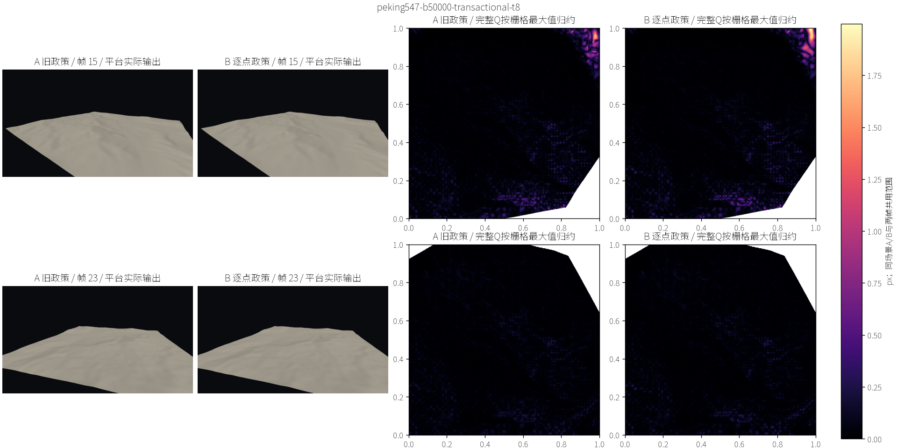
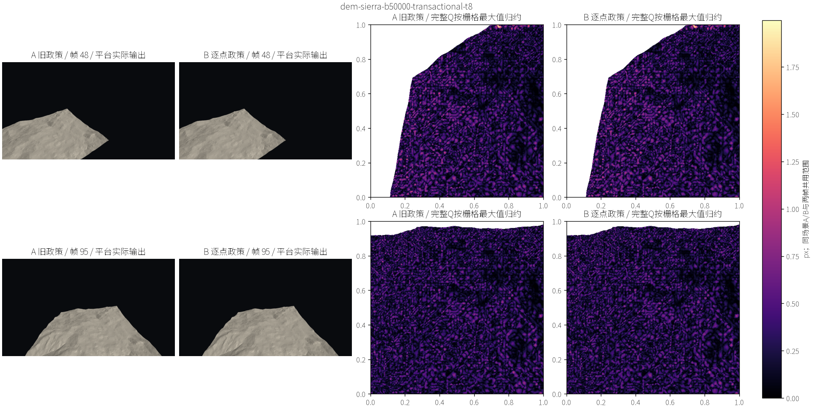
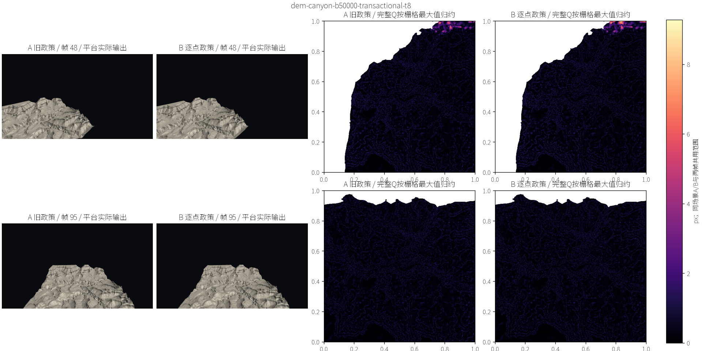

# QPC-04F：显式目标政策的持续接入结果

日期：2026-09-17。上承[小规划](../../plans/cpu_refinement/qpc_04f_target_quality_policy_plan.md)、[QC推导](quality_contract_derivation.md)和[代码事实](../../codebase/cpu_refinement/qpc_04f_target_quality_facts.md)。本阶段实施及有限验证已完成，交用户验收；不进入QPC-05，不改变默认政策。

## 1. 结论与分层出口

**新政策能安全地执行真实事务，但还不能完成持续质量恢复，并且在Sierra/Canyon明显更贵。** 它解决了“目标超标但旧资格不产生请求”的入口问题，也挡住两个已知损伤机制；没有解决旧拟合/目录与新可行域不相容的问题。

| 验收项 | 结论 | 证据和边界 |
|---|---|---|
| 政策与数值接入 | 有限验证通过 | 默认关闭；核心/实际float曲面分别认证；发布前版本、提案几何与共享贡献核对 |
| 冻结样本损伤控制 | 有限验证通过 | 六预定批次共47个非空交换，两个表示域均无接受违规；三个空批不计进展 |
| 已知坏例阻断 | 通过只读回归 | Canyon24旧14个回收全部违反H；Composite8坏B在两个域均有198个屏幕、201个高度违规点 |
| 自然可执行性 | 通过 | 三条路线均有真实正进展接收和持续状态；不是拒绝全部事务 |
| 持续恢复 | **受限，未通过全面恢复** | Peking转向残差、Sierra末帧残差、Canyon转向残差仍明显；后两者出现长停滞 |
| 成本 | **明显风险** | B/A暖CPU：0.99×、2.89×、2.00×；后两者不能据安全通过视为可竞争 |
| 视觉 | Agent完成；用户签收待定 | 实际截图、同尺度热图和局部图；不能代替连续popping验收 |
| 默认切换、论文性能 | 不准入 | 当前保持legacy；不声称完整质量或同质量性能胜出 |

这里“安全”只指固定运行时Q上的声明条件及选定独立审计，不是整个连续地形或任意未来相机的误差上界。

## 2. 输入、版本与验证边界

沿用04D：三场景50k预算、r=m=160、8线程、D3D12、1280×720、固定旧点、原Fit/目录/flip开关和原相机轨迹。Peking24机会，Sierra/Canyon各96；前三机会从暖计时排除，但事务统计保留全部机会。A是04D误差优先政策，B是pointwise-target，E*=0.5px、H*=HeightScale/256。这不是感知阈值。

A/B初始种子完整网格哈希和面数相同。A逐帧输出及工作核对04D后复用其质量文件；A/B正常CPU由当前同一平台二进制独立采集。B视觉/诊断分别核对正常路径，Peking额外B单线程与8线程逻辑输出一致。12个B质量帧全部独立评价成功，无缺覆盖、歧义、非法几何或非法投影计数。

正常二进制SHA256：`088dc07a81582a28dfc2f55862f5876a52edccc2cdf2d7a526280818783b2d15`。后来只修正诊断政策接线、补数值夹具和整理新文件风格，正常政策计算没有变更；未拿后编译诊断时间替换正常计时。来源、二进制与种子身份保存在[sources.json](data/qpc_04f_target_quality/sources.json)，冻结输入在[freeze.json](data/qpc_04f_target_quality/freeze.json)。

实验是快速单进程对照，不是多独立进程统计显著性实验。没有扩大场景、线程、目标、前缀或恢复轮数。默认旧模式前/后Peking暖均值128.217→115.286ms，逻辑输出一致：没有观察到工程回归，不据此宣称提取代码带来加速。

## 3. 新增的真实义务

请求从缓存A>E*²产生；原复合P与回收排序保留。旧Fit成功后还必须满足逐点屏幕/高度损伤条件；接收方自己在超标平方误差和上有正进展，回收方只能非增。Free、B、R和配对均经过相应检查。新证书失败继续旧目录，不能借此扩展翻边搜索。

核心double曲面与float世界输出不能直接视为同一函数。因此分别检查两个域，公开域补局部包围框Q枚举；输出和证书复用`PublishedPosition`。区间不能判定时进入有理比较，进展用128位二进制尺度的整数外包区间。证书绑定状态实例、代次、目标和几何；共享改变贡献会在发布前使整批失败。

该接入**没有使原Fit变成新约束下的求解器**。它仍先寻找满足旧局部最大值门槛的近零高度改变量，再被新条件筛选。这是后述恢复受限的直接算法背景。

## 4. 独立证书审计

Python Fraction读取捕获的旧/新面及原始源高度，自行定位、插值、投影和求和；公开域自行复现float世界位置并以精确有理逆变换定位。它不调用生产Fit、Measure或缓存误差。

| 批次 | 获批交换 | 核心域ΔΨ下界 | float域ΔΨ下界 | 结论 |
|---|---:|---:|---:|---|
| Peking15 | 39 | 81.783302 | 81.783307 | 全部接收侧正进展，回收及共享贡献安全 |
| Peking23 | 0 | 0 | 0 | 保留空批，无进展证据 |
| Sierra48 | 6 | 5.167747 | 5.167704 | 同上 |
| Sierra95 | 0 | 0 | 0 | 保留空批 |
| Canyon24 | 2 | 0.229637 | 0.229607 | 同上 |
| Canyon95 | 0 | 0 | 0 | 保留空批 |

单位为未归一化的超标平方像素和，不能解释成Emax下降同样多。有限精确上下界保存在[summary.json](data/qpc_04f_target_quality/summary.json)。

旧坏补丁重新按同一操作点只读求值，未重跑第四条轨迹。Canyon24旧14个donor均存在高度违规；Composite8坏B同时存在屏幕/高度违规。见[历史回归](data/qpc_04f_target_quality/known-counterexamples.json)。其中`violation`表示**历史旧提案不满足新政策**，不是新政策接受了违规。

局限：47个交换是预注册批次，未独立穷验全部持续事务；每次在线接收都有正下界检查，但只有选定批次导出了精确进展幅度，未保存全轨迹逐交换精确幅度。历史坏补丁回归为独立Python契约核查，C++另用解析损伤/共享/过期夹具。

## 5. 持续质量和实际工作

| 场景 | A接收执行数 | B接收执行数 | B末帧面数 | B末帧请求数 | 超标且无修改的最长连续机会 |
|---|---:|---:|---:|---:|---:|
| Peking | 750 | 245 | 49,999 | 0 | 0 |
| Sierra | 1,245 | 480 | 9,752 | 4,036 | 35 |
| Canyon | 625 | 112 | 50,000 | 25,733 | 33 |

此处执行数是平台`exchanges+free`，不包含净零R；R另在`flip-recovery.csv`记录。面数与预算利用率不能省略：Sierra仍有大量空预算，却无法兑现前缀内请求。

| 场景/帧 | A最大误差 | B最大误差 | DOD最大误差 | B相对DOD的Dmax | B比DOD多0.25px的可见比例 |
|---|---:|---:|---:|---:|---:|
| Peking/2 | 0.411881 | 0.441886 | 0.441886 | 0.000000 | 0.0000% |
| Peking/15 | 1.831328 | 1.996557 | 0.418727 | 1.977369 | 1.8272% |
| Peking/16 | 0.388221 | 0.417066 | 0.441886 | 0.187550 | 0.0000% |
| Peking/23 | 0.388221 | 0.417066 | 0.441886 | 0.187550 | 0.0000% |
| Sierra/2 | 1.586408 | 1.586408 | 1.172692 | 1.553716 | 0.3735% |
| Sierra/48 | 1.976412 | 1.995950 | 1.041680 | 1.963644 | 12.4752% |
| Sierra/80 | 1.133568 | 1.123568 | 1.089577 | 1.123568 | 9.3316% |
| Sierra/95 | 1.133568 | 1.123568 | 1.089577 | 1.123568 | 9.3316% |
| Canyon/2 | 4.636925 | 4.676490 | 2.315694 | 4.676488 | 0.5032% |
| Canyon/48 | 6.818859 | 9.274477 | 1.839557 | 8.972327 | 11.7626% |
| Canyon/80 | 2.783891 | 2.338191 | 2.348193 | 0.339088 | 0.0001% |
| Canyon/95 | 2.783891 | 2.338191 | 2.348193 | 0.339088 | 0.0001% |

全部误差单位px。DOD仍是独立质量比较基线，不是ground truth；相同预算上限及旧numeric阈值不代表相同实际面数或质量政策，表不能导出同质量速度结论。Dmax是同一可见样本逐点差的最大值，不是两个Emax之差。

末帧B的采样RMS依次为0.034499、0.254120、0.298934px；其语义是可见地形域样本等权，**不是屏幕面积加权RMS**。三个场景各质量帧的Hmax分别维持0.167582、0.377723、1.165875世界单位，均包含旧种子误差。高度包络不会自动修复种子超标。完整帧表在[frames.csv](data/qpc_04f_target_quality/frames.csv)。

### 5.1 Peking：返回视图达标，但边界恢复受新损伤条件阻挡

末帧运行时请求为0，Q_eval最大0.417066px；这只是返回视图达标。原外边界见证从seed到frame23高度残差始终−0.167582，固定frame15投影始终1.996557px。frame15最坏覆盖根599排名1，已经进入前缀：E为`fit_bound_failed`，B为`pointwise_screen_damage`，F/H为`shape_infeasible`；此前部分帧B为`pointwise_height_damage`。

因此不是prefix不足，也不是全局Emax回落代表几何恢复。旧B选择源高新点只能改善局部一部分点；新条件不允许用另一部分点的新增损伤交换这次改善。拒绝仅否定当前提案，不证明任意合法边界恢复无解。

### 5.2 Sierra：请求出生缺口补上，瓶颈落到旧拟合目录

frame95已有4,036个目标请求；最坏见证覆盖根排名1，而原04E确认它在旧资格之外。其固定未来视图误差约1.133568→1.123568px，只改善约0.01px。该点多个覆盖根的E/F/H在frame95全部`fit_bound_failed`；全前缀该帧605次拟合失败、496次形状失败，6个旧认证成功项又被逐点高度拒绝，最终receiver为0。

因果链为：新请求出现→原提案生成器受旧Fit/形状可行域限制→少数旧成功结果不满足新H→空预算无法转成细化。不能归因于旧SplitPixels或预算不足，也不能从这些拒绝推导所有局部重构都无解。

### 5.3 Canyon：坏删点被挡住，但种子边界仍冻结

旧04D返回最大见证(0.748046875,0.876953125)在B里始终保留接近零的高度残差，固定frame24投影约6.17e−7px；旧坏回收造成的新增误差没有复现。

同时frame48外边界原见证在seed就有约9.274477px固定视图误差，B直到末帧都没改变该高度。根803排名1，B为`pointwise_height_damage`，E为`fit_bound_failed`，F/H为`shape_infeasible`；根624也出现B损伤与Fit失败。frame95前缀934次Fit失败、186次形状失败，无receiver。

因此frame48的9.274477px主要是未能消除已有边界残差，不能解释成新算法制造了这么大的退化。相较A的6.818859px又确实更差，反映更严格安全条件舍弃了旧政策允许的部分修复。可见超额分布仍有11.76%比DOD多0.25px，不能只强调末帧Emax由A的2.783891降到2.338191。

诊断依据完整attempts；顶层stage只是最后尝试的状态，不能把混合失败一概称作形状失败。见[冻结见证摘要](data/qpc_04f_target_quality/witness-summary.json)。

## 6. 成本、复杂度及原因

| 场景 | A完整CPU ms | B完整CPU ms | B/A | B视图 | B接收 | B回收 | B预留 | B样本修复 |
|---|---:|---:|---:|---:|---:|---:|---:|---:|
| Peking | 104.241 | 103.046 | 0.99 | 10.393 | 41.665 | 11.747 | 31.884 | 4.155 |
| Sierra | 33.161 | 95.838 | 2.89 | 10.671 | 78.862 | 0.000 | 0.087 | 4.547 |
| Canyon | 41.708 | 83.595 | 2.00 | 11.675 | 60.815 | 9.576 | 0.204 | 0.708 |

计时单位ms，均为正常平台暖机会均值；不含独立评价、截图、只读解释及精确审计。不是固定几何同任务消融：新政策改变请求人口、目录尝试和最终批次。

Peking总时间近似不变，不代表认证免费：接收17.218→41.665ms、回收2.353→11.747ms；预留53.347→31.884ms、样本修复12.358→4.155ms。较少执行抵消了部分额外认证费用。

Sierra接收11.748→78.862ms，Canyon接收14.754→60.815ms，是主要上升来源。新资格在尾部继续为超标根尝试旧目录；旧Fit并未针对新条件生成结果，新认证又支付两个域的闭支持检查。即使没有事务，发现/拟合/拒绝仍发生。Canyon预留反而2.398→0.204ms，不能把本轮新增慢归咎于预留。

| 新增质量工作，全轨迹累计 | Peking | Sierra | Canyon |
|---|---:|---:|---:|
| 已比较样本（两个域合计） | 477,754 | 747,473 | 353,283 |
| 样本级精确回退 | 256 | 48,103 | 47,442 |
| 精确回退比例 | 0.054% | 6.44% | 13.43% |
| 已观测比较有理量最大位长 | 75 | 73 | 68 |
| 证据累计近似负载MiB | 9.76 | 10.03 | 11.55 |
| 正常进程峰值MiB | 232.25 | 197.72 | 219.60 |

位长没有覆盖所有几何精确中间量；负载字节不是存活峰值，也未逐项计入map节点开销。配对会重复记donor拒绝reason，所以Canyon的262,076次`pointwise_height_damage`账本事件**不是262,076次独立质量认证**。实际样本访问计数不在配对中重复增长。

新增证书保守复杂度为
W=O(Σ[d_i²+(a_i+c_i)log(2+a_i+c_i)+(s_i+c_i)d_i])+W_exact，
a为旧闭面关联、c为公开曲面包围框候选、s为实际闭支持、d为局部面数；再加共享索引O(S log S)、交集精确复核及有限几何复制/析构。旧Fit、全Q视图刷新、预留和续接仍需另计。d有界不使s、c或精确位长为常数。

诊断账本`pointwise_quality`是任务墙钟之和（约5.94/13.17/12.66s），不能当完整帧时间或aggregate CPU time；它与receiver/donor阶段有包含关系，不能累加。没有测得全轨迹逐交换精确进展幅度或证据实时峰值，不能声称完整成本下界或全部内存逐项归因。

后续只读[成本追溯](../../reviews/cpu_refinement/qpc_04f_quality_cost_analysis.md)进一步按暖掩码拆解净增量、请求与实际根、旧/新认证及静止失败工作；发现新增逐点认证为零时仍存在反复旧Fit开销，且质量回退计数不覆盖全部精确运算。本页历史采样与性能未通过的状态保持不变。

## 7. 视觉核查

Agent实际查看以上三页及三页局部见证图。有限截图中未见明显内部裂缝、缺面或新尖峰；Sierra仍有明显粗面明暗，Canyon转向时边界轮廓与参考见证的偏离仍可见。热图由完整Q的栅格最大值归约，同场景两帧A/B共用色标，白区是参考不可见域。外轮廓误差不能以“没有内部裂缝”消除。

局部图：[Peking](data/qpc_04f_target_quality/peking547-b50000-transactional-t8-witness.png)、[Sierra](data/qpc_04f_target_quality/dem-sierra-b50000-transactional-t8-witness.png)、[Canyon](data/qpc_04f_target_quality/dem-canyon-b50000-transactional-t8-witness.png)。红十字为B最大参考见证投影，A/B使用同一点；Canyon48红点落在B轮廓外，正是轮廓偏移的可见表现，不解释成参数域缺覆盖。用户视觉验收仍待定。

## 8. 验证、过程修正与下一边界

必要专项：新损伤/进展/阈值相邻浮点/128bit定向求和/共享贡献/过期证书/预算续接夹具；旧ReceiverOrdering、FlipRecovery、BoundaryRefinement、ExchangeQuality。没有跑全部CTest、双后端或正式性能重复。

初次B配置被schema拒绝，未进入算法；已补可选字段并在冻结时做schema校验。Canyon首次诊断在旧Accepts语义下误报可用交换；修正只读观察器后，三条B追溯与正常输出相同。旧失败日志保留，未被成功记录覆盖。补数值夹具时显式加入固定Boost私有头依赖，编译及夹具完成。详见[实施审查](../../reviews/cpu_refinement/qpc_04f_target_quality_review.md)。

本阶段以“**损伤控制与自然可执行获得有限验证，恢复及成本受限**”收口。下一决策应围绕当前提案生成与逐点可行域的关系；本轮不新增目录、不重拟合、不改阈值，也不自动开展下一阶段。
