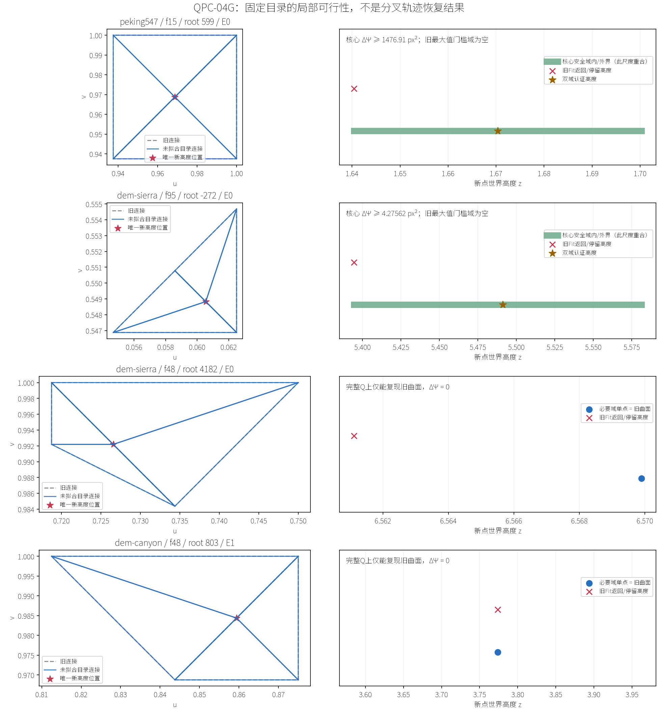

# QPC-04G：现有目录的逐点可行性审计结果

2026-09-17。基线`b437315`；[小规划](../../plans/cpu_refinement/qpc_04g_proposal_feasibility_plan.md)、[推导与过程](proposal_feasibility_derivation.md)、[代码事实](../../codebase/cpu_refinement/qpc_04g_proposal_feasibility_facts.md)。ATT继续暂停。本轮只读观察原QPC-04F政策，未把反事实高度提交到持续状态。

**诊断闭环完成。旧Fit确实漏掉了新逐点契约允许的局部解；但不是所有停滞都能通过换Fit解决。** 43个实际目录项分成28个双域正进展见证、8个“安全域只剩旧曲面”的无进展证明、2个固定B提案违规、5个参数域形状失败。28个正例全部通过原生逐点认证，也全部不满足旧统一最大值门槛。它们的局部最大误差没有下降，不能把这次结果说成最坏点已恢复。

| Gate | 结果 | 严格范围 |
|---|---|---|
| 只读捕获与原轨迹一致 | PASS | 三条原轨迹，共216机会，离散决策/预算/几何hash一致 |
| 固定目录可行性分类 | COMPLETE | 四快照、七根、43项；没有扩大输入或原语 |
| 可发布高度见证 | PASS，28项 | 独立核心/float核查及原生PointwiseQuality，不含配对/提交保证 |
| 原生产拟合政策已修复 | NOT IMPLEMENTED | 旧Fit、请求顺序、前缀、质量目标和默认行为不变 |
| 持续恢复、Emax目标、竞争性性能 | OPEN | 没跑反事实分叉轨迹，不能由局部见证外推 |

## 1. 实验身份与计量口径

使用04F的B resolved配置、原始高度源、相机、种子与追溯表。目标保持`E*=0.5px`、`H*=HeightScale/256`；存活点不改高，E/F/H只允许改变一个新点高度，B固定源高中点。来源与SHA见[freeze](data/qpc_04g_proposal_feasibility/freeze.json)，原生命令、实际程序身份和RSS见[commands](data/qpc_04g_proposal_feasibility/commands.json)。大样本/日志保留于忽略目录`benchmark-output/cpu-refinement/qpc-04g/run-01/`。

所有结果基于**同一batch-start状态**；捕获发生在原Plan之后、Apply之前，随后仍应用原批次。Peking24机会，Sierra/Canyon各96机会。三次捕获与两次正例复核的`frames.csv`、`boundary-refinement.csv`都逐字段匹配04F。因此直接复用04F的全域质量，不重复生成相同evaluator或平台截图。

43项的闭样本记录合计55,745条，最大单项17,154条，均在预注册上限内。数目包含不同提案之间的重复样本，不能当作独立自然输入数。目录项身份是`场景/frame/root/ordinal`；E/F/H字母不能单独确定一个提案。

## 2. 从源码到约束的原因链

原生产链为：

```text
ReceiverCursor：固定UV目录和旧高度
→ Fit：参数域shape → 旧局部max减0.01px → 保守求交 → 近零增量
→ Measure/Accepts：复核旧统一门槛
→ PointwiseQuality：逐点screen/height损伤 + 接收正进展
```

`TransactionalCertification::SetProgressTarget`仍以旧局部最大误差见证向下取微像素整数，减10,000微像素。04F追加了逐点政策，但没有替换这个前置门槛。因此一个能降低总超额、却不能降低固定接口最大值的提案，根本走不到新增认证。

固定新高度z后，精确新曲面为`h_q(z)=a_q+b_q z`。对参考高度r、齐次坐标`m(h)=d+c h`：

\[
A_q(h)=K_q\frac{(h-r)^2}{(d_w+c_wh)^2},\qquad d_w+c_wh>0.
\]

将`A_new≤max(A_old,E*²)`写成`|h-r|≤sqrt(T/K)·w(h)`，得到两条线性高度约束；高度损伤、正w和近面也是线性约束。用96位有理平方根内/外包络求交，分别保存充分内域和必要外域。**外域空才证明无解；安全域非空还要另证正进展。** 这次没有把保守Fit判空改名为真实判空。

对实数域见证先存成binary64，再从实际float世界坐标重建另一曲面，重新枚举闭Q、定位、求误差，并分别用128位有向和检查正进展。生产认证不是独立脚本的唯一oracle；二者分别计算后交叉核对。

## 3. 完整分类

| 冻结对象 | 实际目录 | 双域正例 | 安全但全域无进展 | 固定B违规 | shape失败 |
|---|---:|---:|---:|---:|---:|
| Peking15，599 | 5 | 1 | 1 | 1 | 2 |
| Sierra48，4182 | 5 | 0 | 4 | 0 | 1 |
| Sierra95，−272/−271/−270/−269 | 28 | 27 | 1 | 0 | 0 |
| Canyon48，803 | 5 | 0 | 2 | 1 | 2 |
| 合计 | 43 | 28 | 8 | 2 | 5 |

逐项输入身份、旧理由、活跃约束、区间端点、试值及双域违规点见[summary.json](data/qpc_04g_proposal_feasibility/summary.json)。没有数值未知或配额截断；这不等于本方法能解决所有输入，仅表示本次固定43项已落入可判定类别。没有任何结果来自追加相机、提高前缀或放松shape/H/E。

七根都至少有一个E/F/H通过shape前提，未满足原“全部E/F/H因shape失败”才尝试R的触发条件；没有为了找解绕过该条件构造翻边事务。

### 3.1 Peking15：旧门槛挡住真实进展，但边界最大点仍不动

根599的E0，完整闭支持7,073点，新安全高度域约为`[1.640409588814,1.700303904234]`。冻结顺序先试旧高度、源高投影，再试区间内部；第三个值`1.6703567465237084`在两域均合法：

| 量 | 核心binary64 | 实际float输出 |
|---|---:|---:|
| 超标平方误差和降低，px² | ≥1476.908740 | ≥1476.908900 |
| 局部采样Emax之前/之后，px | 1.996557 / 1.996557 | 1.996557 / 1.996557 |
| 屏幕/高度违规点 | 0 / 0 | 0 / 0 |

旧门槛必要域中的sample597857给出`0·z≤负数`，与任何高度都矛盾。该点不受新高度控制，却仍要求它低于旧最大值减0.01px。**这证明前置政策排除了可降低分布误差的解，不是证据表明保守系数或容器实现太差。** 所有正例均不满足旧门槛，因此本轮无需复制整套旧Fit去区分其更下游的求交/近零选值；失败时未导出的旧保守区间明确标为`available=false`。

另外一个E2的必要域严格退化成`13726673/8388608`，完整Q的新曲面恰等于旧曲面，故超额降低恒为零。F/H在参数域最小角检查失败，与高度无关。

**不能把E0正例解释为Peking最大边界误差已解决。** 接口最大值恰好是它不变的部分；新Fit最多让内部其他点前进。是否后续产生能改变最大点的事务未在此运行。

### 3.2 Sierra95：四根都有被旧门槛排除的解，但微小正数不能包装成恢复

四根的28项中27项有双域正例；−269的E2只能保持原曲面。以−272的E0为例：安全高度域约`[5.394480729305,5.581349429279]`，源高投影试值`5.491086063165272`给出核心`ΔΨ≥4.27561685px²`，float域`≥4.27561913px²`；核心局部Emax仍为`1.123568px`。旧门槛又在sample144696出现零系数矛盾。

但必须分开数值大小。全轮28个正例中：

- 16项核心`ΔΨ`落在约`1.0643～1476.9087px²`，包含Peking E0、Sierra的11项E及−271的F/H四项。
- 另外12项是−272、−270、−269各自的F/H，核心`ΔΨ`仅约`9.3×10⁻¹⁶～1.33×10⁻¹⁴px²`。它们来自存储坐标/初高与精确旧平面之间的微小差异，是数学上正值，**不是有用恢复速度的证据**。

两组都通过了当前`strictly positive`契约。由此暴露的后续问题是：正进展并不自带进展下界或有限时间恢复保证。本轮没有据此临时新增epsilon、更换取高顺序，或用更好试值替换已经命中的第一个正例。

这些目录项还共享根、边和几何区域，不是28个独立样本或可并行事务。所有28项的核心局部Emax前后精确相同；不可把超额平方和降低写成Emax降低。

### 3.3 Sierra48：不是Fit挑得太保守，而是逐点条件锁死唯一高度

4个shape合法提案的必要安全域都是单点，且新曲面在完整Q上等于旧曲面。例如E0：

\[
z\ge27556153/4194304,\qquad z\le27556153/4194304.
\]

下界来自sample259951的高度损伤条件，上界来自259954的相反方向高度条件。任何实际改高都会伤害至少一侧已经超出H*的点。旧Fit的相对区间为`[−0.154418711762,−0.008781485228]`，可以满足旧屏幕门槛，却全部避开新安全单点，所以04F的`pointwise_height_damage`并非偶发拒绝。

F3/H4的安全单点是`1949775756299830603215/295147905179352825856`；它甚至不是可精确存储的binary64高度。即使把z当实数，它也只能复现旧曲面，仍无正进展。单点结论由必要域及完整Q等值证明得出，不是32次搜索失败得出。

这限定于固定插点位置、固定旧高、既有目录及本轮逐点目标。不能推出任意局部重构无解，更不能直接要求放松质量契约。

### 3.4 Canyon48与固定B：总误差下降仍可能伤害很多点

Canyon803的两个E分别只允许高度`7914139/2097152`和`13052227/4194304`，都重现旧曲面。F/H shape失败。B源高中点是固定提案，没有可搜索自由度：

| B提案 | 局部Emax之前→之后 | 核心ΔΨ，px² | 屏幕违规点 | 高度违规点 |
|---|---:|---:|---:|---:|
| Peking599 B1，3,571点 | 1.996557→1.930512 | +1984.0289 | 682 | 577 |
| Canyon803 B0，1,617点 | 9.274477→5.676907 | +27929.1430 | 220 | 225 |

两域违规计数一致。旧统一最大值接受它们，但04F逐点条件正确拒绝：**平均/总超额或最大值变好，不推出每点损伤安全。** 精确违规点及新旧高度、参考、平方误差都保存在summary，不依赖拒绝字符串推断。

## 4. 重复失败可以复用到哪一层

[输入存续表](data/qpc_04g_proposal_feasibility/repeated-inputs.json)记录原七根，不追逐替换根：Peking599有24个活跃机会、5种局部几何、15种几何/视图组合；Sierra各根和Canyon803通常有32次相同组合的重复。这里只是完整局部几何及视图序列化后的**指纹相同线索**，不是已经证明可安全复用整个生产失败。

| 结果依赖 | 可能复用的事实 | 仍需失效条件 |
|---|---|---|
| UV shape | 固定连接/插点下的合法或失败 | 根/邻域连接、UV、目录顺序与分辨率改变 |
| 高度损伤单点 | 完整Q和H*下的必要高度区间 | 旧高、源、Q关联、目标、接口变化 |
| 屏幕损伤/进展 | 同一几何和view下的系数/约束 | 矩阵、可见域、分辨率、旧误差和目标变化 |
| 旧Fit实际失败 | 同一生产数值输入的结果 | 还包括缓存插值/owner、目录身份及拟合运算；不能只看几何hash |
| 配对/预算/冲突 | 本报告不提供复用证明 | donor、已预留集合和预算状态另变 |

源与Q在各条轨迹中固定，但新点身份、owner/cache和目录的完整逐帧证据没有全部导出；所以不能把重复次数直接当成可删除认证次数，也没有实现失败缓存。

## 5. 工作量、时间与复杂度

[成本账本](data/qpc_04g_proposal_feasibility/costs.json)不混入生产计时。三条捕获进程分别5.329/10.952/25.723s；只读组件自身累计0.121/0.108/0.099s。诊断进行了6,916,917次活动面身份检查，明确是`O(N·帧数)`的实验扫描，不声称生产局部复杂度。后两条采集有短时与离线计算重叠，进程耗时不用于跨场景性能比较。

43项旧路径私有重放累计约22.7ms（含旧认证后追加的逐点检查，并非纯Fit）。最终一轮独立Fraction求解累计18.158s，完整分析编排34.665s，其中输入/结果I/O、身份与配额核对等16.507s；Python峰值约91.3MiB。自然单项最长9.940s，未达20s上限。原生最高记录RSS约179.4MiB，均低于配额。

初轮22.325s先保守保留8个`unknown_progress`。检查发现全部必要域为严格单点，于是补上“全Q等于旧曲面”的证明，第二轮17.643s关闭它们；再在补零系数前提、复用原质量核查后完成上述最终核查。各轮均保留原始结果，最终分类、高度和精确进展逐值一致，没有增加试值数或扩大时间上限。最终一轮共构造23,477个样本仿射模型，试41个binary64高度，最多一项3次；系数最大293bit，精确评价中间值最大382bit。96位根包络足够，实际未用区间细分树。

最终整理后又只对预定Peking E0执行一次成本/语义核对，9.729s、约91.5MiB；高度、两域损伤和进展与前次逐值一致。它用于核查工具整理，不作速度结论。

实现成本由三段构成：

1. 原生闭支持集合与身份诊断：单项关联并集`O(a log(2+a))`，另有每帧`O(N)`身份扫描；生产目录/旧Fit重放单列。
2. 离线闭Q枚举和仿射系数：局部包围盒候选c、面数d、样本s，保守`O(cd+sd)`，区间交为`O(s)`次有理操作，空间`O(s+d)`。端点证书常数大小，但有理位复杂度另计。
3. v个最终试值：核心与float均重枚举并精确评价，保守`O(v(cd+sd))`；v≤32，不把该审计器称为实时O(s)拟合实现。范围内提前证明冲突可以更早退出，但可行证书不能截断样本。编排端每项重新汇总已完成配额记录，在p项上有`O(p²)`文件访问上界，也已包含于I/O/控制成本；它不是未来生产求解算法的一部分。

### 普通路径前后对照

诊断关闭的Peking原24机会，完整进程5.312→5.233s；离散工作、预算、全部几何hash相同。主要阶段中位数：view_refresh14.737→13.798ms，receiver97.292→87.400ms，donor26.485→25.917ms。未出现满足门槛的同向退化，不追加重复测试；这些单进程差异不用于宣称优化收益。Pointwise批认证中位数1.609→1.661ms，约3.2%，且完整过程下降，不追逐该微小波动。P95和所有已记录阶段保留在账本，`task_wall_sum_*`是任务累计时间而非完整墙钟。

构建曾因既有CPU probe误启用CBT渲染宏缺SDL失败，后使用`PARALLEL_ROAM_ENABLE_CBT_2024=OFF`构建两个专项目标；并未修改生产注册器、渲染器或CBT。诊断运行程序与收尾仅拆分私有方法/加强输入检查后的程序分别记录身份，最后版本运行了定向夹具及普通路径对照。

收尾已恢复本地构建缓存原值`CBT=ON / BUILD_TESTS=OFF`，不遗留平台能力开关变化。复现本专项时需临时启用测试并关闭CPU探针不消费的CBT路径；原生只构建`parallel_roam_experiment_cpu`及`parallel_roam_transactional_proposal_feasibility_tests`。分析/报告入口为`python3 scripts/run_transactional_proposal_feasibility.py analyze|report`；捕获/见证复核使用`capture|verify`并校验原程序SHA，不允许在旧目录混入新程序。

## 6. 验证与图

新增8项解析测试涵盖严格投影边界、零系数矛盾及常数项反例、内域空但真域有解、旧0.01px与超额进展不等价、共享边、完整闭Q、float舍入伤害。C++定向夹具覆盖实际目录捕获、闭支持去重、只读状态、越界请求、错误绑定拒绝和合法绑定但无进展的复核。只构建/执行相关目标；未跑全CTest、Lean、双后端或新自然矩阵。

28个独立见证的原生结果见[native-witnesses](data/qpc_04g_proposal_feasibility/native-witnesses.json)：`pointwiseReason=certified`全部成立，`legacyAccepts=false`全部成立。Canyon无见证，按规划不做额外重放。



已目视检查实际UV连接、新点位置、高度单位和单点/区间差别；图只显示核心域内外界在此尺度重合，星号才表示两域复核高度。图不是新生产画面或分叉轨迹视觉验收，当前生产画面仍是04F结果。

## 7. 本轮可支持的下一步判断

**有证据支持另行设计“按逐点安全域生成接收提案”，不能再把旧统一最大值门槛当成新质量政策的必要条件。** 这属于政策/提案生成改变，不是等价性能优化。新选值还需要明确有意义的进展策略，避免仅凭`>0`接收存储级微小变化。

但Sierra48、Canyon48和固定B的证据也说明：**替换Fit不足以普遍恢复当前目录。** 严格逐点损伤可以让安全高度只剩旧曲面；改变一个新点无法修复固定接口的最大误差。要不要改目录、目标或其他自由度，应在下一份规划中单独取舍，不在本阶段自动放松。

本阶段完成后交用户验收；不进入QPC-05、性能优化或新原语实施，也未提交Git。
