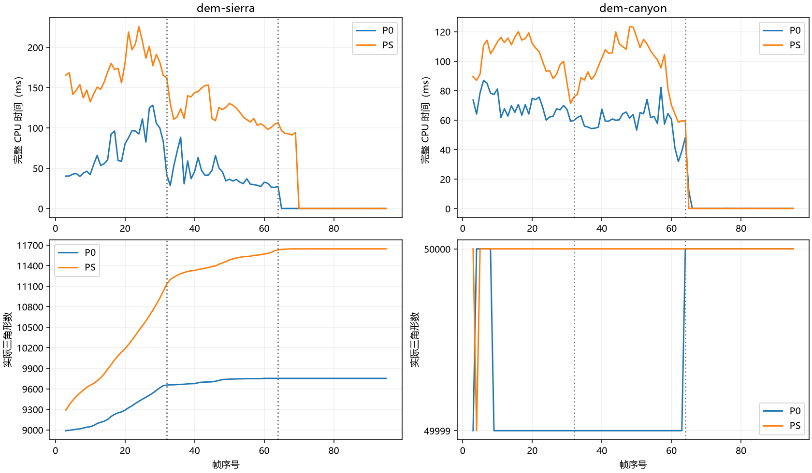
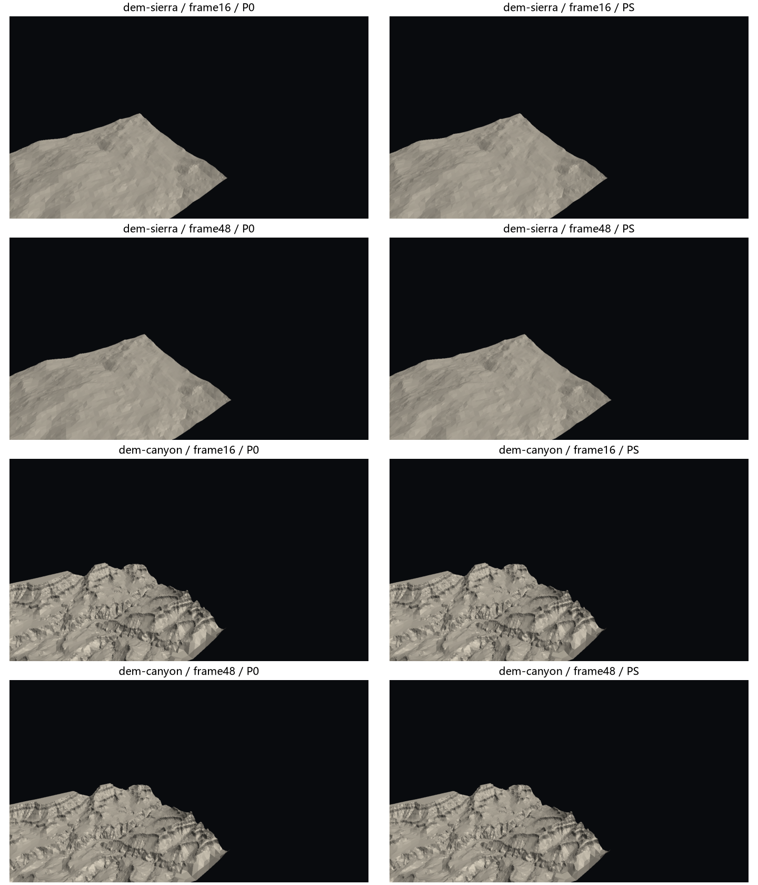

# QPC-04H：源高度替代旧 Fit 的有限消融

2026-09-17。基线 `c00ca8a`。对应[规划](../../plans/cpu_refinement/qpc_04h_source_height_receiver_plan.md)、[推导](qpc_04h_source_height_derivation.md)、[代码事实](../../codebase/cpu_refinement/qpc_04h_source_height_facts.md)。

## 1. 阶段判断

**生成器与安全证书可以分离，但“直接取源高即可降本”不成立。** 源高项能够通过现有双域逐点证书、实际发布并继续更新；默认旧 Fit 保留。PS 不作为性能替代方案晋升，仅留下显式实验分支供复现。

真正原因是删除 Fit 同时删除了一个昂贵但有效的前置筛选。结构通过的源高提案进入完整逐点认证，其中多数又被高度损伤条件拒绝。Sierra 还执行更多真实细分、支付更多续接成本。删除函数调用不是删除同等数量的总体工作。

局部可行性、独立质量、完整成本和默认路径兼容分别判定，不能合并成一个“通过”。本轮不增加新的高度搜索、Fit 回退、损伤放宽或更多恢复机会。

## 2. 冻结边界与数据身份

P0 为 `pointwise-target + error-first + legacy-fit`；PS 只把 E/F/H 唯一新点取为 `SourceHeightAt`，仍执行相同逐点认证与批次验证。旧点不可变，B/R/donor 规则不改，预算、前缀和预留规则不改。

Sierra/Canyon 使用06E原96机会路线，预算50k、r=m=160、8线程；暖移动为frame3～31，返回32～63，静止64～95。Sierra实际约9千～1.2万面，不能当饱和50k输入。两个场景均使用1,574,913个固定运行时样本。

Windows D3D12普通运行计CPU-ready，离线质量、完整审计、perf/Tracy均不在该边界。每政策先运行一个独立进程，明确退化后各追加一次；29帧只描述单进程分布，不当29个独立样本。另对冻结06E原程序各跑一次，用于检查历史时间漂移。输入、环境、程序SHA-256、源快照和失败命令完整留在：

`benchmark-output/cpu-refinement/qpc-04h/run-01/`

完整归约见[数据导航](data/qpc_04h_source_height/README.md)。首测、复测和后续语义修正核对分别保留，不择优替换。WSL两次启动异常发生在采集前，未生成成功性能运行；重启后的实际成功命令保留。功耗/后台环境没有完全受控，不能据单次帧分布声称统计显著。

## 3. 实际实现与证明责任

新 `SourceHeightReceiver::Prepare` 只准备私有提案：原身份/支持/旧点检查、确定源高赋值、原形状和+2面检查。准备成功不是认证成功；`Reservation` 必须随后执行原 `PointwiseQuality::Certify`。缺证书、篡改新高度、过期批次、配置热切换都有专项拒绝。

源高项不再产生旧统一最大值目标，`HasLegacyQualityEvidence=false` 防止默认零值被误当成证据；旧 `Accepts` 明确拒绝这类提案，诊断输出为不适用。完整闭支持、核心/float双域、离屏高度条件、正进展、共享样本组合和发布绑定没有删减。

SH-01～04推导记录了原目录的固定接口义务，以及为何安全证明只要求最终候选满足证书，不要求由旧Fit产生。它不证明任意源高可行、连续曲面最大误差、未来视图或有限时间恢复；没有新增Lean定理。

最终审查发现面数检查过早会遮蔽原形状拒绝：舍入后的内部边中点可能形成额外薄面，旧入口会返回 `shape_infeasible`，新入口不应先返回结构失败而抑制翻边。已把净面数检查移到原形状检查之后，新增“额外退化面仍保留翻边资格”专项。修正后两条PS正常轨迹各96帧的全部导出逻辑列一致，包括网格、实际面数、交换、逻辑访问与写入；因此复用已独立评价的相同网格，不重新做无变化质量矩阵。逐项拒绝分类与此前诊断仍区分，不能把旧profile冒充新版本重采。

## 4. 同快照局部证据

43项04G冻结输入只新增一个源高试值，不用新轨迹重选输入。结果为27项通过、11项质量拒绝、5项形状拒绝；B控制项保持原固定高度，不计算为新生成器收益。

27项通过均来自Sierra frame95，双域均成立，没有仅靠低于1e−12的极小正进展通过的项。但27项的**局部最大误差全部保持原值**：它们改善部分超标样本，不能修复补丁外接口上固定的最坏值。

原生私有见证选定同一根−269的E/F/H三项，源高均被新逐点条件认证，旧 `Accepts` 均拒绝。例如E的旧拟合存值约5.394481、源高约5.491086，核心进展下界约4.27px²；新条件可行不等于旧门槛可行。这些私有试值不修改P0轨迹。

持续轨迹的独立有理审计选择首个非空批frame0及frame48：Sierra分别83/9项，Canyon分别35/0项，共127项非空交换或空额接收。核心和实际float域的逐项损伤/进展及共享样本组合均通过；Canyon48为空，不能算作有工作验证。闭支持组合样本分别为26,625、2,630、3,343。完整证据和有限记录上限留在 `exchange-audit.json`。

## 5. 独立持续质量：改善与退化同时存在

独立评价参考为原始U16+双线性，k=0固定算法无关采样；RMS为可见参数域样本等权，并非屏幕面积加权。四帧均无缺失、歧义、无效几何/投影计数。下表单位px；Hmax的单位是世界高度。

| 场景/帧 | 实际面数 P0→PS | Emax P0→PS | RMS P0→PS | Dmax(PS,P0) |
|---|---:|---:|---:|---:|
| Sierra 2 | 8982→9198 | 1.5864→1.6061 | 0.2572→0.2482 | 0.3520 |
| Sierra 16 | 9196→9952 | 1.9984→1.9984 | 0.2897→0.2691 | 0.3027 |
| Sierra 48 | 9734→11438 | 1.9960→1.9960 | 0.2873→0.2337 | 0.3033 |
| Sierra 95 | 9752→11644 | 1.1236→1.1097 | 0.2541→0.2077 | 0.3674 |
| Canyon 2 | 49999→50000 | 4.6765→4.6765 | 0.3029→0.3021 | 1.0786 |
| Canyon 16 | 49999→50000 | 9.2641→9.2641 | 0.4842→0.4646 | 0.2936 |
| Canyon 48 | 49999→50000 | 9.2745→9.2745 | 0.4796→0.4602 | 0.2936 |
| Canyon 95 | 50000→50000 | 2.3382→2.0477 | 0.2989→0.2981 | 2.0174 |

两政策Hmax在所有被测帧分别保持0.377723/1.165875。Emax均没有触发预注册“P0+0.1px”警戒线，但这不是逐点无退化结论。

Sierra95的RMS下降约18.26%，实际面数增加19.4%；超0.5px样本从86,234减到30,024。与此同时，PS比P0高0.1px的样本有4,156个，高0.25px的有31个。Canyon95整体Emax下降约0.290px，却有7个样本比P0差0.5px以上，其中最差差值2.0174px；P95仅0.63137→0.63026，不能用较低全局最大值掩盖局部结果。

原因是两条路径选择并演化为不同网格。证书保护的是每个事务相对**自身旧状态**的有限样本条件，不保证PS逐点优于另一条P0历史，也不保证一条路径能恢复另一条路径已处理的位置。Sierra16/48最坏见证固定在靠近外边界的同一点，增加内部细分并未改变它。低于目标的样本允许在目标内交换误差，跨视图也没有无条件不退化保证。因而本轮只支持“部分分布改善、仍有局部差异”，不宣布持续质量修复。

## 6. 完整时间和工作量

以下是首测同构建政策对照，单位ms；P95是帧分布，不是独立进程置信区间。

| 场景 | 移动均值 P0→PS | 中位 P0→PS | P95 P0→PS | PS/P0 |
|---|---:|---:|---:|---:|
| Sierra | 73.219→171.609 | 65.854→169.074 | 119.344→214.281 | 2.344 |
| Canyon | 70.000→103.719 | 68.686→108.749 | 83.497→118.009 | 1.482 |

定向复测仍同向：Sierra72.261→178.368ms（2.468倍），Canyon73.339→107.108ms（1.460倍）。没有场景达到完整移动下降10%的候选门槛。不同最终网格的比较不称同任务并行加速。

最终形状拒绝顺序修正后，PS移动均值为Sierra173.604ms、Canyon108.797ms；该两次运行用于修正后的输出/明显成本核对，不当作新的独立重复矩阵或择优替代首测。其数量级没有改变本轮门禁结论。

Sierra96机会中空额接收480→1426、最终9752→11644面；Canyon交换110→111、空额接收均2、最终均50000面。因此Sierra变慢包含更多真实更新；Canyon几乎相同实际事务量仍更慢，说明认证拒绝工作本身也有显著代价。

Sierra复测接收50.031→137.771ms、样本修复9.246→23.092ms；视图10.074→10.773ms，预留0.169→0.533ms。接收和续接合计增量约101.59ms，解释完整增量106.11ms的大部分；不把全部差值都归给Fit移除。

Canyon复测接收41.155→75.947ms，而视图15.088→14.887ms、捐赠14.113→12.971ms、样本修复1.846→1.663ms。接收增加34.792ms基本解释完整增加33.769ms，其他项略抵消。继续优化预留或写网格不能解决该主要增量。

历史06E的55.458/53.785ms不能直接充当本轮相同环境基线。冻结旧程序在本轮复测也变成67.459/72.573ms，说明跨轮时间漂移真实存在。但Sierra本轮P0仍比同时段旧程序高4.801ms（7.12%），超过工程筛查线；Canyon差0.767ms（1.06%）。该旧路径残差没有充分归因，不能写成“默认路径无性能影响”。完整逻辑输出相同，有限额外采样到此停止；保留风险，不借本轮PS负结果扩大微优化或签发生产性能验收。

## 7. 函数、时序和复杂度的统一解释

Sierra暖移动的Tracy结果对比06E历史同协议诊断，调用计数的意义强于跨轮微秒差。这里是最终拒绝分类调整前捕获；后者已核对相同输出，但没有把前一版本精确调用数冒充最终重新采集。跨线程区间和不是aggregate CPU time，父子区间不能相加。

| 函数区间 | 旧P调用数 | PS调用数 | 旧P区间和ms | PS区间和ms |
|---|---:|---:|---:|---:|
| `gtp.fit` | 28606 | 0 | 1628.123 | 0 |
| `gtp.receiver.source_height` | 0 | 23778 | 0 | 282.569 |
| `gtp.pointwise.certify` | 1357 | 11234 | 1997.352 | 13930.156 |
| `gtp.measure` | 1392 | 33 | 475.521 | 8.722 |
| `gtp.pointwise.validate_batch` | 29 | 29 | 61.949 | 104.844 |

删除Fit/Measure确实成功，但逐点调用增加8.28倍，区间和增加约6.97倍。平均每次逐点认证反而约1.472→1.240ms，**主要不是同一次认证突然变贵，而是认证人口扩大**。不同提案和支持分布使这个平均值不能当同输入内核比较。

原链为“Fit失败即停，否则逐点检查”；新链为“局部形状合法即进入逐点检查”。Sierra诊断出现11,228次源高准备成功，只有约1,495次接收证书成功，主要拒绝为高度损伤。源高在新点处正确，不代表其邻域的线性插值满足每个样本的旧误差/目标上界。该事实与3×3中心峰解析拒绝例一致。

成本推导不能只写`W_new=W_old−W_Fit`。正确账本为：

\[
W_0=\sum_{V_0}F_i+\sum_{A_0}Q_i+W_{continuation,0},\qquad
W_s=\sum_{V_s}S_i+\sum_{A_s}Q_i+W_{continuation,s}.
\]

源高取值O(1)，准备访问O(d)局部记录，容器查询上界O(d log N+d log d)；完整双域证书仍最坏O(sd)，还包括样本支持排序、区间和精确有理位长。源高没有消除这个项。新成功项改变目录早停和后续状态，`V_s`与`A_s`不能替换为旧集合。

Tracy接收派发均值70.509ms、最长任务70.340ms、等待70.331ms，8线程均衡量0.905。frame23最长任务103.360ms，其中46次逐点认证累计99.272ms；不是主线程无故等待或线程没有工作。旧06E接收均衡量约0.861，因此不能把变慢归结为任务均衡退化。

perf暖窗口8,592个样本、权重17,218,436,736，lost=0；3个未知自身样本、8,284个未知祖先保留，不伪装完整符号化。逐点Certify含调用83.17%，源高准备含调用1.79%；`__nextafter`自身18.70%，其中18.26个百分点来自逐点链；Boost gcd自身10.73%、浮点转大整数5.47%、一个大整数除法实例5.16%。这是`cpu-clock`采样，不是硬件cycles；完整210个有占比函数、调用边和堆栈在数据目录。

Linux FP正常移动101.605ms，perf捕获100.917ms；Tracy同构建未连接88.912ms，连接96.688ms（+8.75%）。构建和观测会改变时间，诊断不能替代Windows正常主表，也不能跨构建解释“Tracy加速”。

这些数值叶热点与`CheckSample→Cover/Height→区间/有理`源码链一致，但本阶段不继续重写数值核。生成器提高进入此链的人口，是比叶函数常数更直接的因果解释。Canyon账本中的拒绝原因还包含配对反复引用，不把其理由计数冒充独立认证调用次数。

## 8. 验证、视觉和阶段出口

源高专项覆盖原游标构造、旧点不变、真实源高、质量不可旁路、篡改/过期、无进展、中心峰反例、非法配置、后续更新和形状拒绝类别。原逐点双域/float反例及核心持续专项已运行；只改测试排版和新增拒绝类别后定向重跑源高专项，没有全CTest。Python配置校验覆盖有效、未知枚举、旧质量政策、可变旧点和非误差优先组合。

正常/质量/视觉轨迹分别采集，全部96帧导出逻辑列与各自正常运行一致。Agent实际查看两场景P0/PS的frame16/48八张图，未观察到新增可见裂缝、反向面或巨大高度尖峰；原有低模/明暗变化存在。该视觉检查不能覆盖全轨迹与遮挡区，也不替代质量数字；用户视觉签收仍单列。

| 门禁 | 结论 |
|---|---|
| 不依赖旧Fit的合法候选与有限续接 | 通过有限证据，非全输入形式证明 |
| 独立Emax警戒线 | 四帧未触发；局部Dmax仍有明显差异 |
| 完整性能候选价值 | 未通过；两个场景持续更慢 |
| 旧路径逻辑兼容 | 通过导出列核对 |
| 旧路径无性能回退 | 未签发；Sierra同窗口残差另记 |
| 持续恢复/生产推荐 | 未通过，不晋升源高政策 |

本轮结论否定的是当前“源高单点+全逐点认证”作为降本替代，不是否定所有去Fit算法。后续若再讨论，必须回答如何在不恢复旧错误门槛的前提下减少必败提案的昂贵认证，并在同一成本账本中计费；本轮不自动启动该研究。
