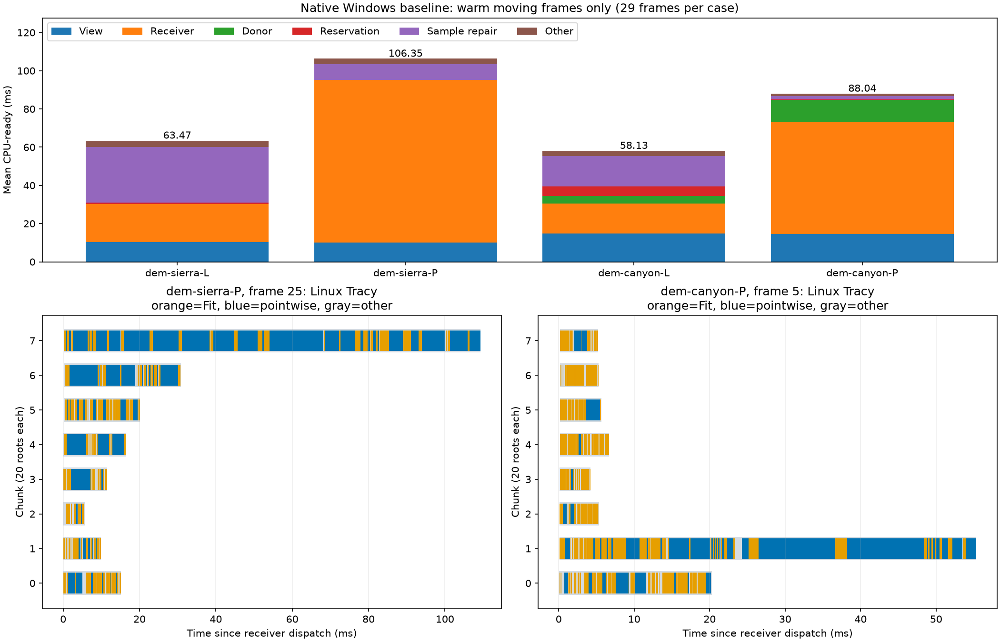

# QPC-06C：当前函数热点、线程长尾与优化依据

2026-09-17。基线`5a18cb1`（06B之后），本轮只增加两个关闭时消失的Tracy区间。结论类型为**当前热点诊断完成**，不是优化收益、持续质量或论文性能门禁通过。

**新政策当前首先受接收阶段限制：旧Fit与新增逐点认证都昂贵，而八个固定连续块又把昂贵根集中在少数任务中。** 06A/06B确实减少了部分工作，但没有解决这条移动路径；也没有证据证明剩余优化空间很小。当前这两个输入的P政策预留不足0.4ms，不能再拿历史200k预留瓶颈来指导这轮优化。

## 1. 测量契约与代表性

- L=`legacy + error-first`，P=`pointwise-target + error-first`；surviving heights均immutable，翻边开启，Sierra不启用边界细化、Canyon启用。预算50k，`r=m=160`，8 workers，原96机会与相机路线不变。
- **50k是预算，不是四组都实际有50k面。** 暖移动段Sierra L为8950～10794面、P为8988～9646面；Canyon L为49997～50000面、P为49999～50000面。四组Q均为1,574,913。不能把Sierra称为实际50k饱和负载。
- 每组分别运行FP正常、perf、Tracy构建未连接、Tracy捕获各一个独立进程，共16个，顺序采集，不与编译或其他采样重叠。96机会包含前三暖机；主要函数与时序分母为**frame3～31的29个暖移动机会**，返回/静止另外归约。
- Linux CPU适配器调用实际`TransactionalTerrainLodAlgorithm::BuildRenderData`，没有renderer/upload。`ProfileSession`当前仅支持Linux；Windows06B正常数据保留为原生参照。四种采集模式之间、Linux与Windows之间，四组各96帧的mesh hash、相机、面数、预算、序列、实际工作和写入计数全部一致。
- 行为一致支持“采到同一算法工作”，**不支持把Linux函数百分比乘Windows毫秒数**。编译器、数学库、分配器和系统仍不同。本报告没有原生Windows函数级比例，没有硬件cycles/cache misses，也没有逐线程精确CPU时间。
- perf使用`cpu-clock:u`、499Hz、frame pointers；保持Release内联与严格浮点。Tracy使用现有0.14.1客户端/采集器；补`gtp.pointwise.certify`和`gtp.pointwise.validate_batch`，没有逐样本区间。工具路径、二进制、CMakeCache、compile_commands、源码/输入与manifest保存在原始目录。

| 输入 | FP正常CPU ms | perf CPU ms | Tracy未连接 ms | Tracy捕获 ms | Windows06B正常 ms |
|---|---:|---:|---:|---:|---:|
| Sierra L | 40.193 | 40.134 | 39.355 | 39.324 | 63.468 |
| Sierra P | 62.406 | 62.283 | 63.053 | 62.965 | 106.349 |
| Canyon L | 43.641 | 44.781 | 43.223 | 43.322 | 58.133 |
| Canyon P | 56.438 | 57.040 | 56.583 | 56.673 | 88.040 |

均为上述暖移动段完整CPU-ready均值，包含视图、规划、应用、续接与CPU mesh，不含初始化和上传；perf控制握手在ROI外，不能加回这些帧。Tracy连接前后均值变化为−0.08%、−0.14%、+0.23%、+0.16%，perf相对FP为−0.15%、−0.20%、+2.61%、+1.07%。每格仅一个进程，负数不是“profiler让算法更快”，也不证明尾部无扰动；本轮不做显著性或新提速声明。

| 输入 | ROI采样数 | 无栈 | 未知自身符号 | 有未知祖先 | 全部有权重符号数 |
|---|---:|---:|---:|---:|---:|
| Sierra L | 1811 | 0 | 1 | 1497 | 155 |
| Sierra P | 2933 | 0 | 2 | 2804 | 168 |
| Canyon L | 2194 | 0 | 1 | 1863 | 164 |
| Canyon P | 3197 | 0 | 1 | 3115 | 193 |

四次perf均报告丢失0。未知祖先主要在外层线程/系统栈边界，业务函数仍可见；不把它隐去，也不能把该inclusive比例当作未知CPU成本。Sierra L低于规划建议的2000样本，本轮保留低样本标记，不补采以改变排序；只用于大路径对照，不解释稀有函数的细微排名。其余三组达到建议量，仍不等于统计精度保证。完整自身权重和等于ROI总权重，调用链有祖先缺口的限制保留。

## 2. 原生阶段与工作人口：P不是L外面简单多包一层

下面用原生Windows正常计时定位用户实际平台的阶段；后文Linux工具负责解释函数与执行形状。

| 输入 | 完整CPU | View | Receiver | Donor | Reservation | Sample repair |
|---|---:|---:|---:|---:|---:|---:|
| Sierra L | 63.468 | 10.448 | 19.911 | 0 | 0.605 | 29.107 |
| Sierra P | 106.349 | 10.016 | 85.070 | 0 | 0.188 | 8.159 |
| Canyon L | 58.133 | 14.762 | 15.614 | 4.171 | 5.023 | 15.711 |
| Canyon P | 88.040 | 14.454 | 58.852 | 11.343 | 0.359 | 1.849 |

单位ms/移动机会；未列小阶段保留在完整分母。P接收占80.0%/66.8%，预留仅0.18%/0.41%。L的Sierra样本续接占45.9%，与P并非相同瓶颈。Canyon L的预留确有成本，但不能用P的优化账本替它选择方向。

| 29机会累计 | Sierra L | Sierra P | Canyon L | Canyon P |
|---|---:|---:|---:|---:|
| examined roots | 4640 | 4640 | 4640 | 4640 |
| certified receivers | 1491 | 582 | 917 | 1129 |
| D_need | 0 | 0 | 910 | 1128 |
| D_feasible | 0 | 0 | 904 | 965 |
| paired exchanges | 0 | 0 | 431 | 60 |
| free executions | 948 | 332 | 6 | 1 |
| pair checks | 0 | 0 | 102870 | 179036 |
| sample touches | 1975364 | 3138183 | 1581024 | 2922122 |

`free/exchanges`不覆盖单独的净零翻边指标，不能拿它们单独代表所有拓扑修改。Sierra没有donor路径却很慢，直接排除“预算配对是P这轮主要退化来源”。Canyon P配对次数更多但预留更便宜，说明检查人口、拒绝位置和批准批宽都影响成本，**不能用PairChecks一个计数预测预留时间**。跨政策曲面、支持与后续人口已变；本表是成本来源对照，不是等价算法的加速比。



上图各栏明确区分平台。下方灰色是任务包络，橙色Fit、蓝色逐点认证；Measure嵌套在Fit中，没有再叠一层避免重复着色。图中每块20根，并不意味着每块工作相同。

## 3. perf：CPU真正花在了哪些函数

表格为ROI内所有参与线程的采样权重百分比，`自身 / 含下游`。后者包含子函数，**行之间不能相加**。这是CPU采样，不是墙钟比例，也不是调用次数。完整符号、采样量、权重、调用边和完整栈在[数据目录](data/qpc_06c_current_profile/README.md)，没有截成只保留前十名。

| 函数/入口 | Sierra L | Sierra P | Canyon L | Canyon P |
|---|---:|---:|---:|---:|
| `PointwiseQuality::Certify` | 0 / 0 | 0.48 / **41.60** | 0 / 0 | 0.31 / **32.03** |
| `Certification::Fit` | 2.21 / **36.66** | 0.92 / **26.08** | 0.87 / **23.43** | 0.88 / **25.43** |
| `__nextafter` | **10.44** / 10.44 | **17.90** / 17.90 | **7.75** / 7.75 | **12.42** / 12.42 |
| `rational_adaptor::operator=(long double)` | 1.77 / 11.93 | 2.35 / 18.34 | 1.73 / 12.40 | 2.35 / 20.21 |
| `Samples::Weights` | 2.32 / 16.90 | 1.57 / 10.91 | 2.23 / 16.09 | 1.31 / 11.73 |
| `QualityEvaluation::ErrorBounds` | 0.50 / 12.53 | 0.27 / 5.56 | 0.41 / 12.63 | 0.56 / 11.73 |
| `Samples::Prepare` | 5.74 / 13.97 | 1.30 / 2.63 | 2.32 / 7.52 | 0.13 / 0.66 |
| `AddBinaryBounds` | 0 / 0 | 0.07 / 0.41 | 0 / 0 | 0 / 0.06 |

`eval_gcd`各重载**自身**合计L/P分别为Sierra3.81%/8.15%、Canyon3.51%/8.01%；`divide_unsigned_helper`自身合计3.64%/5.18%、3.42%/6.85%。这里仅合并互斥叶采样，不把重载inclusive累加。可见有理数转换、归一化和除法不是推测出来的成本。

Sierra P的`__nextafter`有525个自身样本，Canyon P有397个。按互斥上层路径分摊到**整个ROI分母**如下：

| nextafter来源 | Sierra P | Canyon P |
|---|---:|---:|
| 新逐点认证 | 12.79% | 4.91% |
| 旧Fit | 4.88% | 4.72% |
| donor构造/旧认证，排除上两项 | 0 | 1.69% |
| 其他/未落入上述栈 | 0.24% | 1.09% |

因此既不能说“全部数值热点都是P新增的”，也不能继续把06A已经处理的进展整数累计当主瓶颈：当前`AddBinaryBounds`含调用不足0.5%。`nextafter`占比是其运行证据，**不是允许删除外向舍入的理由**。

## 4. Tracy：真实调用次数与时间落在哪里

下表累计29个暖移动机会，单元为`调用次数；累计含下游ms`。并行任务时间可重叠，也含被抢占时间；**不是aggregate CPU work，不可相加当完整帧**。

| 区间 | Sierra L | Sierra P | Canyon L | Canyon P |
|---|---:|---:|---:|---:|
| `gtp.fit` | 23724；1341.93 | 28606；1610.16 | 26725；1043.73 | 25689；1622.65 |
| `gtp.pointwise.certify` | 0；0 | 1357；2449.36 | 0；0 | 6070；2039.22 |
| `gtp.measure` | 1591；545.47 | 1392；467.14 | 4527；707.48 | 6215；949.15 |
| `gtp.receivers` | 26869；340.46 | 32662；304.77 | 30764；340.71 | 29348；228.17 |
| `gtp.donor` | 0；0 | 0；0 | 4640；400.64 | 4640；437.29 |
| `gtp.samples.prepare` | 29；519.52 | 29；155.96 | 29；336.54 | 25；40.46 |

`gtp.receivers`对应cursor取下一项的构造区间，不是整根完整认证；`pointwise.certify`包括receiver和donor，不能把Canyon的6070次都归给receiver。Measure嵌套在Fit/Donor中；完整self表记录在CSV。Canyon P的Fit次数较L少，累计时间却高约55%，不能把退化全部归因于“多调用了几次”：提案、支持、精确分支和曲面均已改变。

### 4.1 八线程并没有把接收工作平均摊开

| Receiver每机会均值（ms） | Sierra L | Sierra P | Canyon L | Canyon P |
|---|---:|---:|---:|---:|
| 派发到完成 | 11.234 | **47.232** | 9.980 | **35.481** |
| 8个任务时长之和 | 59.532 | **151.429** | 53.917 | **120.916** |
| 最长任务 | 11.037 | **46.971** | 9.772 | **35.256** |
| 主线程wait区间 | 11.080 | 47.018 | 9.806 | 35.236 |
| 最后任务完成至派发返回 | 0.061 | 0.128 | 0.068 | 0.142 |
| 各帧`Σtask/(8×maxTask)`的均值 | 0.682 | **0.437** | 0.697 | **0.450** |

四组均实际观察到8个接收worker。最后一行是**任务时长平衡指标**，不是CPU利用率；也不是“均值任务和/均值最长任务”这个不同统计量。View投影/评分的同类指标约0.85～0.91，问题并非所有阶段都无法分发。

源码`TransactionalExecution::Run`令`chunks=min(count,Workers)`，160根恰好切成8个连续20根块；块内顺序处理。每根尝试项数、样本支持、旧Fit及精确回退费用不同。当前块之间不可再分配尾部工作，因此完成时间跟最重块走。`pool.wait`大部分包着worker真实工作，不能当作可以删除的47ms线程池税。派发尾部只有约0.1ms；短face/mesh fill有时只被1～2个线程消费，是另一个小工作量现象，不解释接收长尾。

### 4.2 两个重帧的实际时序

| Linux Tracy | Sierra P，frame25 | Canyon P，frame5 |
|---|---:|---:|
| 完整帧CPU-ready | 128.037ms | 83.008ms |
| Receiver派发 | 109.465ms | 55.534ms |
| 任务和 | 218.120ms | 106.936ms |
| 最长块 | 块7，109.117ms | 块1，55.216ms |
| 最长块Fit | 66次，21.546ms | 119次，16.397ms |
| 其中Measure，已包含于Fit | 25次，12.296ms | 27次，7.978ms |
| 最长块逐点认证 | 25次，**86.144ms** | 27次，**36.209ms** |
| 最长一次逐点认证 | 14.107ms | 10.123ms |
| 最后任务之后的尾部 | 0.189ms | 0.228ms |

重块由多次昂贵认证组成，不是一次不可分的109ms调用。但当前没有每根总时长区间，不能从“25次认证”直接推出“25个互相独立的根”。是否细分根任务足够、最大单根是否仍主导，要由后续同结果消融验证。

## 5. 源码—算法—成本链

### 5.1 接收流程是两套目标顺序求值

`TransactionalReservation::Plan`在只读snapshot上，对每根逐项调用`ReceiverCursor::Next → CertifyReceiver/Fit`；旧认证通过才调用`PointwiseQuality::Certify`。新认证失败仍继续目录；所有worker结束后按原前缀顺序收集，才命名资源与预留。旧Fit目前仍针对旧最大误差/最低改善目标，不是新逐点势能的可行性求解器。

设根数为r，根i实际尝试集合为A_i，则：

\[
W_{receiver}=\sum_{i=1}^{r}\sum_{a\in A_i}
\bigl(W_{construct}(i,a)+W_{Fit}(i,a)+\mathbf1_{old\ accept}W_{pointwise}(i,a)\bigr)+W_{collect}.
\]

若固定分块集合为C_j，本实现的接收完成时间形状为：

\[
T_{receiver}\approx T_{dispatch}+\max_j\sum_{i\in C_j}T_i+T_{join/ledger}.
\]

这是**当前执行划分**，不是语义必需关键路径。即便W下降，某个重块没有下降也可能不明显缩短墙钟；即便重分块缩短墙钟，W仍可能很大。两种优化必须独立测。

### 5.2 几何证据复用尚未覆盖“提案不变的面事实”

`TransactionalQualitySampleEvidence`已复用一个样本/域内的reference、coordinate和clip；但旧/新面仍分别经过`CoverPrepared`。该函数对候选面的每条边先做区间定向判别，不确定时使用精确坐标与`R(b.U)`等边端点重新求值。边上/邻近边的样本可反复触发这些分支。

旧路径`Samples::Weights`也**已有**便宜浮点过滤：只有边判别落入误差界才使用有理计算，不能把它描述成无条件全精确。`TransactionalProposalEvidence::Get`缓存同一proposal的sample→face/weights；它不等于新逐点双域的完整证据，也没有跨proposal缓存。`SameInterface`还单独构造边集、比较外接口并计算精确面积。

因此可检验的省工点是：在不改变面序、闭包含、浮点域/输出域和回退语义的前提下，**按提案准备一次面/边几何系数，供多个样本消费**。不是扩大全Q缓存，更不是替换为裸double+epsilon。采样已经显示重复求值链很贵，但尚无消融证明这种缓存能赚回准备/内存成本；有理位数也必须计费。

设d为提案面数，u为关联/包围盒产生的候选样本数，s为真正覆盖并比较的样本数。逐点认证至少包含两域的候选整理`O(u log u)`、旧新覆盖最坏`O(ud)`、覆盖样本的高度/投影/损伤累计，以及接口检查。`SameInterface`还包含有限面之间的接口检查；可用`O(d²)`保守描述几何对比部分，但map/有理算术成本另计。**d有界不意味着u、s或有理位数有界**。06A只减少部分同样本重复计算，没有把这条路径变成常数。

### 5.3 Samples续接是L的重要成本，不是P的统一解释

`TransactionalSamples::Prepare`访问被移除/目标面及相邻面，重新枚举关联样本、owner、贡献和局部score，再整理发布数据。它是局部支持维护，但费用随实际样本/受影响面与排序规模增长，不能按exchange数直接视作O(1)。Sierra L接受更多自由细化，原生修复29.107ms；P接受少，修复8.159ms。P不是“每个阶段都更慢”。

View仍对Q与活动候选求值；没有因这轮认证热点就证明其全域成本必要或最优。只是当前P的绝对优先级落在Receiver，L需要另读自身账本。

## 6. 根据证据重新排列优化候选

| 优先级/适用政策 | 候选 | 已有证据 | 下一步必须验证的内容 |
|---|---|---|---|
| 1，P接收 | 独立根更细任务划分，完成后仍按前缀收集 | 8个固定块，最长块几乎等于阶段墙钟；重块含多次认证 | 同根目录/选择/输出一致；完整计入更多dispatch、ledger、配额/异常检查；最大单根与任务尾部是否改善 |
| 2，L/P数值路径 | proposal-local面/边准备，减少重复转换/覆盖求值 | Weights、Cover链、有理转换和nextafter实际有显著权重 | 不混两个表示域，不改变误差方向/闭边界/精确回退；记录转换/谓词次数和完整时间；无收益撤回 |
| 3，L尤其Sierra | 局部样本续接重复枚举/排序审计 | 原生29.107ms，Tracy有独立Prepare时段 | owner/闭面贡献/索引持续一致；省工不是漏更新，按真实支持计账 |
| 算法议题，另行Review | 旧Fit与新目标的求解错配 | 两套目标串接，昂贵失败后继续目录 | 不是等价性能修复；需独立冻结可行性、质量与选择语义，不能擅自跳过旧认证 |
| 当前靠后 | reservation、face/mesh fill、AddBinaryBounds再优化 | P预留<0.4ms，累计内核inclusive<0.5%，写入阶段很短 | 不以其他政策/200k旧负载的大头替代当前证据 |

**收益敏感性，不是承诺：** 假设Receiver任务中的可迁移工作可以无额外代价均摊，并暂用Tracy任务时长和作为模型输入，则Sierra P的Receiver从47.232变为151.429/8=18.929ms，完整Linux捕获均值62.965→34.662ms；Canyon P从35.481变为120.916/8=15.115ms，完整56.673→36.307ms。约1.82×/1.56×仅说明长尾可能足以影响完整结论。任务时长含抢占，根不可任意切碎，缓存/调度成本会变；它**不是可实现下界、理论加速保证或Windows预测**。

反过来，即使当前P预留免费，原生完整最多仅省0.188/0.359ms，约0.18%/0.41%。这就是本轮不应优先做reservation的量化理由；不否定Canyon L或历史200k的预留风险。

06A未达到25%门槛只关闭当时两项机制；06B主要降低静止空批成本。二者都不能推出“移动路径已无值得做的优化”。本次补齐证据后，下一步如实施应先做**同结果、有限范围的接收任务粒度消融**，再决定面证据准备；不直接启动更多算法机制，也不因有潜力就承诺追平DOD。

## 7. 复现、验证与收口

原始捕获在`benchmark-output/cpu-refinement/qpc-06c/run-01/`（遵循仓库忽略规则）：每组四模式含输入、frames、源码快照和manifest；perf保留data、report、script和二进制；Tracy保留trace、官方CSV、完成标志与二进制。`freeze.json`记录输入/基线，`collect.py`记录本次顺序命令；源码中可复用入口仍是`run_experiment.py profile`与`profile_adapter`，不是新平台。

归约命令（Ubuntu，仓库根）：

```bash
/home/mcaswen/.cache/roam-experiments/venv/bin/python scripts/analyze_transactional_current_profile.py \
  --input benchmark-output/cpu-refinement/qpc-06c/run-01 \
  --output docs/research/cpu_refinement/data/qpc_06c_current_profile --plot
```

归约加绘图实测9.388s，不计入算法。提交归约表、图、输入manifest等关键文件SHA；大原始文件留在已忽略目录。所有权重符号、调用边、全栈以及逐帧任务起止均保留，完整栈CSV仅gzip压缩，不截断符号。

验证限于两种Linux profiling构建、16次采集行为比对、窗口/完成/权重/嵌套恒等检查与既有perf/Tracy解析测试（6项）；没有重跑后端矩阵和全量CTest。归约表权重、压缩前后全栈内容、Python语法和文档链接另行核对。正常关闭宏不产生这两个区间，原生正常基线复用06B。源码与规划核查见[事实](../../codebase/cpu_refinement/qpc_06c_current_profile_facts.md)、[审查](../../reviews/cpu_refinement/qpc_06c_current_profile_review.md)。

当前出口：**函数/时序归因完成；生产算法没有新的性能修改；优化收益待消融；持续质量仍未通过。** 本阶段收口并提交，不自动进入新的调度、数值缓存、Fit或预留实现。
