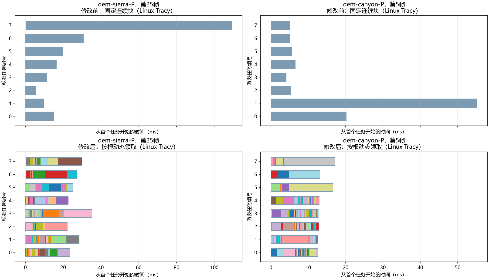

# QPC-06D：接收根任务均衡的实施与性能结果

2026-09-17。基线`c678ebe`，对应[小规划](../../plans/cpu_refinement/qpc_06d_receiver_task_balance_plan.md)、[代码事实](../../codebase/cpu_refinement/qpc_06d_receiver_task_balance_facts.md)和[06C热点报告](qpc_06c_current_hotspot_results.md)。

## 1. 结论与适用范围

**同结果任务均衡的移动段门禁通过，保留实现。** Windows正常运行下，P政策的Sierra/Canyon完整CPU均值分别下降40.84%/31.43%，接收阶段下降50.73%/49.20%；L政策完整均值也下降10.21%/5.12%。Linux独立测量重现相同方向。修改没有降低认证要求、减少目录尝试、缩短前缀或改变最终网格。

收益有明确执行原因：原来160根固定分到8个连续块，重根集中在某一块时，其他线程提前结束；现在仍派发8个同步任务，但完成一根后领取下一根。Tracy显示最长任务约减半、任务时长和基本不变，perf中几何认证热点依然存在。**这是减少固定分块产生的额外等待，不是已经减少几何求值工作。**

本阶段没有证明持续质量恢复、P政策优于L、相对DOD的性能竞争力或优化空间耗尽。Linux Canyon P静止恢复区间仍有约0.08ms的未定因差异，另列[残余分析](../../reviews/cpu_refinement/qpc_06d_idle_timing_analysis.md)；因此不写成“所有区间无性能问题”，不自动开始下一项优化。

## 2. 测量契约与身份

| 项目 | 本轮固定值与边界 |
|---|---|
| 政策 | L=`legacy + error-first`；P=`pointwise-target + error-first`；两者不是同任务速度对照 |
| 输入 | Sierra/Canyon原96机会持续轨迹；预算50k、8线程、r=m=160；旧点高度不可变；翻边开启；边界接收Sierra关闭、Canyon开启 |
| 实际规模 | Sierra约9千～1万活动面，Canyon约5万；Q均1,574,913，不能把预算50k叫作Sierra实际50k |
| 主窗口 | `reveal`暖移动frame3～31，共29帧；`return`32～63和`recovery`64～95独立归约 |
| Linux | 原FP构建正常计时；两个P各一次Tracy及同构建未连接对照；仅Sierra P重采perf |
| Windows | 真实D3D12平台正常构建，四组原生轨迹；上传独立列出，不并入CPU-ready |
| 前测来源 | Linux复用06C；Windows复用06B同政策正常运行；本轮修改前二进制独立保留 |
| 采集规模 | 首轮13个进程，触发项旧/新配对复测8个进程；均顺序执行，无同时编译/测量 |
| 统计单位 | 独立进程；每个初始配置一次，有限触发项补一次。29帧不是29次独立实验，无显著性/置信区间主张 |

P95为有序帧时间上的线性插值描述值，均值、中位、P95、最大值全部保留。既有慢样本没有被复测替换。正常计时不连接Tracy、不运行perf、不执行额外离线质量评价；诊断计时不作为平台收益。

原始输入、完整命令、环境、源快照与二进制身份保存在`benchmark-output/cpu-refinement/qpc-06d/run-01/`的`freeze.json`、各`manifest.json`及`profile-result.json`。修改前FP SHA-256为`d76237633ece2a11a4576259a71d0d03d23e83de8afb1bcbe20b8c28c2ed0248`，原生为`845ad06a920aa93a9059bd9c3ab36b7d377f2c3c0d6b0559c68066dc5795b54e`。复测旧程序沿用原源快照，不以当前工作区冒充旧源码。归约产物、输入摘要及重建入口见[数据说明](data/qpc_06d_task_balance/README.md)。

## 3. 从热点到实现：什么变了，什么成本没有消失

### 3.1 为什么没有直接派发160个线程任务

`CpuTaskExecutor::Dispatch`限制任务数量不超过线程数，而底层`ParallelFor`会根据请求数量确保线程。把根数直接塞入派发接口会改变并发边界。因此新入口放在算法的`TransactionalExecution::RunIndependent`：复用原`Run`派发至多p个任务，每个任务持有原本的一份`WorkLedger`，通过`atomic<size_t>::fetch_add(1, relaxed)`领取下一索引。

只在`TransactionalReservation::Plan`的接收准备调用它。目录枚举、`Fit`、逐点认证、失败分支、翻边和数值内核均不变。接收根写预分配数组的独占索引，所有任务结束后仍按原全局前缀收集，然后执行原预留；完成顺序不会变成贪心顺序。捐赠、视图、网格和共享线程池没有修改。

### 3.2 同结果命题与中间推导

固定只读快照S及前缀`0,…,r−1`。设原来第i根的完整准备为`F_i(S)`，它只写输出槽i及执行它的局部账本。

1. 成功运行时，原子领取返回互不重复的整数；任务不断领取直到越过r，因此有效领取集合恰为整个前缀。
2. 每次领取仍运行原`F_i`，没有使用其他根完成后的信息，输出仍为`A[i]=F_i(S)`。
3. 原有屏障保证A在串行收集前全部可见。业务内存同步由派发/等待负责，`relaxed`只负责索引唯一性。
4. 所有整数计数仍由原`Merge`相加、最大有理位数取最大。时间累加顺序可变，不要求浮点时间逐位一致。
5. 原预留是A的确定函数，故相同A得到相同批次、预算、网格及下一状态。

这是限定前提下的纸面推导，加源码核查与有限测试；没有新增Lean声明，也不将哈希一致称为全输入形式化证明。共享写、随机数、全局可变缓存或按完成顺序预留都会破坏第2/5步，不能将该入口无条件用于其他阶段。

异常时仍排空已派发任务后传播；多异常首先报告哪一根可以不同。期限由真实时间决定，也不要求超时人口一致。正常成功对照不包含这些失败帧。访问配额随外层任务累积，join后仍做全批检查，没有把额度重置为每根一份。

### 3.3 成本与调度界

令第i根成本为t_i，忽略派发/原子/缓存干扰时：

\[
T_{fixed}=\max_j\sum_{i\in C_j}t_i,\qquad
\max\left(\sum_i t_i/p,\max_i t_i\right)\le T_{list}
\le\sum_i t_i/p+(1-1/p)\max_i t_i.
\]

上界来自最后完成任务开始前，所有p个线程都在执行已领取工作；剩余尾部不超过该单根时间。这是理想独立任务列表调度界，不是当前机器时间保证。新增原子领取为O(r+p)，局部账本空间仍O(p)；没有创建r份映射。几何工作`ΣW(F_i)`和根内串行目录没有降低，最长单根仍是明确限制。实际原子、检查、回调、同步和归并成本全部包含在完整CPU时间中。

## 4. 正常平台性能：完整边界和接收边界

### 4.1 Windows暖移动段

单位ms；箭头为修改前→修改后，下降百分比按均值计算。

| 场景/政策 | CPU均值 | CPU中位 | CPU P95 | 接收均值 | 完整下降 |
|---|---:|---:|---:|---:|---:|
| Sierra L | 63.468→56.986 | 63.627→56.918 | 77.432→70.204 | 19.911→13.086 | 10.21% |
| Sierra P | 106.349→62.916 | 108.040→59.809 | 194.169→94.140 | 85.070→41.918 | 40.84% |
| Canyon L | 58.133→55.154 | 57.969→54.417 | 70.243→73.737 | 15.614→11.309 | 5.12% |
| Canyon P | 88.040→60.373 | 88.644→60.558 | 123.873→74.059 | 58.852→29.897 | 31.43% |

Canyon L的P95上升3.494ms（4.97%），没有被均值收益隐藏。Sierra P完整下降43.433ms，接收下降43.152ms；Canyon P完整下降27.668ms，接收下降28.955ms。主要收益确实在目标阶段，其他费用没有被移出边界。新版本P/L均值比约1.10/1.09，只能描述两政策实际成本差缩小，不能将不同输出的两政策叫作等价加速或据此晋升P。

### 4.2 Linux正常FP运行

| 场景/政策 | CPU均值 | CPU中位 | CPU P95 | 接收均值 | 完整下降 |
|---|---:|---:|---:|---:|---:|
| Sierra L | 40.193→37.404 | 37.720→36.742 | 52.502→47.422 | 11.230→8.112 | 6.94% |
| Sierra P | 62.406→37.866 | 60.322→36.442 | 111.080→56.924 | 46.983→23.076 | 39.32% |
| Canyon L | 43.640→40.658 | 42.201→39.735 | 58.524→54.056 | 9.913→7.284 | 6.83% |
| Canyon P | 56.438→38.305 | 55.751→37.401 | 80.024→46.956 | 35.500→17.903 | 32.13% |

Linux与Windows绝对时间不换算；两表分别支持同政策、同系统前后收益。没有用Linux函数百分比乘Windows毫秒。

### 4.3 其他阶段与定向复测

原生暖移动均值，单位ms：

| 场景/政策 | 视图 | 捐赠 | 预留 | 样本修复 | 上传（CPU外） |
|---|---:|---:|---:|---:|---:|
| Sierra L | 10.448→10.705 | 0→0 | 0.605→0.543 | 29.107→29.587 | 2.458→2.144 |
| Sierra P | 10.016→9.846 | 0→0 | 0.188→0.179 | 8.159→8.244 | 2.103→2.310 |
| Canyon L | 14.762→15.218 | 4.171→4.006 | 5.023→5.097 | 15.711→16.605 | 0.032→0.038 |
| Canyon P | 14.454→15.727 | 11.343→11.527 | 0.359→0.351 | 1.849→1.830 | 0.088→0.121 |

按冻结工程门槛，对Sierra P上传、Canyon L样本修复、Canyon P视图各补一对旧/新进程；分别变成2.255→2.233、16.577→16.277、15.297→15.399ms，未重现原先幅度。对应完整CPU下降40.91%/6.86%/33.20%，接收下降51.02%/27.27%/50.11%。没有把第二次更好数据替换首测。

Linux Canyon P恢复区间首测1.513→1.631ms，复测1.473→1.556ms（+0.083ms/+5.64%）；中位0.613→0.684ms，但P95从2.902降到2.800ms。Windows同区间复测均值1.758→1.671ms，中位仍增加0.054ms。这不是可直接删除的记录，且现有证据不足以确定版本因果关系。30个无视图/接收/样本修复/写入的空机会中，新调度入口根本不运行，Linux空机会均值0.551→0.617ms。已排除“这些空帧又执行160根认证”的解释，未证明分配器、缓存布局或系统调度是哪一项原因。停止继续追微小差值，保留为静止低延迟范围的未决信号，不外推全场景无回退。

## 5. Tracy：负载均衡是否真的改变

以下为Linux捕获的29个P暖移动机会均值。任务和是各任务的墙钟时长相加，含可能的抢占/等待，**不是aggregate CPU time或硬件利用率**。均衡量是每帧`Σtask/(8·maxTask)`再取均值。

| 场景 | 派发区间ms | 最长任务ms | 任务和ms | 均衡量 | 最后任务后尾部ms |
|---|---:|---:|---:|---:|---:|
| Sierra P | 47.232→23.236 | 46.971→23.025 | 151.429→155.764 | 0.437→0.860 | 0.128→0.096 |
| Canyon P | 35.481→17.812 | 35.256→17.593 | 120.916→122.996 | 0.450→0.881 | 0.142→0.092 |

真实线程仍为8。任务和增加2.86%/1.72%，没有相应的逻辑工作增加；它同时包括新增调度/诊断与运行波动，不能精确分摊为原子开销。最后任务后的尾部很短，主要等待来自尚未结束的任务，而非一个巨大的屏障后串行归并。

图中彩色段是新版本的单根，颜色循环复用，不表示稳定几何身份。任务编号也不固定绑定某个物理线程。所有160根在每个选定帧恰出现一次。

- Sierra P第25帧：接收派发109.465→35.481ms，整帧128.037→53.924ms；任务和218.120→214.615ms。原重块被拆散，新任务各处理12～28根。最长单根15.107ms。
- Canyon P第5帧：接收派发55.534→17.209ms，整帧83.008→43.876ms；任务和106.936→110.524ms。新任务各处理3～35根；数量极不均匀但时间更接近，说明“每线程相同根数”不是合适的负载目标。
- 新版本Sierra全窗口最慢单根仍为第28帧前缀索引97，31.169ms，其中8次`Fit`共15.511ms、7次`gtp.pointwise.certify`共15.263ms。Canyon最慢根为第5帧索引35，13.452ms，其中1次`Fit`1.298ms、2次逐点认证11.297ms。索引是该帧前缀位置，不是稳定面身份。

因此下一项若继续降本，应研究这些根内部反复求值的事实复用或必需成本，不能把根已经均衡后的费用再次归咎于固定分块。也不能直接并行执行目录项后按“谁先成功”改变原选择。

捕获与同Tracy构建未连接计时的完整均值差为Sierra +3.59%、Canyon −1.91%。后者不代表捕获加速，二者均是有限观测扰动；性能表使用正常构建，时序仅解释机制。

## 6. perf：函数热点还剩在哪里

只重采Sierra P：暖窗口2,968个ROI样本，`cpu-clock`权重5,947,895,744，lost=0、无缺栈样本，自身未知1个、含未知祖先2,844个。未知祖先并不等于全部业务调用不可用；完整未解析项照实保留。采样权重不是调用次数、精确CPU时间或硬件cycles。

| 符号/调用链 | 06C占比 | 本轮占比 | 解释 |
|---|---:|---:|---|
| `TransactionalPointwiseQuality::Certify`，含子调用 | 41.60% | 41.88% | 新政策逐点认证仍是最大业务链 |
| `TransactionalCertification::Fit`，含子调用 | 26.08% | 26.75% | 原提案求解未被省略 |
| `__nextafter`，自身 | 17.90% | 19.00% | 有向区间算术仍贵，不因任务均衡消失 |
| `AddBinaryBounds`，含子调用 | 0.41% | 0.20% | 不支持继续把该已优化小内核作为首要目标 |

`nextafter`自身按互斥调用上下文拆为逐点认证13.54%、旧Fit5.15%、其他0.30%。父子inclusive不能相加。这些比例相近、逻辑访问数相同，加上Tracy任务和相近，支持“缩短执行尾部而未删除主要数值工作”的解释。它们没有证明所有根成本固定，也没有证明真实CPU总消耗严格相同。

全部有占比函数、采样调用边、完整栈、Tracy函数调用次数/含调用及自身时间、所有派发/任务/根起止均在[数据目录](data/qpc_06d_task_balance/README.md)，没有只保留几个热门函数。

## 7. 同结果、实现核查与阶段出口

四个正常配置的Linux/Windows前后各96帧，以及所有perf/Tracy捕获与定向复测，均核对`LOGIC`导出列：输入相机/投影、实际面数/预算、完整网格哈希、序号、逻辑需求/接收/交换/空额、配对/冲突/复用、样本访问/求值、顶点/索引写入等一致。专项核心测试另比较批次/候选与续接字段；没有宣称CSV记录了每一次内部调用。

本轮新增独立执行测试覆盖0/1/不足线程数/160项、唯一索引、输出和整数归并、四线程实际会合、异常排空与复用、局部/全批配额和期限。既有Transactional核心测试覆盖串并行结果、失败不发布及持续生命周期。Linux FP、Tracy及Windows平台目标构建完成；没有跑全仓库CTest、重复渲染后端矩阵或重评相同曲面的全部离线质量。

| 门禁 | 结果 |
|---|---|
| 同政策正常输出与所记录逻辑工作 | 通过，所有已测96帧轨迹一致 |
| 两个P接收均值下降≥15%、完整CPU下降≥10% | 通过，两系统均明显超过门槛 |
| L完整移动均值无实质回退 | 通过；Canyon原生P95不改善的事实保留 |
| 所有静止低延迟区间无版本相关差异 | 未证明；保留Canyon P小幅残余，不标成修复型关闭 |
| 持续质量、DOD竞争性、优化极限 | 本轮未验证，不晋升政策或论文结论 |

本小阶段实现和主目标验证完成，随源码/数据提交供验收。当前已知下一个大头是P根内Fit/认证和L样本续接，仍需独立规划；本轮不继续加机制，不自动进入05预留或质量求解器。
