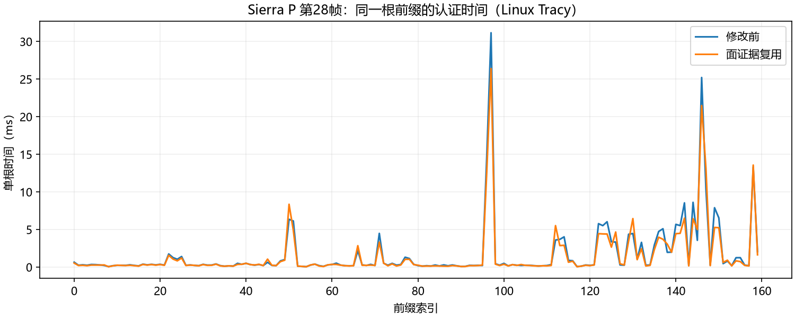

# QPC-06E：提案面证据复用的推导与性能结果

2026-09-17。基线`a508870`；[小规划](../../plans/cpu_refinement/qpc_06e_face_evidence_plan.md)、[代码事实](../../codebase/cpu_refinement/qpc_06e_face_evidence_facts.md)、[审查](../../reviews/cpu_refinement/qpc_06e_face_evidence_review.md)。

## 1. 本轮通过了什么

**同结果面证据复用与有限移动性能门禁通过，保留实现。** Windows正常D3D12运行，P政策的Sierra/Canyon完整CPU移动均值分别从62.916/60.373降到55.458/53.785ms，下降11.85%/10.91%；Linux正常构建分别下降7.72%/6.71%。本轮是在06D任务均衡后进一步减少重复几何运算，不再改变任务划分。

因果证据不只有总时间：相同查询与质量分支下，冻结面坐标差和面积从逐样本重复求值改为每面惰性准备；Tracy逐点认证调用数不变，调用时长和下降20.76%，旧Fit基本不变；perf逐点认证采样权重也下降。两个P的接收阶段和Canyon捐赠阶段均改善，完整边界包含准备、分配、计数归并及析构。

这不证明质量恢复、相对DOD竞争性或优化空间耗尽。P默认策略不晋升，L/P不是同输出性能对照。早拒绝、极小样本提案与其他地形仍可能不划算；此前06D静止微小残余的未定因状态不因本轮自动关闭。

## 2. 冻结任务、版本和测量边界

| 项目 | 固定值及解释 |
|---|---|
| 政策 | L=`legacy + error-first`；P=`pointwise-target + error-first`，逐点目标0.5px、高度比1/256 |
| 输入 | Sierra/Canyon既有96机会轨迹；预算50k，r=m=160，8线程；旧点不可变、翻边开启；边界接收Sierra关、Canyon开 |
| 实际规模 | Sierra约9千～1万活动面，Canyon约5万；Q均1,574,913，预算不冒充实际面数 |
| 事件 | 暖移动frame3～31共29帧；返回32～63、静止恢复64～95独立统计 |
| 正常对照 | Linux FP与Windows D3D12各四配置，各一次；前测复用06D对应正常数据 |
| 诊断 | 仅Sierra P一次perf、一次Tracy及同Tracy构建未连接对照；不扩充诊断矩阵 |
| 定向复测 | Linux Canyon P样本续接触发，旧/新各一次；保留首测，不择优替换 |
| 统计单位 | 独立进程，首轮11个加复测2个；29帧是描述分布，不是假装29次独立实验 |

全部运行串行编排，与编译、归约隔离；正常时间不包含离线质量评价或采样器。P95采用帧分布线性插值；全事件均值、中位、P95、最大值见[数据](data/qpc_06e_face_evidence/README.md)。Windows上传在CPU-ready之外。功耗策略未受控，有限过程不能给置信区间或精确版本因果估计。

原始命令、环境、输入、源快照与二进制SHA-256保存在`benchmark-output/cpu-refinement/qpc-06e/run-01/`。修改前FP/Tracy已分别保存为`before-fp`、`before-tracy`；Windows沿用06D候选副本。新FP的SHA-256为`d650d87f70ee79c610f924f7f8807503ea75ce1a44cf6c218df8a48c442ab746`。各manifest及帧文件摘要提交到归约目录。

FP正常程序先构建，后续Tracy构建追加了仅`TRACY_ENABLE`开启的7项聚合计数事件，并将本来已默认零初始化的两个计数成员显式写为`{}`。各次源快照如实保留，不把三种构建称为同一个二进制；非诊断业务算法相同。最终只有头文件排版和文档整理，无测后算法修改。

## 3. 从函数热点到等价变换：推导过程

### 3.1 缓存对象为什么是面

06A的`TransactionalQualitySampleEvidence`已经保存单样本的参考/投影，旧`TransactionalProposalEvidence`则服务于Fit。06D后，`PointwiseQuality::Certify`仍对同一旧/新面反复做覆盖和高度求值：样本变了，但端点、边向量和面积没有变。继续缓存样本不能消除这部分重复。

因此新增`TransactionalQualityFaceEvidence`，拥有冻结`QualityFace`值，不借用会变化的目录游标。每次Certify的每个表示域分别创建旧/新面数组；数组构建后不增删，样本覆盖入口只借用其中的指针。域结束即销毁，不存在跨帧失效协议或全Q×提案缓存。

区间和有理系数分别惰性准备。未触达面不做系数运算，只有歧义边/精确高度查询才准备有理数；但对象中的optional空间仍已占用。覆盖控制流保持三边顺序和闭包含，第一张覆盖面保持原顺序选择。`Fit`、`Measure`、`SameInterface`、`ValidateBatch`、样本集、目录、贪心预留及线程调度都不改。

### 3.2 FE-01：缓存原表达式子式，而不是重新推一个插值公式

记冻结三点为a,b,c，样本为q。原方向谓词包含

\[
(b_u-a_u)(q_v-a_v)-(b_v-a_v)(q_u-a_u).
\]

缓存前两个固定差分，样本差分与乘减顺序不变。高度原公式为

\[
A=(b_u-a_u)(c_v-a_v)-(b_v-a_v)(c_u-a_u),
\]
\[
w_0=\frac{(b_u-q_u)(c_v-q_v)-(b_v-q_v)(c_u-q_u)}{A},\quad
w_1=\frac{(q_u-a_u)(c_v-a_v)-(q_v-a_v)(c_u-a_u)}{A},
\]
\[
w_2=1-w_0-w_1,\qquad h=(w_0a_h+w_1b_h)+w_2c_h.
\]

保存A、三条有向边差和单独的c−a。拒绝两个看似省事的方案：不能把c−a替换为反向边取负，区间零附近端点可能不同；不能将除A改成乘预先缓存的倒数，区间舍入和跨零传播会变化。两者都超出本轮同结果契约。

输入点值、基本运算和表达式树相同，缓存固定子式得到原区间端点；有理域得到相同精确值。对后续表达式树逐节点代入，方向与高度一致。这是有限且直接的纸面等价推导，不是新几何定理或Lean证明；仍依赖原Interval与严格浮点设置。

### 3.3 FE-02：数值相同如何传递到算法结果

覆盖入口保持原面/边次序，区间能判定时沿原分支，歧义时仍查询相同精确样本坐标。由FE-01，首个闭覆盖面、精确回退时机、旧/新高度及后续损伤/进展累计相同。核心binary64和输出float曲面各建独立证据，不能用核心系数解释公开曲面。

保留逻辑Touch和停止额度，不用“缓存命中”放松原配额。新增计数只说明实际系数构造和消费量。正常成功执行下，同一前缀与输入得到相同认证、事务、预算与网格；真实时间期限触发不要求新旧同时超时。有限轨迹核对全部96帧导出逻辑列，并不声称CSV记录了每个内部状态。

### 3.4 FE-03：复杂度与可反驳边界

设一个提案域有u个样本、d张旧/新面，实际边查询e、高度查询h，触达并准备的面数b。原表达式固定坐标减法次数为

\[
C_{old}=2e+6h,\qquad C_{new}=8b.
\]

每面准备三条边的6次差分加c−a的2次，面积原来每次高度查询构造，现在每面一次。这个式子分别用于区间/有理域，**仅统计指定子表达式，不是完整指令数、CPU工作时间或硬件计数**。原样本相关乘除和位长代价都在。

面系数工作从查询重复变成O(d)，总覆盖仍最坏O(ud)，并没有降为O(u+d)。每个面对象Linux固定部分1552字节，有理动态limb另计；单认证工作空间O(d)，并行时还要乘同时存活认证数，分配/析构均在完整时间内。账本`quality_evidence_bytes`是累计容量估计，不是峰值RSS。

若某面只做一次边查询便拒绝，原固定差分2次，新准备8次且计算面积，会增加局部工作。若d大而u小，也可能被空间/准备抵消。收益必须由真实重复查询量与完整时间支持，不能由“缓存”二字推出。

## 4. 正常运行：完整收益及未改路径

单位ms；箭头为06D→本轮，下降按均值计算。

| Windows场景/政策 | CPU均值 | CPU中位 | CPU P95 | 接收均值 | 完整下降 |
|---|---:|---:|---:|---:|---:|
| Sierra L | 56.986→56.107 | 56.918→54.728 | 70.204→73.865 | 13.086→12.964 | 1.54% |
| Sierra P | 62.916→55.458 | 59.809→50.386 | 94.140→84.478 | 41.918→34.328 | 11.85% |
| Canyon L | 55.154→53.460 | 54.417→52.011 | 73.737→70.126 | 11.309→11.087 | 3.07% |
| Canyon P | 60.373→53.785 | 60.558→51.841 | 74.059→65.855 | 29.897→26.075 | 10.91% |

| Linux场景/政策 | CPU均值 | CPU中位 | CPU P95 | 接收均值 | 完整下降 |
|---|---:|---:|---:|---:|---:|
| Sierra L | 37.404→36.273 | 36.742→34.890 | 47.422→45.582 | 8.112→8.028 | 3.02% |
| Sierra P | 37.866→34.943 | 36.442→32.039 | 56.924→53.461 | 23.076→20.239 | 7.72% |
| Canyon L | 40.658→40.394 | 39.735→38.654 | 54.056→53.630 | 7.284→7.361 | 0.65% |
| Canyon P | 38.305→35.736 | 37.401→36.344 | 46.956→41.079 | 17.903→16.067 | 6.71% |

L在逐点认证新入口之前返回，不能将L的下降归功于面复用。Windows Sierra L的P95反而增加3.661ms/+5.22%，中位和均值下降；保留尾部分布，不写“每帧均更快”。本轮不为单次帧尾或静止微小差值扩大重复矩阵。

两个P的Windows其他阶段如下，上传不计入CPU：

| 场景 | 视图 | 捐赠 | 预留 | 样本修复 | 上传 |
|---|---:|---:|---:|---:|---:|
| Sierra | 9.846→9.925 | 0→0 | 0.179→0.179 | 8.244→8.232 | 2.310→2.289 |
| Canyon | 15.727→14.765 | 11.527→9.868 | 0.351→0.356 | 1.830→1.795 | 0.121→0.085 |

Sierra完整减少7.457ms，接收减少7.590ms；Canyon完整减少6.587ms，接收+捐赠减少5.480ms。Canyon视图下降0.963ms发生于未修改路径，不能把完整6.587ms全归因于面复用。捐赠同样调用逐点Certify，因而其下降有源码依据；预留/上传未被优化。

返回段P完整均值：Linux Sierra22.919→21.630、Canyon30.892→29.181；Windows Sierra35.412→33.102、Canyon48.559→44.728。静止恢复P均值：Linux0.491→0.508、1.631→1.639；Windows0.745→0.717、1.700→1.549。没有以移动收益抵消静止现象；这些小值仅作范围记录，不重新开启06D残余归因。

Linux Canyon P样本续接首测1.3406→1.4165ms（+0.0759ms/+5.66%）触发唯一旧/新配对，复测1.4628→1.4370ms（−1.76%），未重现持续回退。复测完整移动38.948→35.777ms、接收17.885→16.206、捐赠6.958→6.319。这个结果支持不因该首测局部差值撤回实现，不证明所有间接缓存/分配器影响都不存在。

## 5. 实际删除了多少重复工作

Sierra P的29帧Tracy中，1,357次逐点认证产生12,134个面记录；区间实际准备11,649次、精确准备11,237次。后者说明很多面最终确实需要精确算术，收益主要来自多次复用，不能宣称大多数精确分支被消灭。

| 数值域 | 边查询e | 高度查询h | 实际准备b | 原式固定减法2e+6h | 新式固定减法8b |
|---|---:|---:|---:|---:|---:|
| 区间 | 10,209,725 | 1,039,654 | 11,649 | 26,657,374 | 93,192 |
| 精确 | 338,218 | 63,632 | 11,237 | 1,058,228 | 89,896 |

右侧原式计数来自同一查询集合的源码反事实，而不是旧程序硬件指令测量；该子项下降99.65%/91.51%，不等于整体工作或耗时下降同样比例。精确查询数、样本质量求值和逻辑访问并未减少。

独立短内核包含每次准备与析构、32次×1024样本，区间几何求值8.860→6.111ms，下降31.02%。它不是独立进程统计，也不覆盖全部自然早拒绝分布；仅支撑机制门槛，不能代替上述完整对照。

## 6. Tracy：真正减少的是根内认证时间

所有函数/调用次数、自身/含调用时间、线程及根起止均保留在[完整数据](data/qpc_06e_face_evidence/README.md)。以下时间和来自多个线程的区间相加，含抢占等因素，不能称为aggregate CPU time；父子区间也不能重复相加。

| Sierra P暖窗口函数 | 调用数前→后 | 含调用时长和ms前→后 | 解释 |
|---|---:|---:|---|
| `gtp.pointwise.certify` | 1,357→1,357 | 2520.760→1997.352 | 下降20.76%，没有靠少认证取得收益 |
| `gtp.fit` | 28,606→28,606 | 1643.074→1628.123 | 下降0.91%，旧求解仍昂贵 |
| `gtp.measure` | 1,392→1,392 | 474.675→475.521 | 基本不变，未复用到此入口 |
| `gtp.pointwise.validate_batch` | 29→29 | 56.116→61.949 | 未优化路径，本次捕获增加；不能据此改删独立发布验证 |

接收派发均值23.236→20.470ms，任务时长和155.764→136.863ms，最长任务23.025→20.274ms；均衡量`Σtask/(8·maxTask)`均值0.860→0.861，线程仍8。与06D不同，本次均衡量没有明显变化，而每根内部成本减少。

第28帧索引97仍有8次Fit和7次逐点认证。该根31.169→26.404ms，其中Fit15.511→14.632、逐点认证15.263→11.485ms；主要下降发生在目标函数。全窗口新最长根变为第27帧索引137、27.326ms，8次Fit15.233ms加7次逐点认证11.770ms。图中个别根增加如实保留；目录路径相同不代表调度/缓存噪声相同，也不保证每个面准备都收益。

Tracy连接与同构建未连接CPU移动均值35.970→36.245ms（+0.765%），新增1,357个聚合事件共1.273ms线程区间。它们仅用于观测，不把捕获数据代替正常平台表，也不把差值全部称为探针精确成本。

## 7. perf：热点与绝对采样权重相互核对

Sierra P暖窗口2,694个ROI样本、总权重5,398,797,552；lost=0，无缺栈/未知自身样本，2,569个样本仍有未知祖先。187个有占比符号全部保留；采样边不是调用次数。使用`cpu-clock`事件权重，既不是硬件cycles，也不是无偏的精确总CPU时间。

| 符号 | 前占比 | 后占比 | 前权重→后权重 |
|---|---:|---:|---:|
| `PointwiseQuality::Certify`含调用 | 41.88% | 36.19% | 2,490,981,944→1,953,907,800 |
| `Certification::Fit`含调用 | 26.75% | 29.51% | 1,591,182,352→1,593,186,360 |
| `__nextafter`自身 | 19.00% | 16.96% | 1,130,260,512→915,831,656 |

Fit份额增加而绝对权重基本不变，符合“逐点成本减少、分母缩小”，不支持Fit变慢。`nextafter`互斥调用上下文份额由逐点13.54%→10.28%、Fit5.15%→6.42%、其他约0.30%→0.26%。新`SampleEvidence::Cover(prepared)`仍占15.03%含调用，新`ExactHeight`占1.41%；它们嵌在逐点链中不能相加。

剩余大头仍为样本相关区间/有理几何与旧Fit。覆盖仍访问一千万次边，说明复用固定系数没有取消样本遍历；相反，后续若继续，应审计这部分工作是否可等价减少，以及旧Fit与质量政策间的关系。仅凭本轮热点不能直接承诺另一个倍率，不自动启动新机制。

## 8. 验证、代价及出口

新数值专项在840组位置/尺度上逐边核对区间端点（含符号零）、有理值与高度；覆盖专项包含两表示域、三种地形尺度、共享边反序和精确回退次数，另验证惰性仅准备一次。零面积核对区间传播，不把有理除零定义成合法曲面。原逐点政策测试、核心持续状态测试完成；新夹具首次遗漏最小预算导致初始化拒绝，补足夹具预算后执行，不修改生产规则。

Linux FP、Tracy及Windows平台目标构建完成。所有正常、诊断与复测各96帧对照保持导出逻辑列一致，包括网格哈希、相机、实际面数/预算、需求/事务/配对、逻辑样本访问、写入和序号；这支持同输出，未新增密集质量重测。保留原始公式作为数值oracle，不把共用低层Interval的专项说成整个数值库的独立证明。

| 门禁 | 本轮结果 |
|---|---|
| 同输入数值及有限持续输出 | 通过，仍为有限验证与纸面等价论证 |
| 含准备/析构的内核下降≥10% | 通过，31.02%，短内核证据 |
| 至少一个P完整移动均值下降≥5% | 通过，两系统两个P均超过门槛 |
| 其他P/L完整移动无实质持续回退 | 本次均值未回退；尾部分布和触发复测分别保留 |
| 所有输入/静止帧/小提案均收益 | 未证明，早拒绝和空间代价仍有边界 |
| 持续质量、DOD竞争性、性能极限 | 未验证，不晋升政策或论文结论 |

阶段至此闭环，按授权单独提交。源码、推导、全部有占比函数/调用链、时序、工作量和原始指纹一并留存；本轮不进入QPC-05预留，也不替换Fit或开展新的质量算法。
