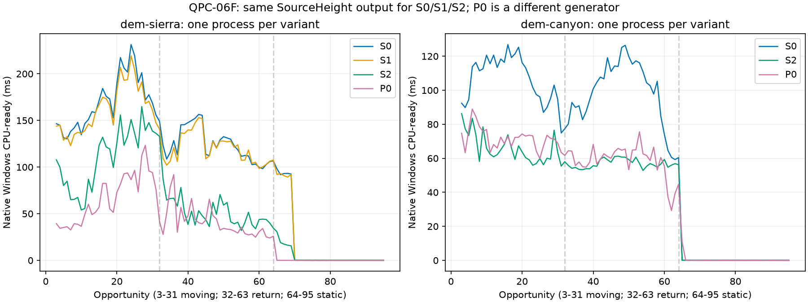

# QPC-06F：高度早拒绝与失败样本提示的有限性能结果

2026-09-18。[规划](../../plans/cpu_refinement/qpc_06f_height_rejection_plan.md)｜[推导过程](qpc_06f_height_rejection_derivation.md)｜[代码事实](../../codebase/cpu_refinement/qpc_06f_height_rejection_facts.md)｜[精简数据](data/qpc_06f_height_rejection/README.md)。

## 1. 阶段结论

**同政策工作削减和有限性能门禁通过；保留S1+S2，仅用于显式SourceHeight分支。** Sierra移动完整CPU-ready 169.655→110.589ms，下降34.8%；Canyon 107.099→65.830ms，下降38.5%。两条96机会轨迹的决策摘要、面数、预算及公开网格哈希均与修改前一致。默认LegacyFit没有切换。

这次确实删除了重复失败认证中的工作：Sierra移动7,838个提案不再从第一个样本走到历史失败点，而是对该点重新证明损伤后拒绝。精确样本求值少67.5%，屏幕求值少37.9%。不是删掉质量条件，也不是减少候选人口获得的时间差。

**04H总体性能问题仍未完全关闭。** 当前Sierra源高110.589ms，旧Fit为66.578ms，仍慢1.66倍；Canyon源高65.830ms，旧Fit71.620ms，在本次有限运行中低8.1%。这两种生成器实际事务不同，只是完整成本参照，不能称为同任务并行加速，更不能据此宣称优于DOD或持续质量已经解决。

## 2. 冻结对象、范围与证据级别

| 项目 | 本轮契约 |
|---|---|
| 输入 | 04H的Sierra/Canyon；预算50k、r=m=160、8线程、96机会；源、seed、相机、Q和阈值不变 |
| S0 | 冻结04H最终源高程序，无本轮机制 |
| S1 | 高度区间损伤前移；只跑Sierra作条件消融 |
| S2 | S1加2048条确定性FIFO样本提示，每项最多一个身份，当前输入重证 |
| P0 | 当前程序LegacyFit+PointwiseTarget+ErrorFirst，旧生成器参照与回归检查 |
| 主时间 | 原生Windows D3D12普通CPU-ready，非perf/Tracy或诊断遍；包括提示准备/归并与完整续接 |
| 分窗 | 移动3～31、返回32～63、静止64～95；0～2冷/预热另留原数据 |
| 统计 | 每变体每场景一个独立进程；帧均值/分位描述轨迹，不伪装成29次独立重复或统计显著性 |
| 诊断 | Sierra S1/S2原生RecoveryTrace；S2每次提示拒绝重放原认证，不用于性能胜负 |
| 函数/时序 | Sierra S2 Linux FP+perf，Tracy未连接+连接各一次；同构建输出及Windows输出一致 |

基线不是裸父提交：采集时`c00ca8a`之上尚有04H未提交实现，已保存修改前完整源码压缩包、差异、程序SHA及冻结输入。身份、命令和原始资料位置见[数据说明](data/qpc_06f_height_rejection/README.md)。用户随后授权分阶段提交：04H按冻结源码归档为`8b5f557`，06F单独归档；未进入05或新算法阶段。数据中的`gitCommitPerformed=false`保留实验核查时点，不改写历史程序身份。

Sierra全程没有donor交换，最终11,644面、1,426次空额接收；因此不能把它称为饱和50k预算压力。Canyon最终50,000面、111次exchange、2次空额接收。两个同政策S0/S2数量完全相同。

## 3. 为什么这次能减工

### 3.1 S1：只提前当前点的确定损伤，收益有限

`PointwiseQuality::CheckSample`原先已取得旧/新高度界，却要再求两次屏幕误差才检查高度损伤。本轮只把严格区间分离条件提前；可见人口核查仍先执行，模糊界仍沿原屏幕/精确路径。它省的是**失败点的后续屏幕工作**，没有省掉到达该点之前的样本。

S1 Sierra完整移动169.655→162.592ms，观察下降4.16%，没有达到10%目标。View、样本续接也有小幅跨进程差异，因此不把这7.06ms全部归于前移谓词，更不单独签发性能门禁。

### 3.2 先确认失败复遇，再加入S2

S1记录的移动9,736次高度失败中，按预定2048容量和同FIFO规则归约，7,836次同根/目录再次遇到相同失败样本，且当次区间可拒绝；全程为34,560/38,018。这只是实施前的复遇证据，不能冒充实际命中率。

S2保存的是样本身份，不保存失败结论。每次先完成原支持收集、排序去重、接口检查与面证据准备，然后核对提示仍在当前支持，重新定位旧/新闭面、检查当前人口并重算当前高度损伤。只有严格违反才拒绝；否则从原第一个样本完整认证。成功提案的双域证书、目录首成功项和后续预留规则不变。

为什么实际S2拒绝比离线同样本复遇稍多：已经重证的旧提示可能与原顺序第一个失败点不同，但仍足以否决；S2还会把该点继续保存。离线“同失败样本”只是保守机会统计，不是实现结果预测。诊断因此记录原首拒绝理由，避免把检查顺序改变当成质量政策变化。

### 3.3 减少了什么，没减少什么

Sierra移动段；S1/S2诊断均为相同输出，S2影子工作不合入以下正常工作计数：

| 工作项 | S1 | S2 | 变化 |
|---|---:|---:|---:|
| 源高结构准备成功项 | 11,228 | 11,228 | 不变 |
| 完整认证入口（Tracy最终为11,234，另含翻边） | 人口保持 | 11,234 | 没有靠少认证入口提速 |
| 高度损伤拒绝 | 9,736 | 9,736 | 不变 |
| 质量认证接收（含3项翻边） | 1,495 | 1,495 | 不变 |
| 样本质量检查（含提示额外检查） | 1,888,889 | 1,235,382 | −34.6% |
| 样本证据对象 | 2,936,796 | 2,283,289 | −22.3% |
| 精确样本求值 | 222,106 | 72,106 | −67.5% |
| 屏幕求值（区间与精确） | 4,097,270 | 2,543,216 | −37.9% |
| 精确闭覆盖请求 | 1,446,552 | 842,002 | −41.8% |
| 参考精确构造 | 783,697 | 438,788 | −44.0% |
| 面证据记录 | 97,844 | 97,844 | 不变 |
| 证据bytes账本 | 174,394,616 | 174,394,616 | 准备仍在；不是RSS或实际全部分配量 |

S2移动查询11,228次，表命中7,894次；46次已不在当前支持；7,848次实际重证中7,838次拒绝，10次回退。完整域循环仍进入4,891次，包含通过核心后进入float的循环，不能当作4,891个独立提案。其余3,334个查询无提示。表容量达到2048，移动段134次淘汰；全程1,384次淘汰。

全程34,718次实际提示复查中34,705次拒绝；**34,705次影子原认证也全部返回`pointwise_height_damage`**，没有原接受、新拒绝。移动对应7,838次。此结果不代表未来所有输入首拒绝理由都相同；契约只要求接受集合和实际决策不变。

诊断移动提示查询跨任务时间和8.524ms、重证64.767ms，主线程归并总2.266ms（每机会0.078ms）。影子重放跨任务总12.788s另列，故诊断接收阶段不能用来比较性能。普通Tracy的提示检查区间总42.020ms、归并1.685ms；跨平台不同计时不能直接相减或当作CPU时间。

## 4. 完整时间，而不只报告内核

单位ms，Windows普通计时；均值/中位/P95均来自同一独立进程轨迹，P95采用经验nearest-rank。

| 场景 | 版本 | 移动均值 | 中位 | P95 | 返回均值 | 静止均值 |
|---|---|---:|---:|---:|---:|---:|
| Sierra | S0 | 169.655 | 168.612 | 219.370 | 124.328 | 18.040 |
| Sierra | S1 | 162.592 | 161.153 | 207.108 | 120.785 | 17.706 |
| Sierra | S2 | **110.589** | 120.576 | 155.860 | **53.388** | **4.228** |
| Sierra | P0旧Fit | 66.578 | 60.222 | 112.451 | 40.978 | 0.853 |
| Canyon | S0 | 107.099 | 112.589 | 125.296 | 98.697 | 1.910 |
| Canyon | S2 | **65.830** | 63.519 | 83.541 | **56.952** | **1.784** |
| Canyon | P0旧Fit | 71.620 | 72.358 | 84.551 | 58.825 | 1.797 |

S2相对S1 Sierra移动下降32.0%，因此持久提示具有独立于S1的小规模收益证据。返回段S0→S2下降57.1%；静止段均值包含少数继续工作机会，随后空批复用趋近零，不能把4.228ms称为每一静止帧成本或新增空批机制。

冷启动frame0 Sierra S0/S2为1702.141/1642.801ms，Canyon4642.563/4423.933ms；完整初始化未排除，仅不混进暖路径均值。不据单次冷帧宣称初始化优化。

### 4.1 移动阶段分解及因果边界

| 阶段 | Sierra S0 | Sierra S2 | Canyon S0 | Canyon S2 |
|---|---:|---:|---:|---:|
| Receiver | 129.173 | **72.280** | 74.911 | **35.260** |
| View | 10.975 | 10.177 | 15.531 | 14.788 |
| Donor | 0 | 0 | 13.074 | 12.358 |
| Reservation | 0.519 | 0.529 | 0.818 | 0.795 |
| Samples::Prepare | 22.669 | 21.501 | 1.818 | 1.644 |
| Topology prepare | 1.030 | 0.948 | 0.164 | 0.158 |
| Topology publish | 0.164 | 0.143 | 0.029 | 0.029 |

完整下降59.066/41.269ms，接收下降56.894/39.651ms，约解释观察差额的96.3%/96.1%。后者不是严格因果估计，但结合相同提案人口、早拒绝工作量和调用栈，支持主要收益来自认证遍历减少。没有把其余阶段的小幅跨进程下降包装成本轮优化。

P0输出与04H P0的96帧结果一致。本次移动66.578/71.620ms，04H同窗口复测P0为72.261/73.339ms，再早06E参考67.459/72.573ms。没有发现本轮新增超过工程阈值的回退，所以没有追加重复运行。**这不追认04H旧路径曾有的7.12%残差已经被一个特定代码改动修复**；本轮未针对LegacyFit优化，不作微差因果承诺。

## 5. perf：剩余成本仍在原数值链

Sierra S2暖移动ROI 4,820样本，丢样0，缺栈0，未知self 1；4,542样本含未知祖先，尤其外层线程/运行库祖先不完整。表为已解析函数权重，不能当完整精确调用图或逐函数墙钟。214个函数、所有调用边和路径已保存，非只给热点摘要。

| 函数/符号 | self % | inclusive % | 解释 |
|---|---:|---:|---|
| PointwiseQuality::Certify | 0.98 | 75.46 | 剩余成功/未提示拒绝的完整认证仍主导；包含子调用不能相加 |
| CheckSample | 0.39 | 36.45 | 原逐点屏幕/高度/进展及精确回退 |
| QualitySampleEvidence::Cover | 0.35 | 27.70 | 当前闭面取证；不是历史失败点可直接跳过的事实 |
| `__nextafter` | 21.20 | 21.20 | 21.12百分点可归入已解析逐点认证链 |
| Boost `eval_gcd`主实例 | 7.88 | 9.17 | 精确有理构造/约分仍有成本 |
| Boost `do_assign_float<long double>` | 4.34 | 6.12 | 数值转换；不是新点源高赋值单独费用 |
| Boost `divide_unsigned_helper`主实例 | 4.29 | 4.42 | 其他实例另列完整CSV，不能漏项后称全部除法 |
| Samples::Project | 4.42 | 4.42 | 本轮未改的视图刷新 |
| QualityFaceEvidence::SideBounds | 3.36 | 3.78 | 当前样本相关边判断仍需执行 |
| unsigned Slot `__introsort_loop` | 2.66 | 2.66 | 支持排序没有被早拒绝消掉 |
| Samples::Prepare | 1.41 | 3.94 | 跨线程采样权重不是Windows串行阶段占比 |
| HeightRejection::Recheck | 0 | 0.46 | 提示重证存在真实成本，非直接读取旧失败结论 |
| RejectionHints::Find | 0.04 | 0.04 | 当前有限表查找未成为新热点 |

旧04H捕获的Certify inclusive为83.17%，本次75.46%；这是历史/当前各自分母的定位，不将占比相减当作Windows节时。绝对收益以§4为准。函数级证据说明本轮减少调用内部的重复工作，没有修改nextafter、gcd或有理精度来换数值语义。

## 6. Tracy：并行仍有效，尾部仍由认证控制

Linux同构建普通FP、perf、Tracy未连接、Tracy连接移动CPU-ready分别64.129、64.449、66.530、64.678ms；均为96帧相同逻辑结果，也与Windows S2一致。这组只检查捕获代表性与扰动，不把64ms与Windows110ms拼成优化收益。

| 移动阶段 | 派发均值ms | 任务区间和ms/机会 | 最长任务均值ms | 实际线程均值 |
|---|---:|---:|---:|---:|
| Receiver | 39.388 | 276.247 | 39.200 | 8 |
| View projection | 3.756 | 24.298 | 3.656 | 8 |
| View scores | 1.912 | 12.300 | 1.829 | 8 |
| Face fill | 0.133 | 0.0023 | 0.0015 | 1 |
| Mesh fill | 0.133 | 0.0208 | 0.0059 | 1.97 |

Receiver平均最长任务结束至派发返回0.088ms，主要墙钟不是归并/派发尾税。最慢frame21派发69.725ms，最长worker69.342ms，其中61次Certify区间和65.253ms，最慢单次21.954ms；旧Fit和Measure均0次。独立根调度仍受个别重认证拖尾，不能从平均8线程活跃推出已达理想上限。

移动Certify 11,234次，跨线程区间总7,288.859ms；提示检查7,894次总42.020ms，归并29次总1.685ms。Samples::Prepare 29次总394.630ms。**跨线程区间和既不是完整帧时间，也不是aggregate CPU time**，不能将7.29s除以29后称每帧认证延迟。完整任务和逐帧时序见数据目录。

## 7. 正确性、质量复用与成本界

本轮必要验证：高度拒绝新专项、既有pointwise/source-height专项、持续transactional_lod专项均通过；Linux和原生Windows编译通过。没有全套CTest、全后端矩阵、额外自然线程矩阵或新增质量采样。1/8线程有限夹具核对根序反馈；自然两场景S0/S2共192帧完整导出逻辑字段相同（touches/evaluations属有意减少的计费，不纳入结果等价）。

公开网格哈希与视图一致，故复用04H对应曲面质量/视觉结果，不将它写成新一轮质量改善。哈希/有限轨迹是实现证据，不等于所有内部字段的形式化同构证明；HR纸面说明正常未触限条件下的接受集合、目录选择与状态归纳。全程没有用触限、未知或失败进程缩短样本来制造性能收益。

对每项保留支持/证据准备c_i、原遍历v_i和新增提示h_i，提示未拒绝时实际剩余遍历另记v'_i：

\[
W_2=\sum_i(c_i+h_i)+\sum_{i\notin A_{reject}}v'_i+W_{merge}.
\]

收益要求被省遍历加未拒绝路径中已有面证据复用的节省，大于提示/归并费用。初稿将v'_i=v_i写死；实施核查后已修正，因为提示会预热同次面系数。本轮提供正面实例，非所有输入定理。O(s log s)支持整理、O(d)面记录、未命中最坏O(sd)及有理位长费用依然存在；有界表O(C)，查/写O(log C)，不建立全Q缓存。旧未知分支可能先被提示损伤遮蔽，首理由变化是允许的诊断差异，不能将未知统一解释为不可行。

## 8. 验收与下一步边界

| Gate | 结果 |
|---|---|
| HR条件证明与实现对应 | 完成纸面和有限核查，无新增Lean |
| 原认证接受集合/自然轨迹 | 有限PASS；34,705提示拒绝全部原认证确认 |
| 工作削减 | PASS；入口不减，实际数值遍历/精确操作下降 |
| Sierra完整至少10%、Canyon/P0无工程回退 | 有限PASS；34.8%/38.5%，P0未见新增回退 |
| S2相对S1独立价值 | PASS；Sierra移动另降32.0% |
| 04H源高总体性能问题 | 未完全关闭；Sierra仍1.66×旧Fit |
| 持续质量/生产默认/DOD竞争力 | 不变，未通过；SourceHeight保持实验选项 |

当前剩余空间是可定位而未自动授权的：完整支持整理、成功/无提示认证及重项尾部、Sierra Samples::Prepare，以及View。不能从缓存有效推断应扩大容量或缓存认证结论；也不能根据nextafter仍热立即改数值核。本阶段到此交付，不扩新高度求解、不改政策、不进入下一阶段。
