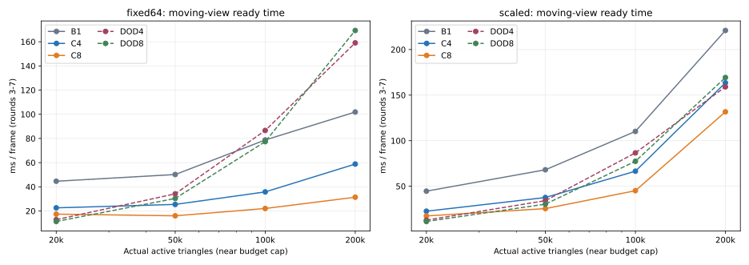
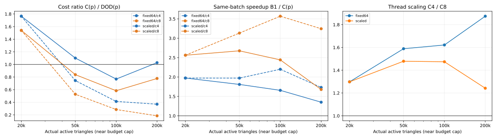
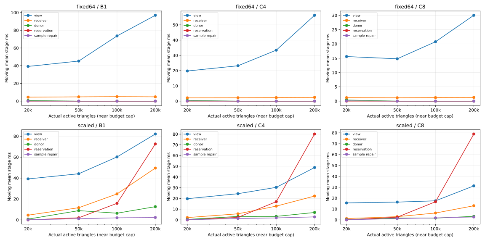
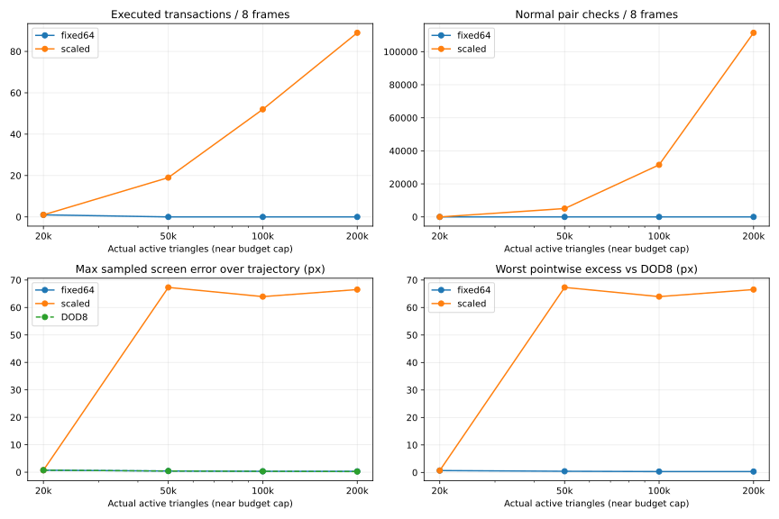

# SVE-01：固定与增长额度的 20k→200k 扩展结果

> 2026-09-14；算法为 `7425736` 的 GWR 保留实现，实验入口为本次 SVE-01 提交所归档的工作区实现；采集时的源码/程序身份保留在原始清单。对应 [小规划](../../plans/cpu_refinement/sve_01_scaling_viability_plan.md)、[代码事实](../../codebase/cpu_refinement/sve_01_scaling_facts.md)、[实施审查](../../reviews/cpu_refinement/sve_01_scaling_review.md)。本文的毫秒均来自关闭 perf/Tracy 的普通运行，另标者除外。

## 1. 结论与类型化出口

**实验完成，8 线程有真实同任务收益，但没有得到“同质量优于 DOD”的证据。** 两条额度曲线暴露了不同限制：固定 64 项在 50k～200k 不再执行任何事务；同比增长额度确实执行更多事务，却放大了串行冲突/预留成本，并在新视角暴露 64～67px 的局部几何误差。不能用前者的空更新低成本或后者的质量退化换取论文性能胜出。

- 输入规模覆盖：**PASS**。实际种子 N=20,000/49,999/99,999/200,000，全部接近饱和，最大/最小=10。
- 同组执行一致性：**PASS（本矩阵）**。7 个独立配置的 B1/C4/C8，全部 168 个独立逐帧结果与诊断几何/意图/尝试/交换一致；两组展开计 192 项，20k 的24项是共享数据。全部有限结构、预算、样本归属、mesh、Pending 及首批反序诊断完成。
- 实际多线程参与：**PASS（已采5份 Tracy）**。C8 真实使用8个 worker；短面/mesh任务仍常只由1～2个 worker消费。
- 同任务并行收益：**有证据**。增长组 C8 相对 B1 的移动帧收益为 2.56×/2.68×/2.44×/1.68×；与 DOD 的成本比不是这一指标。
- fixed64/C4、fixed64/C8 的完整动态 LOD scaling viability：**证据不足**。数值成本条件趋好，但50k以上拓扑工作为零，不能证明更强适应需求下可竞争。
- scaled/C4、scaled/C8：**未通过本轮继续研究条件**。100k→200k 的相对成本比反转，且质量提供明确反证；不是证明该事务表示永远无价值。
- 同质量性能优势 / 正式平台性能准入：**未通过**。当前不据此接入平台或扩到500k/1M；修订持续质量契约或预留机制属于后续独立决策，本轮没有修改算法来追求正结果。

## 2. 实际采集与计量边界

四档使用同一 Peking 547² 原始高度，80/12尺度、depth20、.25/.10px、RH_NO 1280×720、64点既有环绕公式。先从独立 DOD4 完整执行0..14，冻结 sample14 **帧后**种子；DOD4/DOD8 公共输出分别核对同一逻辑种子。后八轮固定为14,14,14,15,16,17,18,14。原 trajectory A 的20k数字没有拼入本曲线。

fixed64 为 r=m=64；scaled 为64/160/320/640。20k两组共用一次；每预算 DOD4/8也仅各一次。主矩阵29个独立普通进程、7个B1诊断进程；额外仅200k两组C8各复测一次，共用一次DOD8复测。另采5份Tracy及1份单次八帧perf。无配额、超时或内存截尾；全部来源/矩阵/复核/采样在首次40分钟预算内结束，含其间构建与等待约15.1分钟；后续汇总/文档时间不算新增采集。

WSL Ubuntu、GCC15.2.0、Release，沿用固定Boost1.90和核心严格浮点开关。B1绑CPU0，4线程绑0,2,4,6，8线程绑0,2,…,14；依据WSL暴露的16 core/32逻辑CPU映射挑不同core，**没有把它当成Windows主机物理核调度保证**。协调线程也在同一集合内，不额外赠送CPU。原始manifest记录完整环境、SHA和命令。

`T_ready(new)=SetView+Update+ConsumeMesh`，包括内部准备/同步/发布和消费包临时释放；`T_ready(DOD)=BuildRenderData`。审计用返回Batch、JSON导出、源/状态初建、离线全Q评价和最终状态销毁不在该窗口内，后文单列。每帧导出本身可能影响下一帧缓存；这些数字是公开CPU就绪边界的有限工程筛查，不是无观察应用帧率。8帧不是8个独立进程样本，没有P95、置信区间或统计显著性宣称。

主门槛严格取 **round3..7五个移动视图均值**。首轮、静止两轮和八轮均值全部保留，不能择优替换。DOD与新算法的决策、工作和质量不同，只能说工程成本比。

## 3. 移动视图完整时间：每组、每档都比较基线

单位ms。共享20k和DOD行不是独立重复。

### fixed64

| 预算 | B1 | C4 | C8 | DOD4 | DOD8 | C4/DOD4 | C8/DOD8 |
|---|---|---|---|---|---|---|---|
| 20k | 44.613 | 22.603 | 17.411 | 12.806 | 11.306 | 1.765 | 1.540 |
| 50k | 50.165 | 25.433 | 16.010 | 34.175 | 30.351 | 0.744 | 0.527 |
| 100k | 78.743 | 35.783 | 22.066 | 86.600 | 77.363 | 0.413 | 0.285 |
| 200k | 101.869 | 58.826 | 31.390 | 159.071 | 169.314 | 0.370 | 0.185 |

### scaled

| 预算 | B1 | C4 | C8 | DOD4 | DOD8 | C4/DOD4 | C8/DOD8 |
|---|---|---|---|---|---|---|---|
| 20k | 44.613 | 22.603 | 17.411 | 12.806 | 11.306 | 1.765 | 1.540 |
| 50k | 68.071 | 37.626 | 25.440 | 34.175 | 30.351 | 1.101 | 0.838 |
| 100k | 110.179 | 66.509 | 45.114 | 86.600 | 77.363 | 0.768 | 0.583 |
| 200k | 220.923 | 163.526 | 131.656 | 159.071 | 169.314 | 1.028 | 0.778 |




### 同任务线程收益

以下 B1/C4/C8 使用同一配置并得到相同结果，因此是实际执行并行收益；效率为 S_p/p。


| 组 | 预算 | B1/C4 | B1/C8 | C4/C8 | 4线程效率 | 8线程效率 |
|---|---|---|---|---|---|---|
| fixed64 | 20k | 1.974 | 2.562 | 1.298 | 49.3% | 32.0% |
| fixed64 | 50k | 1.972 | 3.133 | 1.589 | 49.3% | 39.2% |
| fixed64 | 100k | 2.201 | 3.569 | 1.622 | 55.0% | 44.6% |
| fixed64 | 200k | 1.732 | 3.245 | 1.874 | 43.3% | 40.6% |
| scaled | 20k | 1.974 | 2.562 | 1.298 | 49.3% | 32.0% |
| scaled | 50k | 1.809 | 2.676 | 1.479 | 45.2% | 33.4% |
| scaled | 100k | 1.657 | 2.442 | 1.474 | 41.4% | 30.5% |
| scaled | 200k | 1.351 | 1.678 | 1.242 | 33.8% | 21.0% |




### 限定复测：不替换较慢结果

200k反序复测为 scaled C8→fixed64 C8→DOD8。两条C8和DOD8全部八帧输出与首次一致。


| 200k路径 | 首次移动ms | 复测移动ms | 首次C8/DOD8 | 复测C8/DOD8 |
|---|---|---|---|---|
| fixed64 | 31.390 | 34.526 | 0.185 | 0.190 |
| scaled | 131.656 | 129.398 | 0.778 | 0.712 |
| DOD8 | 169.314 | 181.644 | — | — |


C8成本交叉得到一次复核，C4交叉只属于首次观察。这里没有“同质量交叉”：fixed64几乎不更新，scaled的持续质量明显更差。DOD8在200k不比DOD4更快，保留全部长帧与匹配基线，不换成较慢/较快线程基线来优化结论。

## 4. 增长的是什么工作

以下为整个八轮的真实计数；D_raw为逐帧全域人口，本文不把前缀检查数误作全域需求。所有配置每轮都用满r；20k每轮64，scaled其余每轮160/320/640。a约1,808,400是闭面样本关联数，q固定1,790,881；样本覆盖没有随网格扩大而同比增加。


| 组 | 预算 | 检查intent | 需交换/局部可行 | 执行交换 | 每帧批宽 | PairChecks | ReservationChecks | 冲突拒绝 |
|---|---|---|---|---|---|---|---|---|
| fixed64 | 20000 | 512 | 1/1 | 1 | 0,0,0,1,0,0,0,0 | 1 | 1 | 0 |
| fixed64 | 50000 | 512 | 0/0 | 0 | 0,0,0,0,0,0,0,0 | 0 | 0 | 0 |
| fixed64 | 100000 | 512 | 0/0 | 0 | 0,0,0,0,0,0,0,0 | 0 | 0 | 0 |
| fixed64 | 200000 | 512 | 0/0 | 0 | 0,0,0,0,0,0,0,0 | 0 | 0 | 0 |
| scaled | 20000 | 512 | 1/1 | 1 | 0,0,0,1,0,0,0,0 | 1 | 1 | 0 |
| scaled | 50000 | 1280 | 50/50 | 19 | 0,0,0,7,5,4,3,0 | 5069 | 3585 | 3427 |
| scaled | 100000 | 2560 | 147/147 | 52 | 0,0,0,22,16,8,6,0 | 31516 | 21308 | 20202 |
| scaled | 200000 | 5120 | 258/258 | 89 | 0,0,0,35,25,18,11,0 | 111436 | 75762 | 72460 |


这些配置的空额度执行均为0；预算利用率一直接近100%。`R_local=1`只针对冻结前缀里真正形成的D_need，不能称全域可兑现率。fixed64在50k以上D_need=0，其可行/执行率分母为0，记N/A而不是100%。增长组执行率为19/50=38.0%、52/147=35.4%、89/258=34.5%。

fixed64三个大档仍分别构造3118/3096/3103个接收提案；大量 `no_screen_samples` 与形状拒绝发生在上游，空批次不是“没有付出发现成本”。这再次体现 edge-urgency 前缀与可见样本认证的错位。这些理由是提案/配对层计数，不能直接当候选拒绝百分比。


| 组/预算 | 接收构造 | donor认证 | 样本Touches | 证据Builds | 精确检查 | RepairSamples | PreparedFaces | MeshVertices |
|---|---|---|---|---|---|---|---|---|
| fixed64/20000 | 3131 | 64 | 4016 | 294 | 4 | 754 | 8 | 24 |
| fixed64/50000 | 3118 | 0 | 259 | 259 | 4 | 0 | 0 | 0 |
| fixed64/100000 | 3096 | 0 | 77 | 77 | 3 | 0 | 0 | 0 |
| fixed64/200000 | 3103 | 0 | 77 | 77 | 3 | 0 | 0 | 0 |
| scaled/20000 | 3131 | 64 | 4016 | 294 | 4 | 754 | 8 | 24 |
| scaled/50000 | 7974 | 640 | 52470 | 7332 | 108 | 9078 | 152 | 456 |
| scaled/100000 | 16193 | 1280 | 49829 | 17170 | 432 | 10301 | 375 | 1125 |
| scaled/200000 | 33484 | 2560 | 87018 | 26366 | 1260 | 11349 | 628 | 1884 |


增长组50k→200k，事务19→89（4.68×），正常配对检查5069→111436（21.98×），冲突拒绝3427→72460（21.14×）。增加额度并非只增加可并行的有用提交，也显著增加未兑现工作的判断与预留。正常模式已在首次成功后停止尾扫描；完整诊断的额外PairChecks另存，未混入这里。

DOD继续执行大量自身primitive，不能与新算法exchange一对一相加。其原始统计字段如下；forced是原统计口径，**不再次加到split形成伪造总工作**。


| 预算 | DOD SplitCount | ForcedSplitCount | MergeCount |
|---|---|---|---|
| 20000 | 11869 | 5993 | 11869 |
| 50000 | 28013 | 14289 | 28013 |
| 100000 | 59945 | 30227 | 59945 |
| 200000 | 112409 | 56821 | 112409 |


DOD4/8这些计数相同。数据说明“都在同预算下”不足以构成同任务比较；也提示严格来源在该低阈值轨迹上存在显著维护/更新工作，不能据此推广到普通低压力DOD帧。

## 5. 阶段成本与函数归因

### 普通 C8 的移动帧均值

单位ms；view内部包含projection/scores/order，表中不重复相加。提交相关列只列拓扑prepare+publish与mesh_prepare；样本续接单列。


| 组/预算 | 全帧 | View | Receiver | Donor | Reservation | Samples repair | Topology prep+publish | Mesh prep |
|---|---|---|---|---|---|---|---|---|
| fixed64/20000 | 17.411 | 15.591 | 1.220 | 0.392 | 0.004 | 0.100 | 0.036 | 0.024 |
| fixed64/50000 | 16.010 | 14.800 | 1.177 | 0.000 | 0.000 | 0.000 | 0.000 | 0.000 |
| fixed64/100000 | 22.066 | 20.767 | 1.241 | 0.000 | 0.001 | 0.000 | 0.000 | 0.000 |
| fixed64/200000 | 31.390 | 30.013 | 1.306 | 0.000 | 0.000 | 0.000 | 0.000 | 0.000 |
| scaled/20000 | 17.411 | 15.591 | 1.220 | 0.392 | 0.004 | 0.100 | 0.036 | 0.024 |
| scaled/50000 | 25.440 | 16.354 | 2.963 | 1.685 | 2.484 | 1.170 | 0.352 | 0.105 |
| scaled/100000 | 45.114 | 17.514 | 6.310 | 1.615 | 16.683 | 1.832 | 0.637 | 0.106 |
| scaled/200000 | 131.656 | 31.264 | 12.982 | 3.258 | 78.912 | 2.678 | 1.318 | 0.125 |




fixed64/200k的View约30.01/31.39=95.6%完整时间，projection约6.00ms、scores11.49ms、order12.27ms。q不变，全Q固定税没有随N消失；索引和按面关联访问随N增加。

scaled/200k的Reservation约78.91/131.66=59.9%完整时间；Receiver12.98ms、Donor3.26ms，而拓扑prepare+publish约1.32ms、mesh_prepare约0.13ms。**扩大commit并行边界不是本数据中主要可回收项。** 这里只做归因，不在实验里直接改选择器、冲突表示或质量策略。

### Tracy：实际线程与关键时序


| 配置 | 全轨迹worker | round3窗口ms | Reservation ms | 投影task/worker | 评分task/worker | 接收task/worker | 面task/worker | mesh task/worker |
|---|---|---|---|---|---|---|---|---|
| fixed64/20000/C4 | 4 | 37.718 | 0.022 | 4/4 | 4/3 | 4/4 | 4/1 | 4/1 |
| fixed64/200000/C4 | 4 | 52.250 | 0.001 | 4/4 | 4/4 | 4/3 | — | — |
| fixed64/200000/C8 | 8 | 30.343 | 0.000 | 8/7 | 8/8 | 8/7 | — | — |
| scaled/200000/C4 | 4 | 248.475 | 151.159 | 4/4 | 4/4 | 4/4 | 4/1 | 4/2 |
| scaled/200000/C8 | 8 | 210.577 | 152.473 | 8/8 | 8/8 | 8/8 | 8/2 | 8/2 |


增长200k round3，从C4到C8，receiver约29.37→13.59ms，donor14.85→7.39ms；但reservation151.16→152.47ms基本不变，因而完整窗口248.47→210.58ms。短任务的task数不等于实际参与线程数。Tracy区间是墙钟，pool.sleep、pool.wait和worker区间不能累计为完整帧或aggregate CPU work。

### 一份限定 perf：增长200k/C8

为解释Tracy中大块reservation self，补采一次八帧，未扩到17/32次重放。得到710个ROI样本，0丢失、0未知self、0缺栈，但473个样本含未知祖先，且未达到FPR原筛查样本门槛。因此以下只是函数热点定位，**不是稳定比例或完整调用树证明**。保留这一限制，不为凑样本继续采集。


| 实际函数/符号类别 | self样本 | 采样权重占比 |
|---|---|---|
| PrepareView评分lambda（#2） | 110 | 15.49% |
| TransactionalState::Vertex | 70 | 9.86% |
| TransactionalReservation::Conflict | 68 | 9.58% |
| 资源tuple有序树 find | 43 | 6.06% |
| TransactionalSamples::Project | 33 | 4.65% |
| Boost eval_gcd | 29 | 4.08% |
| std::_Rb_tree_increment | 26 | 3.66% |
| PrepareView投影lambda（#1） | 24 | 3.38% |
| TransactionalSamples::BuildOrders | 16 | 2.25% |
| __nextafter | 12 | 1.69% |


`Conflict`遍历写资源，并在对方Read/Write set中查找；`Plan`在通过内部可行判断后，对尚未占用donor构造 `Unite(rf,df)`，再线性检查已有reserved事务。Footprint虽复用，pair级联合set构造和对reserved扫描仍然存在。perf的Conflict、tree-find、tree迭代与该源码路径一致；不能把所有Vertex或所有tree热点都归给reservation。完整函数列表和时间线在原始profiles目录，比例是采样权重比例，不是同一帧墙钟占比。

## 6. 质量：成本交叉为什么不能当性能胜出

这里报告八轮最大值，不是平均值。C4/C8与B1几何一致，共用同一次独立Q评价；DOD4/8分别评价。本轮二者摘要/逐点质量相同，以下显示DOD8，完整匹配4/8的值保存在audit.json。


| 组/预算 | 新Emax px | DOD Emax px | 最坏逐点Dmax px | 新RMS最大px | DOD RMS最大px | 新Hmax | DOD Hmax |
|---|---|---|---|---|---|---|---|
| fixed64/20000 | 0.740 | 0.743 | 0.686 | 0.078 | 0.075 | 0.168 | 0.245 |
| fixed64/50000 | 0.442 | 0.442 | 0.428 | 0.037 | 0.038 | 0.168 | 0.245 |
| fixed64/100000 | 0.331 | 0.336 | 0.327 | 0.021 | 0.021 | 0.168 | 0.245 |
| fixed64/200000 | 0.327 | 0.246 | 0.327 | 0.012 | 0.012 | 0.168 | 0.245 |
| scaled/20000 | 0.740 | 0.743 | 0.686 | 0.078 | 0.075 | 0.168 | 0.245 |
| scaled/50000 | 67.320 | 0.442 | 67.314 | 0.532 | 0.038 | 4.801 | 0.245 |
| scaled/100000 | 63.970 | 0.336 | 63.968 | 0.410 | 0.021 | 4.801 | 0.245 |
| scaled/200000 | 66.541 | 0.246 | 66.540 | 0.439 | 0.012 | 4.801 | 0.245 |




fixed64/50k与100k的绝对最大误差看起来接近DOD，但逐点excess仍达0.43/0.33px；它几乎保持初始网格，不能由单一全局最大值断言其适应性相同。本轮没有预设“0.33px可接受”等感知阈值，也没有长轨迹证据。

scaled三个大档都在round6/view18达到64～67px，HeightGuard仍按协议关闭。以200k为例：新可见样本的更新前最大误差66.5509px，更新后66.5409px。**同一视图的“误差不增”验证通过，与跨视图暴露极大误差并不矛盾**；当前0.01px进展/冻结视域契约不足以约束长期几何状态。返回view14时，逐点相对离开前误差仍有0.02889px excess，返回恢复标记为截尾。

这一现象与已有off-view height风险一致，不能用更快时间抵消。具体哪个拟合点/哪次提案造成该见证属于后续定位，不在本轮猜定因果；没有开启HeightGuard、重跑阈值或删去坏帧。所有质量均为固定Q上的observed maximum，RMS是terrain-domain采样，不冒充连续上界或屏幕面积加权。

## 7. 复杂度与本轮趋势能说明什么

完整基础推导见[当前算法与阶段复杂度](transactional_algorithm_overview.md)。本轮只改变N和r/m，不从四点拟合“证明”渐近界。

1. **View**：仍包含Θ(q)投影、a级闭面归约和N级状态/分块索引工作；K=256固定，索引构造为O(N log K)加邻域/查找费用。五次换视图固定组SampleEvaluations几乎均为5q=8,954,405；a在所有预算约1.808M，但IndexSlots从约0.156M到1.502M、比较从约1.480M到14.314M。固定组曲线混合了固定Q税与增长的索引/面访问。
2. **发现/认证**：r随预算增长10倍，不代表样本访问同比。q/N从89.54降到8.95；每提案覆盖样本可能更少，提案数、可见覆盖、数值分支和实际成功率又同时变化。这里既没有测更大资产q，也没有隔离r与m的独立因果。
3. **预留**：设实际配对数P≤r×m，批准批宽b，单足迹资源数f。当前pair级联合set、资源查找和逐reserved扫描产生约 `O(P(b+1)f log(2+f))` 加接受判定与一次足迹构造/状态寻址成本；精确分支额外单列。不能把整个reservation只写O(rm)，也不能用拓扑度数界省去局部证书/样本成本。
4. **应用/续接**：拓扑support受度数约束，但sample repair、包围框定位、脏索引块和Pending不由b单独决定。增长200k实际准备628面、修复11,349样本，与五次全Q刷新和111,436次pair判断相比分属不同规模。

固定组200k相对20k的C8成本只增长1.80×，但大档0事务。增长组100k→200k C8从45.11到131.66ms（2.92×），而事务52→89（1.71×）、pair31516→111436（3.54×）、reservation16.68→78.91ms（4.73×）。这支持“当前预留工作放大压低扩展性”的解释；不证明所有贪心事务算法都必有该下界。

相邻两档描述性弹性β=log(T2/T1)/log(N2/N1)，仅用移动帧：


| 组/路径 | 20→50k | 50→100k | 100→200k |
|---|---|---|---|
| fixed64/b1 | 0.128 | 0.650 | 0.371 |
| fixed64/c4 | 0.129 | 0.493 | 0.717 |
| fixed64/c8 | -0.092 | 0.463 | 0.508 |
| scaled/b1 | 0.461 | 0.695 | 1.004 |
| scaled/c4 | 0.556 | 0.822 | 1.298 |
| scaled/c8 | 0.414 | 0.826 | 1.545 |
| DOD4（两组共享） | 1.071 | 1.341 | 0.877 |
| DOD8（两组共享） | 1.078 | 1.350 | 1.130 |


β受固定税、不同工作和单次测量噪声影响，不是算法阶数。scaled的100→200k相对成本反转在C4/C8均出现；C8复测的200k比值0.712仍高于100k的0.583。不能继续外推“大一点自然会赢”。

## 8. 冷启动、销毁、内存和未摊薄成本

C8的cold包括解析/视图文件、执行器、状态构建、完整样本初建和完整mesh初建；不对init中嵌套子计时重复求和。RSS为整个普通进程观测到的VmHWM，含计时外导出，不是纯核心live bytes。


| 组/预算 | C8 cold ms | state destroy ms | 进程RSS MiB | 面槽 | 点槽 |
|---|---|---|---|---|---|
| fixed64/20000 | 636.644 | 13.993 | 138.5 | 20000 | 10137 |
| fixed64/50000 | 885.332 | 12.302 | 206.8 | 49999 | 25201 |
| fixed64/100000 | 1425.667 | 22.272 | 320.0 | 99999 | 50290 |
| fixed64/200000 | 2060.408 | 36.007 | 548.0 | 200000 | 100384 |
| scaled/20000 | 636.644 | 13.993 | 138.5 | 20000 | 10137 |
| scaled/50000 | 974.145 | 11.927 | 207.2 | 49999 | 25201 |
| scaled/100000 | 1359.547 | 15.822 | 320.7 | 99999 | 50290 |
| scaled/200000 | 2110.227 | 45.837 | 549.2 | 200000 | 100384 |


DOD8生成0..14前缀的总Build时间约166.8/441.3/1090.5/2180.1ms，包含15次真实更新，不与新算法一次导入cold当同任务比较。其八帧离线质量评价约7.74/12.00/19.91/34.42秒，全部排除在BuildRenderData时间外。源码/JSON初建及全量导出仍有显著成本；本轮没有用“接平台删除JSON”虚构正常T_ready收益。

## 9. 八轮、静止、首轮与最大帧完整保留

单位ms；以下用于检查分母与长尾，Gate仍只使用移动均值。不同组的DOD相同，只列一份。


| 组/预算/路径 | 8轮均值 | 静止均值 | 首轮 | 8轮最大 |
|---|---|---|---|---|
| fixed64/20000/b1 | 29.770 | 5.072 | 4.953 | 67.216 |
| fixed64/20000/c4 | 15.081 | 2.367 | 2.899 | 25.407 |
| fixed64/20000/c8 | 11.894 | 1.315 | 5.472 | 22.666 |
| fixed64/20000/dod4 | 10.827 | 5.027 | 12.535 | 18.753 |
| fixed64/20000/dod8 | 8.813 | 4.664 | 4.646 | 16.281 |
| fixed64/50000/b1 | 33.481 | 5.337 | 6.355 | 52.116 |
| fixed64/50000/c4 | 16.725 | 2.329 | 1.980 | 26.348 |
| fixed64/50000/c8 | 10.561 | 1.284 | 1.872 | 16.706 |
| fixed64/50000/dod4 | 28.115 | 18.340 | 17.367 | 51.528 |
| fixed64/50000/dod8 | 23.915 | 13.482 | 12.597 | 47.736 |
| fixed64/100000/b1 | 51.217 | 5.210 | 5.602 | 89.081 |
| fixed64/100000/c4 | 23.335 | 2.709 | 2.350 | 45.359 |
| fixed64/100000/c8 | 14.401 | 1.314 | 2.256 | 25.464 |
| fixed64/100000/dod4 | 67.279 | 32.689 | 39.856 | 134.969 |
| fixed64/100000/dod8 | 59.279 | 29.181 | 29.059 | 124.108 |
| fixed64/200000/b1 | 65.470 | 4.892 | 4.629 | 113.368 |
| fixed64/200000/c4 | 37.407 | 1.814 | 1.494 | 63.245 |
| fixed64/200000/c8 | 20.233 | 1.728 | 1.457 | 35.356 |
| fixed64/200000/dod4 | 130.851 | 74.118 | 103.216 | 236.661 |
| fixed64/200000/dod8 | 134.071 | 74.029 | 77.945 | 341.493 |
| scaled/50000/b1 | 46.517 | 10.732 | 10.319 | 86.136 |
| scaled/50000/c4 | 25.037 | 4.197 | 3.772 | 44.893 |
| scaled/50000/c8 | 16.957 | 2.825 | 2.805 | 31.607 |
| scaled/100000/b1 | 77.740 | 23.726 | 23.568 | 141.944 |
| scaled/100000/c4 | 43.863 | 5.994 | 6.369 | 81.413 |
| scaled/100000/c8 | 29.834 | 4.614 | 3.871 | 71.365 |
| scaled/200000/b1 | 155.012 | 45.252 | 44.979 | 308.056 |
| scaled/200000/c4 | 110.432 | 22.018 | 21.793 | 253.172 |
| scaled/200000/c8 | 85.739 | 10.642 | 6.347 | 209.044 |


## 10. 实施核查与复现

实验扩展只修改输入/探针、协议/质量导出helper、CMake及实验脚本。新算法core与DOD热路径未改。压力协议夹具、profiler CLI三个定向检查、旧Peking轨迹A兼容对照和本轮必要自然诊断完成；没有跑全项目/渲染器测试。

旧入口改动前后原frame_update平均15.2996→16.0312ms（+4.78%），几何/决策全8帧精确一致，未越过既定5%工程筛查线；这不是严格“性能完全不变”的统计证明。新增压力路径没有伪造历史四档对照。初次离线audit因默认Python缺NumPy退出，随后复用已有FPR分析包（NumPy2.5.3/Matplotlib3.11.2）；未重跑任何正常测量。

原始目录：`benchmark-output/cpu-refinement/sve-01/run-01/`（Git忽略，保留慢点、命令、二进制、SHA、独立逐点质量和trace）。主要文件：

- `run.json`、`environment/`、`freeze/manifest.json`：冻结输入/程序/编译/环境。
- `commands/`、`logs/`：4次来源、29个主计时、7个诊断及3个复核进程的实际命令/状态。
- `analysis/timing.csv`、`timing.json`、`details.json`、`audit.json`：全部普通时间、工作、质量及一致性。
- `profiles/*/artifacts/{summary.json,report.md}`：5份Tracy和1份perf；`profiles/commands.json`与`perf-command.json`记录真实调用。
- `before-after/`、`rechecks/`：入口兼容与限定复核，未覆盖初测。

从仓库根目录用WSL Ubuntu执行，选择新输出目录以保留旧证据：

```bash
cmake --build /home/mcaswen/workload-roam-nmp01p-build --target parallel_roam_transactional_lod_probe parallel_roam_transactional_lod_family_probe parallel_roam_greedy_multipass_snapshot_probe parallel_roam_transactional_scaling_protocol_tests -j 8
python3 scripts/run_transactional_scaling.py freeze --output benchmark-output/cpu-refinement/sve-01/new-run
python3 scripts/run_transactional_scaling.py measure --output benchmark-output/cpu-refinement/sve-01/new-run
PYTHONPATH=/home/mcaswen/.cache/roam-profiling/report-plot python3 scripts/run_transactional_scaling.py audit --output benchmark-output/cpu-refinement/sve-01/new-run
PYTHONPATH=/home/mcaswen/.cache/roam-profiling/report-plot python3 scripts/run_transactional_scaling.py report --output benchmark-output/cpu-refinement/sve-01/new-run --figures benchmark-output/cpu-refinement/sve-01/new-run/figures
```

本次已完成用户要求的固定一轮、增长一轮、8线程及匹配DOD基线；后续重点不应由裸时间交叉决定。现有数据最明确的两个障碍是**跨视图质量失控**与**增长额度下串行预留工作放大**。本轮到此关闭，不自动继续优化、扩大工作量或接平台。
