# FER-01 正式实验数据附录

[结论与方法](fer_01_results.md)；[进程原值](data/fer_01/process-statistics.csv)；[质量原值](data/fer_01/quality.csv)。

三个独立正常进程；进程均值的范围不是置信区间。时间与质量从同一份formal-analysis归约。

## 正常成本与实际预算利用率

| 配置 | 进程n | CPU均值ms | 最小 | 最大 | 三个进程均值 | 帧包络ms | 上传ms | 初始N | 最终N | 平均N/B |
|---|---|---|---|---|---|---|---|---|---|---|
| peking547-b50000-classic-t1 | 3 | 74.156 | 67.858 | 80.629 | 80.629/73.981/67.858 | 76.364 | 1.357 | 50000.0 | 50000.0 | 1.000 |
| peking547-b50000-dod-t8 | 3 | 48.765 | 42.465 | 58.536 | 42.465/58.536/45.294 | 51.835 | 1.788 | 49999.0 | 49999.0 | 1.000 |
| peking547-b50000-transactional-t8 | 3 | 37.222 | 36.143 | 38.341 | 36.143/38.341/37.182 | 37.522 | 0.141 | 49999.0 | 49999.0 | 1.000 |
| peking547-b50000-transactional-t1 | 3 | 119.960 | 112.843 | 126.171 | 112.843/126.171/120.866 | 120.215 | 0.122 | 49999.0 | 49999.0 | 1.000 |
| peking547-b100000-classic-t1 | 3 | 174.570 | 149.384 | 222.068 | 152.259/222.068/149.384 | 179.129 | 3.081 | 100000.0 | 100000.0 | 1.000 |
| peking547-b100000-dod-t8 | 3 | 111.609 | 92.223 | 134.477 | 108.126/134.477/92.223 | 117.167 | 3.545 | 99999.0 | 99999.0 | 1.000 |
| peking547-b100000-transactional-t8 | 3 | 63.695 | 60.276 | 70.040 | 60.276/60.769/70.040 | 63.981 | 0.145 | 99999.0 | 99999.0 | 1.000 |
| peking547-b200000-classic-t1 | 3 | 384.196 | 298.886 | 472.681 | 298.886/472.681/381.022 | 393.893 | 6.826 | 200000.0 | 200000.0 | 1.000 |
| peking547-b200000-dod-t8 | 3 | 221.608 | 201.924 | 247.876 | 201.924/247.876/215.024 | 234.481 | 8.016 | 200000.0 | 200000.0 | 1.000 |
| peking547-b200000-transactional-t8 | 3 | 611.895 | 535.362 | 677.412 | 677.412/535.362/622.911 | 612.291 | 0.234 | 200000.0 | 200000.0 | 1.000 |
| generated-ridge-b50000-classic-t1 | 3 | 2.053 | 1.747 | 2.383 | 2.028/1.747/2.383 | 2.598 | 0.117 | 5443.0 | 8264.0 | 0.152 |
| generated-ridge-b50000-dod-t8 | 3 | 1.192 | 1.123 | 1.258 | 1.196/1.258/1.123 | 1.731 | 0.123 | 5443.0 | 8264.0 | 0.152 |
| generated-ridge-b50000-transactional-t8 | 3 | 38.020 | 37.148 | 38.606 | 38.606/37.148/38.307 | 38.441 | 0.286 | 5443.0 | 5747.0 | 0.112 |
| dem-canyon-b50000-classic-t1 | 3 | 30.461 | 24.275 | 41.630 | 25.478/41.630/24.275 | 31.772 | 0.457 | 50000.0 | 50000.0 | 0.876 |
| dem-canyon-b50000-dod-t8 | 3 | 13.199 | 9.697 | 18.402 | 9.697/18.402/11.497 | 14.560 | 0.409 | 50000.0 | 50000.0 | 0.876 |
| dem-canyon-b50000-transactional-t8 | 3 | 19.054 | 17.243 | 20.081 | 19.840/17.243/20.081 | 19.267 | 0.084 | 50000.0 | 50000.0 | 1.000 |
| dem-canyon-b50000-transactional-t1 | 3 | 84.773 | 73.408 | 97.690 | 97.690/73.408/83.220 | 84.987 | 0.092 | 50000.0 | 50000.0 | 1.000 |
| dem-sierra-b50000-classic-t1 | 3 | 5.488 | 4.789 | 5.922 | 4.789/5.922/5.752 | 6.138 | 0.154 | 8792.0 | 15919.0 | 0.226 |
| dem-sierra-b50000-dod-t8 | 3 | 1.907 | 1.608 | 2.382 | 1.608/2.382/1.731 | 2.420 | 0.139 | 8792.0 | 15919.0 | 0.226 |
| dem-sierra-b50000-transactional-t8 | 3 | 11.043 | 10.601 | 11.486 | 10.601/11.486/11.042 | 11.344 | 0.179 | 8798.0 | 8976.0 | 0.179 |

## 冷启动和路线阶段

| 配置 | 冷启动ms | 预热ms | 移动ms | 返回/恢复ms | 静止ms |
|---|---|---|---|---|---|
| peking547-b50000-classic-t1 | 245.994 | 33.000 | 88.774 | 50.402 | 未测 |
| peking547-b50000-dod-t8 | 200.237 | 22.172 | 61.208 | 28.545 | 未测 |
| peking547-b50000-transactional-t8 | 1460.623 | 2.884 | 57.152 | 4.835 | 未测 |
| peking547-b50000-transactional-t1 | 1408.976 | 15.896 | 176.562 | 27.981 | 未测 |
| peking547-b100000-classic-t1 | 496.283 | 82.134 | 216.464 | 106.494 | 未测 |
| peking547-b100000-dod-t8 | 309.029 | 41.099 | 142.483 | 61.438 | 未测 |
| peking547-b100000-transactional-t8 | 2422.775 | 6.138 | 96.678 | 10.097 | 未测 |
| peking547-b200000-classic-t1 | 948.010 | 179.846 | 462.799 | 256.466 | 未测 |
| peking547-b200000-dod-t8 | 588.521 | 94.186 | 285.409 | 117.931 | 未测 |
| peking547-b200000-transactional-t8 | 4337.751 | 16.496 | 976.499 | 19.413 | 未测 |
| generated-ridge-b50000-classic-t1 | 112.414 | 1.587 | 2.056 | 1.784 | 未测 |
| generated-ridge-b50000-dod-t8 | 109.735 | 1.211 | 1.194 | 1.066 | 未测 |
| generated-ridge-b50000-transactional-t8 | 1042.095 | 32.181 | 38.285 | 13.656 | 未测 |
| dem-canyon-b50000-classic-t1 | 274.584 | 37.391 | 34.381 | 28.685 | 未测 |
| dem-canyon-b50000-dod-t8 | 195.059 | 17.500 | 14.894 | 12.430 | 未测 |
| dem-canyon-b50000-transactional-t8 | 3981.555 | 43.635 | 28.406 | 14.817 | 未测 |
| dem-canyon-b50000-transactional-t1 | 4108.106 | 162.970 | 121.194 | 68.269 | 未测 |
| dem-sierra-b50000-classic-t1 | 127.794 | 5.736 | 3.764 | 6.269 | 未测 |
| dem-sierra-b50000-dod-t8 | 112.199 | 2.325 | 1.858 | 1.929 | 未测 |
| dem-sierra-b50000-transactional-t8 | 1371.588 | 44.477 | 16.113 | 8.745 | 未测 |

## 同编号重复的成本比

| 参考/新算法 | 相同任务 | 结果一致 | 暖均值 | 暖范围 | 移动均值 | 恢复均值 |
|---|---|---|---|---|---|---|
| peking547-b50000-dod-t8 / peking547-b50000-transactional-t8 | False | False | 1.307 | 1.175–1.527 | 1.069 | 5.870 |
| peking547-b50000-transactional-t1 / peking547-b50000-transactional-t8 | True | True | 3.221 | 3.122–3.291 | 3.088 | 5.799 |
| peking547-b100000-dod-t8 / peking547-b100000-transactional-t8 | False | False | 1.774 | 1.317–2.213 | 1.492 | 6.352 |
| peking547-b200000-dod-t8 / peking547-b200000-transactional-t8 | False | False | 0.369 | 0.298–0.463 | 0.297 | 6.216 |
| generated-ridge-b50000-dod-t8 / generated-ridge-b50000-transactional-t8 | False | False | 0.031 | 0.029–0.034 | 0.031 | 0.078 |
| dem-canyon-b50000-dod-t8 / dem-canyon-b50000-transactional-t8 | False | False | 0.710 | 0.489–1.067 | 0.533 | 0.865 |
| dem-canyon-b50000-transactional-t1 / dem-canyon-b50000-transactional-t8 | True | True | 4.442 | 4.144–4.924 | 4.258 | 4.602 |
| dem-sierra-b50000-dod-t8 / dem-sierra-b50000-transactional-t8 | False | False | 0.172 | 0.152–0.207 | 0.115 | 0.220 |

## 事务工作量（结果一致时列第1重复）

| 配置 | 总需求 | 总可行 | 预算交换 | 空额度细分 | 净零翻边 | 配对检查 | 冲突拒绝 | 样本求值 |
|---|---|---|---|---|---|---|---|---|
| peking547-b50000-transactional-t8 | 308.0 | 308.0 | 145.0 | 0.0 | 1 | 28580.0 | 23551.0 | 26960324.0 |
| peking547-b100000-transactional-t8 | 412.0 | 412.0 | 173.0 | 0.0 | 1 | 79672.0 | 69987.0 | 26937776.0 |
| peking547-b200000-transactional-t8 | 1114.0 | 1114.0 | 522.0 | 0.0 | 1 | 412142.0 | 355191.0 | 26983753.0 |
| generated-ridge-b50000-transactional-t8 | 0.0 | 0.0 | 0.0 | 152.0 | 0 | 0.0 | 94.0 | 151364864.0 |
| dem-canyon-b50000-transactional-t8 | 165.0 | 163.0 | 77.0 | 0.0 | 1 | 15154.0 | 8843.0 | 102431196.0 |
| dem-sierra-b50000-transactional-t8 | 0.0 | 0.0 | 0.0 | 92.0 | 2 | 0.0 | 77.0 | 102421927.0 |

## 暖路径分阶段成本

| 配置 | 阶段 | 均值ms | 占CPU比例% |
|---|---|---|---|
| peking547-b50000-transactional-t8 | 种子 | 0.000 | 0.000 |
| peking547-b50000-transactional-t8 | 初始化 | 0.000 | 0.000 |
| peking547-b50000-transactional-t8 | 视图 | 12.090 | 32.482 |
| peking547-b50000-transactional-t8 | 接收认证 | 7.594 | 20.402 |
| peking547-b50000-transactional-t8 | 回收认证 | 1.603 | 4.307 |
| peking547-b50000-transactional-t8 | 预留 | 10.708 | 28.769 |
| peking547-b50000-transactional-t8 | 拓扑准备 | 0.544 | 1.462 |
| peking547-b50000-transactional-t8 | 拓扑发布 | 0.120 | 0.321 |
| peking547-b50000-transactional-t8 | 样本续接 | 3.786 | 10.173 |
| peking547-b50000-transactional-t8 | 网格准备 | 0.039 | 0.105 |
| peking547-b50000-transactional-t8 | 续接发布 | 0.214 | 0.576 |
| peking547-b50000-transactional-t8 | 适配 | 0.015 | 0.041 |
| peking547-b50000-transactional-t8 | 未归属 | 0.507 | 1.361 |
| peking547-b100000-transactional-t8 | 种子 | 0.000 | 0.000 |
| peking547-b100000-transactional-t8 | 初始化 | 0.000 | 0.000 |
| peking547-b100000-transactional-t8 | 视图 | 16.712 | 26.237 |
| peking547-b100000-transactional-t8 | 接收认证 | 13.082 | 20.539 |
| peking547-b100000-transactional-t8 | 回收认证 | 1.287 | 2.021 |
| peking547-b100000-transactional-t8 | 预留 | 27.480 | 43.143 |
| peking547-b100000-transactional-t8 | 拓扑准备 | 0.623 | 0.978 |
| peking547-b100000-transactional-t8 | 拓扑发布 | 0.114 | 0.178 |
| peking547-b100000-transactional-t8 | 样本续接 | 3.482 | 5.467 |
| peking547-b100000-transactional-t8 | 网格准备 | 0.035 | 0.055 |
| peking547-b100000-transactional-t8 | 续接发布 | 0.148 | 0.232 |
| peking547-b100000-transactional-t8 | 适配 | 0.014 | 0.021 |
| peking547-b100000-transactional-t8 | 未归属 | 0.719 | 1.128 |
| peking547-b200000-transactional-t8 | 种子 | 0.000 | 0.000 |
| peking547-b200000-transactional-t8 | 初始化 | 0.000 | 0.000 |
| peking547-b200000-transactional-t8 | 视图 | 27.961 | 4.570 |
| peking547-b200000-transactional-t8 | 接收认证 | 30.248 | 4.943 |
| peking547-b200000-transactional-t8 | 回收认证 | 3.060 | 0.500 |
| peking547-b200000-transactional-t8 | 预留 | 537.805 | 87.892 |
| peking547-b200000-transactional-t8 | 拓扑准备 | 2.844 | 0.465 |
| peking547-b200000-transactional-t8 | 拓扑发布 | 0.318 | 0.052 |
| peking547-b200000-transactional-t8 | 样本续接 | 7.601 | 1.242 |
| peking547-b200000-transactional-t8 | 网格准备 | 0.067 | 0.011 |
| peking547-b200000-transactional-t8 | 续接发布 | 0.263 | 0.043 |
| peking547-b200000-transactional-t8 | 适配 | 0.017 | 0.003 |
| peking547-b200000-transactional-t8 | 未归属 | 1.711 | 0.280 |
| generated-ridge-b50000-transactional-t8 | 种子 | 0.000 | 0.000 |
| generated-ridge-b50000-transactional-t8 | 初始化 | 0.000 | 0.000 |
| generated-ridge-b50000-transactional-t8 | 视图 | 11.560 | 30.406 |
| generated-ridge-b50000-transactional-t8 | 接收认证 | 24.599 | 64.698 |
| generated-ridge-b50000-transactional-t8 | 回收认证 | 0.000 | 0.000 |
| generated-ridge-b50000-transactional-t8 | 预留 | 0.022 | 0.057 |
| generated-ridge-b50000-transactional-t8 | 拓扑准备 | 0.057 | 0.150 |
| generated-ridge-b50000-transactional-t8 | 拓扑发布 | 0.010 | 0.026 |
| generated-ridge-b50000-transactional-t8 | 样本续接 | 1.557 | 4.096 |
| generated-ridge-b50000-transactional-t8 | 网格准备 | 0.016 | 0.043 |
| generated-ridge-b50000-transactional-t8 | 续接发布 | 0.028 | 0.073 |
| generated-ridge-b50000-transactional-t8 | 适配 | 0.008 | 0.021 |
| generated-ridge-b50000-transactional-t8 | 未归属 | 0.163 | 0.428 |
| dem-canyon-b50000-transactional-t8 | 种子 | 0.000 | 0.000 |
| dem-canyon-b50000-transactional-t8 | 初始化 | 0.000 | 0.000 |
| dem-canyon-b50000-transactional-t8 | 视图 | 10.857 | 56.982 |
| dem-canyon-b50000-transactional-t8 | 接收认证 | 5.420 | 28.447 |
| dem-canyon-b50000-transactional-t8 | 回收认证 | 1.189 | 6.239 |
| dem-canyon-b50000-transactional-t8 | 预留 | 0.476 | 2.496 |
| dem-canyon-b50000-transactional-t8 | 拓扑准备 | 0.055 | 0.287 |
| dem-canyon-b50000-transactional-t8 | 拓扑发布 | 0.013 | 0.069 |
| dem-canyon-b50000-transactional-t8 | 样本续接 | 0.822 | 4.313 |
| dem-canyon-b50000-transactional-t8 | 网格准备 | 0.009 | 0.045 |
| dem-canyon-b50000-transactional-t8 | 续接发布 | 0.022 | 0.114 |
| dem-canyon-b50000-transactional-t8 | 适配 | 0.008 | 0.043 |
| dem-canyon-b50000-transactional-t8 | 未归属 | 0.184 | 0.964 |
| dem-sierra-b50000-transactional-t8 | 种子 | 0.000 | 0.000 |
| dem-sierra-b50000-transactional-t8 | 初始化 | 0.000 | 0.000 |
| dem-sierra-b50000-transactional-t8 | 视图 | 6.886 | 62.356 |
| dem-sierra-b50000-transactional-t8 | 接收认证 | 3.636 | 32.928 |
| dem-sierra-b50000-transactional-t8 | 回收认证 | 0.000 | 0.000 |
| dem-sierra-b50000-transactional-t8 | 预留 | 0.008 | 0.073 |
| dem-sierra-b50000-transactional-t8 | 拓扑准备 | 0.018 | 0.166 |
| dem-sierra-b50000-transactional-t8 | 拓扑发布 | 0.003 | 0.027 |
| dem-sierra-b50000-transactional-t8 | 样本续接 | 0.358 | 3.246 |
| dem-sierra-b50000-transactional-t8 | 网格准备 | 0.005 | 0.041 |
| dem-sierra-b50000-transactional-t8 | 续接发布 | 0.007 | 0.064 |
| dem-sierra-b50000-transactional-t8 | 适配 | 0.007 | 0.064 |
| dem-sierra-b50000-transactional-t8 | 未归属 | 0.114 | 1.035 |

## 独立关键帧质量

| 配置 | 帧 | 状态 | N | Emax px | RMS px | Hmax | Q | 缺失 | 歧义 | 见证 |
|---|---|---|---|---|---|---|---|---|---|---|
| peking547-b50000-classic-t1 | 2 | ok | 50000.0 | 0.442 | 0.036 | 0.168 | 1790881 | 0 | 0 | [13560, 0.8040292859077454, 0.007326007355004549] |
| peking547-b50000-classic-t1 | 15 | ok | 50000.0 | 0.419 | 0.034 | 0.282 | 1790881 | 0 | 0 | [852488, 0.7307692170143127, 0.4761904776096344] |
| peking547-b50000-classic-t1 | 16 | ok | 50000.0 | 0.442 | 0.036 | 0.168 | 1790881 | 0 | 0 | [13560, 0.8040292859077454, 0.007326007355004549] |
| peking547-b50000-classic-t1 | 23 | ok | 50000.0 | 0.442 | 0.036 | 0.168 | 1790881 | 0 | 0 | [13560, 0.8040292859077454, 0.007326007355004549] |
| peking547-b50000-dod-t8 | 2 | ok | 49999.0 | 0.442 | 0.036 | 0.168 | 1790881 | 0 | 0 | [13560, 0.8040292859077454, 0.007326007355004549] |
| peking547-b50000-dod-t8 | 15 | ok | 50000.0 | 0.419 | 0.034 | 0.282 | 1790881 | 0 | 0 | [852488, 0.7307692170143127, 0.4761904776096344] |
| peking547-b50000-dod-t8 | 16 | ok | 49999.0 | 0.442 | 0.036 | 0.168 | 1790881 | 0 | 0 | [13560, 0.8040292859077454, 0.007326007355004549] |
| peking547-b50000-dod-t8 | 23 | ok | 49999.0 | 0.442 | 0.036 | 0.168 | 1790881 | 0 | 0 | [13560, 0.8040292859077454, 0.007326007355004549] |
| peking547-b50000-transactional-t8 | 2 | ok | 49999.0 | 0.442 | 0.036 | 0.168 | 1790881 | 0 | 0 | [13560, 0.8040292859077454, 0.007326007355004549] |
| peking547-b50000-transactional-t8 | 15 | ok | 49999.0 | 1.997 | 0.115 | 0.168 | 1790881 | 0 | 0 | [1790794, 0.9743589758872986, 1] |
| peking547-b50000-transactional-t8 | 16 | ok | 49999.0 | 0.442 | 0.036 | 0.168 | 1790881 | 0 | 0 | [13560, 0.8040292859077454, 0.007326007355004549] |
| peking547-b50000-transactional-t8 | 23 | ok | 49999.0 | 0.442 | 0.036 | 0.168 | 1790881 | 0 | 0 | [13560, 0.8040292859077454, 0.007326007355004549] |
| peking547-b100000-classic-t1 | 2 | ok | 100000.0 | 0.331 | 0.020 | 0.168 | 1790881 | 0 | 0 | [209346, 0.5311355590820312, 0.11721611768007278] |
| peking547-b100000-classic-t1 | 15 | ok | 100000.0 | 0.349 | 0.019 | 0.282 | 1790881 | 0 | 0 | [839376, 0.7307692170143127, 0.46886447072029114] |
| peking547-b100000-classic-t1 | 16 | ok | 100000.0 | 0.331 | 0.020 | 0.168 | 1790881 | 0 | 0 | [209346, 0.5311355590820312, 0.11721611768007278] |
| peking547-b100000-classic-t1 | 23 | ok | 100000.0 | 0.331 | 0.020 | 0.168 | 1790881 | 0 | 0 | [209346, 0.5311355590820312, 0.11721611768007278] |
| peking547-b100000-dod-t8 | 2 | ok | 99999.0 | 0.331 | 0.020 | 0.168 | 1790881 | 0 | 0 | [209346, 0.5311355590820312, 0.11721611768007278] |
| peking547-b100000-dod-t8 | 15 | ok | 100000.0 | 0.349 | 0.019 | 0.282 | 1790881 | 0 | 0 | [839376, 0.7307692170143127, 0.46886447072029114] |
| peking547-b100000-dod-t8 | 16 | ok | 99999.0 | 0.331 | 0.020 | 0.168 | 1790881 | 0 | 0 | [209346, 0.5311355590820312, 0.11721611768007278] |
| peking547-b100000-dod-t8 | 23 | ok | 99999.0 | 0.331 | 0.020 | 0.168 | 1790881 | 0 | 0 | [209346, 0.5311355590820312, 0.11721611768007278] |
| peking547-b100000-transactional-t8 | 2 | ok | 99999.0 | 0.331 | 0.020 | 0.168 | 1790881 | 0 | 0 | [209346, 0.5311355590820312, 0.11721611768007278] |
| peking547-b100000-transactional-t8 | 15 | ok | 99999.0 | 1.997 | 0.105 | 0.168 | 1790881 | 0 | 0 | [1790794, 0.9743589758872986, 1] |
| peking547-b100000-transactional-t8 | 16 | ok | 99999.0 | 0.331 | 0.020 | 0.168 | 1790881 | 0 | 0 | [209346, 0.5311355590820312, 0.11721611768007278] |
| peking547-b100000-transactional-t8 | 23 | ok | 99999.0 | 0.331 | 0.020 | 0.168 | 1790881 | 0 | 0 | [209346, 0.5311355590820312, 0.11721611768007278] |
| peking547-b200000-classic-t1 | 2 | ok | 200000.0 | 0.209 | 0.011 | 0.168 | 1790881 | 0 | 0 | [176837, 0.6135531067848206, 0.09798534959554672] |
| peking547-b200000-classic-t1 | 15 | ok | 200000.0 | 0.194 | 0.010 | 0.282 | 1790881 | 0 | 0 | [855772, 0.732600748538971, 0.4780219793319702] |
| peking547-b200000-classic-t1 | 16 | ok | 200000.0 | 0.209 | 0.011 | 0.168 | 1790881 | 0 | 0 | [176837, 0.6135531067848206, 0.09798534959554672] |
| peking547-b200000-classic-t1 | 23 | ok | 200000.0 | 0.209 | 0.011 | 0.168 | 1790881 | 0 | 0 | [176837, 0.6135531067848206, 0.09798534959554672] |
| peking547-b200000-dod-t8 | 2 | ok | 200000.0 | 0.209 | 0.011 | 0.168 | 1790881 | 0 | 0 | [176837, 0.6135531067848206, 0.09798534959554672] |
| peking547-b200000-dod-t8 | 15 | ok | 199999.0 | 0.194 | 0.010 | 0.282 | 1790881 | 0 | 0 | [855772, 0.732600748538971, 0.4780219793319702] |
| peking547-b200000-dod-t8 | 16 | ok | 200000.0 | 0.209 | 0.011 | 0.168 | 1790881 | 0 | 0 | [176837, 0.6135531067848206, 0.09798534959554672] |
| peking547-b200000-dod-t8 | 23 | ok | 200000.0 | 0.209 | 0.011 | 0.168 | 1790881 | 0 | 0 | [176837, 0.6135531067848206, 0.09798534959554672] |
| peking547-b200000-transactional-t8 | 2 | ok | 200000.0 | 0.209 | 0.011 | 0.168 | 1790881 | 0 | 0 | [176837, 0.6135531067848206, 0.09798534959554672] |
| peking547-b200000-transactional-t8 | 15 | ok | 200000.0 | 1.997 | 0.100 | 0.168 | 1790881 | 0 | 0 | [1790794, 0.9743589758872986, 1] |
| peking547-b200000-transactional-t8 | 16 | ok | 200000.0 | 0.209 | 0.011 | 0.168 | 1790881 | 0 | 0 | [176837, 0.6135531067848206, 0.09798534959554672] |
| peking547-b200000-transactional-t8 | 23 | ok | 200000.0 | 0.209 | 0.011 | 0.168 | 1790881 | 0 | 0 | [176837, 0.6135531067848206, 0.09798534959554672] |
| generated-ridge-b50000-classic-t1 | 2 | ok | 5553.0 | 1.064 | 0.157 | 0.177 | 1574913 | 0 | 0 | [626750, 0.5546875, 0.3984375] |
| generated-ridge-b50000-classic-t1 | 48 | ok | 7999.0 | 1.037 | 0.121 | 0.160 | 1574913 | 0 | 0 | [678820, 0.4928385416666667, 0.4303385416666667] |
| generated-ridge-b50000-classic-t1 | 80 | ok | 8458.0 | 0.989 | 0.106 | 0.160 | 1574913 | 0 | 0 | [678820, 0.4928385416666667, 0.4303385416666667] |
| generated-ridge-b50000-classic-t1 | 95 | ok | 8264.0 | 0.972 | 0.107 | 0.160 | 1574913 | 0 | 0 | [678820, 0.4928385416666667, 0.4303385416666667] |
| generated-ridge-b50000-dod-t8 | 2 | ok | 5553.0 | 1.064 | 0.157 | 0.177 | 1574913 | 0 | 0 | [626750, 0.5546875, 0.3984375] |
| generated-ridge-b50000-dod-t8 | 48 | ok | 7999.0 | 1.037 | 0.121 | 0.160 | 1574913 | 0 | 0 | [678820, 0.4928385416666667, 0.4303385416666667] |
| generated-ridge-b50000-dod-t8 | 80 | ok | 8458.0 | 0.989 | 0.106 | 0.160 | 1574913 | 0 | 0 | [678820, 0.4928385416666667, 0.4303385416666667] |
| generated-ridge-b50000-dod-t8 | 95 | ok | 8264.0 | 0.972 | 0.107 | 0.160 | 1574913 | 0 | 0 | [678820, 0.4928385416666667, 0.4303385416666667] |
| generated-ridge-b50000-transactional-t8 | 2 | ok | 5467.0 | 1.064 | 0.160 | 0.177 | 1574913 | 0 | 0 | [626750, 0.5546875, 0.3984375] |
| generated-ridge-b50000-transactional-t8 | 48 | ok | 5593.0 | 1.164 | 0.164 | 0.177 | 1574913 | 0 | 0 | [626750, 0.5546875, 0.3984375] |
| generated-ridge-b50000-transactional-t8 | 80 | ok | 5655.0 | 1.131 | 0.160 | 0.177 | 1574913 | 0 | 0 | [920366, 0.0703125, 0.5859375] |
| generated-ridge-b50000-transactional-t8 | 95 | ok | 5747.0 | 1.060 | 0.159 | 0.177 | 1574913 | 0 | 0 | [626750, 0.5546875, 0.3984375] |
| dem-canyon-b50000-classic-t1 | 2 | ok | 50000.0 | 2.316 | 0.298 | 1.166 | 1574913 | 0 | 0 | [1325460, 0.8515625, 0.841796875] |
| dem-canyon-b50000-classic-t1 | 48 | ok | 49999.0 | 1.840 | 0.246 | 6.260 | 1574913 | 0 | 0 | [343060, 0.267578125, 0.21875] |
| dem-canyon-b50000-classic-t1 | 80 | ok | 50000.0 | 2.348 | 0.299 | 1.166 | 1574913 | 0 | 0 | [1073620, 0.92578125, 0.681640625] |
| dem-canyon-b50000-classic-t1 | 95 | ok | 50000.0 | 2.348 | 0.299 | 1.166 | 1574913 | 0 | 0 | [1073620, 0.92578125, 0.681640625] |
| dem-canyon-b50000-dod-t8 | 2 | ok | 49996.0 | 2.316 | 0.298 | 1.166 | 1574913 | 0 | 0 | [1325460, 0.8515625, 0.841796875] |
| dem-canyon-b50000-dod-t8 | 48 | ok | 49999.0 | 1.840 | 0.246 | 6.260 | 1574913 | 0 | 0 | [343060, 0.267578125, 0.21875] |
| dem-canyon-b50000-dod-t8 | 80 | ok | 50000.0 | 2.348 | 0.299 | 1.166 | 1574913 | 0 | 0 | [1073620, 0.92578125, 0.681640625] |
| dem-canyon-b50000-dod-t8 | 95 | ok | 50000.0 | 2.348 | 0.299 | 1.166 | 1574913 | 0 | 0 | [1073620, 0.92578125, 0.681640625] |
| dem-canyon-b50000-transactional-t8 | 2 | ok | 50000.0 | 4.637 | 0.303 | 1.166 | 1574913 | 0 | 0 | [1501038, 0.96875, 0.953125] |
| dem-canyon-b50000-transactional-t8 | 48 | ok | 50000.0 | 9.274 | 0.479 | 1.166 | 1574913 | 0 | 0 | [1574412, 0.837890625, 1] |
| dem-canyon-b50000-transactional-t8 | 80 | ok | 50000.0 | 2.348 | 0.299 | 1.166 | 1574913 | 0 | 0 | [1073620, 0.92578125, 0.681640625] |
| dem-canyon-b50000-transactional-t8 | 95 | ok | 50000.0 | 2.348 | 0.299 | 1.166 | 1574913 | 0 | 0 | [1073620, 0.92578125, 0.681640625] |
| dem-sierra-b50000-classic-t1 | 2 | ok | 8845.0 | 1.173 | 0.254 | 0.471 | 1574913 | 0 | 0 | [864998, 0.05859375, 0.55078125] |
| dem-sierra-b50000-classic-t1 | 48 | ok | 12085.0 | 1.042 | 0.188 | 1.754 | 1574913 | 0 | 0 | [1561810, 0.73828125, 0.9921875] |
| dem-sierra-b50000-classic-t1 | 80 | ok | 15919.0 | 1.090 | 0.178 | 0.378 | 1574913 | 0 | 0 | [1502006, 0.283203125, 0.955078125] |
| dem-sierra-b50000-classic-t1 | 95 | ok | 15919.0 | 1.090 | 0.178 | 0.378 | 1574913 | 0 | 0 | [1502006, 0.283203125, 0.955078125] |
| dem-sierra-b50000-dod-t8 | 2 | ok | 8845.0 | 1.173 | 0.254 | 0.471 | 1574913 | 0 | 0 | [864998, 0.05859375, 0.55078125] |
| dem-sierra-b50000-dod-t8 | 48 | ok | 12085.0 | 1.042 | 0.188 | 1.754 | 1574913 | 0 | 0 | [1561810, 0.73828125, 0.9921875] |
| dem-sierra-b50000-dod-t8 | 80 | ok | 15919.0 | 1.090 | 0.178 | 0.378 | 1574913 | 0 | 0 | [1502006, 0.283203125, 0.955078125] |
| dem-sierra-b50000-dod-t8 | 95 | ok | 15919.0 | 1.090 | 0.178 | 0.378 | 1574913 | 0 | 0 | [1502006, 0.283203125, 0.955078125] |
| dem-sierra-b50000-transactional-t8 | 2 | ok | 8874.0 | 1.586 | 0.257 | 0.378 | 1574913 | 0 | 0 | [1559282, 0.916015625, 0.990234375] |
| dem-sierra-b50000-transactional-t8 | 48 | ok | 8960.0 | 2.015 | 0.288 | 0.378 | 1574913 | 0 | 0 | [1561810, 0.73828125, 0.9921875] |
| dem-sierra-b50000-transactional-t8 | 80 | ok | 8976.0 | 1.134 | 0.255 | 0.378 | 1574913 | 0 | 0 | [864998, 0.05859375, 0.55078125] |
| dem-sierra-b50000-transactional-t8 | 95 | ok | 8976.0 | 1.134 | 0.255 | 0.378 | 1574913 | 0 | 0 | [864998, 0.05859375, 0.55078125] |

## 相对DOD逐点超额

| 配置 | 帧 | 状态 | Dmax px | 见证序号 |
|---|---|---|---|---|
| quality-dem-canyon-b50000-transactional-t8 | 2 | paired | 4.637 | 1501038 |
| quality-dem-canyon-b50000-transactional-t8 | 48 | paired | 8.972 | 1574874 |
| quality-dem-canyon-b50000-transactional-t8 | 80 | paired | 1.730 | 5826 |
| quality-dem-canyon-b50000-transactional-t8 | 95 | paired | 1.730 | 5826 |
| quality-dem-sierra-b50000-transactional-t8 | 2 | paired | 1.554 | 1562350 |
| quality-dem-sierra-b50000-transactional-t8 | 48 | paired | 1.956 | 1555662 |
| quality-dem-sierra-b50000-transactional-t8 | 80 | paired | 1.134 | 864998 |
| quality-dem-sierra-b50000-transactional-t8 | 95 | paired | 1.134 | 864998 |
| quality-generated-ridge-b50000-transactional-t8 | 2 | paired | 1.001 | 627374 |
| quality-generated-ridge-b50000-transactional-t8 | 48 | paired | 1.164 | 626750 |
| quality-generated-ridge-b50000-transactional-t8 | 80 | paired | 1.131 | 920366 |
| quality-generated-ridge-b50000-transactional-t8 | 95 | paired | 1.060 | 626750 |
| quality-peking547-b100000-transactional-t8 | 2 | paired | 0.000 | 1770000 |
| quality-peking547-b100000-transactional-t8 | 15 | paired | 1.977 | 1790800 |
| quality-peking547-b100000-transactional-t8 | 16 | paired | 0.163 | 21439 |
| quality-peking547-b100000-transactional-t8 | 23 | paired | 0.163 | 21439 |
| quality-peking547-b200000-transactional-t8 | 2 | paired | 0.000 | 1786318 |
| quality-peking547-b200000-transactional-t8 | 15 | paired | 1.992 | 1790794 |
| quality-peking547-b200000-transactional-t8 | 16 | paired | 0.075 | 48306 |
| quality-peking547-b200000-transactional-t8 | 23 | paired | 0.075 | 48306 |
| quality-peking547-b50000-transactional-t8 | 2 | paired | 0.000 | 1756818 |
| quality-peking547-b50000-transactional-t8 | 15 | paired | 1.977 | 1790800 |
| quality-peking547-b50000-transactional-t8 | 16 | paired | 0.101 | 404342 |
| quality-peking547-b50000-transactional-t8 | 23 | paired | 0.101 | 404342 |

## 预注册质量预算覆盖（四个观测帧）

| 配置 | 允许超额px | Emax满足/评价 | Dmax满足/配对 |
|---|---|---|---|
| peking547-b50000-transactional-t8 | 0 | 3/4 | 1/4 |
| peking547-b50000-transactional-t8 | 0.1 | 3/4 | 1/4 |
| peking547-b50000-transactional-t8 | 0.25 | 3/4 | 3/4 |
| peking547-b50000-transactional-t8 | 0.5 | 3/4 | 3/4 |
| peking547-b50000-transactional-t8 | 1 | 3/4 | 3/4 |
| peking547-b100000-transactional-t8 | 0 | 3/4 | 1/4 |
| peking547-b100000-transactional-t8 | 0.1 | 3/4 | 1/4 |
| peking547-b100000-transactional-t8 | 0.25 | 3/4 | 3/4 |
| peking547-b100000-transactional-t8 | 0.5 | 3/4 | 3/4 |
| peking547-b100000-transactional-t8 | 1 | 3/4 | 3/4 |
| peking547-b200000-transactional-t8 | 0 | 3/4 | 1/4 |
| peking547-b200000-transactional-t8 | 0.1 | 3/4 | 3/4 |
| peking547-b200000-transactional-t8 | 0.25 | 3/4 | 3/4 |
| peking547-b200000-transactional-t8 | 0.5 | 3/4 | 3/4 |
| peking547-b200000-transactional-t8 | 1 | 3/4 | 3/4 |
| generated-ridge-b50000-transactional-t8 | 0 | 1/4 | 0/4 |
| generated-ridge-b50000-transactional-t8 | 0.1 | 2/4 | 0/4 |
| generated-ridge-b50000-transactional-t8 | 0.25 | 4/4 | 0/4 |
| generated-ridge-b50000-transactional-t8 | 0.5 | 4/4 | 0/4 |
| generated-ridge-b50000-transactional-t8 | 1 | 4/4 | 0/4 |
| dem-canyon-b50000-transactional-t8 | 0 | 2/4 | 0/4 |
| dem-canyon-b50000-transactional-t8 | 0.1 | 2/4 | 0/4 |
| dem-canyon-b50000-transactional-t8 | 0.25 | 2/4 | 0/4 |
| dem-canyon-b50000-transactional-t8 | 0.5 | 2/4 | 0/4 |
| dem-canyon-b50000-transactional-t8 | 1 | 2/4 | 0/4 |
| dem-sierra-b50000-transactional-t8 | 0 | 0/4 | 0/4 |
| dem-sierra-b50000-transactional-t8 | 0.1 | 2/4 | 0/4 |
| dem-sierra-b50000-transactional-t8 | 0.25 | 2/4 | 0/4 |
| dem-sierra-b50000-transactional-t8 | 0.5 | 3/4 | 0/4 |
| dem-sierra-b50000-transactional-t8 | 1 | 4/4 | 0/4 |

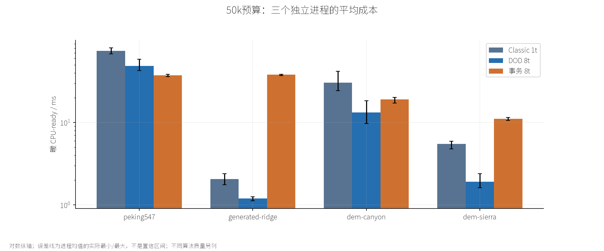
对数纵轴；误差线为进程均值的实际最小/最大，不是置信区间；不同算法质量另列

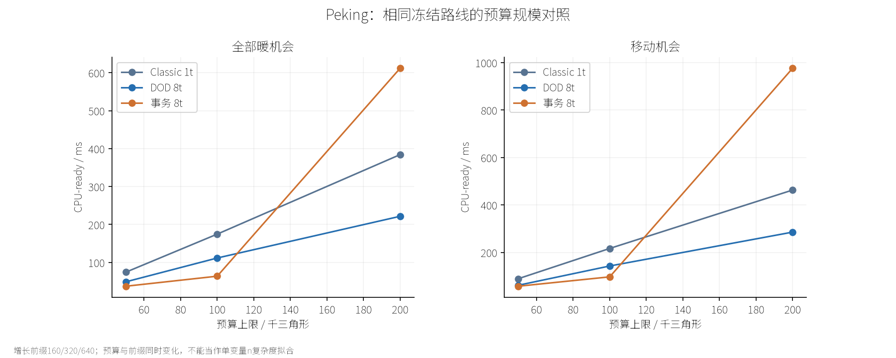
增长前缀160/320/640；预算与前缀同时变化，不能当作单变量n复杂度拟合

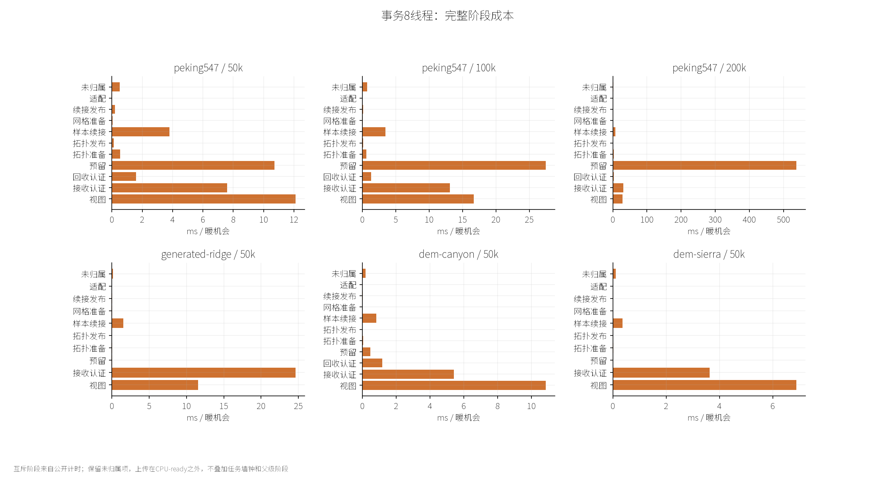
互斥阶段来自公开计时；保留未归属项，上传在CPU-ready之外，不叠加任务墙钟和父级阶段

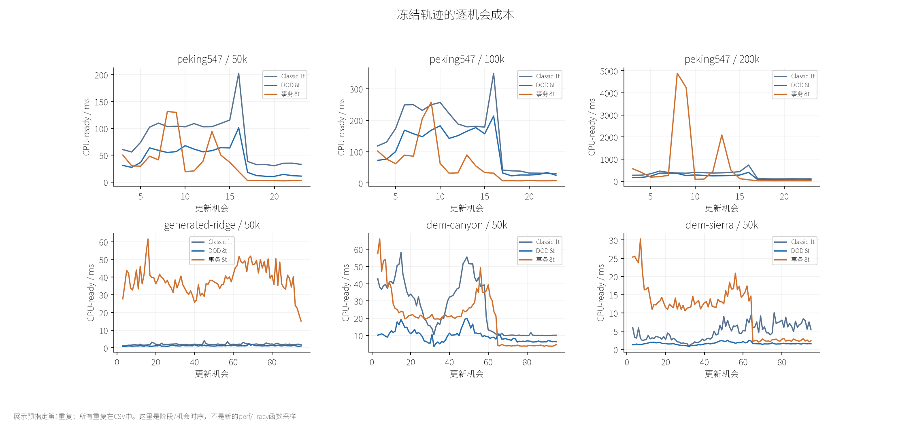
展示预指定第1重复；所有重复在CSV中。这里是阶段/机会时序，不是新的perf/Tracy函数采样

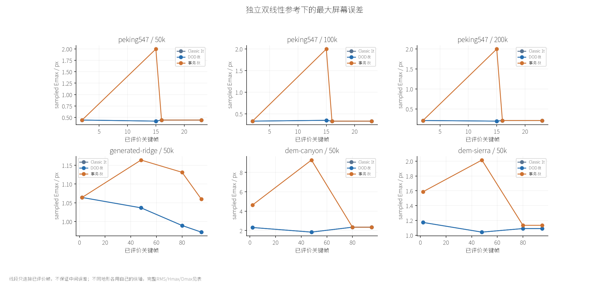
线段只连接已评价帧，不保证中间误差；不同地形各用自己的纵轴，完整RMS/Hmax/Dmax见表

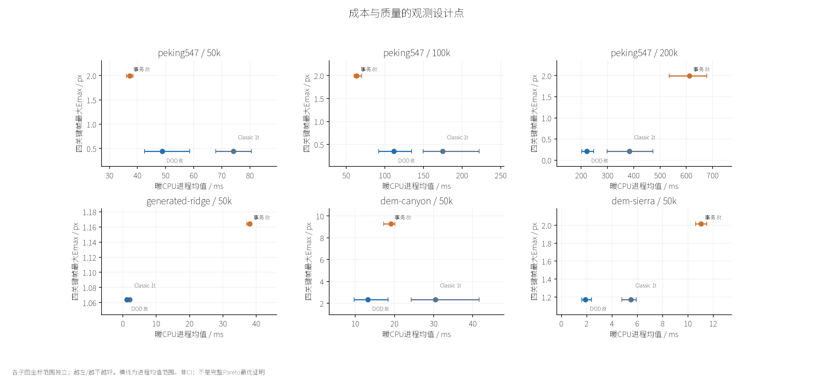
各子图坐标范围独立；越左/越下越好。横线为进程均值范围，非CI；不是完整Pareto最优证明

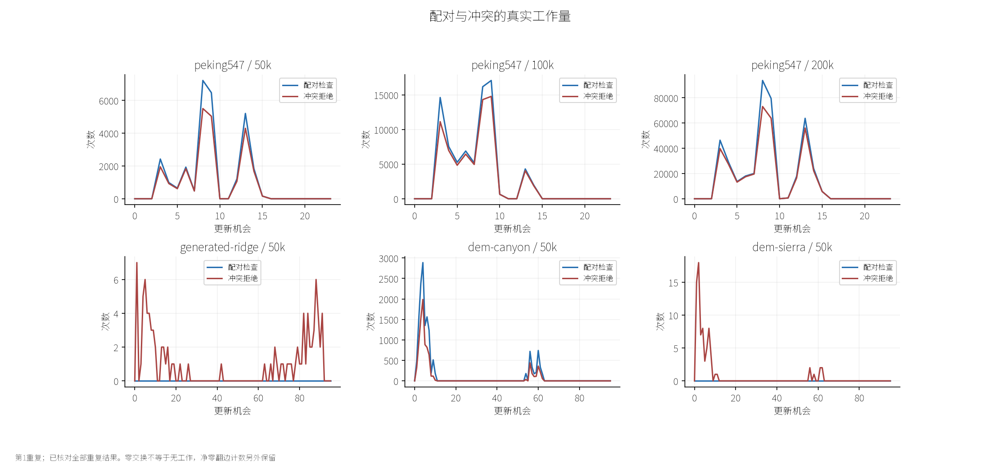
第1重复；已核对全部重复结果。零交换不等于无工作，净零翻边计数另外保留

相同中性材质/相机/视口；原始1280×720保留。缩略图用于对照，不替代数值质量和原像素检查

相同中性材质/相机/视口；原始1280×720保留。缩略图用于对照，不替代数值质量和原像素检查

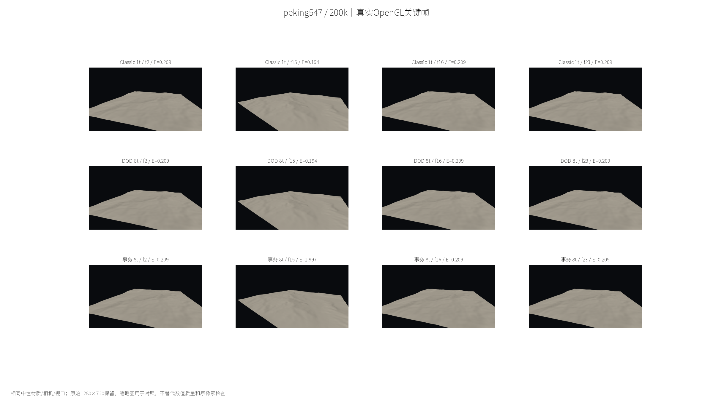
相同中性材质/相机/视口；原始1280×720保留。缩略图用于对照，不替代数值质量和原像素检查

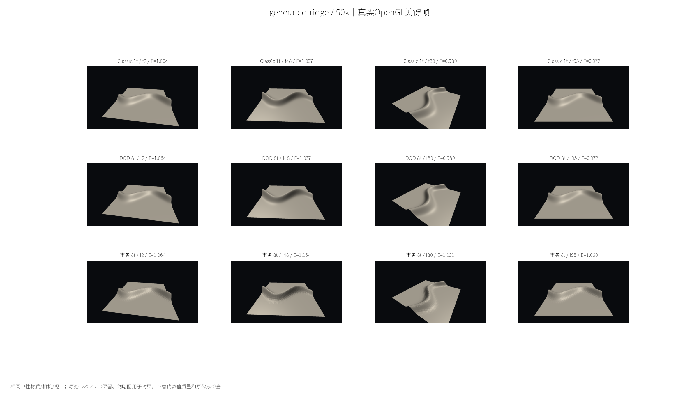
相同中性材质/相机/视口；原始1280×720保留。缩略图用于对照，不替代数值质量和原像素检查

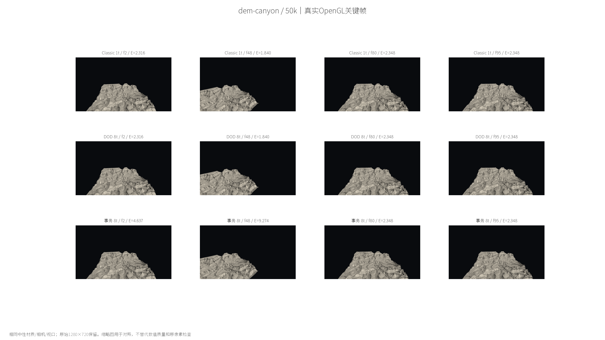
相同中性材质/相机/视口；原始1280×720保留。缩略图用于对照，不替代数值质量和原像素检查

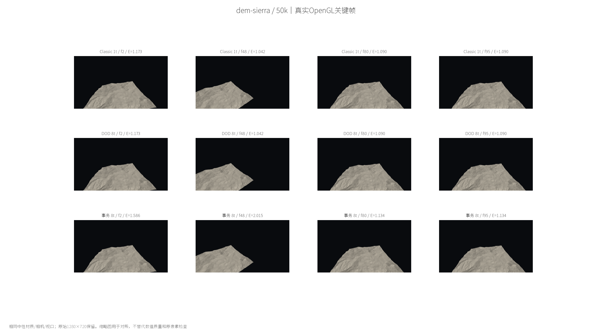
相同中性材质/相机/视口；原始1280×720保留。缩略图用于对照，不替代数值质量和原像素检查

仅从四个已评价关键帧选最大者展示；两侧同一参考投影裁剪，不新增采样，不以画面相似推断误差相同

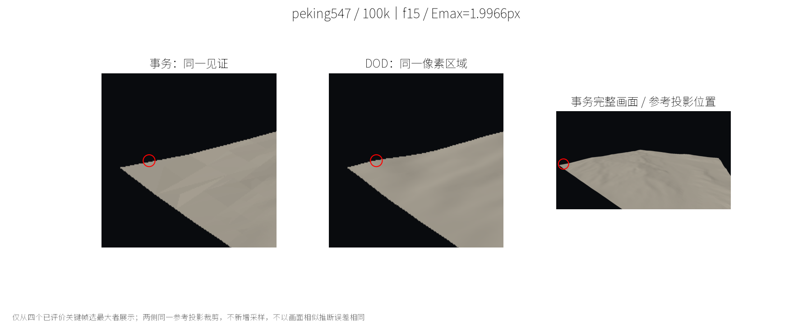
仅从四个已评价关键帧选最大者展示；两侧同一参考投影裁剪，不新增采样，不以画面相似推断误差相同

仅从四个已评价关键帧选最大者展示；两侧同一参考投影裁剪，不新增采样，不以画面相似推断误差相同

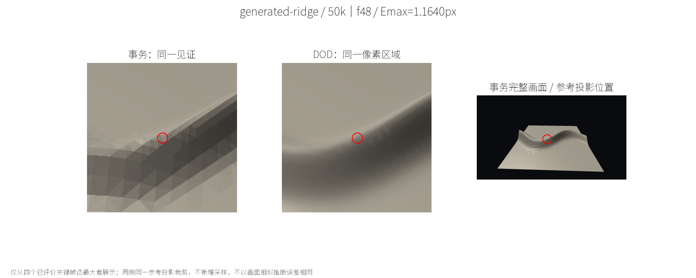
仅从四个已评价关键帧选最大者展示；两侧同一参考投影裁剪，不新增采样，不以画面相似推断误差相同

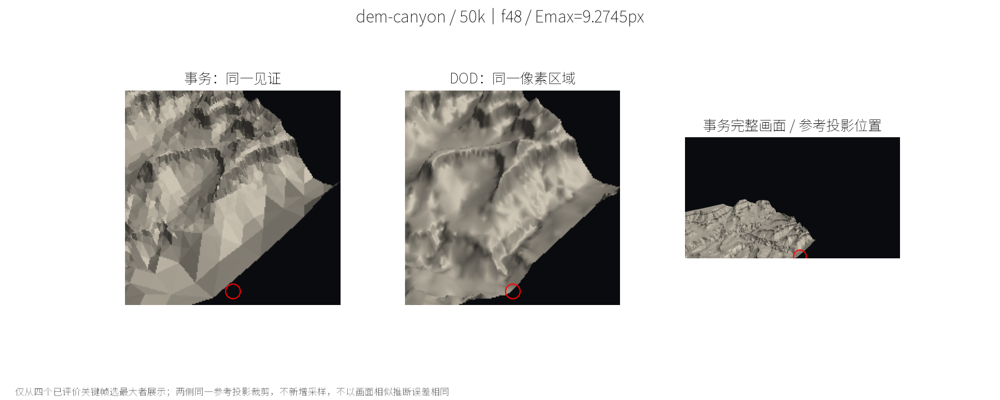
仅从四个已评价关键帧选最大者展示；两侧同一参考投影裁剪，不新增采样，不以画面相似推断误差相同

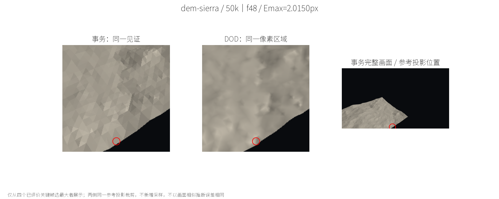
仅从四个已评价关键帧选最大者展示；两侧同一参考投影裁剪，不新增采样，不以画面相似推断误差相同
