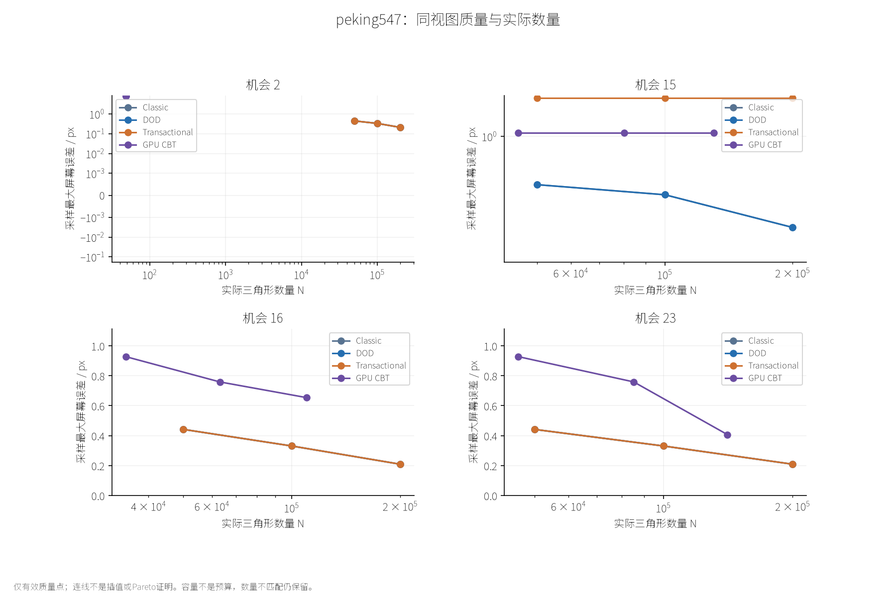
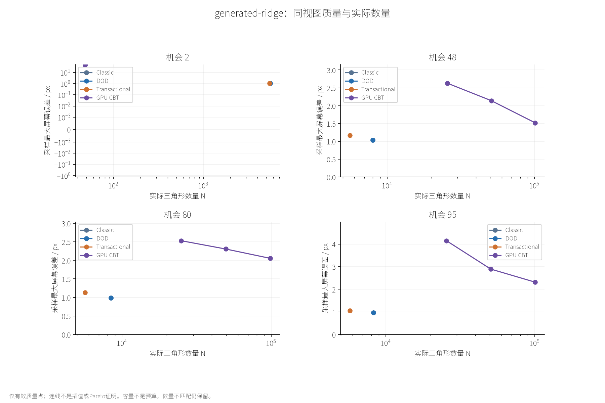
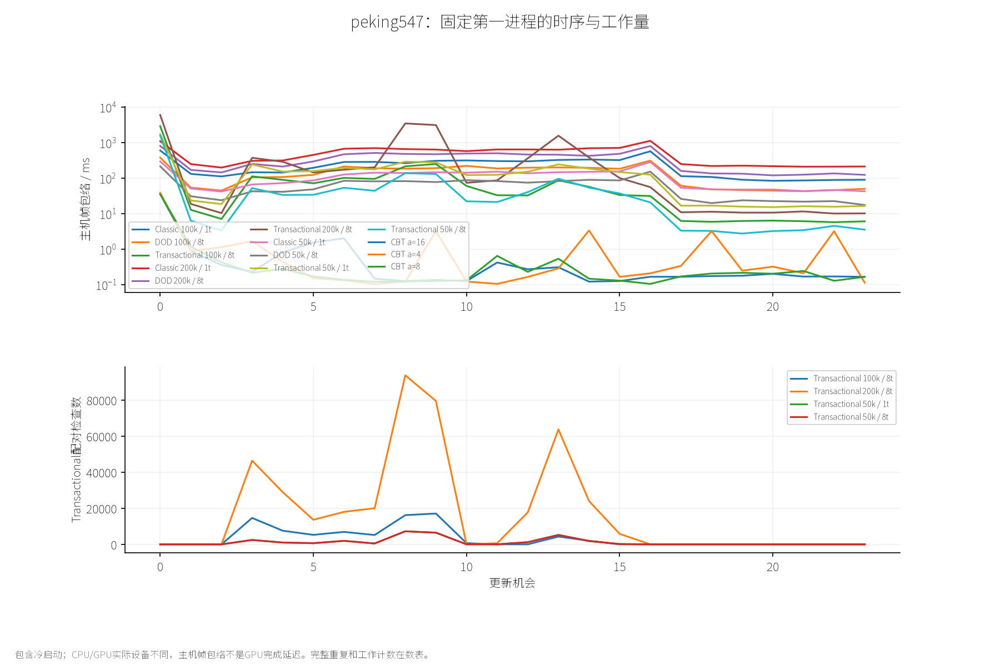

# FER-02 四算法总体实验：质量、数量、成本与持续状态

日期：2026-09-16。状态：实验、报告与Agent图像审阅完成；用户视觉待验收。
本轮沿[CEI大规划](../../plans/experiment_infrastructure/cbt_experiment_infrastructure_major_plan.md)与[CEI-03小规划](../../plans/experiment_infrastructure/cei_03_overall_experiment_plan.md)执行。

**CBT已进入共同实验链。部分状态中，ROAM家族和Transactional相对面积驱动CBT具有更好的面数—误差关系；但Transactional转向质量、200k预留成本以及9个CBT质量无效观察，使“统一性能和质量胜出”仍不成立。**

## 比较对象与独立性

Classic/DOD采用动态逐请求优先更新；Transactional采用批次快照全局优先序贪心预留，固定旧点并启用既有翻边恢复；CBT来自本项目第三方目录中的实际GPU参考实现，采用面积驱动自适应。
四者并不解决完全相同的优化任务。Classic/DOD不是独立几何真值；Transactional不严格复现其请求轨迹；CBT容量不是硬三角形预算。

质量参考保持raw U16＋bilinear。Emax为可见参考域采样最大屏幕偏移；RMS为可见参数域等权；Hmax覆盖全域；Dmax为逐点误差差值的最大，而不是两个Emax相减。
同帧同Q、相机、尺度才作质量比较；有歧义覆盖的点无效，不以部分样本最大值排名。

## 实验协议与计时边界

使用FER-01四资产和冻结路线，全部切到同一当前D3D12程序。32配置、3个独立随机重复区组，另外30组视觉采集各4个质量观察。
Peking24机会评价2/15/16/23，其他96机会评价2/48/80/95。返回不重置，路线按机会推进，不按实测帧时间重新采样。
因此名义相机播放速度不能证明实时帧率，四个质量观察也不能证明整个连续轨迹的误差上界。

主性能统计是第3机会至结束的每进程均值，再对3个独立均值求平均。范围为实测进程范围，不是CI。第0机会初始化单列，不保证冷机或冷文件缓存。
CPU完整更新、CBT主机命令录制、GPU来源代计算、GPU绘制、上传和主机帧包络具有不同边界，不能任意相加或相除称同任务加速。

正常CPU路径在计时外计算实际mesh哈希和公共证据，可能影响后续缓存；CBT普通计时没有全网格读回。GPU质量/计时只能按配置关联，不能把未捕获的不同进程mesh认作同一个结果。
GPU捕获使用同代实际绘制网格；异步时间戳按来源代归约，缺失尾部样本不回填当前帧。

## 初始化与稳定质量的区分

CPU路径可以从已经细化的初始网格/种子开始，CBT从粗网格逐轮细化。第2机会质量因此包含不同初始化/适应机制；不能将其单独解释成稳定质量胜负。
最终关键帧与转向/返回关键帧分别报告，并同时列实际N、数量接近程度及有效性。即使同预算上限，也不能默认实际N相同。
CBT面积16/8/4在采集前固定；最近N按绝对数量差选取，不因误差或无效状态换点。10%只是数量接近描述，不是视觉等价契约。

## 版本与已有问题

程序、质量probe与协议哈希见冻结清单；每进程保留源码、输入和命令。所有正常进程使用相同源码身份，未混入旧FER/CBI时间。
CBI-03 CPU工程回归仍OPEN，本轮同程序比较不等于回归被修复。CBI峡谷歧义也不通过更改容差掩盖；新评价有效率另列。
Peking资产再分发许可仍未确立，仓库内部可读取不代表可随论文公开分发。其余资产沿已有来源和许可证目录。

## 1. 完成率与来源

96个正常进程、30个视觉进程全部正常退出，无超时、替换或未执行配置。20个CPU配置的重复/采集实际结果核对一致；12个CBT配置只有输入/代次证据，不据空hash宣称同网格。120个质量点中111有效、9无效；30组逐点配对的120个观察中111可配、9不可配。

机器为AMD Ryzen 9 9950X3D（16核32逻辑处理器）与RTX 5090 D，Windows默认调度，电源/频率/温度未受控。D3D12记录驱动32.0.15.9186、系统D3D12Core 6.2.26100.9278。8线程不等于八个固定物理核心；三重复范围只描述这轮波动。

正常运行的源码身份统一为 `b9968bcbace7f27395892a897b51f1704b46b8388457869d0e02781a68d73f6b`。程序SHA256为 `e34f860ac14971a49d8932b46d664c49b1311591bd31fb4fb0fe6317d20f17b2`；probe为 `3bbc626c16199fb6c7a9a0a75507dbd345e247b17d2ca2f293118efdf86029a1`。完整冻结见[数据](data/fer_02/freeze.json)。

## 2. CPU完整成本与多核收益

单位ms/暖机会，括号为三个独立进程均值范围；不是CI。

| 输入 | Classic 1t | DOD 8t | Transactional 8t | T/DOD成本比 |
|---|---:|---:|---:|---:|
| Peking50k | 106.637（102.074–110.034） | 60.099（56.260–65.284） | 37.815（37.590–38.150） | 0.629 |
| Peking100k | 229.743（225.882–235.179） | 142.932（138.136–152.393） | 61.520（60.999–62.191） | 0.430 |
| Peking200k | 486.221（475.890–492.239） | 329.342（315.704–343.108） | 501.469（500.765–502.470） | 1.523 |
| 山脊50k上限 | 3.717（3.470–4.094） | 1.496（1.421–1.640） | 35.288（34.769–35.945） | 23.590 |
| 峡谷50k | 44.768（43.355–45.540） | 19.521（18.974–20.291） | 17.551（16.878–17.977） | 0.899 |
| 山地50k上限 | 7.483（6.792–8.269） | 2.390（2.267–2.492） | 11.737（11.531–11.862） | 4.912 |

Peking50k/100k与峡谷的平均CPU成本较低，但并不随规模单调改善。山脊/山地虽然配置上限50k，实际面数只有数千至一万余，不能将它们当成真实50k活动负载。当前数据不能支持“50k及以上普遍优于DOD”。

相同Transactional任务的1→8线程成本：Peking50k为128.511→37.815ms，3.398×；峡谷50k为88.656→17.551ms，5.051×。对应网格、公共计数及翻边记录一致。这是有限任务的真实多核收益，不是跨算法或GPU加速。

| Peking预算 | DOD移动 | T移动 | DOD返回/恢复 | T返回/恢复 | DOD第0机会 | T第0机会 |
|---|---:|---:|---:|---:|---:|---:|
| 50000 | 74.935 | 57.795 | 35.991 | 5.347 | 214.979 | 1622.383 |
| 100000 | 178.428 | 94.171 | 85.249 | 8.463 | 352.446 | 2967.258 |
| 200000 | 406.876 | 800.342 | 203.349 | 15.801 | 743.843 | 5821.293 |

返回/恢复组低成本不能掩盖Peking200k移动阶段约800ms。事务第0机会包含DOD种子、持久样本和状态初始化，当前达到秒级；暖路径排除它不等于成本消失。平台初始化setup另见每次environment.txt。

## 3. CBT设备成本与数量口径

CBT普通计时没有CPU网格全量读回。下表GPU计算为来源代17阶段之和，GPU绘制独立；不能把主机录制、异步帧包络直接解释成GPU完成延迟，也不跨代相加。

| 资产 | 面积 | 主机录制ms | GPU计算ms | GPU绘制ms | 主机帧包络ms | 末帧实际N |
|---|---:|---:|---:|---:|---:|---:|
| peking547 | 16 | 0.03971 | 0.08418 | 0.01414 | 0.43149 | 45844 |
| peking547 | 8 | 0.03783 | 0.09087 | 0.01854 | 0.46227 | 85238 |
| peking547 | 4 | 0.03863 | 0.10344 | 0.02292 | 0.48911 | 140913 |
| generated-ridge | 16 | 0.03614 | 0.08125 | 0.01382 | 0.51906 | 25574 |
| generated-ridge | 8 | 0.03752 | 0.08403 | 0.01956 | 0.59499 | 50744 |
| generated-ridge | 4 | 0.03989 | 0.08925 | 0.02887 | 0.63436 | 100869 |
| dem-canyon | 16 | 0.03740 | 0.07780 | 0.01292 | 0.61791 | 34973 |
| dem-canyon | 8 | 0.03726 | 0.08288 | 0.01802 | 0.57473 | 67255 |
| dem-canyon | 4 | 0.03906 | 0.08982 | 0.02513 | 0.48401 | 125407 |
| dem-sierra | 16 | 0.03544 | 0.06945 | 0.01200 | 0.45917 | 28643 |
| dem-sierra | 8 | 0.03696 | 0.07189 | 0.01630 | 0.64419 | 56100 |
| dem-sierra | 4 | 0.03717 | 0.08202 | 0.02359 | 0.49542 | 110369 |

GPU计算约0.069–0.103ms，确实是很低的设备成本；这与CPU样本认证/贪心预留不是同任务。Peking每进程21个暖来源机会中19个有效时间样本，其他93中91个；最后2代缺测，不回填。绘制覆盖数量相同，但独立归属。

容量固定为524288个动态槽加6个基础槽，不是50000面上限。面积越小通常产生更多面，但本轮不是同N校准；真实数量只引用同代捕获或明确标注来源的延迟观察。

36个正常CBT进程中，已有分类观测的faults与dropped最大值均为0，最小观察剩余槽为383277；这些已观察状态没有耗尽槽容量。尾部未读回状态和关闭的完整验证不在此结论内。逐进程数据见[资源表](data/fer_02/gpu-resources.csv)。

## 4. 末帧质量与实际N

表格为N / Emax px；Classic与DOD在本轮末帧Emax相同，详细Classic数值仍保留在完整表。无效点不提供部分最大值。

| 输入 | DOD | Transactional | CBT a16 | CBT a8 | CBT a4 |
|---|---:|---:|---:|---:|---:|
| Peking50k | 49999 / 0.441886 | 49999 / 0.441886 | 45844 / 0.927970 | 85238 / 0.758890 | 140913 / 0.407000 |
| Peking100k | 99999 / 0.330869 | 99999 / 0.330869 | 45844 / 0.927970 | 85238 / 0.758890 | 140913 / 0.407000 |
| Peking200k | 200000 / 0.209150 | 200000 / 0.209150 | 45844 / 0.927970 | 85238 / 0.758890 | 140913 / 0.407000 |
| 山脊50k上限 | 8264 / 0.971799 | 5747 / 1.059956 | 25574 / 4.148093 | 50744 / 2.893437 | 100869 / 2.314244 |
| 峡谷50k | 50000 / 2.348193 | 50000 / 2.348193 | 34973 / 9.069726 | 67255 / 无效 | 125407 / 无效 |
| 山地50k上限 | 15919 / 1.089577 | 8976 / 1.133568 | 28643 / 1.742150 | 56100 / 1.489559 | 110369 / 无效 |

Peking50k末帧相对CBT a16：实际N多9.06%，Emax从0.927970降至0.441886，约降低52.4%。这是接近数量的有限质量证据，不能称严格同N，也不能推广到转向帧。

山脊末帧，Transactional以5747面达到1.059956px，CBT a4以100869面为2.314244px；山地以8976面达到1.133568px，而有效CBT a8为56100面、1.489559px。这支持几何误差驱动在这些状态的数量效率优势，但没有证明所有局部点更好，也不覆盖无效的更细CBT点。

这些优势并非Transactional独有：DOD在山脊8264面达到0.971799px、山地15919面达到1.089577px，也优于已有效观测的CBT点。不能把ROAM家族相对面积驱动参考的优势全部记为新事务架构的新增贡献。

## 5. 转向、恢复与逐点退化

Peking frame15：Transactional三档预算均为1.996557px；CBT三面积均为1.069818px；DOD50k/100k/200k分别为0.418727/0.349195/0.193772px。增加事务预算并没有改善这个转向见证。

峡谷frame48：DOD1.839557px，Transactional9.274477px，CBT a16为11.115904px，a8/a4质量无效。返回后DOD与Transactional均回到2.348193px，不能据末帧相等抹去中途明显退化。

同时，全域Hmax与当前可见Emax不是同一指标。峡谷frame48中DOD Hmax为6.259915，Transactional为1.165875，但前者当前可见Emax更低。固定旧点保护了部分全域几何状态，并未自动建立更好的可见恢复契约。

逐点Dmax进一步排除了“Emax相同就等价”：Peking50k末帧T−DOD为0.101125px；峡谷末帧为1.729848px。Peking50k末帧T−CBT a16也有0.328234px，即使T的全局最大值更小，仍有局部点更差。

预注册T−DOD的24个关键观察，Dmax≤0/0.1/0.25/0.5/1px分别为3/5/9/9/9个（1e−9仅作数值比较容差）。这些是质量操作点，不是感知阈值。全表见[逐点CSV](data/fer_02/pointwise.csv)。

## 6. 无效质量与未解决边界

CPU72点全部有效，CBT48点中39有效。无效9点均为覆盖歧义：峡谷a8在48/80/95为1/11/11个；峡谷a4为104/123/123个；山地a4为38/11/11个。缺失覆盖与invalidGeometry为0不等于完整合法性已经证明。

这些点保留实际N、原始失败计数及网格，但Emax/Hmax/RMS不用于比较。最近N选择仍可能落到无效点，例如峡谷frame48最接近50k的是CBT a8的49165面；不能转而选择更远、但质量有效的a16。

原因尚未在本轮证明，既不能直接指控CBT有裂缝，也不能宣布评价器误报。旧有限顶点一致性检查不能为新增山地或其他机会自动背书。本轮不改容差、不重新选点。

## 7. 工作量、阶段瓶颈与复杂度解释

Peking暖路径的事务阶段均值如下（ms）。

| 预算 | 视图 | 接收 | 回收 | 预留 | 样本续接 | 拓扑准备+发布 | 网格准备 | 预留占完整成本 |
|---|---:|---:|---:|---:|---:|---:|---:|---:|
| 50000 | 12.500 | 7.590 | 1.633 | 10.734 | 3.907 | 0.660 | 0.034 | 28.4% |
| 100000 | 17.716 | 11.515 | 1.212 | 25.320 | 3.748 | 0.879 | 0.045 | 41.2% |
| 200000 | 28.858 | 23.389 | 2.327 | 432.271 | 8.253 | 3.183 | 0.083 | 86.2% |

50k→200k，完整轨迹配对检查28580→412142（14.42×），预算交换145→522（3.60×），最大总批宽41→150（包含翻边）。预留时间10.734→432.271ms（40.27×），明显不是仅增加4倍面数的线性成本。

源码仍在配对时构造联合足迹并遍历已有预留事务：[Reservation](../../../src/algorithms/greedy_transactional_lod/TransactionalReservation.cpp:105)。增长前缀160/320/640会增加搜索人口，批准批宽也扩大冲突检查。该结构与观察一致；本轮没有函数采样或独立消融，不能宣称432ms全部由某一个容器操作造成。

仅作敏感性上限：若200k预留免费，其他阶段仍约69.20ms；它是可回收成本的极端上限，不是优化承诺。当前拓扑准备/发布与网格准备仅约3.27ms，继续只优化这些小阶段无法消除主要差距。

长轨迹还显示全Q负担：山脊累计约1.514亿次evaluation，峡谷/山地各约1.024亿。它们是账本工作单位，不是CPU指令或函数调用次数；不能用“局部拓扑只有几个面”概括完整算法成本。

当前复杂度应按参数分别理解。N为状态槽/索引规模，q为公共Q，a为面—样本关联，r/m为前缀/回收池，b为批准批宽，f为事务足迹规模，s为局部认证样本；固定最小角只约束拓扑邻域，不约束s或q。

| 路径 | 主要工作项和边界 |
|---|---|
| Transactional换视图 | 仍投影全部q并按关联a归约，另建K=256分块优先索引；不能声称次线性视图查询。核心样本项Θ(q+a)，还须计N与有序容器查询 |
| 提案/认证 | 随实际尝试数量和各自s增长；复用局部证据不等于免除动态质量求值。区间/有理分支有额外位复杂度，不能全部当普通浮点常数 |
| 贪心预留 | 至多r×m配对，成功后可早停；已有实现还带b与足迹f相关检查，保守表达O(rm(b+1)f log(2+N))，并加认证分支成本 |
| 续接/输出 | 与触及面、样本、包围盒候选及脏块有关，扩容另计；不是单靠b或固定degree就能证明O(1) |
| 净零翻边恢复 | 每个触发根最多尝试3条边，几何支持有限；质量求值仍随局部样本增长。不可从固定3条边推出常数完整认证 |
| DOD | 评分、严格动态选择/堆维护、实际拓扑编辑与网格输出分别计费；没有本算法全Q在线证书。不把同名评分阶段当相同工作单位 |
| GPU CBT | 活动列表分类、模板/传播、容量相关占用归约、全槽索引、修改列表几何分别计费；本轮固定容量无法实验识别容量缩放率 |

CBT [Indexation](../../../src/algorithms/cbt_2024/d3d12/D3D12CbtFramePipeline.cpp:1218)仍按TotalElementCount派发；[归约](../../../src/algorithms/cbt_2024/d3d12/D3D12CbtFramePipeline.cpp:1121)按树层规模派发；[几何](../../../src/algorithms/cbt_2024/d3d12/D3D12CbtFramePipeline.cpp:1237)使用modified列表。Validation关闭时计时槽仍可能有查询/命令开销，不能把其非零值解读成全网格验证已执行。

以上是源码与账本支持的成本解释，不是完整CPU/GPU span定理。本轮没有重新采perf/Tracy，不能用旧版本函数百分比拼成本轮函数归因。

## 8. 视觉、复现与证据入口

- [完整HTML：数表、70组图像与30个实际播放器](../../../benchmark-output/experiment-infrastructure/fer-02/report/index.html)
- [详细数表/图像附录](fer_02_appendix.md)、[独立进程CSV](data/fer_02/processes.csv)、[全部质量CSV](data/fer_02/quality.csv)
- [阶段/分组指标](data/fer_02/group-metrics.csv)、[GPU来源代统计](data/fer_02/gpu-metrics.csv)、[翻边续接补充](data/fer_02/connectivity-repair.csv)
- [冻结协议](../../../configs/experiments/formal/fer_02/protocol.json)、[模式与重复检查](data/fer_02/mode-and-repeat-checks.json)

共享analysis的transactionFrames字段来自exchange/free计数，不含净零翻边；本报告“总事务帧/总批宽”另从已核对的flip-recovery记录补入。不能以只看exchange/free断言某机会没有任何拓扑修改。

Agent实际审阅了36张科学图、4条路线、30幅见证的总览及四资产实际同帧对照；Peking/山脊质量—成本图的重叠标签已改为图外图例，并重新看图。30个播放器的事件逻辑核对完成，不冒充真实浏览器交互验收；用户视觉未代签。

中性材质画面中，Transactional山脊与山地可见更明显的三角面明暗分块。Emax只测几何偏移，不包含法线/着色误差，因此当前不能以较低Emax宣称画面全面更好。未对法线来源作因果定位，也没有以缩略截图认证无裂缝。原图、局部裁剪与错误见证均保留。

原始程序、mesh、误差数组与图片保留在Git忽略的benchmark-output，精简数表和44张PNG随本阶段提交。来源及视觉记录见[图清单](data/fer_02/figure-manifest.json)和[审阅记录](data/fer_02/visual-review.json)。

离线流水线耗时分别为：96个正常运行约1315秒，30次视觉采集约475秒，质量及逐点比较约233秒，analysis约74.7秒，完整70图报告约660秒；排版修订的12图重绘约102秒。这些包括工具与文件处理，均未计入算法CPU/GPU时间，不与原生测量并发。没有因无效质量点重跑或替换配置。

## 9. 总体判断

**CBT全面实验接入及本轮执行已成立；新算法的统一质量/性能胜出没有成立。**

本轮支持三个分开的结论：Transactional有真实多核收益；在部分状态中ROAM家族/事务策略用更少面获得更低Emax；但面积驱动CBT在本GPU上的计算成本很低，且Peking转向时质量可优于当前Transactional。

相对DOD，Peking50k/100k的成本优势与转向质量退化并存；200k受预留放大限制；峡谷暖成本接近但中途质量落后；山脊/山地固定发现成本明显。因而“50k及以上更快且Emax不明显退化”的目标仍未达到。

后续优先项应是已定位的预留工作放大、转向/恢复残差，以及CBT质量歧义的独立判别。它们是本轮证据支持的待办，不在此次实验接入里自动改算法、改容差或追加有利工作负载。

| 门禁 | 本轮状态 |
|---|---|
| CBT共同实验基础设施 | 完成：配置、矩阵、运行、代次时间、质量、配对、统计、科学图及实际图像 |
| 冻结实验执行 | 完成：96正常＋30视觉，未替换或删减 |
| 独立质量覆盖 | 部分有效：111/120；9个CBT覆盖歧义保留 |
| 同任务多核收益 | 有限正面证据：两组1→8线程约3.40×/5.05× |
| 50k以上更快且质量不明显退化 | 未达到：部分成本优势不能抵消转向质量与200k成本失败 |
| Agent视觉审阅 | 完成；保留明暗分块、初始化和见证边界 |
| 用户视觉/实际浏览器交互 | 未代签/未验证 |
| 既有CBI工程回归与质量歧义 | OPEN，本轮不关闭原因调查 |

阶段核查见[代码事实](../../codebase/experiment_infrastructure/cei_03_overall_experiment_facts.md)及[架构审查](../../reviews/experiment_infrastructure/cei_03_overall_experiment_review.md)。
