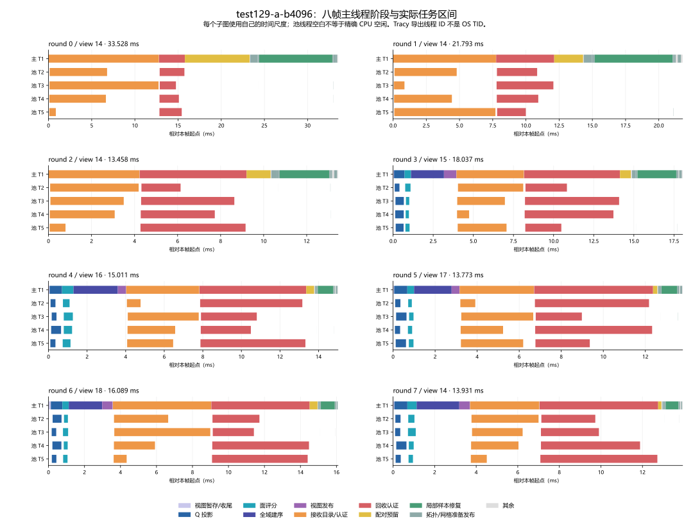
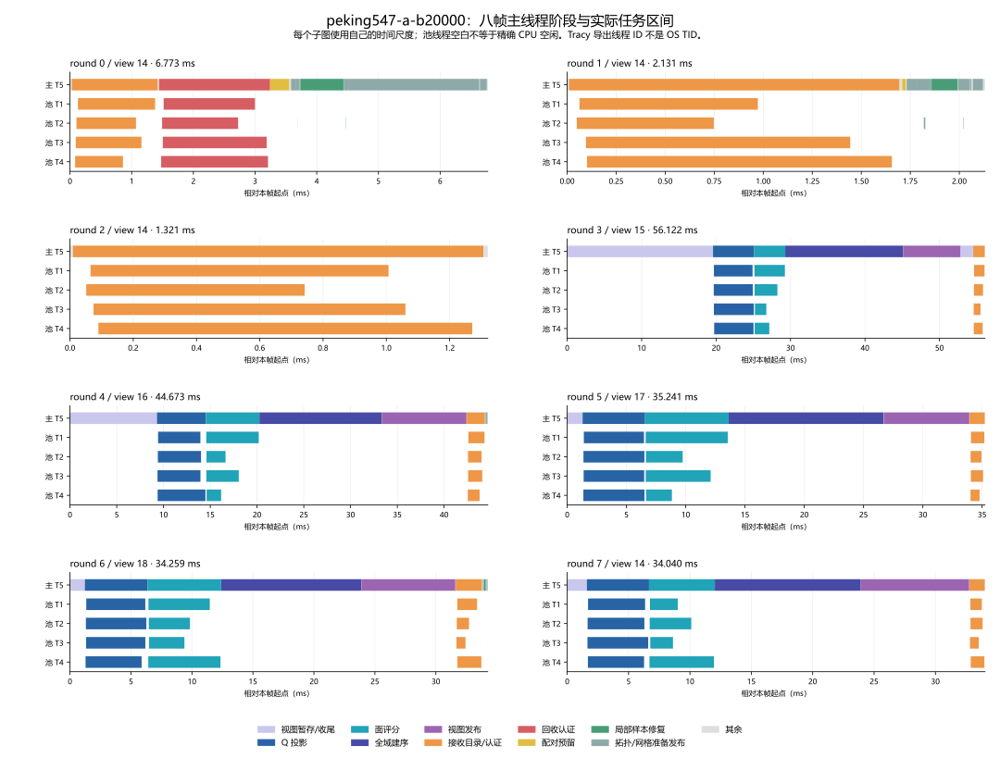

# CPU 函数热点、调用路径、时序与算法成本报告

2026-09-14；FPR-01～04 的实际使用闭环。本次补充完整函数、逐帧时序和源码成本审计，复用已有数据，没有重跑自然矩阵或修改算法。**test129 的主要成本在提案认证与样本修复；Peking 在换视图的全量投影、暂存、建序和发布。两者都不能只靠并行最后的拓扑写入解决。** GWR 仍暂停。

## 阅读入口与完整性

| 文档 | 内容与覆盖 |
| --- | --- |
| 本页 | 可直接相加的帧成本、关键函数、调用链、工作量及结论 |
| [test129 完整函数明细](fpr_test129_function_details.md) | 全部 178 个有权重符号、385 条相邻调用边、631 条完整记录栈；含自身/祖先占比、主/池线程、命中数及完整模板符号 |
| [Peking 完整函数明细](fpr_peking_function_details.md) | 全部 121 个有权重符号、198 条相邻调用边、187 条记录栈；没有仅截取前 50 名 |
| [全部函数与线程时序](fpr_thread_timeline_details.md) | 两场景各八帧的全部已标记函数、次数/均值/最大值/self、逐帧起止、每次派发/等待/收尾、全部 276 个业务任务；另含 DOD 八帧 |
| [完整逻辑工作账本](fpr_workload_details.md) | 每帧 D_raw→需求→可行→执行、全部 36 个工作字段、原因与原始阶段计时，保留零值 |
| [函数算法与复杂度](fpr_function_cost_analysis.md) | C00～C13：每条业务路径、库函数族、数据结构、循环/分支、时间/空间界、精确算术和未确认成本 |
| [采集原报告](fpr_02_function_sampling_report.md)、[时序原报告](fpr_03_thread_timeline_report.md)、[使用指南](cpu_profiling_usage.md) | 采集环境、扰动、故障、复现和有效原始产物位置 |

完整表中的“函数”是本次优化后二进制实际记录到的符号；没有独立机器符号或从未被采中的源码函数，不会伪造一行百分比。未标记函数也没有精确调用次数：perf 的命中是统计样本，Tracy 的次数是导出的作用域数，两者在表中分别命名。

## 测量边界和分母

| 证据 | test129 | Peking | 可以回答的问题 |
| --- | ---: | ---: | --- |
| 固定预算 / Q | 4096 / 98,817 | 20,000 / 1,790,881 | 输入规模；不是相同 sample/triangle 密度 |
| perf：轨迹重放 / ROI 样本 | 17 / 2558 | 16 / 2508 | 函数自身及同线程祖先的 CPU 事件归属 |
| perf：缺栈 / 未知自身 / 丢失 | 0 / 1 / 0 | 0 / 0 / 0 | 数据完整性；部分未知外层仍保留 |
| Tracy：八帧墙钟合计 | 145.620174ms | 214.558869ms | 先后次序、重叠、等待和串行段 |
| Tracy：完整 ROI 区间 | 13,566 | 4,447 | 已插桩作用域的时间和数量 |
| 实际业务池线程 | 4 | 4 | 实际任务执行者；不是由任务数量推断 |

轨迹固定为 view `[14,14,14,15,16,17,18,14]`。前 3 帧视图不变，后 5 帧发生视图刷新；同视图时网格仍持续变化。perf 的重复从相同种子开始，用于补足采样，不是 17/16 个独立统计单位。初始化、文件输出、全量质量诊断在 ROI 外；perf 和 Tracy 分开运行，不能拼成同一次精确调度。

- **perf 自身占比：** 栈顶 period / ROI 总 period，各符号自身可相加；含调用占比按该样本是否包含该符号计一次，父子不可相加。
- **Tracy 含调用/self：** 都是区间墙钟；self 只扣已标记同线程直接子区间，仍含未标记子函数。跨线程加总可大于帧墙钟。
- **调用次数：** 未插桩函数没有 exact count；官方 CSV 还会省略部分零时长短区间，因此导出数不无条件等于全部 C++ 调用数。高频完整业务函数与逻辑计数另做交叉核对。
- **等待：** 主线程 wait 与池线程任务重叠，不是额外再付一次同等 CPU 工作。本轮未取得内核调度/PMU，不能恢复精确 CPU 利用率或语义关键路径。

## 不重复计费的整帧成本

下面以主线程时间轴切片，嵌套区间只归入一个最内层已列阶段；派发包含任务完成前的等待。所有行相加等于八帧总时间。**这张表适合判断完整成本所在；不能拿后面的 inclusive 表代替它。**

| 互斥阶段 | test129 合计 ms | 占帧 % | Peking 合计 ms | 占帧 % |
| --- | ---: | ---: | ---: | ---: |
| 视图暂存准备剩余 | 0.343 | 0.24 | 33.011 | 15.39 |
| 视图投影派发 | 3.197 | 2.20 | 26.254 | 12.24 |
| 视图评分派发 | 2.112 | 1.45 | 28.317 | 13.20 |
| 全域建序 | 10.044 | 6.90 | 65.364 | 30.46 |
| 视图结果发布 | 2.668 | 1.83 | 40.527 | 18.89 |
| 视图控制/收尾剩余 | 0.018 | 0.01 | 1.730 | 0.81 |
| 接收目录与认证派发 | 45.037 | 30.93 | 12.587 | 5.87 |
| 回收认证派发 | 40.646 | 27.91 | 1.801 | 0.84 |
| 配对与资源预留 | 12.697 | 8.72 | 0.357 | 0.17 |
| 拓扑准备剩余，已扣面填写 | 2.581 | 1.77 | 0.219 | 0.10 |
| 面记录填写派发 | 0.620 | 0.43 | 0.261 | 0.12 |
| 局部样本/priority 修复 | 22.001 | 15.11 | 1.064 | 0.50 |
| 网格准备剩余，已扣属性填写 | 0.084 | 0.06 | 2.134 | 0.99 |
| 网格属性填写派发 | 0.597 | 0.41 | 0.257 | 0.12 |
| 拓扑发布 | 0.473 | 0.32 | 0.034 | 0.02 |
| 样本/候选索引发布 | 1.082 | 0.74 | 0.251 | 0.12 |
| 网格发布 | 0.030 | 0.02 | 0.005 | <0.01 |
| 其余未单列控制和生命周期 | 1.392 | 0.96 | 0.387 | 0.18 |
| **合计** | **145.620** | **100** | **214.559** | **100** |

显示值有舍入，精确逐帧合计保存在[时序明细](fpr_thread_timeline_details.md)。视图暂存剩余不是一个虚构的新计时探针，而是 `PrepareView` 减掉投影/评分派发和 BuildOrders 后的已标记剩余；源码中的数组创建/初始化位于此处，尚未进一步区分分配、初始化、缺页和调度。

Peking 约 90.98% 的整帧时间处于 SetView 相关边界，主要问题与成功提交了多少个面脱钩。test129 则有 58.84% 处于接收/回收派发，另有 15.11% 局部样本修复。此前只写“投影/认证较贵”漏掉了这两个明确的成本组成。

## 关键函数的自身与下层调用

此表供快速阅读；**所有非零项及编译器模板实例都在两份完整明细中**。百分比为各自 perf ROI period，不能拿 test129 与 Peking 的分母混算。

| 函数 | test129 自身 / 含调用 % | Peking 自身 / 含调用 % | 算法位置 |
| --- | ---: | ---: | --- |
| `Project` | 1.37 / 1.37 | 22.09 / 22.09 | C01：逐 Q 投影 |
| `PrepareView` 评分 lambda#2 | 1.52 / 2.31 | 16.91 / 19.98 | C01：归约面样本、顶点树访问；不是纯回调管理 |
| `PrepareView` 投影 lambda#1 | 见完整表 / 2.23 | 7.85 / 31.58 | C01：遍历输入/输出投影数组 |
| `PublishView` | 0.43 / 1.17 | 8.81 / 13.08 | C01：全 Q 写回、替换并释放旧索引 |
| `PrepareView` 入口 | 0.20 / 3.91 | 2.27 / 21.93 | C01：主线程含调用不含异步池线程 |
| `BuildOrders` | 0.20 / 3.32 | 1.12 / 15.55 | C02：全域候选/回收代理索引 |
| `IsBoundary` | 3.09 / 3.09 | 13.44 / 13.44 | C02：incident lists 与边 map 查询 |
| `Vertex` | 1.06 / 1.06 | 2.67 / 2.67 | C02：稳定身份树查物理槽 |
| `Receivers` | 0.27 / 5.08 | 0.08 / 2.67 | C04：提前构造 E/F/H 目录 |
| `VisibleSupport` | 1.80 / 3.24 | 0.56 / 0.68 | C04：闭样本收集、排序、去重 |
| `Fit` | 0.70 / 30.53 | 0 / 7.42 | C05：Shape、见证、约束、拟合、最终认证 |
| `Measure` | 0.23 / 42.96 | 0 / 1.48 | C05：逐样本误差界 |
| `ErrorBounds` | 0.35 / 41.36 | 0 / 1.40 | C05：区间参考/插值/投影，必要时精确回退 |
| `CoveringFace` | 0.35 / 22.56 | 见完整表 | C05：重复恢复提案覆盖面 |
| `Weights` | 3.01 / 33.58 | 见完整表 | C05：浮点过滤与有理包含判断 |
| `Shape` | 0.31 / 7.31 | 0.24 / 7.30 | C05：朝向和三个角的精确兜底 |
| `Donor` | 0.08 / 40.03 | 0.04 / 1.99 | C06：环恢复、耳切和 Measure |
| `Conflict` | 0.82 / 0.82 | 见完整表 | C07：资源集合读写交叉 |
| `Samples::Prepare` | 2.07 / 7.27 | 见完整表 | C08：局部 owner、样本和索引修复 |
| `__nextafter` | 17.44 / 见完整表 | 1.04 / 见完整表 | C12：区间逐运算向外舍入 |
| Boost `eval_gcd` 首位实例 | 5.04 / 见完整表 | 1.04 / 见完整表 | C12：有理数规范化；模板实例未混并 |
| Boost `divide_unsigned_helper` 首位实例 | 3.83 / 见完整表 | 0.68 / 见完整表 | C12：多精度整数除法 |
| `__wrap_scalbnl` / `__frexpl` | 3.67 / 3.21（各自自身） | 见完整表 | C12：浮点/有理数转换下层 |

test129 的主要已观测路径是 `Donor或Fit → Measure → ErrorBounds → CoveringFace → Weights → Boost`，以及 `ErrorBounds → Interval运算 → __nextafter`。Peking 的路径分成主线程 `SetView → PrepareView → BuildOrders → IsBoundary/树维护`、`SetView → PublishView → 写回/树析构`，和池线程两个 PrepareView lambda。完整栈里因内联/优化没有显式出现的中间函数，由源码说明，不能伪称每条机器栈都完整包含上述源码节点。

## 调用量和实际交付的工作

| 八轮工作量 | test129 | Peking | 解释 |
| --- | ---: | ---: | --- |
| 接收 root 目录调用 | 512 | 512 | 都消费每帧 64 个请求 |
| Fit 尝试 | 2693 | 3103 | 已尝试提案，不是已构造全部提案 |
| 回收提案调用 | 512 | 64 | Peking 只有首轮需要 donor |
| Measure 导出次数 | 614 | 64 | test129 还包含接收拟合后的认证 |
| Accepts 导出次数 | 8268 | 64 | 大部分是缓存界 O(1) 比较 |
| 样本评价 | 506,082 | 8,955,073 | 换视图 + 局部评价，不是全部认证访问 |
| 区间过滤计数 | 116,690 | 7,525 | 数值证据构造工作 |
| 位置测试 | 95,837 | 9,558 | 包围框定位，未覆盖每个 CoveringFace 内部测试 |
| PairChecks / ReservationChecks | 9088 / 1332 | 64 / 43 | 配对人口与真正预留检查不同 |
| 成功交换 / 空额度细化 | 56 / 0 | 0 / 5 | 本次持续轨迹事实，不是 GMP-03 单快照结果 |
| 新面准备 / 网格顶点写入 | 409 / 1227 | 35 / 105 | 远少于上游访问量 |
| 被跟踪容量搬移字节 | 0 | 4,317,952 | 非全部内存流量；首帧占 3,998,000 |

test129 的 512 个回收提案调用合计 116.100ms，其中 106.437ms 在 Measure 内，约 91.68%。相较之下，8268 次 Accepts 合计约 0.317ms。**这两项区分直接改变优化对象：主要认证成本在预先构造误差证据，不能归给最后那次接受比较。**

Peking 3103 次 Fit 中，2061 次无可见样本、1029 次形状不满足、3 次拟合失败、10 次认证成功。这解释了为什么“多数请求没有实际写入”仍不是便宜路径：目录、Shape/精确几何前提和全局视图状态已经付费。完整字段、失败层级和计数局限均在[账本](fpr_workload_details.md)与[成本分析](fpr_function_cost_analysis.md)中。

## 时序如何解释等待与短任务

以下为同一有效 Tracy 捕获的八帧图。每个子图时间轴从自己的帧起点开始，**不同子图横轴尺度不同**。主线程颜色显示互斥阶段；池线程只画实际任务区间，空白不能直接解释为 OS 层 CPU 空闲。

test129 round0：整帧 33.528ms；接收派发 12.762ms，其 4 个任务墙钟之和 26.582ms，最长 12.626ms；主等待 12.670ms，最后任务结束到派发返回仅 0.043ms。随后回收派发 2.988ms，再进入主线程配对 7.501ms 和局部样本修复 8.468ms。这里的主要顺序等待与真正长任务重叠，不能扣除 wait 就得到“理想帧时间”。

Peking round3/5/7 没有任何成功事务，仍分别为 56.122/35.241/34.040ms，主要在视图刷新；round2 同视图、同样无成功事务为 1.321ms。它是同条轨迹的阶段差异，不是算法消融或统计加速比，但明确表明当前帧成本不由 b 单独决定。

面填写和网格填写很短，多个 chunk 常被一个池线程领完；全部任务表提供实际线程、起止和重叠。不要把“发出四个任务”当成四核都在有效计算。Peking 首帧网格准备约 2.20ms，只有约 0.073ms 是属性填写派发，另有实际容量搬移；这个异常组成也已保留，未用更快帧替换。

## 算法成本的统一解释

在[详细分析](fpr_function_cost_analysis.md)定义的 n/v/e/q/a/r/m/b/d/sᵢ/u 下，当前实现应至少分别计入：

| 路径 | 当前工作项 | 可并行与仍串行的界线 |
| --- | --- | --- |
| 换视图 | Θ(q+nₛ) 暂存 + Θ(q) 投影 + O(a+n log v) 评分 + 全域建序 + Θ(q+n+v) 发布 | 投影/面评分分块，暂存、建序、发布仍串行 |
| 全域建序 | O(n log n+vₛ+v log v+Σdᵢ log e) | 主线程；边界和树维护需分别看 |
| 接收目录 | 至多 rc 个局部几何/样本集合构造，包含 aᵢ 收集与排序 | root 间并行，当前 eager 构造 |
| 一/两自由高度拟合 | 样本覆盖与约束 + 精确见证 + Measure；二维另加 ΣⱼO(vⱼ+vⱼ²) | root 间并行，提案内部顺序；不能无条件写成 O(sᵢ) |
| 回收 | O(d³ log d) 保守耳切 + 样本收集/误差认证 | donor 间并行；自然耗时主要落认证 |
| 配对/预留 | 保守 O(rmbd log d) + 模糊误差精确比较 | 主线程；当前命中后仍保留部分审计 |
| 状态/样本续接 | 局部面/点/边/索引树维护 + z 定位 + aΔ 关联访问 | 面独占填写可分块，其他修复仍串行 |
| 增量输出 | O(bd) 属性工作 + O((u+bd)log(u+bd)) 脏块合并 + 偶发扩容 | 属性分块，发布串行 |

表中对数省略了空/单元素的常数项，严格符号见详细分析；精确算术另计位复杂度 χ(ℓ)。`d≤19` 仅约束拓扑支持，不使样本认证常数化；偶发扩容可触及旧容量，不能承诺每帧纯 O(b)。这些是实际源码的参数化上界，**不是已经测得的 span，也不构成真实 CPU 加速保证**。

## 已获得的能力

1. Release 优化和原浮点规则下的真实函数自身、含调用与调用路径采样；含未手工标记的 libc/Boost/标准库。记录缺栈、未知和丢失，保留实际带符号程序。
2. 以原更新边界为 ROI 的线程时间线；初始化、JSON、全量质量诊断不进入热点分母。真实任务、等待和函数区间在正确线程配对，捕获连接丢失时拒绝完整结果。
3. 默认关闭无 Tracy 依赖、客户端符号或标记实参求值；未连接和捕获分别计费。perf 和 Tracy 分开运行，不能拼接为同一次调度。
4. GTP 与 Classic/DOD 探针共用采集会话和 Python 入口。原始数据、程序和日志忽略；解释性结果、版本锁与工具代码提交。

## 对 GWR 假设的证据判断

| 候选工作 | 实际证据 | 当前判断与建议承接 |
| --- | --- | --- |
| 削减每次视图变化的 dense-Q 工作 | Peking `Project` 自身 22.09%；五次投影派发均值 5.251ms，四线程任务长度较均匀 | **高优先级，有直接证据。** GWR-01 的精确查询/跳过证据审计仍有必要；更便宜但不同的 priority 不能冒称同任务优化 |
| 全量建序改为精确前缀 | Peking `BuildOrders` 五次共 65.364ms，perf 含调用 15.55% | **高优先级。** 但该入口同时遍历顶点资格与回收代理，不能预支全部耗时为“移除树节点分配”的收益 |
| 拓扑事实的局部持久化 | Peking `IsBoundary` 自身 13.44%；源码显示它访问 incident faces 和边表，换视图建序再次调用 | **新增的明确核查点。** 边界性质不随相机变，后续应核查可否随局部拓扑事务维护；需完整失效支持，不直接加 bool 缓存。本轮不实施 |
| 视图结果发布 | Peking `PublishView` 五次共 40.527ms；包含全 Q 当前值写回及旧索引替换/析构 | **不能遗漏。** 仅并行投影或替换排序容器不足以自动消除这一段；不得将其全部归因为内存带宽 |
| proposal 局部证据复用 / 惰性构造 | test129 `Measure` 含调用 42.96%，`ErrorBounds` 41.36%，`__nextafter` 自身 17.44%；512 次 Receivers、2693 次 Fit | **有价值，但必须对准数值证据链。** 复用定位/系数与保守区间前提，避免重复恢复；精确回退和最终接受规则不能省略 |
| production pair 早停 | test129 `gtp.reservation` 八轮共 12.697ms，而 8268 次 `Accepts` 共约 0.317ms | **范围需收紧。** 早停可能减少足迹、集合和统计工作，但便宜的接受比较不是主要认证成本；预先完成的 donor 认证不会因 pair 早停自动消失 |
| ClipPolygon 去重 | Fit 有成本，但 perf 第一热点是数值认证；未单独取得 ClipPolygon 充分样本或区间 | **证据尚不足以列第一优化。** 不能把 Fit 的未标记 self 全称为 polygon clipping；仅按 GWR 原定一个有限消融处理 |
| 更多线程或更细调度 | test129 接收任务平均长度比约 0.619，主线程大段等待对应最慢实际任务；Peking 投影比约 0.964 | **任务负载不均衡存在，原因尚待区分。** 比例不是 CPU 利用率；先减少必需工作，再决定是否改变粒度 |
| 并行更多拓扑/网格写入 | 两场景面/网格填写派发约 0.06～0.08ms，短任务常由单个线程完成 | **当前优先级低。** 不能用四个任务声称四核加速，也不能靠优化这段解释或追回几十毫秒总体差距 |

这些证据支持“先削减工作再扩大并行”作为下一轮顺序，但不证明上述任何修改一定产生某个倍率，也不证明事务架构已接近 DOD。函数采样百分比是事件权重，区间时序是墙钟；两者均不等于严格工作复杂度或语义关键路径。

## 家族接入的有限核查

test129/DOD 的原十四帧引导和八轮报告帧保持，默认自动线程策略未改。本次 ROI 共 437 个区间，观察到 8 个实际池线程；DOD 与 GTP C4 的线程配置不同，不是严格性能配对。

| DOD 标记 | 八轮数量 | 区间合计 ms |
| --- | ---: | ---: |
| 合并评分 | 8 | 1.132 |
| 合并拓扑 | 8 | 0.009 |
| 细分评分 | 8 | 1.265 |
| 细分拓扑 | 8 | 1.018 |
| 网格提交 | 8 | 0.071 |
| 完整构建 | 8 | 4.687 |

这张表证明家族阶段可测，不承担 ROAM 并行度或普遍性能结论。Classic 已编译并运行同源短轨迹；本轮没有展开 Classic 全时序或家族 perf 样本矩阵。

普通 DOD 前/后均值为 0.580/0.619ms，中位数 0.581/0.578ms；后测一个 0.950ms 尾值触发唯一一次相邻复测，当前/原备份变为 0.706/0.764ms、中位数 0.703/0.750ms、P95 0.866/0.929ms。没有持续版本相关回归证据；保留较慢数据，未反向宣称提速。

Tracy 未连接/捕获均值 0.569/0.590ms，中位数 0.564/0.596ms，P95 0.606/0.707ms。小任务的绝对差与调度扰动占比更敏感，捕获尾值约多 0.100ms；家族 trace 用于区间和接入核查，不作为正式性能表替代品。各路径最终 mesh 字节、质量结果和逐轮逻辑字段一致。

## 符号、源码和证据限制

- perf 主路径采用已验证帧指针变体；当前 WSL 的 DWARF 子线程展开问题没有解决。未知库入口仍保留，不能声称完整系统调用图。
- 对 Peking `Project` 的 554 个自身样本实际运行官方 annotate；保存指令采样。对记录程序 `0x91ba0/0x91bc8` 用 addr2line 恢复源码及内联链，映射到采样时 `TransactionalSamples.cpp:159/160` 与 `Parameter:46`。该源文件从 `fa8bfac` 恢复，哈希与采集时清单匹配；不是拿当前插桩后的行号套旧程序。
- 各自完整 trace 支持同一任务的时序核查，不含内核调度数据；空白/等待不能全部归因于依赖、线程池或 cache。
- 本轮未采硬件计数作归因，没有 CPI、内存带宽、cache miss 成因或精确全线程 CPU work 的结论。
- 早期采集只记录主 snapshot 身份，最终审查补充归档 reference source、场景/相机清单和家族高度资产。`fpr-04/input-archive` 明确是事后归档，不伪装成原采集时清单；今后的 runner 自动归档所有这些实际输入。

### 仍缺少的细分信息

| 未获得的信息 | 当前不能得出的结论 | 后续真的需要回答时的最小补测 |
| --- | --- | --- |
| PrepareView 暂存内的分配/初始化独立时间 | 33.011ms 全由分配、带宽或缺页造成 | 仅拆 `resize/初始化` 与释放作用域，或匹配事件；不重建 profiler 平台 |
| Fit 内 ClipPolygon 的次数与 vⱼ | 立方去重是本次第一瓶颈 | 仅对拟合子阶段记录调用和多边形规模；现有自然 trace 不虚构该数据 |
| Weights/Shape/Orientation 全部精确回退数及 ℓ | ExactChecks 可以估计全部多精度工作 | 必要时补有边界的回退/位数诊断，与普通路径分离 |
| 各容器全部分配和内存流量 | CapacityBytes* 就是全部流量，或某热点由 cache miss 导致 | 仅在相应优化需要时采分配/硬件证据 |
| 内核调度与 off-CPU | wait 或图中空白等于 CPU 空闲，或者语义强依赖 | 当前权限下不能由这两份 trace 得出；不重启所谓理论关键路径分析器 |

这些缺项不影响已经测得的函数比例和阶段时序，但限制了更细的因果归属。此次没有为了填满表格添加高频逐样本插桩。

## 详细报告的复核与留痕

本次聚合只读取已冻结的官方 `perf-script.txt`、`zones.csv`、`zones-self.csv`、ROI 窗口与八轮 JSON。所有 perf 自身和完整栈的权重分别闭合到各自分母，原前 50 结果逐项一致；三份有效 Tracy 捕获的 self 与官方自身导出逐项一致；每帧互斥区间和等于 frame 纳秒长度。没有删除慢帧或少量样本符号。

分析脚本、输入 SHA-256 清单和可机读摘要保存在忽略目录 [report-detail-20260914](../../../benchmark-output/profiling/report-detail-20260914/)。`derive.py` 重新生成完整函数、时序和工作量表，`plot.py` 用 Matplotlib 生成独立 SVG 时间线；图像预览已检查文字、坐标轴和线程归属。正文算法解释由逐文件审读后撰写，不由符号名自动猜测。原始捕获仍位于 FPR-02/03/04 有效目录，失败捕获未用于本报告。阶段规划和审查已同步记录这次补充。

## 出口

FPR 四阶段完成。后续每项实质优化先引用相应函数/时序证据，用必要范围复测成本是否减少或转移，再用无采集构建验性能。当前建议恢复讨论 GWR 的工作削减顺序；尚未启动其任何实现或平台接入。
