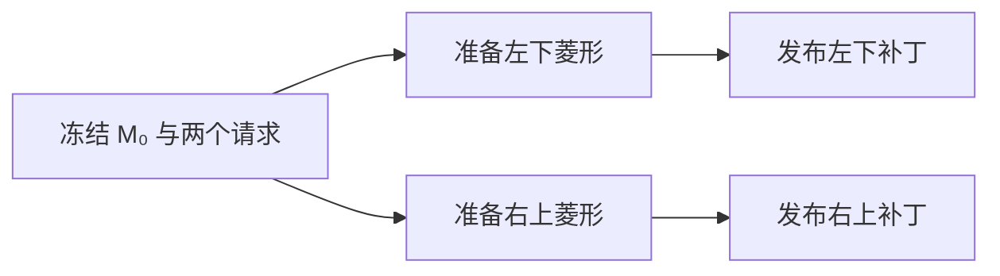
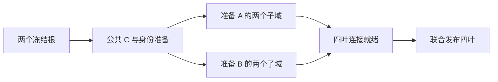
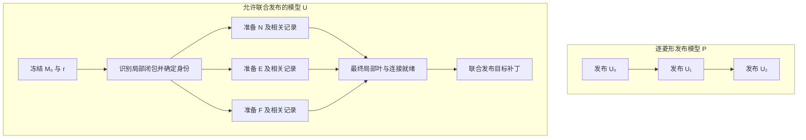

# ROAM 必要依赖审计：三个局部例子与一个历史反例

> 日期：2026-09-12；源码基线：`037c698`；[已确认小规划](../../plans/roam_parallelism/necessary_dependency_audit_plan.md)。
> 方法：源码和归档日志只读核对、有限几何构造及纸面反例；没有运行代码实验或 Lean。
> 结论：**当前证据只支持指定执行方式的依赖描述，尚不足以建立覆盖允许预计算与联合发布的执行集合的非平凡长链证书。** 按小规划停止扩大本轮审计，不进入分析器建设。

## 1. 一页模型与结论范围

| 项目 | 本轮固定内容 |
| --- | --- |
| 输入 | 合法规则二分网格 M₀、冻结高度采样与设置、已批准的一个根请求；独立区域例子有两个根。深度允许完成目标，局部三角形预算足够 |
| 几何规则 | 正方形的两个根；三角形 T=(a,b,c) 的底边为 ab，m=(a+b)/2，子域为 (c,a,m)、(b,c,m)。所有例子使用精确二进制分数坐标，与现有 `SplitTriangleDomain` 的规则对应 |
| 事件身份 | 根标签加左右路径；一次成功的单三角形二分为一个逻辑事件，菱形含两个事件。调用尝试、递归帧及重复访问不重复计作成功事件 |
| 必须保持的结果 | 相同逻辑细分事件、最终叶集合、几何与连接、活动三角形数量。内部已细分事件可由逻辑历史记录，不要求按原序先成为公开叶 |
| 可改变内容 | 递归顺序、槽位、私有暂存、预分配、准备计算与发布安排。允许从 M₀ 和已确定输入推导局部目标，再联合发布；发现目标和准备输出均计费 |
| 发布与资源 | 对外可见状态须为共形网格且 N≤B；私有半成品不提前消费。B 是活动三角形上限，私有存储另计内存，不能当成免费资源 |
| 不包含 | 完整严格 greedy 决策、合并/预算交换、部分失败和停止语义的等价；也不承诺保持原队列物理顺序或原逐条网格编辑日志 |
| 成本 | c 是三角形增量；w 是声明任务的工作成本。准备、目标发现、连接、发布和实际必需维护均不能移出总成本。c 不等于 w |

本页符号 e⇒f 表示“目标包含 e 时也必须包含 f”，e≺f 才表示“e 的完成是 f 开始的必要先决条件”。联合发布可能使两个事件在同一发布点生效；共同包含不能自动导出严格先后关系。

对固定任务和固定非负权重，可复用[方向记录中的条件上界](direction_note.md)：T_p≥max(W/p,D_cert)。每条证书边须对声明的执行集合都必要。变换若改变了计算任务或工作量，必须重新计算 W、映射任务；不能用旧 trace 的 W 与新执行的 D 拼成加速比。本轮没有取得自然输入的数值 W、D 或加速上界。

比较两种边界：本轮允许联合发布的模型记作 U；另以每次只执行一个合法菱形/边界二分并发布结果的模型 P 作条件对照。P 比 U 更严格，不能以 P 的低并行度代表 U，也不把 U 自动等同于当前 Classic/DOD 的完整行为。

## 2. 例一：两个独立区域

从两个根均匀细分到深度 4，得到 4×4 个小方格、32 个叶三角形；本例最大深度至少为 5，以允许进一步细分。取左下小方格 [0,1/4]² 与右上小方格 [3/4,1]²；每格中的两叶沿各自公共对角线组成菱形。两个区域不共享顶点或边，局部约束保持启用。

对每格批准一侧的细分请求，目标分别包含本格两个伙伴事件，共四个唯一事件。各菱形在内部对角线中心插点，外围四条边不改变，因此两项修改之间没有几何接口变化。对外部邻接的对应替换分别发生在不相邻区域；全局队列、分配与统计不据此自动成为可并发写资源。

图表示一个允许的工作安排，不是对所有实现证明的唯一 DAG。两补丁可以任意先后发布，也可以准备后联合发布；其逻辑结果相同。叶数为 32→34→36，或联合 32→36，预算取 B≥36。每次菱形二分覆盖原区域且不改变其外轮廓，共形性由两区域独立保持。

**审计结果：** 左下事件整体≺右上事件整体及反向关系均被合法反序否定。共享预算计数器或相同队列容器不能成为这条跨区域结构边的证明。该例未测线程调度、缓存或真实并行时间。

## 3. 例二：一个底边菱形

令 O=(0,0)、X=(1,0)、Y=(0,1)、Z=(1,1)，两根为 A=(Y,X,O)、B=(X,Y,Z)，公共中点 C=(1/2,1/2)。请求细分 A，预算 B_cap≥4，目标事件集为 {A,B}。

按现有递归执行可先完成对侧 B，再完成 A。但两侧子域均可从冻结根直接确定：

| 事件 | 左子域 | 右子域 |
| --- | --- | --- |
| A | A₀=(O,Y,C) | A₁=(X,O,C) |
| B | B₀=(Z,X,C) | B₁=(Y,Z,C) |

一个反序/并行准备安排是：确定公共 C 的规范身份和高度，在私有空间分别填写 A/B 两侧四个子域，以端点相同的公共边形成连接，再联合发布。C 两侧的高度和身份一致，不靠两次不一致的浮点计算拼接。根坐标及 C 均是精确二进制分数；高度使用相同冻结采样规则。

共同边分别为 OC、XC、YC、ZC，每条由其两侧完整匹配；旧外边不变。叶数 2→4，增加两个单三角形事件和一个公共顶点。

**审计结果：** A⇒B、B⇒A 是共形目标的共同包含；B 的整体完成≺A 的全部准备并不必要。准备 C 与建立连接仍有数据工作，图中的安排没有证明 C 必须采用单独任务，也没有证明统一的理想成本或加速。原始 ROAM 本就以菱形作为合法细分单位，联合两侧不构成新算法。

## 4. 例三：合法网格中的三层强制细分

### 4.1 从两个根构造 M₀

沿用 O、X、Y、Z、C，再令 W=(0,1/2)、S=(1/2,0)、D=(1/4,1/4)。下标 0/1 表示左右子路径，不是当前 C++ 池下标。

按以下合法顺序建立初态：细分根菱形 {A,B}，细分西侧边界三角形 A₀，细分南侧边界三角形 A₁，再细分互为底边的 {A₀₀,A₁₁}。叶数依次为 2→4→5→6→8。

| M₀ 的叶 | 顶点，前两项为底边 | 深度 |
| --- | --- | ---: |
| A₀₀₀ | (W,C,D) | 3 |
| A₀₀₁ | (O,W,D) | 3 |
| A₀₁ | (Y,C,W) | 2 |
| A₁₀ | (C,X,S) | 2 |
| A₁₁₀ | (S,O,D) | 3 |
| A₁₁₁ | (C,S,D) | 3 |
| B₀ | (Z,X,C) | 1 |
| B₁ | (Y,Z,C) | 1 |

这些叶由合法边界/菱形二分得到，不是手工拼接的依赖图。请求 r=A₀₀₀，最大深度至少为 4，活动预算至少为 13。

### 4.2 逐菱形执行时的前置发布链

r 的底边 WC 邻接较粗 A₀₁；A₀₁ 的底边 YC 邻接更粗 B₁；B₁ 的底边 YZ 在域边界。因而在模型 P 下，合法的操作组为：

| 操作组 | 唯一事件 | 新公共点 | 发布后的叶数 |
| --- | --- | --- | ---: |
| U₀ | B₁ | N=(Y+Z)/2=(1/2,1) | 9 |
| U₁ | B₁₀ 与 A₀₁ | E=(Y+C)/2=(1/4,3/4) | 11 |
| U₂ | A₀₁₁ 与 r | F=(W+C)/2=(1/4,1/2) | 13 |

U₀ 生成 B₁₀=(C,Y,N)，使其与 A₀₁ 配对；U₁ 生成 A₀₁₁=(C,W,E)，使其与 r 配对。这证明了在**每次只能发布一个当前叶菱形**的 P 中，U₀≺U₁≺U₂ 的发布顺序必要。它没有证明 U₁ 的全部准备必须等 U₀ 发布，更没有证明整个操作的 CPU 时间必须依此串行。

### 4.3 允许联合发布时的反例

在 U 中，先从 M₀ 识别上述局部依赖，得到五个事件 {B₁,B₁₀,A₀₁,A₀₁₁,r}。这一步不是免费 oracle：本例按三条已列出的底边关系作纸面识别；任意输入的发现成本及其关键路径仍未知，也未使用后续 greedy 结果。

N、E、F 分别由 M₀ 已有的 Y/Z、Y/C、W/C 直接计算；不必先在活动网格中创建 B₁₀ 或 A₀₁₁ 才知道这些坐标。三个点的身份及冻结高度可以先确定，以下八片最终叶全部可以在私有补丁中准备：

| 最终局部叶 | 顶点 |
| --- | --- |
| r₀、r₁ | (D,W,F)、(C,D,F) |
| A₀₁₀ | (W,Y,E) |
| A₀₁₁₀、A₀₁₁₁ | (E,C,F)、(W,E,F) |
| B₁₀₀、B₁₀₁ | (N,C,E)、(Y,N,E) |
| B₁₁ | (Z,C,N) |

保持另外五片旧叶不变，联合替换 M₀ 中的 r、A₀₁、B₁，得到 8−3+8=13 片叶。五个细分事件均记录一次；没有把中途生成后又细分的 B₁₀、A₀₁₁ 算成额外最终叶。

共形性可逐边核对：原内部边 YC 被 E 分成两段，WC 被 F 分成两段，两侧均采用相同分段；YZ 为域边界，可以插 N；替换区域其余外边不变。局部原区域面积为 1/16+1/8+1/4=7/16，最终四片深度 4 叶、三片深度 3 叶和一片深度 2 叶面积同为 4/32+3/16+1/8=7/16。结合每次二分的区域覆盖和上述共同边匹配，最终结果与 U₀、U₁、U₂ 顺次执行的叶及连接一致。

这个执行只发布一次局部目标，不需要公开 9 叶和 11 叶中间态，因而反驳 U 中必须存在三次严格前置发布的命题。它保留了准备完成先于相应结果可消费的基本要求，没有证明整个发现/准备阶段也不存在长链。

**成本不能遗漏：** 识别目标、路径和槽位安排、顶点高度、内部事件记录、连接构造、私有存储、替换发布及必要维护均需付费。仅移动发布位置不保证减少 W 或 D。此处给出的是一个有限的合法执行反例，没有提出新并行实现、一般复杂度或性能优势。

## 5. 边依据审计表

| 拟议关系 | 所需信息或来源 | 审计与可消除方式 | 分类 |
| --- | --- | --- | --- |
| 左下菱形整体≺右上菱形整体 | 例一两个区域 | 两种发布顺序均合法；相同容器不构成几何关联 | 实现选择，不进入证书 |
| B 整体完成≺A 全部准备 | 例二底边伙伴 | A 的子域可以从两个冻结根直接形成，双方联合发布 | 共同包含，不是该时间边 |
| U₀ 发布≺U₁ 发布 | B₁₀ 必须作为当前叶存在 | 在 P 下必要；U 联合生成局部目标，不暴露中间叶 | 指定发布粒度的条件约束 |
| U₁ 发布≺U₂ 发布 | A₀₁₁ 必须作为当前叶存在 | 同上；F 由 M₀ 的 W/C 直接确定 | 指定发布粒度的条件约束 |
| 父操作完成≺所有子域计算 | 父路径、几何坐标 | 本例可从 M₀ 展开明确表达式；一般表达式求值和身份发现的成本不能忽略 | 本例否定整体边；一般成本未知 |
| 所消费的最终信息就绪≺对外可消费 | 显式叶、顶点和连接内容 | 内容未就绪不得消费；融合操作时是其内部约束，不必表现为两个任务 | 必要但粒度相关的基本要求，未形成非平凡长链 |
| 全局预算的一次写≺下一次写 | 同一物理计数器 | 容量可先联合核算；串行写不是所有允许方式的必要顺序 | 资源约束与实现选择分开 |
| 保守根足迹重叠→整根串行 | GATE-01 的节点级 R/W | 不能区分字段、共同写结果、不同阶段；两菱形伙伴反例已显示误用风险 | 不能作为必要边证据 |
| 同一自然输入的较高优先级根≺较低根 | 严格队列及预算状态 | 历史反例证明某次提前提交不等价，未证明所有请求对的不可交换性 | 严格语义约束存在；具体边仍需证明 |

如果将每个菱形所有准备与发布合并成一个不可分任务，会得到 P 下的链；若再把该任务成本设为整段递归耗时，就重复包含了前置工作。上述两种做法都不能导出 U 的可信时间上界。缺少操作级数据来源和权重对应时，本轮不填数值 D_cert。

## 6. sampleIndex=14：只核对既有证据

固定身份为 `peking547-a-b20000 / splitTopology / sampleIndex=14 / selectionRank=3`。两份归档日志均给出 `source=4677929227313376363`、`priorEdits=10`；它们属于历史诊断，版本解释沿用[P4 分析](../../reviews/formal_experiment/prep_04_split_topology_equivalence_analysis.md)，没有作为当前程序重新运行。

| 内容 | 实际核对结果 | 解释边界 |
| --- | --- | --- |
| 预算与候选 | 剩余预算 10；19,857 个候选；内部 2，边界 19,855 | 安全分类结果不是必要依赖 DAG |
| 两个内部项 | rank=44 / path=`140737488378281` / 块 58；rank=353 / path=`10650` / 块 40 | 两项在不同安全块，不证明它们与完整严格收敛可交换 |
| 首五个排序项 | 全部为无安全块标识 `4294967295` | 不解释成五条必然串行的结构边 |
| 相同输入，不同结果 | 串行结果哈希 `1100364126311268133`，实际并行辅助为 `5598545571842840993` | 原策略的提前提交改变结果；不能据此量化关键路径 |
| 数量与网格 | 两者都是 20,000 叶，历史验证均为真；网格哈希分别为 `159806467330165317`、`9468994361173074292` | 同预算、各自合法不等于相同网格 |
| 诊断和线程对照 | 两种诊断配置下重复出现差异；单线程回退时结果相同 | 支持旧差异的实际执行来源，不是新性能证据 |

19,990 个初始活动三角形及最终叶集合差异来自已提交 P4 分析；两份日志本身没有完整初始叶集合，不能将其当成独立重建验证。

原始来源的本轮 SHA-256 核对：

- `benchmark-output/prep-04/topology-diagnosis-20260910.log`：`e7d4d5102362c50c9098b3a0bff981ea71fe7e0aa3e140e892479dfbdef67a93`。
- `benchmark-output/prep-04/topology-plan-diagnosis-20260910.log`：`8ff84bb0323f460209b0680a8b7087797d85cc68e4a96c6f30e826946d0b32a3`。

**事实：** 这个历史提前提交方案不满足严格结果等价。**解释：** 局部几何独立与有预算的 greedy 状态演化是不同约束。**未知：** 哪一条具体操作边不可消除、真实最长链、理论并行度、每个不安全分类的实际原因。现有日志不足以回答这些问题，不以两项数量或 rank 代替。

## 7. 来源、验证与阶段出口

源码依据为 [RoamGeometry.h](../../../src/algorithms/RoamGeometry.h)、[Classic 根与状态](../../../src/algorithms/classic_roam/ClassicRoamState.cpp)、[Classic 拓扑](../../../src/algorithms/classic_roam/ClassicRoamTopology.cpp)、[DOD 拓扑](../../../src/algorithms/data_oriented_roam/DataOrientedRoamTopology.cpp)及[观察事实](../../codebase/ordering_relaxation/topology_operation_observation.md)。本轮没有更改这些文件。

原始 ROAM §4.1–4.2 的[项目内原文转录](../../source_analysis/roaming_terrain_paper.md)已定义菱形细分和逐操作的强制细分。这里不把它重述为新颖性。旧[闭包论证](../roam_threshold/model_and_proofs.md)保留其原验证层级；[Kremlin](https://bsg.ai/kremlin/)作为已核对的程序并行分析先例，未开展新一轮泛检索，也没有据此证明本项目新颖性。

本轮按纸面规则逐项代入子域、核对事件与叶数、比较公共边及局部面积；这些是三个有限构造与反例，不是一般形式化证明。原日志只读并保留指纹，未执行自然轨迹、CTest、Lean 或性能实验。纯文档范围不需要运行时性能前后对照。

**阶段出口：审计完成，暂不建议建设面向 U 的上界分析器。** 本轮确立了 P 下的三层发布链，同时给出 U 中消除这三次发布先后要求的有限反例。尚未找到既跨越允许变换、又具有实际约束力的非平凡长链；也未证明不存在其他这种链。依照小规划停止扩大取证，现有观察能力继续保持，不增加逐字段插桩。

这不关闭并行特征分析方向。若以后限定到具体程序的数据流或固定发布粒度，可以报告相应模型下的 W/D 与维护开销，但要承认模型范围及已知方法先例；本轮不自动启动该工具。多阶段执行与优化继续依照既有主线，通过公平基线和完整成本实验成立，不必等待一项“ROAM 必然低并行度”的证明。
