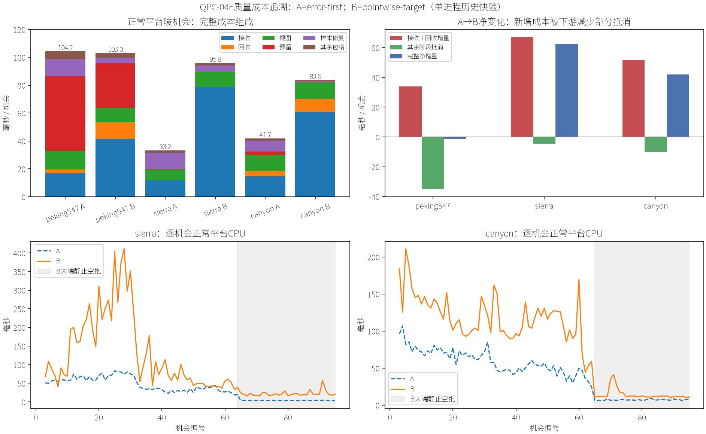

# QPC-04F 新质量政策性能问题分析

2026-09-17。根据用户“先提交，再调查开销来源”的授权完成。04G已独立提交为`736f9ed`；本报告是后续只读调查，不是性能修复或新政策准入。对应[调查小规划](../../plans/cpu_refinement/qpc_04f_quality_cost_audit_plan.md)、[04F原结果](../../research/cpu_refinement/qpc_04f_target_quality_results.md)、[04G有限可行性](../../research/cpu_refinement/qpc_04g_proposal_feasibility_results.md)。

## 1. 结论：直接证书成本与间接失败工作同时存在

**2.89×/2.00×退化是真实记录中的完整暖CPU差异，04G没有修复它。主要增量来自接收提案路径，而非预留、发布或网格输出。** 本轮进一步确认三点：

1. **不能简单解释成“检查了更多根”。** 暖机会中，Sierra实际前缀根检查只增加3.4%；Canyon完全相同。改变的是被检查的根、各根目录尝试、样本支持和失败后的持续状态；全域请求人口不等于实际前缀工作。
2. **新增逐点认证本身很重。** 它在旧Fit成功后重新构造两域支持、定位、插值、投影与损伤/进展证据。任务子计时确认它与旧认证都占显著费用，绝不是只增加几次阈值比较。
3. **新政策还通过失败链持续放大旧工作。** Canyon末帧新增逐点认证为零，仍尝试1,120个旧目录项；Sierra末帧1,107项中仅6项旧认证成功，又全部被新H条件拒绝。无事务不代表无成本。

因此准确的因果表述是：**新请求/接受政策改变了状态演化和停止位置；旧生成器仍解旧局部最大值问题，随后再叠新逐点筛选；没有取得可提交结果时，下一机会重新尝试。** 哪些费用可以等价消除、哪些属于质量义务，尚不能用一次A/B直接分成精确百分比。

## 2. 数据、版本及计时边界

复用04F三场景50k预算、`r=m=160`、8线程、D3D12、1280×720、固定旧点及原相机。A为`error-first + legacy`，B为`error-first + pointwise-target`。正常平台A/B计时来自原同一二进制`088dc07a…`，前三机会按原`warmup`标记排除。三条B轨迹24/96/96机会与诊断的几何哈希、面数、请求、接收、执行、配对、冲突和访问逐帧一致；A/B的配置公共字段与初始种子一致。

| 证据 | 用途 | 不允许的解释 |
|---|---|---|
| 正常平台`run/frames.csv` | 完整CPU、顺序阶段墙钟、工作与事件分层 | 不能与另一个进程的诊断计时相加 |
| B追溯`pointwise-work.csv` | 原生产账本中的任务子计时、拒绝和样本访问 | `task_wall_sum_*`不是完整帧时间，也不是所有线程CPU time |
| 同B追溯`frames.csv` | 验证诊断与正常路径做相同决策 | 不能用哈希相同证明所有潜在缓存条件已覆盖 |
| 生产源码及04G | 解释控制流与旧门槛限制 | 源码出现一次调用，不等于已测得其独立CPU占比 |

这是历史快速单进程数据再分析，没有新增正常运行、perf/Tracy采集或A/B分支消融。独立进程样本量没有增加，不能升级为统计显著性结果；质量政策及最终几何不同，也不是同质量性能比较。机器噪声不能解释成已剔除，但成十毫秒的阶段差异与逻辑工作证据足以定位当前调查方向。

所有24个源文件指纹、核对结果、逐帧归约和图在[数据目录](../../research/cpu_refinement/data/qpc_04f_quality_cost/README.md)。新脚本归约耗时0.166s；不改生产源，故不再为文档重跑前后平台矩阵。

## 3. 完整墙钟差异到底落在哪里

单位为正常平台暖机会平均ms。下面是顺序阶段的**净增量B−A**；未单列包络保留，不强行归因给某个函数。

| 项目 | Peking | Sierra | Canyon |
|---|---:|---:|---:|
| 完整CPU A→B | 104.241→103.046 | 33.161→95.838 | 41.708→83.595 |
| 完整耗时比 | 0.989× | **2.890×** | **2.004×** |
| 接收增量 | +24.447 | **+67.114** | **+46.061** |
| 回收增量 | +9.394 | 0.000 | +5.763 |
| 视图增量 | −2.999 | +2.888 | +0.361 |
| 预留增量 | −21.462 | −0.142 | −2.194 |
| 样本修复增量 | −8.203 | −7.352 | −7.175 |
| 其余阶段及未单列包络合计 | −2.371 | +0.169 | −0.928 |
| **净增量合计** | **−1.195** | **+62.677** | **+41.888** |

接收阶段占B完整CPU的40.4%/82.3%/72.7%。Sierra的接收增量大于完整净增量，是因为少执行事务节省了下游修复等费用；Canyon同理。Peking总均值近似不变，则掩盖了接收＋回收多花33.841ms的事实。

| 正常CPU分布，ms | A中位数 | B中位数 | A P95 | B P95 |
|---|---:|---:|---:|---:|
| Peking | 120.803 | 17.943 | 229.820 | 294.622 |
| Sierra | 31.074 | 56.357 | 76.891 | 310.243 |
| Canyon | 46.491 | 98.014 | 81.944 | 161.977 |

这里P95为单条暖序列的最近秩统计，不是跨进程尾延迟保证。Peking的中位数反转来自返回视图请求归零，不能据此忽略移动段：该段A/B完整均值151.499→165.061ms，而返回/恢复段27.446→2.272ms。



## 4. 工作人口：根数量与每根代价必须分开

以下均为暖机会累计；不是原04F全216机会的执行总数。

| 场景 | 实际检查根A→B | 认证成功接收A→B | 执行接收A→B | 配对检查A→B |
|---|---:|---:|---:|---:|
| Peking | 3,360→926 | 1,559→642 | 593→245 | 175,489→71,250 |
| Sierra | 14,391→14,880 | 1,873→655 | 1,192→385 | 0→0 |
| Canyon | 14,880→14,880 | 1,212→1,811 | 580→64 | 137,546→287,994 |

执行接收为`exchanges+free`，净零翻边另计。Canyon的成功接收增加却执行锐减，说明回收/配对可用性也改变了；不能把“找到更多receiver”当成工作更有效。

源码`TransactionalSamples::ReceiverKey`（229起）把B资格改为`maximum > E*²`；A资格来自复合priority与旧SplitPixels。`Prefix`仍只查询前缀。因此Canyon累计全域请求约4.79倍，并不意味着扫描根约4.79倍：每个暖机会两边都检查160根。Sierra根数增加约3.4%，远不足以单独说明接收时间约6.71倍。Peking甚至检查更少的根，接收费用仍约2.42倍。

不能用这里的阶段时间除根数来宣称同一根单价变化，因为A/B根身份、曲面、目录深度、局部样本支持和执行历史不同。明确缺少的是**同快照/同提案输入的交叉成本消融**。

## 5. 已有子计时给出的直接证据

单位秒，B暖机会累计，来自诊断进程。各行计时类别不同，**不得逐列相加当作总耗时**。

| 账本键及含义 | Peking | Sierra | Canyon |
|---|---:|---:|---:|
| `receiver_stage`：接收阶段墙钟 | 1.020 | 6.918 | 5.831 |
| `donor_stage`：回收阶段墙钟 | 0.277 | 0 | 0.916 |
| `task_wall_sum_proposal`：目录构造任务子计时之和 | 0.094 | 1.598 | 1.105 |
| `task_wall_sum_receiver_certification`：旧接收认证任务子计时之和 | 0.979 | 10.209 | 11.333 |
| `task_wall_sum_pointwise_quality`：新增逐点认证任务子计时之和 | **5.937** | **11.497** | **11.859** |
| `pointwise_batch`：发布前组合核对的串行墙钟 | 0.024 | 0.054 | 0.0047 |

计时来源：`Reservation.cpp:106–111`在旧`CertifyReceiver`返回后才调用新`Certify`，因此旧认证子计时**不含**新增逐点认证。新增计时来自`PointwiseQuality.cpp`的`QualityWork`析构；拒绝也计费，包含接收、回收及可能的R。`Execution.cpp:35`只加`task_wall_sum_`前缀并求和；不是系统CPU计时。翻边总计时内部可能再包含逐点认证，不能再加一次。回收旧构造/Measure没有对等的独立子计时，不凭相减补造。

Sierra无回收，所以约11.50s的新增证书和约10.21s的旧认证都落在接收相关任务内，已经否定“只多了轻量筛选”或“全部慢在新证书之一”的解释。发布前组合平均约0.58ms/暖机会，不是新增62.68ms完整成本的主因。

较贵的移动机会也有可对照事实：Sierra25正常接收374.289ms；另一个诊断进程同一离散结果的阶段墙钟320.071ms，旧认证任务和168.622ms、新逐点任务和458.162ms、目录构造22.387ms，当帧比较26,917个质量样本。数字只定位同一重工作事件，不能将这些跨进程/跨线程数相减。

执行器把根按连续区间分成最多8块，并非按样本量均衡。样本支持/拒绝出口不同可以造成块耗时差异；现有记录没有本轮逐块时序，故**调度不均是有源码依据的风险，尚非已量化主因**。不能把任务墙钟和除以8，直接当成新阶段时间或可节省时间。

## 6. 新证书为何比“逐点比较”重

调用链为：

```text
ReceiverCursor::Next
→ CertifyReceiver / Fit（旧最大值减0.01px约束）
→ Measure / Accepts
→ PointwiseQuality::Certify（仅旧认证成功者）
→ 核心域、公开float域各自恢复闭支持和证据
→ 新条件失败则继续当前根的下一目录项
```

### 6.1 已从源码确认的实际工作

| 环节/位置 | 实际工作及义务 | 归因边界 |
|---|---|---|
| `PointwiseQuality::Certify:170` | 分配证书，复制支持、Points/Faces/配置；每域构造新旧面、核查接口、收集并排序去重支持 | 没有单独的分配/复制/析构时间，不能说它们占多少 |
| `Certify:201–272` | 核心用闭面关联；float域用局部包围框再精确覆盖；旧/新两次`Cover`，随后`CheckSample` | 两种曲面及支持不能直接假定一致，这是04F真实质量义务 |
| `QualityEvaluation::Cover:118` | 每次重建Reference；逐面逐边判包含；边界歧义时调用`Reference<R>` | 不只是在已有owner里读取一个三角形；最坏有局部面数乘数 |
| `CheckSample:57` | 再重建Reference，校验可见性，旧/新插值，旧/新屏幕投影，再检查H与E | 已覆盖样本至少有旧Cover、新Cover、CheckSample三次Reference入口；没有复用前一步完整证据 |
| `QualityEvaluation::Screen:131` | 每次投影参考与被测高度 | 可见快速路径两次Screen加VisibilityAgrees，包含五次Clip调用；只表示代码工作，不是独立CPU比例 |
| `QualityWork`与精确分支 | 区间不确定后才增加`quality_exact_samples` | 这个计数不是整条路径所有有理运算的计数 |
| `ValidateBatch:275` | 已接受提案的证书绑定、共享样本索引和交集复核 | 有单独组计时，当前并非最大费用 |

旧`TransactionalProposalEvidence`在Fit内部缓存可见样本定位与权重，供Fit/Measure复用；其局部对象随Fit返回销毁。新证书没有消费这份证据，又要增加不可见闭支持及float域。**已有证据复用并未覆盖新路径。** 这不意味着可以把旧浮点权重直接当精确新证据：共享必须保留域、坐标、几何及舍入语义。

### 6.2 精确回退比例低估了精确工作范围

04F全轨迹`quality_exact_samples / quality_samples`为0.054%/6.44%/13.43%。本次同暖掩码为0.054%/6.97%/14.02%，分母改变，不能混用。下面的工作都不被该回退计数完整覆盖：

- `SameInterface`的精确面积、参数共线/插值关系；每个到达的域都会执行，而非只在质量阈值附近执行。
- `Cover`边界包含中的精确比较，以及`VisibilityAgrees`裁剪边界回退。
- **快速质量判定通过后，仍将区间端点构造成`cpp_rational`并调用`AddBounds`，再进行128位尺度的大整数除法/定向累加。** 这条路不增加`quality_exact_samples`。
- `Cover`为了求UV调用完整`Reference<R>`，其中还计算了该处不使用的源高度。这是可定位的重复计算候选，不是已经测得收益。

所以“只有6%回退，精确计算应该很便宜”没有依据。本轮能确认整个逐点认证组很贵，不能据现有计时为`Cover`、`Reference`、大整数或`nextafter`分别指定百分比；旧FPR函数占比也不能移植为新04F的函数占比。

### 6.3 旧生成政策与新接受政策并未统一

`Fit:193–265`仍求旧最大值降低0.01px的可行增量，再Measure/Accepts；新逐点损伤/超额进展在其后检查。04G已给出28个固定目录项的可行高度，满足新证书却不满足旧统一最大值门槛。反之，04F末端也有旧Fit成功却被新H拒绝的项。

这意味着当前路径同时支付旧求解和新筛选，却不能让旧求解主动找到新安全域。因新拒绝而继续后续目录，也是间接增加旧工作的一条机制。**但本轮缺少A逐项调用账本，不能把全部旧Fit增加定量归因于这一个机制。** 还有根集合、实际几何和支持变化。

回收路径`Proposals::Donor:224`仍先Measure得到旧最大值摘要；B配对在`Reservation:224`又明确跳过旧`Accepts(donor,target)`。随后新证书重新检查旧/新逐点误差。旧Measure同时具有投影合法性拒绝作用，不能直接删除；但“旧摘要的主要消费者已经绕过”的事实值得在未来替代路径中审计。

## 7. 静止空批：反复工作已得到直接反例

末帧95的数据如下。目录拒绝是普通接收尝试，两个场景当帧均无R尝试。

| 指标 | Sierra | Canyon |
|---|---:|---:|
| 全域请求 / 实查根 | 4,036 / 160 | 25,733 / 160 |
| 旧Fit失败 | 605 | 934 |
| 形状失败 | 496 | 186 |
| 旧认证成功后新H拒绝 | 6 | 0 |
| 原目录尝试合计 | **1,107** | **1,120** |
| 新逐点比较样本 | 224 | **0** |
| 最终事务 | 0 | 0 |
| 旧认证任务时间和，ms | 88.968 | 72.427 |
| 新逐点任务时间和，ms | 5.597 | **0** |
| 接收阶段墙钟（诊断），ms | 20.497 | 11.698 |

Sierra64–95为同视图、同输出、无事务后缀，32次累计完整CPU723.082ms；其中64仍执行一次视图切换，因此真正没有再次刷新视图的65–95累计684.253ms，平均22.073ms。旧政策相同机会平均3.597ms。

Canyon65–95为同视图、同输出、无事务后缀，31次累计完整CPU435.477ms，平均14.048ms；没有视图刷新，没有新增逐点比较，重复28,954次Fit失败与5,766次形状失败。旧政策相同机会平均7.062ms。

源码对应：`Pipeline::SetView:79`相同相机直接返回，`Apply:44`空批直接返回；但`Update:96`每次仍执行Plan，Plan内重新建立ReceiverCursor并遍历目录。结合冻结源、相同配置及这些空批，可解释末端重复计算。04G几何/视图重复指纹提供旁证，但不代替完整生产缓存键证明。

这些数不能全部视为“缓存即可节省”：第一次观察仍需决策；相机/目标/目录/局部或全局身份变化都可能失效；取消重复也不会使一个无解或旧门槛阻塞的根恢复。更关键的是，Sierra移动reveal段B/A均值206.135/65.876ms，Canyon131.590/73.633ms，**仅解决静止重复仍远远不够**。

## 8. 成本结构与已经排除的方向

设前缀根集合为R，每根实际尝试目录`A(r)`，局部闭样本s、包围框候选c、旧关联a、面数d。接收侧工作账本应写成：

\[
W_{recv}=\sum_{r\in R}\sum_{p\in A(r)}
\left(W_{construct}(p)+W_{old}(p)
+\mathbf1_{old\_pass}(p)W_{point}(p)\right)+W_R+W_{collect}.
\]

这里`W_old`含形状拒绝、旧Fit及其Measure/Accepts；不同失败出口成本不同。`W_point`还包括两域支持、接口与精确数值工作，保守结构界沿04F：

\[
W_{point}=O\!\left(d^2+(a+c)\log(2+a+c)+(s+c)d\right)+W_{numeric}.
\]

`W_numeric`同时含快速路径里的定向进展累加与真正歧义回退，不能只用`quality_exact_samples`代表。固定每根至多八项、局部拓扑有界，都不能令s、c或精确位复杂度变成常数。连续失败t次且不复用结果，还会重复支付同一类工作约t次。

实际墙钟还受最多8个连续根块、各块不同成本、调度和同步影响；上述W只描述工作结构，不是CPU毫秒预测。没有构造新的必要依赖DAG，也没有把当前顺序证明成算法关键路径。

本轮可以排除或降优先级的解释：

- **不是新增预留工作主导。** 三场景预留均下降；Canyon配对数量虽增加，很多无效donor直接拒绝，配对数量与费用不成固定比例。
- **不是更多成功提交。** B暖执行接收均下降；发布/样本/输出费用总体下降。
- **不是单纯全Q求值更多。** 两条慢场景暖`evaluations`均略降，视图净增量只有2.888/0.361ms；不解释完整62.677/41.888ms增量。
- **不是两自由度ClipPolygon坏界。** 本实验固定旧点，E/F/H的Free都只有新点；B走固定源高，R不做Fit，旧二维裁剪分支未被这一配置启用。
- **不是04G审计混入正常计时。** 本次性能记录早于04G，正常平台时间不含该离线求解。
- **不能归为新质量条件必然慢2～3倍。** A/B状态和工作不同，没有给出同任务成本下界；既存在真实双域义务，也存在明确重复表示与两套政策衔接成本。

## 9. 后续选择：先确定替代关系，不再盲目叠层

以下是供用户决策的方向，不是本轮已经实现或承诺的收益。

| 方向 | 应减少的工作 | 必须保持/验证的边界 |
|---|---|---|
| 在后续提案生成规划中替换旧Fit＋新筛选链 | 避免求一个与新准入不匹配的旧解；减少反复生成后拒绝 | 属于算法政策修订，非等价性能改写；生成器仍需双域认证，不能把04G离线求解器直接加入正常路径 |
| 独立的等价证据复用/数值成本小规划 | 新旧覆盖、参考/投影系数重复；旧Measure已不被消费的部分；快速累加中的不必要有理构造 | 精确支持、舍入、公开float对应、投影合法性必须保留；先做同提案的计时/结果消融，不绕过证书 |
| 完全相同输入的失败复用 | 同视图、同状态停滞时的上千次重复目录尝试 | 先证明输入/失效完整性；不能跨相机沿用旧失败、不能掩盖没有恢复能力；不承诺解决移动段 |

本轮判断：**结构上最需要处理的是旧生成器与新契约的衔接；直接认证内部的重复工作值得做有限等价消融。** 若只优化有理数叶函数，会留下Canyon“新证书零调用但仍慢”的失败链；若只缓存静止失败，又会留下移动段的重证书和迟滞质量。

一个有用的下一实验应冻结少量同快照/同提案，分别记录旧生成、双域支持/覆盖、质量比较、进展累加，再验证替代路径减少了实际工作。该实验不应直接切换全轨迹政策以获得无法归因的新总时间，也不能把关闭证书作为可发布性能结果。本轮不擅自启动。

## 10. 调查验收与剩余未知

### Critical

未发现阻止只读报告交付的未解决Critical。归约校验24个输入指纹、共同配置/种子、216个正常与诊断机会，阶段增量恒等式闭合。报告不把任务和当帧时间，不混合暖/全轨迹分母，不宣称持续质量或性能修复。

### Major

生产问题仍开放：Sierra/Canyon新政策完整成本分别2.89×/2.00×，恢复仍受限；默认保持legacy。缺少同快照A/B调用账本、认证内部函数独立计时及本轮逐块时序，因此不能声称“新证书导致总退化的X%”、缓存能省全部停滞费或新拟合器一定消除退化。

### Minor与实际检查

新归约只落在scripts与文档/数据，不改生产依赖；脚本约0.166s，不新增镜像实现单测或全CTest。已目视核对图中的单位、暖掩码、堆叠总数、净变化及末端区间。初次制图解释器没有matplotlib，改用已有`mesh_splatting`环境完成，未安装新依赖；所有命令从Ubuntu发起。原数据不覆盖，本次调查产物按2026-09-17用户授权独立提交。

**出口：成本来源完成第一轮有证据的拆解；性能问题未修复。** 后续是独立等价优化小规划，还是在新提案生成规划中合并修订，由用户决定，不自动开启QPC下一阶段。
