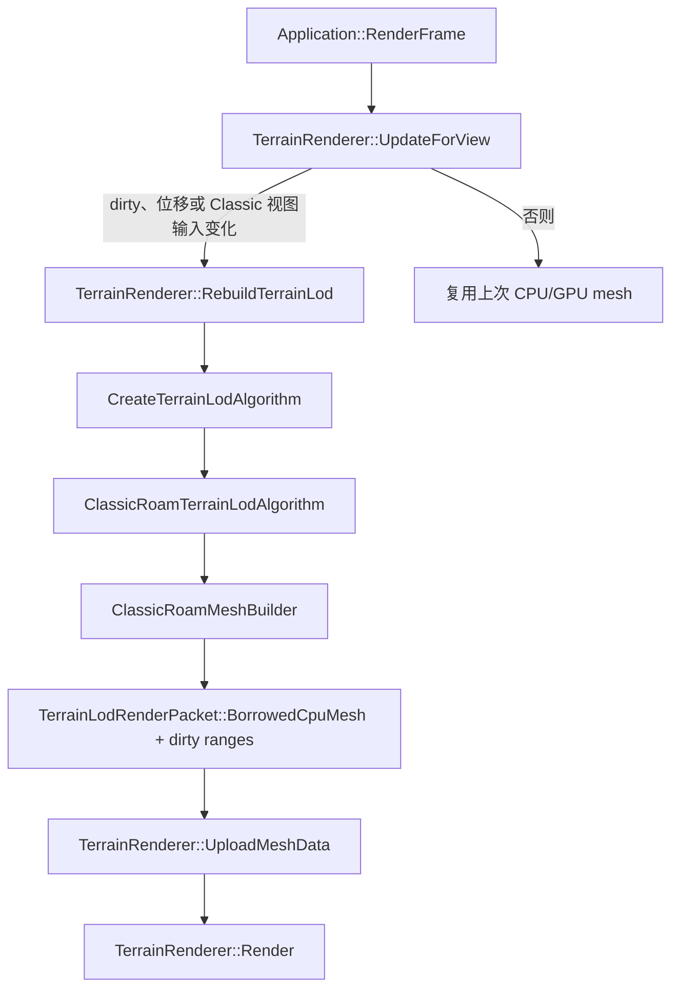
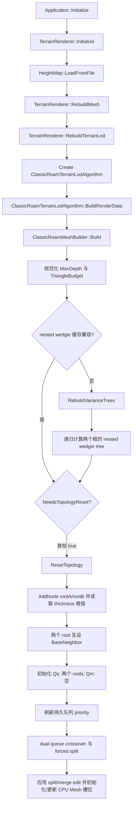
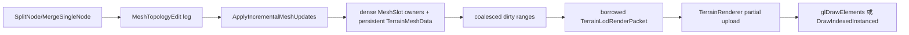

# Classic CPU ROAM 源码上下文

> 分析代码基线：2026-08-03 当前工作树，包含 nested wedgie 公式 (1)、保守屏幕投影公式 (2)/(3) 和持久双优先队列。本文以实际执行代码为准；历史文档只作为工程背景，不反向推定实现。行号可能随后续提交变化，因此证据同时保留符号名。
>
> 证据标签约定：
>
> - **源码事实：** 可以从当前代码直接确认。
> - **根据实现推断：** 由控制流、数据布局或公式推导出的结论，仍建议用运行或 profiler 验证。
> - **经典算法背景：** 用于帮助理解标准 ROAM，但不代表本项目已经实现。
> - **尚无法确认：** 静态代码或本次验证不足以作出结论。

## 1. 一页概览

**源码事实：** 当前 `Classic CPU ROAM` 是一个单线程、对象式、持久化二叉三角树（binary triangle tree，简称 bintree）实现。它通过 `ClassicRoamTerrainLodAlgorithm` 适配项目统一的 `ITerrainLodAlgorithm` 接口，实际拓扑由 `ClassicRoamMeshBuilder` 持有。初始化时为两个根预计算论文公式 (1) 的 nested wedgie thickness tree，并建立持久 `Q_s/Q_m`；普通 Build 刷新现有队列成员的相机相关 priority，在统一 crossover 循环中局部执行 merge、split 和 forced split，再把拓扑 edit 增量应用到持久 CPU indexed mesh，只重写受影响的 dense triangle slots。

证据：

- 文件：`src/algorithms/classic_roam/ClassicRoamTerrainLodAlgorithm.h`；符号：`ClassicRoamTerrainLodAlgorithm`；代码范围：第 11-30 行。
- 文件：`src/algorithms/classic_roam/ClassicRoamMeshBuilder.cpp`；符号：`ClassicRoamMeshBuilder::Build`；代码范围：第 21-128 行。
- 文件：`src/algorithms/classic_roam/ClassicRoamQueues.cpp`；符号：`OptimizeWithPersistentDualQueues`、indexed heap 与局部 membership 维护。

| 结论 | 当前实现 |
| --- | --- |
| 公共接口 | `ITerrainLodAlgorithm` |
| 统一输出模式 | `TerrainLodRenderMode::CpuMesh` |
| 拓扑 | 两个根三角形 + 裸指针 parent/child/neighbor bintree |
| 跨帧状态 | 持久化节点、活动 split 状态、`Q_s/Q_m` membership、`PathId` 迟滞历史 |
| 误差 | 两棵 nested wedgie tree 按公式 (1) 累积 base-midpoint displacement；构建时换算为像素误差 |
| 细分 | 持久 `Q_s` 保存全部 active leaves；forced split 预留预算 token |
| 合并 | 持久 `Q_m` 保存 canonical mergeable diamonds；与 `Q_s` 在同一循环 crossover |
| 裂缝约束 | 默认启用局部 `baseNeighbor` 传播；validator 只检查、不修复 |
| Mesh | 每个活动叶占一个稳定 dense slot，每槽 3 个独立顶点和 3 个索引；split/merge 只重写受影响槽位，无顶点共享/去重 |
| 并行 | Classic 核心没有并行 pass，统一统计固定报告 `CpuWorkerCount = 1` |
| GPU 工作 | 无；CPU Mesh 之后由 OpenGL 或 D3D12 renderer 上传和绘制 |
| 视锥感知 | 6 个 inward plane 与 thickness 扩张世界 AABB 相交；视锥外 score 为 0 |
| 三角形预算 | 默认 20,000 个活动 leaf；预算变化重置拓扑并重新分配 |
| 论文 nested wedgie | 两个二叉堆数组预计算到 `max(MaxDepth, sourceDepth)`；最细层为 0，父值为 `max(left,right)+abs(base midpoint displacement)` |

**源码事实：** “程序每帧调用更新入口”不等于“Classic 每帧重建”。普通交互中，`TerrainRenderer::UpdateForView` 在 mesh dirty、相机移动至少 `max(0.30, TerrainSize * 0.01)`、Classic 原地转向、投影/FOV 变化或 drawable 尺寸变化时调用 `RebuildTerrainLod`。运行时 benchmark 每帧主动 `RequestMeshRebuild()`，因此会绕过该缓存。

证据：

- 文件：`src/render/TerrainRenderer.cpp`；符号：`ClassicViewInputsChanged`、`TerrainRenderer::UpdateForView`；代码范围：第 135-166、290-319 行。
- 文件：`src/render/D3D12TerrainRenderer.cpp`；符号：`ClassicViewInputsChanged`、`TerrainRenderer::UpdateForView`；代码范围：第 123-153、692-718 行。
- 文件：`src/app/Application.cpp`；符号：`Application::PrepareRuntimeBenchmarkFrame`；代码范围：第 759-784 行。

**源码事实：** 核心实现实际分布在九个 Classic 文件中，而不是全部位于一个类实现文件：adapter、主 build、状态、评分、拓扑、mesh emit、validator 分开编译。直接相关的公共接口、HeightMap、Mesh、renderer、UI 和 benchmark 位于目录外。

## 2. 模块在项目中的位置

### 2.1 所有权与接口边界

**源码事实：** `ClassicRoamTerrainLodAlgorithm final : public ITerrainLodAlgorithm` 实现 `Info`、`Capabilities`、`BuildRenderData`、`Stats`、`Reset`。它按值持有 `_builder` 和统一 `_stats`；`TerrainRenderer` 通过 `std::unique_ptr<ITerrainLodAlgorithm>` 持有所选算法；`Application` 按值持有 `TerrainRenderer`。

证据：

- 文件：`src/algorithms/ITerrainLodAlgorithm.h`；符号：`ITerrainLodAlgorithm`；代码范围：第 336-354 行。
- 文件：`src/algorithms/classic_roam/ClassicRoamTerrainLodAlgorithm.h`；符号：`ClassicRoamTerrainLodAlgorithm`；代码范围：第 11-30 行。
- 文件：`src/render/TerrainRenderer.h`；符号：`TerrainRenderer::_terrainLodAlgorithm`；代码范围：第 216-225 行。
- 文件：`src/app/Application.h`；符号：`Application::_terrainRenderer`；代码范围：第 190-199 行。



调用链入口证据：

| 方法 | 文件与范围 | 责任 |
| --- | --- | --- |
| `Application::RenderFrame` | `src/app/Application.cpp` 第 364-531 行 | 每个应用帧建立相机/投影上下文，调用更新、统计和绘制 |
| `TerrainRenderer::UpdateForView` | OpenGL：`src/render/TerrainRenderer.cpp` 第 253-283 行；D3D12：`src/render/D3D12TerrainRenderer.cpp` 第 656-680 行 | 决定是否真正重建 LOD |
| `TerrainRenderer::RebuildTerrainLod` | OpenGL：第 525-640 行；D3D12：第 951-1116 行 | 创建算法、组装统一输入、调用算法、消费 render packet |
| `ClassicRoamTerrainLodAlgorithm::BuildRenderData` | `src/algorithms/classic_roam/ClassicRoamTerrainLodAlgorithm.cpp` 第 30-67 行 | 校验输入、映射设置、调用 builder、包装 CPU Mesh 和统计 |
| `ClassicRoamMeshBuilder::Build` | `src/algorithms/classic_roam/ClassicRoamMeshBuilder.cpp` 第 17-97 行 | Classic 单次完整更新入口 |

### 2.2 创建、持有和调用

**源码事实：** OpenGL 与 D3D12 renderer 各自有一个编译期互斥的工厂函数。选择 `TerrainLodAlgorithmId::ClassicCpuRoam` 时，两者都构造同一个、不依赖图形 API 的 `ClassicRoamTerrainLodAlgorithm`。OpenGL 工厂位于 `TerrainRenderer.cpp` 第 144-163 行；D3D12 工厂位于 `D3D12TerrainRenderer.cpp` 第 130-152 行。

**源码事实：** 默认面板状态选择 `UseTerrainLod = true` 和 `ClassicCpuRoam`，因此常规启动会走 Classic。OpenGL 初始化在加载 HeightMap 和 shader 后立即 `RebuildMesh`；D3D12 对 CPU 算法也在初始化期间立即重建。GPU 原生资源算法才推迟到已打开的帧。

证据：

- 文件：`src/gui/ImGuiLayer.h`；符号：`TerrainPanelState`；代码范围：第 153-177 行。
- 文件：`src/render/TerrainRenderer.cpp`；符号：`TerrainRenderer::Initialize`；代码范围：第 173-218 行。
- 文件：`src/render/D3D12TerrainRenderer.cpp`；符号：`TerrainRenderer::Initialize`；代码范围：第 565-615 行。

### 2.3 最终向渲染层提供什么

**源码事实：** Classic 直接维护 `Terrain::TerrainMeshData`。adapter 不再复制或移动整张 Mesh，而是通过 `TerrainLodRenderPacket::BorrowedCpuMesh` 借用 builder 的持久数据，声明生命周期到下一次 Build/Reset，并附带 `CpuMeshGeneration`、`CpuMeshRequiresFullUpload` 和合并后的 `CpuMeshUpdateRanges`。它不返回 GPU buffer ID、原生 D3D12 资源或 indirect args。

证据：

- 文件：`src/algorithms/classic_roam/ClassicRoamTerrainLodAlgorithm.cpp`；符号：`BuildRenderData`；代码范围：第 51-66 行。
- 文件：`src/algorithms/ITerrainLodAlgorithm.h`；符号：`TerrainLodRenderPacket`；代码范围：第 153-190 行。

## 3. 相关文件与类型

### 3.1 Classic 目录

| 文件 | 关键类型/函数 | 实际责任 |
| --- | --- | --- |
| `ClassicRoamTerrainLodAlgorithm.h`、`ClassicRoamTerrainLodAlgorithm.cpp` | `ClassicRoamTerrainLodAlgorithm` | 统一接口 adapter、能力声明、设置/统计映射、Reset |
| `ClassicRoamMeshBuilder.h` | `TriangleDomain`、`ClassicRoamSettings`、`ClassicRoamStats`、`ClassicRoamNode`、`ClassicRoamMeshBuilder` | 全部 Classic 私有类型和状态声明 |
| `ClassicRoamMeshBuilder.cpp` | `Build` | 单次更新的 pass 调度和计时 |
| `ClassicRoamState.cpp` | `AddNode`、`ResetTopology`、leaf/path/stats 收集 | 持久状态、根节点、活动集合 |
| `ClassicRoamScoring.cpp` | split 判断、base midpoint displacement、相机分数、世界坐标、法线 | LOD 评分与顶点派生属性 |
| `ClassicRoamTopology.cpp` | split/merge 队列、forced split、邻接重连 | 活动拓扑维护 |
| `ClassicRoamMeshEmit.cpp` | `ApplyIncrementalMeshUpdates`、`ReplaceMeshLeafWithChildren`、`ReplaceMeshChildrenWithLeaf`、`WriteMeshLeaf` | 持久 Mesh 槽位、拓扑 edit replay 和 dirty range 生成 |
| `ClassicRoamValidation.cpp` | `ValidateTopology` | 可选 T-junction、邻接和 parent/child 检查 |

### 3.2 目录外直接依赖

| 文件 | 关键类型/函数 | 与 Classic 的关系 |
| --- | --- | --- |
| `src/algorithms/ITerrainLodAlgorithm.h` | 统一输入、输出、统计、接口 | Classic 的公共工程边界 |
| `src/algorithms/TerrainLodView.cpp` | `BuildTerrainLodViewInput` | renderer 构造 View、Projection、六个 inward frustum planes 和 drawable 尺寸；Classic 全部消费 |
| `src/terrain/HeightMap.h`、`src/terrain/HeightMap.cpp` | `LoadFromFile`、`SamplePixel`、`SampleBilinear` | 保存归一化高度并提供双线性采样 |
| `src/terrain/TerrainMeshBuilder.h` | `TerrainMeshVertex`、`TerrainMeshData` | Classic CPU Mesh 输出契约 |
| `src/render/TerrainRenderer.h`、`src/render/TerrainRenderer.cpp` | OpenGL renderer | 创建、持有、调用 Classic，上传并绘制 CPU Mesh |
| `src/render/D3D12TerrainRenderer.cpp` | D3D12 renderer | 同上，上传到逐帧 D3D12 资源并直接 indexed draw |
| `src/gui/ImGuiLayer.h`、`src/gui/ImGuiLayer.cpp` | `TerrainPanelState`、ROAM 控件/统计 | 运行时参数入口和观测面板 |
| `src/benchmark/TerrainLodBenchmark.cpp` | 无窗口 smoke/budget-reentry/standard benchmark | 直接经统一接口逐相机关键帧调用 Classic |
| `src/app/RuntimeBenchmark.*`、`Application.cpp` | 有窗口运行时 benchmark | 强制逐帧重建并输出 Markdown/CSV |
| `docs/parallel-roam/04-milestones.md` | 阶段 2 记录 | 有用的开发背景，但部分旧条目与当前代码冲突 |
| `docs/parallel-roam/11-bug-fix-log.md` | BUG-004..010 等 | 说明 PathId、绕序、评分、持久拓扑入口等历史问题 |

**源码事实：** `tests/CMakeLists.txt` 注册了共享 `roam_nested_wedgie` 属性测试，覆盖公式递推、最细层为 0、分辨率深度解析，并用一个小型几何 bintree 穷举每个 ancestor 对最细后代顶点的高度误差界；还注册 Classic/DOD 的 budget-reentry 回归。完整 Classic 拓扑正确性仍主要由 `TerrainLodBenchmark` smoke profile 验证。

证据：文件：`tests/CMakeLists.txt`；符号：`roam_nested_wedgie`、`roam_budget_reentry_classic`。文件：`tests/RoamNestedWedgieTests.cpp`；符号：`CheckNestedBounds`、`main`。文件：`src/benchmark/TerrainLodBenchmark.cpp`；符号：`MakeScenario`、`ValidateFrame`。

## 4. 初始化流程

### 4.1 应用到算法的首次初始化



证据：

- 文件：`src/app/Application.cpp`；符号：`Application::Initialize`；代码范围：第 140-237 行。
- 文件：`src/terrain/HeightMap.cpp`；符号：`HeightMap::LoadFromFile`；代码范围：第 32-66 行。
- 文件：`src/algorithms/classic_roam/ClassicRoamMeshBuilder.cpp`；符号：`ClassicRoamMeshBuilder::Build`；代码范围：第 21-128 行。
- 文件：`src/algorithms/RoamNestedWedgie.h`；符号：`ResolveNestedWedgieTreeDepth`、`BuildNestedWedgieTree`、`BuildNestedWedgieSubtree`。
- 文件：`src/algorithms/classic_roam/ClassicRoamScoring.cpp`；符号：`ComputeBaseMidpointDisplacement`、`RebuildVarianceTrees`。
- 文件：`src/algorithms/classic_roam/ClassicRoamState.cpp`；符号：`AddNode`、`ResetTopology`；代码范围：第 20-78 行。

### 4.2 根三角形

**源码事实：** 两个根三角形覆盖 `[0,1] x [0,1]` UV 正方形，共享从 `(0,1)` 到 `(1,0)` 的对角线，并互为 `BaseNeighbor`：

```text
rootA = A(0,1), B(1,0), C(0,0)
rootB = A(1,0), B(0,1), C(1,1)

(0,1) o-----------o (1,1)
      | \ rootB   |
      |   \       |
      |     \     |
      | rootA \   |
(0,0) o-----------o (1,0)
```

证据：文件：`src/algorithms/classic_roam/ClassicRoamState.cpp`；符号：`ResetTopology`；代码范围：第 45-70 行。

### 4.3 HeightMap 和误差缓存

**源码事实：** `HeightMap::LoadFromFile` 通过 stb 16-bit 灰度接口读取，归一化为 `[0,1]` float 数组。`SampleBilinear(u,v)` 把 UV clamp 到 `[0,1]`，映射到 `(width-1,height-1)` 像素坐标并双线性插值。

证据：文件：`src/terrain/HeightMap.cpp`；符号：`LoadFromFile`、`SampleBilinear`；代码范围：第 32-66、83-113 行。

**源码事实：** `ResolveNestedWedgieTreeDepth` 令预计算最细深度为 `max(runtime MaxDepth, 2*ceil(log2(max(width-1,height-1))))`，再限制到 20；129x129 与 513x513 高度图分别得到深度 14 与 18。`RebuildVarianceTrees` 为两个根各构造一棵二叉堆数组：最细层写 0，其他层执行 `max(leftThickness,rightThickness)+abs(baseMidpointDisplacement)`。`AddNode` 只按 `VarianceTreeIndex/VarianceIndex` 读取预计算结果，不在热路径重新求 thickness。

证据：文件：`src/algorithms/RoamNestedWedgie.h`；符号：`ResolveNestedWedgieTreeDepth`、`BuildNestedWedgieSubtree`。文件：`src/algorithms/classic_roam/ClassicRoamScoring.cpp`；符号：`ComputeBaseMidpointDisplacement`、`RebuildVarianceTrees`。文件：`ClassicRoamState.cpp`；符号：`AddNode`。

### 4.4 什么只做一次，什么按构建重做

| 数据/工作 | 首次或输入变化 | 每次 Classic `Build` | 每个应用帧 |
| --- | --- | --- | --- |
| HeightMap 文件解码 | 加载/切图时 | 否 | 否 |
| 两棵 nested wedgie tree | HeightMap 对象或解析出的预计算深度变化 | 条件执行；预计算树扩深会刷新已有节点 error | 否 |
| 两个根节点 | 首次或 topology reset | 条件执行 | 否 |
| 节点 `GeometricError` | 建节点时从 nested tree 读取 | tree 重建时可刷新 | 否 |
| 节点对象和 child 指针 | 首次走到该深度 | 跨 Build 复用 | 否 |
| 相机相关 score/视锥测试 | 否 | 刷新 `Q_s/Q_m` 全部现有成员 | 只有触发 Build 才算 |
| merge/split 活动状态 | 初始化粗拓扑 | 更新 | 只有触发 Build 才更新 |
| 活动叶 dense view | topology reset 时由两个 root 初始化 | split/merge 同步维护 `_meshSlotOwners` | 否 |
| CPU Mesh | topology reset 时全量初始化 | 只重写 dirty slots；无变化时完整复用 | 未触发 Build 时复用 |
| GPU 上传 | 首次/容量增长时全量 | OpenGL 上传 dirty ranges；D3D12 为每个 frame slot 延迟消费累计 ranges | 否 |

### 4.5 topology reset 与 nested tree 重建条件

**源码事实：** `NeedsTopologyReset` 在没有根/节点、`HeightMap` 对象地址改变、新 `MaxDepth` 小于历史深度、预算改变、`terrainSize` 或 `heightScale` 改变时返回 true。预算降低因此会立即从根重新分配，不会遗留超过新上限的活动 leaf。单纯提高最大深度不清空拓扑；只有它使 nested wedgie 预计算深度继续扩展时才重建树，并用 `RefreshNodeVarianceErrors` 刷新已有节点。

证据：文件：`src/algorithms/classic_roam/ClassicRoamState.cpp`；符号：`NeedsTopologyReset`；代码范围：第 80-113 行。文件：`ClassicRoamMeshBuilder.cpp`；符号：`Build`；代码范围：第 21-75 行。

## 5. 一帧更新流程

这里把“应用帧”和“真正执行 Classic 构建的帧”分开。

### 5.1 应用帧入口

**源码事实：** `Application::RenderFrame` 每帧先建立包含视图/投影的 `RenderContext`，再调用 `TerrainRenderer::UpdateForView`。Classic 除位置阈值外还会在原地转向、投影矩阵或 drawable 尺寸变化时重建；否则复用上次 Mesh。最后 `TerrainRenderer::Render` 提交绘制。

证据：文件：`src/app/Application.cpp`；符号：`Application::RenderFrame`；代码范围：第 364-531 行。文件：`src/render/TerrainRenderer.cpp`、`src/render/D3D12TerrainRenderer.cpp`；符号：`ClassicViewInputsChanged`、`UpdateForView`；代码范围：第 135-166、253-283 行及第 123-153、656-680 行。

### 5.2 一次 Classic 更新的实际顺序

```text
BuildRenderData(input)
清空 adapter stats 和输出 packet；校验 HeightMap
把统一 settings 映射为 ClassicRoamSettings
ClassicRoamMeshBuilder::Build(heightMap, scales, fullView, settings)
    ++buildSequence
    clamp MaxDepth 到 [0,20]；TriangleBudget 至少为 2
    判断 topology reset 与 nested tree rebuild
    写入 View/Projection/FrustumPlanes/DrawableHeight
    必要时 RebuildVarianceTrees(finestDepth)
    必要时 ResetTopology()，否则刷新已有节点的 thickness
    OptimizeWithPersistentDualQueues()
        刷新 Q_s/Q_m 全部现有成员的 priority 并 heapify
        remainingBudget = budget - Q_s.size()
        min(Q_m) < MergeThreshold 时回收低误差 diamond
        max(Q_s) > SplitThreshold 且有 token 时提交 forced-split closure
        预算不足且 max(Q_s) > min(Q_m) 时先 merge 再重试 split
        split/merge 只局部更新两个 indexed heaps
    ApplyIncrementalMeshUpdates()
        清除上次 Rebuilt 调试属性
        按提交顺序 replay split/merge mesh edits
    FinalizeIncrementalMeshUpdate()
        合并 dirty slots 为 update ranges
    可选 ValidateTopology()，同时交叉检查 leaf 与 mesh slot owners
    AccumulateLeafStats(meshData, meshSlotOwners)
    CollectActiveSplitPaths()
    previousSplitPaths = currentSplitPaths
    return meshData
映射 TerrainLodStats；借用持久 CpuMesh 并发布 update ranges/generation
```

证据：文件：`src/algorithms/classic_roam/ClassicRoamTerrainLodAlgorithm.cpp`；符号：`BuildRenderData`；代码范围：第 30-68 行。文件：`ClassicRoamMeshBuilder.cpp`；符号：`Build`；代码范围：第 21-128 行。

### 5.3 各阶段的数据条件

1. **输入与缓存。** 已有持久树、上一 Build 的 split path、新 `HeightMap/settings/view`。先判断缓存兼容性，再覆盖成员；nested wedgie tree 必须在 root/child 读取 `GeometricError` 前可用。
2. **Priority refresh。** `Q_s` 已保存全部 active leaves，`Q_m` 已保存全部 canonical mergeable diamonds；本阶段只更新它们的 view-dependent score 并原地 heapify，不再递归发现 membership。
3. **统一 dual-queue 优化。** `min(Q_m)` 低于 merge threshold 时先回收；`max(Q_s)` 高于 split threshold 时尝试 forced-split closure。预算满载或 closure token 不足时，只有 `max(Q_s) > min(Q_m)` 才先 merge 低损失 diamond，再在下一轮重试高收益 split。
4. **局部队列维护。** 每次 split 删除 parent `Q_s` 项并加入 children；merge 执行反向操作。拓扑变更前失效局部 `Q_m` association，完成后只重新检查 node/parent/children/邻接邻域。
5. **增量 Mesh emit。** split 把 parent slot 改写为 left child，并为 right child 追加一槽；merge 用一个 child slot 写 parent，删除另一槽，必要时把末槽搬入空洞。只有这些槽及上一 Build 的调试高亮过渡槽会重采样顶点。
6. **可选验证。** 用量化共线边检查 T-junction，再验证 active neighbor、共享边和 parent/child/root 不变量；同时要求每个 active leaf 恰好拥有一个合法 `MeshSlot`，slot owner 与 index 范围一致。validator 只报告，不修复。
7. **统计/迟滞提交。** 统计节点池、leaf 分类、预算拒绝和各阶段时间；最终仍 split 的 `PathId` 成为下一 Build 的迟滞历史。

证据：Merge/Split：`src/algorithms/classic_roam/ClassicRoamTopology.cpp` 第 53-235、237-531 行；评分：`ClassicRoamScoring.cpp` 第 214-273 行；emit/stats：`ClassicRoamMeshEmit.cpp` 第 7-68 行、`ClassicRoamState.cpp` 第 115-194 行。

### 5.4 核心函数调用表

“热路径”指每次真正发生 Classic 构建，而不是所有应用帧。

| 函数 | 调用者 / 被调用者 | 输入与输出 | 修改状态 | 递归 | 热路径 |
| --- | --- | --- | --- | --- | --- |
| `BuildRenderData` | renderer / `Build`、stats 映射 | `TerrainLodBuildInput` -> packet/bool | adapter `_stats` | 否 | 是 |
| `Build` | adapter / nested tree、reset、merge、split、emit | HeightMap/尺度/完整 view/settings -> Mesh | builder 本帧状态 | 否 | 是 |
| `RebuildVarianceTrees` | `Build` / `Roam::BuildNestedWedgieTree` | 两 root domain + finest depth -> 两个 float 数组 | thickness 缓存 | 共享子函数递归 | 条件 |
| `Roam::BuildNestedWedgieSubtree` | `BuildNestedWedgieTree` / 自身 | domain/depth/index -> nested thickness | tree entry | 是 | 仅重建 |
| `NeedsTopologyReset` | `Build` | 新旧输入 -> bool | 无 | 否 | 是 |
| `ResetTopology` / `AddNode` | `Build`、split | domain/thickness index -> pointer | node pool/root/初始 `Q_s` | 否 | 条件/新节点 |
| `OptimizeWithPersistentDualQueues` | `Build` / score、split、merge | 持久 `Q_s/Q_m`、预算 | 拓扑、预算、stats | 否 | 是 |
| `RefreshPersistentQueuePriorities` | optimizer / score、heapify | 现有 queue members | 两个 heap keys | 否 | 是 |
| `SplitNode` | dual queue/自身 | leaf/reason/reserved slots -> bool | child、邻接、预算、局部 queues | forced split 递归 | 是 |
| `CanMergeNode` / `MergeNodeOrDiamond` | dual queue | internal node -> bool | 一侧或 diamond 状态、局部 queues | 否 | 是 |
| `ComputeBaseMidpointDisplacement` | nested wedgie build | domain -> normalized signed displacement | 无 | 否 | 仅误差树构建 |
| `ComputeScreenErrorScore` / `IsNodeVisible` | merge/split | node/view/frustum -> pixels | 无 | 否 | 是且重复 |
| `CollectLeafNodesFrom` | validator | node -> vector append | 验证快照 | 是 | 仅验证开启时 |
| `ValidateTopology` | `Build` | 当前活动树 | validation stats | leaf 收集递归 | 可选 |
| `ApplyIncrementalMeshUpdates` | `Build` / slot replace、write | topology edit log -> persistent mesh | mesh/slot owners/dirty slots | 否 | 是 |
| `WriteMeshLeaf` | incremental emit | leaf + slot -> 3 vertices/indices | 固定 mesh 区间 | 否 | 仅 dirty slot |

**源码事实：** 旧 `RefineNode`、`RefineWithSplitQueue` 和 `MergeWithDiamondQueue` 已移除；所有 topology 调度统一从 `OptimizeWithPersistentDualQueues` 进入。

## 6. 核心数据结构

### 6.1 `TriangleDomain`

**源码事实：** 只保存三个 `glm::vec2`：`A/B/C`，位于 HeightMap UV 空间。`A-B` 是 base edge，`B-C` 是 right edge，`C-A` 是 left edge；`SplitTriangleDomain` 是 nested thickness 预计算和真实 split 共用的唯一几何派生规则。

证据：文件：`src/algorithms/classic_roam/ClassicRoamMeshBuilder.h`；符号：`TriangleDomain`、`SplitTriangleDomain`；代码范围：第 22-38 行。文件：`ClassicRoamScoring.cpp`；符号：`SplitTriangleDomain`；代码范围：第 15-23 行。

### 6.2 `ClassicRoamNode`

| 字段 | 语义 | 生命周期/修改者 |
| --- | --- | --- |
| `Domain` | 当前三角形的 UV 顶点 | `AddNode` 写一次 |
| `Parent` | 所属 bintree 父节点，root 为 null | `AddNode` 写一次 |
| `LeftChild/RightChild` | 惰性创建的两个孩子；merge 后仍保留 | `SplitNode` 首次 split 写入 |
| `BaseNeighbor/LeftNeighbor/RightNeighbor` | 跨 base/left/right edge 的活动拓扑邻居 | reset、split、merge 重连 |
| `GeometricError` | 对应节点的归一化 nested wedgie thickness | 建节点读取；误差树重建可刷新 |
| `VarianceTreeIndex` | 选择 rootA/rootB 的 thickness 数组；名称保留旧术语 | `AddNode` 写一次 |
| `VarianceIndex` | 二叉堆索引：左 `2i+1`，右 `2i+2` | `AddNode` 写一次 |
| `PathId` | 二叉路径稳定键，用于跨 Build 迟滞 | `AddNode` 写一次 |
| 四个 Build ID | 创建、激活、split、merge 的时间戳；`SplitBuildId/MergeBuildId` 还阻止同一 Build 立即反向执行刚提交的事务 | 相应拓扑操作更新；dual-queue eligibility 读取 |
| `SplitBlockedBuildId` | closure 本帧无法提交时临时把该 leaf 沉到 `Q_s` 底部 | dual-queue optimizer |
| `Depth` | root 为 0，child 为 parent+1 | `AddNode` 写一次 |
| `ActivatedByForcedSplit` | 本次激活是否由 forced split | split/merge |
| `Active` | 区分当前 triangulation 与对象池中等待复用的历史节点 | reset/split/merge |
| `IsSplit` | 活动 leaf/internal 的唯一判据 | split=true，merge=false |
| `SplitQueueIndex` | 当前 leaf 在持久 `Q_s` indexed heap 中的位置 | split/merge/heap swap |
| `MergeQueueIndex` | canonical parent 在持久 `Q_m` 中的位置 | 局部 diamond 更新 |
| `MergeQueueRepresentative/Partner` | diamond 两侧共享的唯一 `Q_m` identity | 局部 diamond 更新 |
| `MeshSlot` | active leaf 在持久 dense CPU Mesh 中拥有的三角形槽；非 active leaf 为无效值 | 初始化、split/merge 和末槽压缩更新 |

证据：文件：`src/algorithms/classic_roam/ClassicRoamMeshBuilder.h`；符号：`ClassicRoamNode`；代码范围：第 175-211 行。

**源码事实：** leaf 判定只看 `!IsSplit`，不是看 child 指针是否为空；`Active` 另外区分当前 cut 和历史对象。因此一个 merge 后的 active leaf 可以仍有两个非空但 `Active=false` 的 child。

证据：文件：`src/algorithms/classic_roam/ClassicRoamState.cpp`；符号：`IsLeaf`；代码范围：第 196-205 行。文件：`ClassicRoamTopology.cpp`；符号：`MergeSingleNode`；代码范围：第 473-498 行。

### 6.3 `ClassicRoamMeshBuilder` 持久状态

| 成员 | 角色 | 生命周期 |
| --- | --- | --- |
| `_heightMap`、`_settings`、`_terrainSize/_heightScale` | 地形和 Classic 参数快照 | 每次 Build 覆盖 |
| `_viewProjection/_frustumPlanes/_drawableWidth/_drawableHeight` | 公式 (2)/(3) 像素投影和可见性输入 | 每次 Build 覆盖 |
| `_varianceTrees[2]` | 两个根的 nested wedgie tree | HeightMap/预计算深度变化时重建 |
| `_varianceHeightMap/_varianceTreeMaxDepth` | nested tree 缓存键；名称保留旧术语 | 重建时更新 |
| `_stats` | 最近一次 Build 统计 | 每次 Build 清零后重算 |
| `_nodes` | `unique_ptr` 所有权池 | reset 前持续增长，merge 不删除 |
| `_previousSplitPaths/_currentSplitPaths` | 最终 active internal path，用于迟滞 | Build 末尾轮换 |
| `_meshData/_meshSlotOwners` | 持久 CPU Mesh 与 dense active-leaf view | reset 初始化；split/merge 增量维护 |
| `_meshTopologyEdits` | 本次 Build 按 topology commit 顺序记录的 split/merge | Build 开头清空，emit 阶段 replay |
| `_dirtyMeshSlots/_meshUpdateRanges` | 被重写槽及其合并区间 | 每次 Build 重建；交给 renderer 部分上传 |
| `_debugTransitionLeaves` | 上一 Build 的 Rebuilt leaf，用于下一次恢复普通调试色 | 跨一个 Build 保留 |
| `_splitQueue` | 持久 `Q_s` indexed max-heap，保存全部 active leaves | reset 初始化；split/merge 局部更新 |
| `_mergeQueue` | 持久 `Q_m` indexed min-heap，保存 canonical diamonds | split/merge 局部更新 |
| `_rootA/_rootB` | 两棵活动树入口 | reset 创建 |
| `_remainingSplitBudget` | 剩余净增 leaf token | 由 `budget-Q_s.size()` 初始化；merge 增加、split 消费 |
| `_topologyMaxDepth/_buildSequence` | 缓存兼容深度与单调 Build ID | Build 更新 |

证据：文件：`src/algorithms/classic_roam/ClassicRoamMeshBuilder.h`；符号：`ClassicRoamMeshBuilder` 私有成员；代码范围：第 331-358 行。

### 6.4 公共输入输出

**源码事实：** `TerrainLodBuildInput` 包含 HeightMap、完整 `TerrainLodViewInput` 和统一 settings。Classic adapter 把完整 `input.View` 传入 builder；builder保存 `View`、`Projection`、`FrustumPlanes`、`DrawableHeight`。`ViewProjection` 和 `CameraForward` 不在评分函数中直接读取，但它们参与 renderer 的重建变化检测或 frustum plane 的上游构造。

证据：文件：`src/algorithms/ITerrainLodAlgorithm.h`；符号：`TerrainLodViewInput`、`TerrainLodBuildInput`。文件：`ClassicRoamTerrainLodAlgorithm.cpp`；符号：`BuildRenderData`；代码范围：第 30-68 行。文件：`ClassicRoamMeshBuilder.cpp`；符号：`Build`；代码范围：第 21-56 行。

### 6.5 裸指针与悬空风险

**源码事实：** `_nodes` 是 `vector<unique_ptr<Node>>`。vector 扩容只移动 `unique_ptr`，不会移动各自 heap 上的 Node，所以已有裸指针保持稳定。只有 `_nodes.clear()`/builder 销毁会释放对象；外部无法访问私有 Node 指针。

**根据实现推断：** 普通 split/merge 不会造成对象悬空；更现实的风险是邻接重连错误导致指针指向 inactive child。validator 检查活动邻居，不覆盖所有 inactive 历史连接。

## 7. 三角形几何表示

### 7.1 坐标空间

**源码事实：** 节点只保存 UV。输出、评分或 frustum AABB 构造时，`DomainToWorld(uv)` 执行：

```text
x = (u - 0.5) * terrainSize
y = HeightMap.SampleBilinear(u, v) * heightScale
z = (v - 0.5) * terrainSize
```

因此地形中心是世界原点，UV x/y 分别映射世界 x/z，高度映射世界 y。

证据：文件：`src/algorithms/classic_roam/ClassicRoamScoring.cpp`；符号：`DomainToWorld`；代码范围：第 275-284 行。

### 7.2 父到子

**源码事实：** 对父 `T = {A,B,C}`，base 是 `A-B`，`M=(A+B)/2`：

```text
LeftChild  = {C, A, M}
RightChild = {B, C, M}
```

两个 child 的面积各为父的一半；新的 base 分别是父的 left edge `C-A` 和 right edge `B-C`。`SplitTriangleDomain` 同时被 nested tree 预计算和 `SplitNode` 调用，避免误差树与运行拓扑采用不同几何规则。

证据：文件：`src/algorithms/classic_roam/ClassicRoamScoring.cpp`；符号：`SplitTriangleDomain`；代码范围：第 15-23 行。文件：`ClassicRoamTopology.cpp`；符号：`SplitNode`；代码范围：第 237-350 行。

### 7.3 深度与 HeightMap 分辨率

**源码事实：** builder 把 `MaxDepth` clamp 到 `[0,20]`，但没有按 HeightMap 尺寸进一步收紧。注释指出 129 高度图使用 depth 14 才“接近规则网格间距”：`129 = 2^7+1`，而最长边大致每两个 bintree 层级缩小一半。

证据：文件：`src/algorithms/classic_roam/ClassicRoamMeshBuilder.cpp`；符号：`MaximumSupportedDepth`、`Build`；代码范围：第 11-12、21-36 行。

**根据实现推断：** HeightMap 分辨率与拓扑深度独立，所以设置过深会在相邻 texel 之间继续用双线性高度生成更小三角形，增加数量却不增加新的原始高度信息。

### 7.4 绕序和退化

**源码事实：** `TriangleDomain` 的存储次序不是最终 culling 契约。emit 后用世界空间 `cross(edge0,edge1).y` 检查朝向；负 Y 时交换后两个索引，保证最终面朝正 Y。

证据：文件：`src/algorithms/classic_roam/ClassicRoamMeshEmit.cpp`；符号：`WriteMeshLeaf`。

**根据实现推断：** 在 builder 的 `MaxDepth <= 20` 和 dyadic midpoint 下，float 精度足以区分这些 UV 端点；源码仍没有显式面积检查。退化 HeightMap 不会退化 XZ 三角形，但极端非法尺度仍需输入契约或测试约束。

## 8. Nested Thickness 与像素误差计算

### 8.1 Nested Wedgie Tree

**经典算法背景：** ROAM 的 nested wedgie（嵌套楔形误差界）用一个竖直 thickness segment 包住节点子树相对当前粗三角形平面的累计高度偏差。它不只是对子树局部误差取最大值，而要逐层加入 child plane 相对 parent plane 的位移。

**源码事实：** 当前实现有两棵 `std::vector<float>` nested wedgie tree，分别对应两个根。数组使用二叉堆索引：root 为 0，left 为 `2i+1`，right 为 `2i+2`。令 `D_v` 为预计算最细深度，则每棵容量为 `2^(D_v+1)-1`。最细层为 0，其他节点严格执行论文公式 (1)：

```text
e[i] = max(e[2i+1], e[2i+2])
     + abs(h((A+B)/2) - (h(A)+h(B))/2)
```

其中 `A-B` 始终是当前 domain 的 base edge。`RoamNestedWedgie.h` 是 Classic/DOD 的共享递推实现；GPU ROAM-like 从 DOD snapshot 读取同一个 `GeometricError`，不在 shader 中另建误差树。

证据：文件：`src/algorithms/RoamNestedWedgie.h`；符号：`BuildNestedWedgieSubtree`、`BuildNestedWedgieTree`。文件：`src/algorithms/classic_roam/ClassicRoamScoring.cpp`；符号：`RebuildVarianceTrees`。

### 8.2 Base Midpoint Displacement 与预计算深度

令 `h(P) = HeightMap::SampleBilinear(P.x,P.y)`，则当前节点的有符号局部位移为：

```text
M = (A+B)/2
baseMidpointDisplacement = h(M) - (h(A)+h(B))/2
```

共享递推在累加时取其绝对值。`ComputeBaseMidpointDisplacement` 本身保留符号，是为了与论文中的 `z(v_c)-z_T(v_c)` 一一对应。

**源码事实：** `ResolveNestedWedgieTreeDepth` 使用：

```text
sourceAxisLevel = max(ceil(log2(width-1)), ceil(log2(height-1)))
sourceDepth = min(2 * sourceAxisLevel, 20)
D_v = max(clamp(MaxDepth,0,20), sourceDepth)
```

bintree 每两个深度层级把地形两个轴的采样间隔各减半，所以 129x129 和 513x513 分别需要深度 14 与 18。这样即使运行时 `MaxDepth` 较小，祖先 thickness 仍能看到源网格更深的误差。`GeometricError` 的单位是归一化高度；乘 `_heightScale` 后成为世界高度误差。

**根据实现推断：** 对 `2^k+1` 的规则 height map 且 `2k<=20`，最细层与源采样网格对齐。非该尺寸会向上取整到下一 dyadic extent；所需深度超过 20 时会被截断。因此当前实现忠实采用公式 (1)，但不能据此宣称任意尺寸、任意连续双线性曲面都已得到严格上界。

### 8.3 相机相关评分公式

下面公式是**源码事实**，变量名与共享 `RoamScreenProjection.h` 一致。项目世界高度轴为 Y，所以论文的 world thickness vector 映射为 `(0, worldError, 0, 0)`：

```text
a,b,c = DomainToWorld(node.Domain.A/B/C)
if !IsNodeVisible(node,a,b,c): return 0
worldError = node.GeometricError * HeightScale
thicknessClip = ViewProjection * vec4(0,worldError,0,0)

对三个 corner i：
  clip_i = ViewProjection * vec4(vertex_i,1)
  denominator_i = clip_i.w^2 - thicknessClip.w^2
  numerator_i^2 = (0.5*DrawableWidth *(thicknessClip.x*clip_i.w-thicknessClip.w*clip_i.x))^2
                + (0.5*DrawableHeight*(thicknessClip.y*clip_i.w-thicknessClip.w*clip_i.y))^2

geometricBoundPixels = 2*sqrt(max(numerator_i^2))/min(denominator_i)
edgeDensityPixels = ProjectedLongestTriangleEdgePixels * 0.20
screenErrorScore = max(geometricBoundPixels, edgeDensityPixels)
```

如果 thickness 扩张后的 wedgie 触碰或穿越 near plane，`geometricBoundPixels` 直接取 `std::numeric_limits<float>::max()`，跳过分母计算。完全在视锥外则仍先返回 0。齐次 clip 写法把论文公式 (2)/(3) 的 camera/projection 变换、X/Y 像素尺度和 perspective/orthographic 统一在同一表达式中。

证据：文件：`src/algorithms/RoamScreenProjection.h`；符号：`WedgieIntersectsNearPlane`、`ComputeConservativeScreenDistortionPixels`、`ComputeProjectedLongestEdgePixels`。文件：`src/algorithms/classic_roam/ClassicRoamScoring.cpp`；符号：`ComputeScreenErrorScore`。

**源码事实：** `geometricBoundPixels` 是论文 projected thickness segment 的保守像素上界；`edgeDensityPixels` 是项目额外的平坦区域细分压力，不应称为几何近似误差。自动测试对多组 FOV、aspect、pitch/roll、透视/正交和 drawable 尺寸密集采样公式 (2)，确认样本不超过公式 (3) bound；另有一个带 midpoint displacement 的公式 (1) parent/child 构造验证 child geometric bound 不超过 parent。

**尚无法确认：** CPU helper、OpenGL GLSL 与 D3D12 HLSL 当前代数一致且分别通过构建/smoke，但尚无读取 GPU score buffer 后逐值对比 CPU 的自动测试。

### 8.4 split、merge 和迟滞

```text
if Depth >= MaxDepth: 不 split
if score > SplitThreshold: split
if score < MergeThreshold: 不 split
否则（包含等于任一阈值）：沿用上一帧该 PathId 是否 split

merge 允许条件之一：parent score <= MergeThreshold
```

**源码事实：** `Build` 防御性执行 `MergeThreshold = min(MergeThreshold, SplitThreshold)`。双阈值与 `_previousSplitPaths` 共同提供迟滞。

证据：文件：`src/algorithms/classic_roam/ClassicRoamMeshBuilder.cpp`；符号：`Build`；代码范围：第 24-39 行。文件：`ClassicRoamScoring.cpp`；符号：`ShouldSplitWithScore`、`WasSplitLastFrame`；代码范围：第 34-60 行。

**源码事实：** accuracy merge 使用严格的 `mergeScore < MergeThreshold`，因此 `score == MergeThreshold` 不会先被阈值 merge；预算满载 crossover 则独立比较 `max(Q_s) > min(Q_m)`。

### 8.5 视锥测试与误差边界

**源码事实：** `IsNodeVisible` 以三角形三个世界顶点构造 AABB，并按 `node.GeometricError * HeightScale` 向上下扩张。对六个 inward plane，若 `centerDistance + projectedRadius < 0`，整个节点不可见，score 返回 0。forced split 不经过 score，可为可见边界继续细分对侧以保持无裂缝。

**源码事实：** `GeometricError` 已按 nested wedgie 公式累积到源分辨率对应深度，而不是只取各层局部误差最大值。AABB 纵向扩张因此使用的是累计 thickness。

**根据实现推断：** 该扩张对论文的离散 bintree terrain 模型具有保守意图；对非 `2^k+1` 尺寸、深度 20 截断以及把 `SampleBilinear` 视作连续曲面的情形，仍需专门的 bound 属性测试，当前不能作无条件形式化保证。

## 9. Split 与 Forced Split

### 9.1 谁决定 split

**源码事实：** 热路径由 `OptimizeWithPersistentDualQueues` 决定。`Q_s` 跨帧保存全部 active leaves；每帧刷新现有成员的 score 并 heapify，最高 score 位于队首，同分时按稳定 `PathId` 排序。低于阈值和达到 `MaxDepth` 的 leaf 仍保留 membership，只是不会触发 split。

证据：文件：`src/algorithms/classic_roam/ClassicRoamQueues.cpp`；符号：`SplitQueueScore`、`RefreshPersistentQueuePriorities`、`OptimizeWithPersistentDualQueues`。

### 9.2 `SplitNode` 完整步骤

1. 拒绝 non-leaf、`Depth >= MaxDepth`，以及 `_remainingSplitBudget <= reservedSplitSlots`。
2. 读取 `baseNeighbor`。
3. 若启用局部约束且对侧不是互为 base 的合法关系，沿 base-neighbor 链递归 forced split，guard 上限为 `MaxDepth + 2`；递归参数把 `reservedSplitSlots` 加一，为尚未执行的调用者保留 token。
4. 若最终 base neighbor 仍是 leaf 且不是 `forcedFrom`，先 forced split 它；`forcedFrom` 防止互为 base 的两个 leaf 无限回跳。
5. 首次 split 通过 `SplitTriangleDomain` 创建两个 child，并传入左右 thickness tree 的堆索引；再次 split 复用旧 child。
6. 失效局部 `Q_m` diamond association，并从 `Q_s` 删除 parent。
7. `IsSplit=true`、children `Active=true`，清空 child 的旧 neighbor，更新 build/debug 字段。
8. `LinkSplitNeighbors` 建立 sibling、父 left/right 外邻居以及对侧 split child 的四边连接。
9. 把两个 children 加入 `Q_s`，只重新检查局部 `Q_m` membership。
10. 消费一个 `_remainingSplitBudget` token，记录 split path 和统计；forced 原因额外增加 `ForcedSplitCount`。

证据：文件：`src/algorithms/classic_roam/ClassicRoamTopology.cpp`；符号：`SplitNode`；代码范围：第 237-349 行。

### 9.3 具体指针变化

设 `T` 的邻居为：`B = T.BaseNeighbor`、`L = T.LeftNeighbor`、`R = T.RightNeighbor`。`T` 的孩子为 `TL/TR`，`B` 的孩子为 `BL/BR`。

split 前：

```text
                 T.C
                /   \
       L <---- /  T  \ ----> R
              /       \
          T.A --------- T.B       <- T 的 base edge
               B（对侧）

T.Base=B, T.Left=L, T.Right=R
B.Base=T（合法 diamond 时）
T.IsSplit=false
```

若 `B` 还是 leaf，先递归 `SplitNode(B, ForcedByBaseNeighbor, T)`。该调用看到 `B.Base == forcedFrom`，不再反向 forced split `T`，从而终止二节点回跳。随后 `T` 自身 split。

split 后关键赋值：

| 指针 | 新值 | 源码位置 |
| --- | --- | --- |
| `TL.LeftNeighbor` | `TR` | `ClassicRoamTopology.cpp` 第 360-362 行 |
| `TR.RightNeighbor` | `TL` | 同上 |
| `TL.BaseNeighbor` | 旧 `T.LeftNeighbor` 即 `L` | 第 364-368 行 |
| `TR.BaseNeighbor` | 旧 `T.RightNeighbor` 即 `R` | 第 364-368 行 |
| `L` 中指向 `T` 的字段 | `TL` | `ReplaceNeighborReference` 第 391-417 行 |
| `R` 中指向 `T` 的字段 | `TR` | 同上 |
| `TL.RightNeighbor` | `BR` | 第 377-388 行 |
| `TR.LeftNeighbor` | `BL` | 第 377-388 行 |
| `BR.LeftNeighbor` | `TL` | 第 380-383 行 |
| `BL.RightNeighbor` | `TR` | 第 385-388 行 |

```text
             TL ----- TR            （T 一侧）
              | \   / |
              |  \ /  |
              |  / \  |
              | /   \ |
             BR ----- BL            （B 一侧）

跨原共享 base 的配对：TL <-> BR，TR <-> BL
父级仍保持：T.BaseNeighbor == B，B.BaseNeighbor == T
```

### 9.4 停止条件与资源耗尽

**源码事实：** forced split 的停止条件包括 null base neighbor、到达互为 base 的 diamond、遇到 `forcedFrom`、目标已不是 leaf、`Depth >= MaxDepth`、预算不足、递归失败或 while guard 到达 `MaxDepth+2`。代码没有固定节点池容量；内存分配失败仍以标准分配异常表现。

**源码事实：** `TriangleBudget` 是活动 leaf 的硬上限且最小为 2。optimizer 直接用 `budget-Q_s.size()` 初始化 token；每个 parent merge 释放一个 token，每次成功 split 消费一个 token。forced 调用通过预留 token 避免“先拆对侧、后发现调用者没预算”留下半完成约束链。

**源码事实：** `Q_m` 保存所有结构上可合并的 canonical diamonds，不按阈值过滤 membership。accuracy 路径只在 `min(Q_m) < MergeThreshold` 时合并；预算不足时，若 `max(Q_s) > min(Q_m)`，则先回收最低损失 diamond，再重试 forced-split closure。该 merge-first 顺序保证任何中间状态都不超出 hard budget。

## 10. Diamond 与裂缝约束

### 10.1 当前源码中的 diamond

**经典算法背景：** 两个共享 base edge、互为 base neighbor 的同层三角形组成 diamond。只 split 一侧会在另一侧大边中间引入新顶点，形成 T-junction；同步 split 两侧后，共享边两边都有相同中点。

**源码事实：** 当前实现显式依赖 diamond 语义：两个 root 互为 base；`SplitNode` 在需要时 forced split base neighbor；`LinkSplitNeighbors` 连接四个 child；merge 时若 base 对侧也是 internal，要求互为 base 并成对回收。

证据：

- 根 diamond：`ClassicRoamState.cpp` 第 49-78 行。
- split diamond：`ClassicRoamTopology.cpp` 第 262-297、351-389 行。
- merge diamond：同文件第 419-471、500-526 行。

### 10.2 它不是全局 repair

**源码事实：** 默认正确性路径只沿局部 neighbor 链传播。`ValidateTopology` 只计数，不调用 split 或修改拓扑。当前 Classic 目录没有全局 T-junction repair pass。

证据：文件：`src/algorithms/classic_roam/ClassicRoamValidation.cpp`；符号：`ValidateTopology`；代码范围：第 149-310 行，其中第 245-249 行明确只记录。

**源码事实：** 当前里程碑文档已同步为局部 forced split + 只读 validator；历史目录仍保留旧 repair 阶段快照，不能反向当作当前实现。

### 10.3 关闭局部约束会怎样

**源码事实：** `EnableLocalConstraints=false` 时，`SplitNode` 跳过 forced split。如果 base neighbor 是粗 leaf，`LinkSplitNeighbors` 在第 370-375 行直接返回，允许一侧继续 split。若同时开启 validator，这类粗边内部出现细 leaf 端点会计为 `TjunctionCount/CrackRiskCount`；validator 不修复。

**根据实现推断：** 因此“局部约束”不是纯性能提示，而是当前防裂缝机制的功能开关。关闭它可能产生可见裂缝，具体是否被 rasterization 暴露取决于高度和视角。

### 10.4 validator 的边界

**源码事实：** validator 可以发现：粗边内部存在共线 leaf 顶点；非空 neighbor 不是活动 leaf；没有完整共享边；对侧不能反向找到 owner；root base 互指损坏；split node 缺 child；child parent 错；非 root 无 parent。

**源码事实：** 它不要求每条非边界边都必须有非空 neighbor，也不做全域面积覆盖/重叠证明，不检查 `PathId` 唯一性，不检查所有 inactive child 的 neighbor 是否仍自洽。

## 11. Merge 或重建机制

### 11.1 merge 条件

`IsMergeableTopology(node)` 先建立 `Q_m` membership，要求：

1. `node` 是 active internal；
2. 左右 child 都存在且都是 active leaf；
3. 若 `BaseNeighbor` 为 null 或 active leaf，可单侧回收 sibling pair；
4. 若 `BaseNeighbor` 也是 internal，双方必须互为 base，对侧两个 active children 也必须是 leaf。

`CanMergeNode(node, maximumScore)` 再叠加双方 parent score 上限。accuracy merge 由 optimizer 使用 `MergeThreshold` 决定，预算 crossover 可在 `mergeScore < splitScore` 时回收高于 `MergeThreshold` 的 diamond。

证据：文件：`src/algorithms/classic_roam/ClassicRoamTopology.cpp`；符号：`CanMergeNode`；代码范围：第 419-471 行。

### 11.2 merge 执行

**源码事实：** `MergeSingleNode` 从两个 child 的 `BaseNeighbor` 恢复 parent 的 `LeftNeighbor/RightNeighbor`，把外部邻居中指向 child 的引用改回 parent，从 `Q_s` 删除 children，设置 children `Active=false`、parent `IsSplit=false`，再把 parent 加回 `Q_s` 并释放一个预算 token。child 对象和 parent/child 指针不释放；下次 split 会清空并重建 child neighbor。

证据：文件：`src/algorithms/classic_roam/ClassicRoamTopology.cpp`；符号：`MergeSingleNode`；代码范围：第 473-498 行。

**源码事实：** 对内部共享 base 的完整 diamond，`MergeNodeOrDiamond` 连续调用两次 `MergeSingleNode` 并恢复 parent base 互指。边界或对侧已是 leaf 时只回收当前 parent。

### 11.3 持久 `Q_m` 与级联 merge

**源码事实：** 拓扑与 Mesh 都跨 Build 增量维护。split/merge 在提交拓扑后记录 edit，Mesh 阶段按相同顺序 replay；只有 topology reset、首帧或 GPU buffer 容量增长才要求全量上传。

**源码事实：** `Q_m` membership 与拓扑一起跨帧保留，不再从活动树扫描构建。每次 `MergeNodeOrDiamond` 成功后，局部邻域刷新会让刚满足条件的 ancestor diamond 立即进入 `Q_m`，因此深层回收可在同一 Build 向上级联。

**源码事实：** 一个 diamond 只由较小 `PathId` 的 parent 作为 canonical representative，双方通过 `MergeQueueRepresentative` 指向同一项；validator 会独立推导所有 mergeable diamonds，检查无漏项和重复项。

### 11.4 split 与 merge 是否同帧发生

**源码事实：** 可以。merge 和 split 位于同一 crossover 循环，不再是两个固定顺序 pass：低于 merge threshold 的 diamond 会先回收；有 split demand 且预算可用时会细分；满预算时则比较两端 priority 后执行 merge-first 交换。统计可能同时非零，但同一个 parent 在同一 Build 不能先 split 后 merge 或先 merge 后 split：`MergeQueueScore` 把 `SplitBuildId == _buildSequence` 的 diamond 临时沉到 `Q_m` 底部，`SplitQueueScore` 把 `MergeBuildId == _buildSequence` 的 leaf 沉到 `Q_s` 底部。membership 始终保留；下一 Build 的全队列 key refresh 自动恢复资格。

**根据实现推断：** 该单 Build 事务保护用于弥补最终 priority 尚未证明 parent-child 单调的问题；否则统一循环可能反复撤销刚执行的拓扑操作，直到 iteration guard 才停止。它不是论文 dual-queue 最优性证明中的机制。

证据：文件：`src/algorithms/classic_roam/ClassicRoamMeshBuilder.cpp`；符号：`Build`；代码范围：第 60-68 行。

## 12. Mesh 生成



### 12.1 leaf 到顶点/索引

**源码事实：** 每个 active leaf 恰好拥有一个 `MeshSlot`，`_meshSlotOwners[slot]` 必须反向指向该 leaf。每槽固定占 3 个顶点和 3 个索引，因此：

```text
VertexCount = 3 * ActiveLeafCount
IndexCount  = 3 * ActiveLeafCount
TriangleCount = ActiveLeafCount
```

没有共享顶点、顶点哈希或去重，但 Mesh 数组本身不再每次 Build 清空重建。

证据：文件：`src/algorithms/classic_roam/ClassicRoamMeshEmit.cpp`；符号：`AppendMeshLeaf`、`RemoveMeshLeaf`、`WriteMeshLeaf`。文件：`src/algorithms/classic_roam/ClassicRoamValidation.cpp`；符号：`ValidateIncrementalMesh`。

### 12.2 split、merge 与 dense compaction

**源码事实：** split 复用 parent 槽写 left child，再在末尾为 right child 追加一槽，净增长一个三角形。merge 选择一个 child 槽写 parent，并删除另一个 child；如果待删除槽不是末槽，`RemoveMeshLeaf` 把最后一个 owner 和三顶点/索引搬进空洞并修正 owner 的 `MeshSlot`。若某个 child 本来就在末槽，merge 优先删除它，避免 compaction 覆盖刚写入的 parent。

**源码事实：** `MarkMeshSlotDirty` 用 generation 去重；`FinalizeIncrementalMeshUpdate` 排序 dirty slots 并合并连续槽，产生 vertex/index 对齐的 `ClassicRoamMeshUpdateRange`。稳定拓扑且调试色不再过渡时，range 数和 updated triangle 数都为 0。

### 12.3 顶点属性

| 字段 | 生成方式 |
| --- | --- |
| `Position` | `DomainToWorld(uv)`，双线性高度乘 `HeightScale` |
| `Normal` | HeightMap 左右/上下 4 次采样构造 X/Z tangent，`cross(tangentZ,tangentX)` 后归一化 |
| `TexCoord` | 原 UV |
| `Height` | 再次 `SampleBilinear`，保存归一化高度 |
| `DebugColor` | Original/Subdivided/Rebuilt + depth；forced rebuilt 为粉红色系 |
| `DebugHighlight` | Original 0.35、Subdivided 0.70、Rebuilt 1.0 |

证据：`ClassicRoamScoring.cpp`，符号 `DomainToWorld`、`SampleNormal`、debug helpers；`ClassicRoamMeshEmit.cpp`，符号 `WriteMeshLeaf`、`RefreshMeshLeafDebugAttributes`；`TerrainMeshBuilder.h`，符号 `TerrainMeshVertex`。

### 12.4 裂缝、法线和容量

**源码事实：** Mesh emit 本身不焊接或添加 skirt；无裂缝依赖拓扑阶段的 leaf 边匹配。法线直接由 HeightMap 梯度采样，所以重复顶点通常得到相同法线，不依赖相邻活动三角形。

**源码事实：** Mesh vectors 与 slot-owner vector 持久复用容量；split 只在末尾增长，merge 只缩小 size。没有独立 freelist，因为 dense compaction 立即消除洞。容量不足时 vector 仍可能扩容，但不会因每次 Build 从空数组开始而反复分配。

**根据实现推断：** 单个 leaf emit 至少执行 18 次 `SampleBilinear`（每个顶点：Position 1 + Normal 4 + Height 1，共 6；三个顶点），且共享 UV 也重复采样。这可能是较大的热路径成本，但占比需要 profiler。

### 12.5 渲染消费

**源码事实：** adapter 发布借用 Mesh 和 dirty ranges，避免把持久 vectors 复制进 packet。OpenGL `UploadMeshData` 在首次/容量增长时全量上传，否则只对 ranges 调用 `glBufferSubData`。D3D12 把 full/ranges 分别挂到所有 frame resources；某个 frame slot 再次可用时才写其持久映射资源，并对该 slot 跨多个 Build 积累的 vertex/index ranges 分别求并集，保证交换链轮转既不会漏掉更新，也不会重复复制重叠区间。最终分别调用 `glDrawElements` 或 `DrawIndexedInstanced`。

证据：

- OpenGL：`src/render/TerrainRenderer.cpp`；符号：`UploadMesh`、`Render`；代码范围：第 355-418、642-706 行。
- D3D12：`src/render/D3D12TerrainRenderer.cpp`；符号：`Render`、`RebuildTerrainLod`、`UploadMesh`；代码范围：第 746-848、1094-1135 行。

## 13. 内存与对象生命周期

### 13.1 节点

**源码事实：** 每个新 Node 单独 `make_unique`，所有权放入 `_nodes`；拓扑字段使用裸指针。没有固定容量、freelist、对象块分配器或递归 delete。merge 只使 child inactive，后续同一 parent 重 split 会复用 child。`ResetTopology` 是唯一清空整个 node pool 的 Classic 内部入口。

**根据实现推断：** 优点是裸指针不会因 `_nodes` vector 扩容失效；缺点是每个节点独立 heap allocation、地址离散、cache locality 较差，且历史高水位内存直到 reset/销毁才释放。

### 13.2 Builder 的复制/移动

**源码事实：** `ClassicRoamMeshBuilder` 没有显式声明 copy/move。由于包含 `vector<unique_ptr<...>>`，复制构造/复制赋值隐式删除；移动操作可由编译器生成。adapter 的 `Reset` 使用 `_builder = ClassicRoamMeshBuilder{}` 移动赋值，从而整体丢弃旧拓扑。

证据：文件：`src/algorithms/classic_roam/ClassicRoamTerrainLodAlgorithm.cpp`；符号：`Reset`；代码范围：第 74-80 行。文件：`ClassicRoamMeshBuilder.h`；代码范围：第 129-309 行。

### 13.3 reset 和借用关系

| 事件 | 结果 |
| --- | --- |
| 普通相机/投影变化 | 节点、nested thickness 和 children 保留，只更新活动状态并重建 Mesh |
| 提高 MaxDepth | 旧拓扑保留；仅当超过当前预计算深度时扩树并刷新已有节点 error |
| 降低 MaxDepth | `NeedsTopologyReset` 清树 |
| 改像素 split/merge 阈值 | renderer 标 dirty；builder 不清树 |
| 改 TriangleBudget | builder 清树，以新硬上限重新分配 |
| 改 terrainSize/heightScale | builder 清树，重算 world-dependent topology/error cache |
| 换 HeightMap 对象 | renderer reset 算法，builder/adapter 销毁重建 |
| 切算法/关闭 LOD | renderer 释放 `unique_ptr<ITerrainLodAlgorithm>` |

### 13.4 风险

**源码事实：** builder 把 `MaxDepth` clamp 到 0-20，UI 使用 1-20。`RootBPathId = 1<<32`，child path 使用 `parent*2(+1)`；在当前上限内不会进入两棵 root 的编码冲突区。validator 量化深度另行 clamp 到 0-30。

证据：`ClassicRoamState.cpp` 第 8-12 行；`ClassicRoamTopology.cpp` 第 26-36 行；`ClassicRoamValidation.cpp` 第 110-117 行；`ImGuiLayer.cpp` 第 722-732 行。

**根据实现推断：** 当前深度 clamp 已规避已知 PathId 边界；仍可通过单元测试明确验证两棵树在深度 20 内的 path 唯一性。

## 14. 算法不变量

| 不变量 | 建立者 | 依赖者 | 当前检查 | 破坏后的表现 |
| --- | --- | --- | --- | --- |
| 两个 root 非空且互为 `BaseNeighbor` | `ResetTopology` | 所有 diamond 传播 | validator 检查 | 根对角线裂缝/forced 链错误 |
| active internal 必须有两个 child | `SplitNode` | leaf 遍历、merge | validator 只检查 `IsSplit` 时两 child 非空 | null 递归、缺失区域 |
| leaf 由 `IsSplit=false` 定义 | split/merge | 所有 active traversal | 间接依赖 | inactive child 误渲染或 internal 被渲染 |
| child 的 `Parent` 指回 owner | `AddNode` | validator/拓扑理解 | validator 检查整个池 | 无法可靠回溯/结构损坏 |
| 非 root 必须有 parent | `AddNode` | 所有权语义 | validator 检查 | 孤立节点 |
| 活动 leaf neighbor 若非空，必须也是活动 leaf、共享完整边且反向可达 | split/merge 重连 | crack-free 拓扑 | validator 检查 | invalid neighbor、潜在裂缝 |
| 合法内部 diamond 的 parent 互为 base | reset/forced split/diamond merge | 成对 split/merge | merge 前检查，root validator 检查 | 单侧粗细边、T-junction |
| split 前 base 对侧尺度兼容 | `SplitNode` forced recursion | `LinkSplitNeighbors` | 无 assert；可选几何 validator | T-junction |
| 每个非退化 split 生成两个等面积子域并覆盖父域 | 固定 domain 公式 | 完整覆盖 | 无显式检查 | 洞、重叠、长三角 |
| `Depth <= MaxDepth` | queue/`SplitNode` | PathId/量化/资源规模 | benchmark 检查最终最大深度 | 无限/过量细分 |
| `GeometricError == varianceTree[VarianceIndex]` | nested tree build/refresh、`AddNode` | SSE 与 frustum AABB | 无 assert | 父节点低估子域误差 |
| nested thickness 不小于左右 child | `BuildNestedWedgieSubtree` 的 `max(child)+abs(displacement)` | 粗层累计误差界 | 属性测试覆盖递推与叶层为 0 | 深层误差被低估 |
| `ActiveTriangleCount <= TriangleBudget` | merge 后计数、`SplitNode` token | 内存/性能预算 | Classic/DOD benchmark 与双后端 GPU smoke 检查 | 超预算 |
| `_remainingSplitBudget` 为未使用的净增 leaf 数 | `Build`、`SplitNode` | requested/forced split | 仅最终预算断言 | forced 链半完成或超预算 |
| `_previousSplitPaths` 只代表上次最终 active internal | Build 末尾重新收集 | 迟滞判断 | 无 assert | 迟滞错误、拓扑抖动 |
| 节点对象地址在普通 Build 间稳定 | `unique_ptr` pool、不 erase | 所有裸指针 | 由容器设计保证 | 悬空指针/崩溃 |
| 最终 leaf 对 root domain 完整覆盖且不重叠 | 根 + 二分公式 + active traversal | Mesh 输出 | validator 不完整证明 | 洞或重复面 |

**源码事实：** 项目没有 `assert` 用于 Classic 拓扑；检查均为运行时计数，而且只有 `EnableTopologyValidation=true` 才执行。

**根据实现推断：** “完整覆盖且不重叠”来自根覆盖和父域二分公式的归纳；当前 validator 不做面积并集验证，因此它是由实现结构推导的不变量，而非被代码完整验证的事实。

## 15. 参数、统计与 Benchmark

### 15.1 参数

| 参数 | 默认值 | 单位/范围 | UI | 对算法的影响 |
| --- | ---: | --- | --- | --- |
| `TerrainSize` | 30.0 | 世界 x/z 长度；UI 6-80 | 可调 | 世界坐标、距离、边长、renderer rebuild 距离 |
| `HeightScale` | 4.0 | 世界 y / 归一化高度；UI 0-12 | 可调 | 高度和 `worldError`；变化会 reset |
| `MaxDepth` / `RoamMaxDepth` | 14 | bintree 层；UI 1-20 | 可调 | split 上限、节点/三角形理论规模 |
| `ScreenSpaceSplitThresholdPixels` | 4.0 | 像素；UI 0.25-32 | 可调 | 越小越容易 split |
| `ScreenSpaceMergeThresholdPixels` | 2.0 | 像素；UI 0.1-32，且 clamp 到 split | 可调 | 越大越容易 merge，迟滞带变窄 |
| `TriangleBudget` | 20000 | 活动 leaf；内部最小 2，UI 2-200000 | 可调 | split 的硬上限；降低会 reset topology |
| `EnableLocalConstraints` | true | bool | 可调 | 开启 forced split 防裂缝 |
| `EnableTopologyValidation` | false | bool | 可调 | 开启全局 debug 扫描和 validation stats |
| `MaximumSupportedDepth` | 20 | bintree 层，内部常量 | 不可调 | 限制 nested tree 指数容量与 PathId 深度 |
| `ProjectedEdgeWeight` | 0.20 | 像素边长权重 | 不可调 | 平坦近景仍保有几何密度 |
| View/Projection/FOV/aspect | 来自相机 | 完整 `ViewProjection` | 间接可调 | 改变 thickness direction、角点齐次分母和投影尺度 |
| `DrawableWidth/DrawableHeight` | 当前窗口 | 像素，最小 1 | 随窗口 | 分别缩放 X/Y 投影误差；分辨率越高 bound 越大 |
| renderer rebuild threshold | 位移 `max(0.30,TerrainSize*0.01)`，另含方向/投影/尺寸变化 | 混合 | 不可调 | 决定普通交互何时真正运行算法 |

参数证据：`ITerrainLodAlgorithm.h`，符号 `TerrainLodSettings` / `TerrainLodViewInput`；`ClassicRoamMeshBuilder.h`，符号 `ClassicRoamSettings`；`RoamScreenProjection.h`，符号 `ConservativeScreenProjectionInput`；`TerrainRenderer.h` 与 `ImGuiLayer.cpp`。

**源码事实：** 统一 `TerrainLodSettings` 对 Classic、DOD 和 GPU ROAM-like 只暴露 `ScreenSpaceSplitThresholdPixels`、`ScreenSpaceMergeThresholdPixels` 与 `TriangleBudget`；旧式 `SplitThreshold/MergeThreshold/DistanceScale` 已从公共设置、renderer、UI 和 runtime benchmark schema 移除。三种 ROAM 在 UI 中共享同一组像素阈值与预算。

### 15.2 Classic 原生统计

`ClassicRoamStats` 包含：

- 规模：`NodeCount`、`ActiveTriangleCount`、`Original/Subdivided/RebuiltTriangleCount`、`ActiveSplitCount`、`MaxDepthReached`。
- 队列与事件：`PersistentSplitQueueSize`、`PersistentMergeQueueSize`、`QueueCrossoverCount`、`QueueMembershipUpdateCount`、`SplitCount`、`ForcedSplitCount`、`MergeCount`、`ConstraintPassCount`、`CandidatePeakCount` 和各类拒绝计数。
- 正确性：`CrackRiskCount`、`TjunctionCount`、`InvalidNeighborCount`、`InvalidTopologyCount`。
- 互斥阶段时间：`PrepareMilliseconds`、`MergeCandidateMarkMilliseconds`、`MergeTopologyMilliseconds`、`BudgetLeafCollectMilliseconds`、`SplitInitialScanMilliseconds`、`SplitSerialConvergenceMilliseconds`、`FinalLeafCollectMilliseconds`、`MeshEmitMilliseconds`、`ValidateMilliseconds`、`FinalizeMilliseconds`；其中 `SplitQueueTopologyMilliseconds` 仅保留为每次 `SplitNode` 提交的细粒度诊断，不再作为统一 Split 阶段总计。上述阶段之和应接近外层 `UpdateMilliseconds`。
- 增量输出计数：`MeshFullRebuildCount`、`MeshUpdatedTriangleCount`、`MeshReusedTriangleCount`、`MeshDirtyRangeCount`。
- 原生 pass 包络时间：`SplitMilliseconds`、`MergeMilliseconds`、`EmitMilliseconds`、`ValidateMilliseconds`。它们与上述互斥阶段重叠，只用于观察实现原有 pass，不能再次相加到 `UpdateMilliseconds`。

证据：文件：`src/algorithms/classic_roam/ClassicRoamMeshBuilder.h`；符号：`ClassicRoamStats`；代码范围：第 54-124 行。

**源码事实：** adapter 映射到统一 `TerrainLodStats` 并设置 `CpuWorkerCount=1`。`CpuSplitCandidateMarkMilliseconds` 当前表示 `Q_s` key refresh/heapify，`CpuMergeCandidateMarkMilliseconds` 表示 `Q_m` key refresh/heapify；局部 topology 与 membership 操作分别进入 split/merge topology 字段。预算直接使用 `Q_s.size()`，因此 `CpuBudgetLeafCollectMilliseconds=0`；最终 leaf view 直接使用 `_meshSlotOwners`，因此 `CpuFinalLeafCollectMilliseconds=0`；`CpuMeshEmitMilliseconds` 只计算 edit replay、dirty slot 写入和 range 合并。

**源码事实：** runtime Markdown 先给出总体结果，再以 ROAM 逻辑阶段为行，对照 Classic CPU、DOD CPU、GPU-like CPU baseline 与 GPU-like shader；随后分别列出 CPU 实现阶段、原生 Split/Merge/Emit/Validate 包络、GPU 物理 shader dispatch 和 GPU 编排/渲染。GPU-like 被明确标为混合路径：CPU DOD 先完成持久拓扑的 merge/split baseline，GPU 再追加一轮 split-only 和 mesh emit；未实现的 GPU merge topology 显示为 `N/A`，不会用零耗时冒充已实现。

证据：文件：`src/algorithms/classic_roam/ClassicRoamTerrainLodAlgorithm.cpp`；符号：`ToTerrainLodStats`；代码范围：第 96-128 行。

**源码事实：** 统一字段名 `ActiveNodeCount` 在 Classic adapter 中直接接收 `ClassicRoamStats::NodeCount`，而后者是 `_nodes.size()`。它包含活动 internal/leaf，也包含 merge 后仍留在池中的 inactive child，不能解释为“当前活动节点数”或直接据此计算活动树内存。

证据：文件：`src/algorithms/classic_roam/ClassicRoamState.cpp`；符号：`AccumulateLeafStats`；代码范围：第 154-180 行。文件：`src/algorithms/classic_roam/ClassicRoamTerrainLodAlgorithm.cpp`；符号：`ToTerrainLodStats`；代码范围：第 101-103 行。

**源码事实：** `CrackRiskCount` 的头文件注释称“达到最大深度后仍无法修复”，但实际唯一写入点是 validator 发现任意 T-junction 时与 `TjunctionCount` 同时递增；`SplitNode` 的 MaxDepth 拒绝不会增加它。这是注释与执行代码的冲突。

证据：`ClassicRoamMeshBuilder.h` 第 83-87 行；`ClassicRoamValidation.cpp` 第 232-249 行；`ClassicRoamTopology.cpp` 第 246-249 行。

### 15.3 UI 显示

**源码事实：** `TerrainRenderer::Stats` 把统一统计映射到 `TerrainRenderStats`，`Application::RenderFrame` 再复制到 `DebugOverlayData`，ImGui 显示 leaf 分类、active/frame/forced split、merge、约束、队列、拒绝、三类 topology issue、各阶段时间和设置/实际深度。

证据：OpenGL `TerrainRenderer.cpp` 第 420-475 行；D3D12 `D3D12TerrainRenderer.cpp` 第 850-905 行；`Application.cpp` 第 422-491 行；`ImGuiLayer.cpp` 第 350-383 行。

### 15.4 无窗口 benchmark

**源码事实：** `--benchmark --algorithm classic|dod|gpu|all --profile smoke|budget-reentry|incremental-emit|standard [--csv path]` 为每个关键帧用 1280x720、60 度透视视图调用一次 `BuildRenderData`。Smoke 使用 129 高度图、6 个视点并开启 validator：`away` 与 `center` 位置相同但向上看，用于验证视锥；`far-return` 用于验证一次 Build 的向上级联合并。`budget-reentry` 使用 512 leaf 预算和同位置小角度转向，要求第一次 Build 就同时发生 merge/split。`incremental-emit` 连续三次使用相同视点，要求第一帧恰好一次 full rebuild、第二帧仍为增量、第三帧零 dirty range 且全部 leaf 复用。无窗口 GPU 因缺少已初始化图形后端通常按 capability skip。Standard 使用 513 高度图、64 帧闭合路径并关闭 validator。

证据：`src/benchmark/TerrainLodBenchmark.cpp`；符号：`BuildBenchmarkView`、`MakeScenario`、`RunBenchmark`；代码范围：第 157-229、423-464 行。

**运行观察（2026-08-03，nested wedgie 公式 (1) 接入后）：** Classic 与 DOD smoke 六帧均 PASS，所有 topology issue 为 0；两者活动三角形都依次为 `far=7072`、`center=528`、`away=36`、`near-corner=15980`、`far-return=1043`、`center-return=528`。`center -> away` 同位置从 528 降至 36，隔离验证了方向/视锥影响；所有帧低于 20000 预算。budget-reentry 的五帧均维持 512 leaf，并在每次小角度转向的首个 Build 同时发生 13-17 次等量 merge/split。513x513 standard 64 帧也通过，Classic/DOD 三角形范围均为 `12906..20000`。这些数值依赖当前地形、公式与阈值，不是算法常量，也不能与旧误差口径的报告直接比较。

**运行观察（2026-08-03）：** RTX 5090 D 上 OpenGL 4.3 与 D3D12 `--gpu-smoke-test` 均以退出码 0 通过；smoke 断言覆盖 GPU packet 非空、最终三角形不超过共享预算，以及 CPU DOD 持久拓扑三类 issue 为零。无窗口 benchmark 没有已初始化图形上下文，因此 GPU 按 capability gate skip；这里没有据此虚构 GPU 六视点三角形序列或独立拓扑 validator 结果。

### 15.5 运行时 benchmark

**源码事实：** UI/`--runtime-benchmark` 依次运行 Classic、DOD，并在后端支持时加入 GPU；每个算法 reset 后按相同 `sampleIndex` 执行离散相机姿态，默认选项路径从地形 Z+ 边中点平滑移动到中心，共 600 点；极限压力路径共 64 点。每个采样点强制一次 LOD Build，算法完成全部点后才切换；实际墙钟时间只写入 `timeSeconds`，不参与路径推进。输出 `benchmark-output/runtime-benchmark-<timestamp>.md/.csv`，CSV 额外记录 `pathSampleIndex`、`pathSampleCount` 和 `pathProgress`。Classic 与 DOD 都把历史字段 `merge candidate mark` / `split scan-mark` 分别解释为持久 `Q_m/Q_s` 的优先级刷新与原地建堆，并输出两队列大小、资源交换次数和局部队列成员更新次数；Classic 另有四个增量 Mesh 计数。两者预算与最终 leaf collect 均为 0。renderer 的 `CpuGpuUploadBytes` 记录实际 full/range 上传字节。DOD 最终直接复用 `ActiveLeafNodes`，但仍完整 emit CPU Mesh。GPU 路径仍记录各 compute 算法阶段及 snapshot/allocation/dispatch/query/readback/render 边界成本。

证据：`Application.cpp` 第 640-784、850-879 行；`RuntimeBenchmark.cpp` 第 130-200、339-390、414-430 行。

## 16. 性能特征

### 16.1 源码可以直接证明的事实

- 节点是独立 heap 对象，热拓扑通过裸指针跳转；Classic 无线程池或并行算法。
- `Q_s/Q_m` 是跨帧 indexed heaps；topology 变更只局部更新 membership，每帧仍刷新全部现有 queue keys。
- score 在 queue refresh 与局部新项插入时计算；同一 Build 中未受影响的现有 entry 不重复评分。
- Mesh 与 dense slot owners 跨 Build 保留；每叶仍有三个独立顶点，但只对 dirty slots 重复高度/法线采样。
- 两棵 nested wedgie tree 在 HeightMap/预计算深度变化时完整递归构建；节点只缓存对应公式 (1) thickness。
- 活动 leaf 数直接等于 `Q_s.size()`；每个 merge parent 释放一个 token，每次 split 消费一个 token。
- validator 默认关闭；开启时构造 `unordered_map<line, endpoints>` 并排序每条线的端点。
- renderer 的相机位移缓存减少普通交互的 Build/上传频率；benchmark 刻意禁用该收益。

### 16.2 基于结构的复杂度推断

令 `D` 为 `MaxDepth`，`L` 为当前活动 leaf 数，`I` 为活动 internal 数，`S` 为成功 split 数，`M` 为 merge 入队项数：

| 阶段 | 推断复杂度 | 主要成本 |
| --- | --- | --- |
| nested wedgie 重建 | `O(2^(D_v+1))` 时间和空间 | 递归、每个非叶节点 3 次高度采样；仅缓存失效时 |
| `Q_m` key refresh + topology | `O(Q_m + M log Q_m)` | score/frustum、局部 indexed-heap 更新 |
| `Q_s` key refresh + topology | `O(L + S log L)` 加 forced closure | score/frustum、heapify、邻接递归 |
| leaf 输出视图 | `O(1)` | 直接使用 `_meshSlotOwners`；validator 开启时另有 `O(I+L)` 递归交叉检查 |
| incremental emit | `O(E + R log R)`，最坏 `O(L)` | `E` 为本帧 topology edits，`R` 为 dirty slots；首次/reset 为全量 |
| path 收集 | `O(I+L)` | 再一次树遍历、unordered_set 插入 |
| validator | 约 `O(L log L)`，取决于同线端点分布 | hash、每线排序、邻接检查 |

**源码事实：** 深度 20 时每棵树有 2,097,151 个 float，两棵约 16 MiB；129x129 的 `D_v=14` 时两棵约 256 KiB，513x513 的 `D_v=18` 时两棵约 4 MiB。运行时 `MaxDepth=14` 不会把 513x513 的预计算树截在 14。

**根据实现推断：** 稳态瓶颈候选已从“每叶 emit/upload”转向 `Q_s/Q_m` 全成员的 SSE/frustum key refresh、离散节点 cache miss、indexed heap 维护和 active path 收集；topology 大幅变化时 dirty-slot 高度/法线采样与部分上传仍可能显著，缓存失效帧还可能被 nested wedgie 预计算主导。实际占比必须 profiler 确认。

### 16.3 递归和分配

**源码事实：** 递归发生在 validator leaf 收集、active path 收集和 forced split，不再用于正常 Mesh 输出或每帧发现 queue membership。深度受 `MaxDepth` 限制；UI 最大 20。每个首次 split 会产生两个独立 node allocation；之后 merge/re-split 复用。indexed heaps、Mesh vectors 和 slot-owner vector 都保留容量。

### 16.4 为什么难直接迁移 GPU

**根据实现推断：** 难点不是公式，而是 pointer-based 可变图：forced split 依赖邻居递归；一个 split 同时改多个节点的双向邻接；diamond merge 要原子地回收两侧 sibling pair；新节点分配和 priority queue 都有全局、数据相关顺序。这些写集合难以无冲突并行提交。

**源码事实：** 项目的 DOD 版本已把字段拆为 SoA/index，并把优先级刷新、mesh emit 和部分 chunk interior commit 批处理；`ActiveLeafNodes` / `ActiveLeafNodePositions` 同时构成持久 `Q_s` 最大堆，持久 `Q_m` 最小堆只登记当前可 merge diamonds，并保证每个 diamond 只入队一次。每个 Build 并行刷新两队列现有成员的像素 SSE/视锥优先级，再原地建堆；split/merge 只局部维护队列成员。预算满载时持续比较 `max(Q_s)` 与 `min(Q_m)`，只要最高 split 收益仍大于最低 merge 损失，就执行 merge-first 资源交换，直到队首条件收敛。拓扑稳定后，CPU emit、统计和 GPU snapshot 直接只读消费 `ActiveLeafNodes`，不再递归收集或复制最终 leaf；独立 root traversal 仅由 validator 用来交叉检查活动索引和队列不变量。它与 Classic 共用同一个 `RoamNestedWedgie.h` 公式 (1) 实现、像素 SSE、视锥、硬预算和级联合并语义。GPU 版本同样使用 snapshot 中的 nested wedgie `GeometricError`、像素 SSE、六平面视锥和剩余预算 token，但仍先由 CPU DOD 生成持久拓扑真值；GPU 的 merge candidate shader 只输出诊断列表，不提交 merge，split shader 只追加一轮独立边界 split 或直接 base-neighbor diamond pair，不递归传播完整 forced-split chain。随后 GPU 重建活动叶并 emit mesh/indirect draw。这直接反映评分口径已统一、拓扑所有权尚未完全迁移的边界。

### 16.5 需要 profiler 才能确认

- topology 大幅变化时 dirty-slot emit 是否超过 split/merge 成为最大 CPU 桶；
- `SampleBilinear`、heap allocation、priority queue、unordered_set 各自占比；
- pointer cache miss 与分支预测失败率；
- OpenGL `glBufferSubData` 或 D3D12 frame upload 是否是总帧瓶颈；
- 开 validator 后 hash/sort 的真实成本；
- 高水位节点池的实际内存和 allocator fragmentation。

## 17. 与经典 ROAM 的对应关系

| 经典 ROAM 概念 | 当前项目中的对应实现 | 文件/符号 | 是否完全一致 |
| --- | --- | --- | --- |
| Binary Triangle Tree | 两 root；Node parent/child；沿 A-B base 二分 | `ClassicRoamNode`、`SplitNode` | 基本一致，但节点惰性创建 |
| Variance/Nested Wedgie Tree | 两个 heap-indexed float 数组；公式 (1) 自底向上累积 | `Roam::BuildNestedWedgieSubtree`、`RebuildVarianceTrees` | 公式一致；深度 20 截断和输入模型仍有限定 |
| Split | 创建/复用两个 child，`IsSplit=true` | `SplitNode` | 是，带工程化状态字段 |
| Forced Split | 递归 split `BaseNeighbor` | `SplitNode` 第 252-287 行 | 基本一致，有 `forcedFrom`/guard |
| Diamond | 互为 base 的两个 parent 和四个 child | reset、`LinkSplitNeighbors` | 显式采用 |
| Merge | sibling leaf，内部对侧成对回收并局部维护 `Q_s/Q_m` | `MergeNodeOrDiamond`、`RefreshMergeQueueNeighborhood` | 基本一致；单 Build 可级联 |
| Triangle Priority | nested thickness 的公式 (2)/(3) 保守投影 + edge-density indexed heap | `ComputeScreenErrorScore`、`OptimizeWithPersistentDualQueues` | geometric bound 一致；最终 priority 是项目扩展 |
| Crack Prevention | base-neighbor forced split | `SplitNode`、`LinkSplitNeighbors` | 默认有；可关闭；validator 不修复 |
| Triangle Budget | 活动 leaf token 硬上限，forced 链预留；池满时 dual-queue merge-first crossover | `TriangleBudget`、`OptimizeWithPersistentDualQueues`、`_remainingSplitBudget`、`SplitNode` | 双队列结构已实现；exact target/最优性前提仍缺失 |
| Incremental Update | 持久 node/child、split/merge、PathId 迟滞、dense mesh slots 与 dirty ranges | `Build`、`ApplyIncrementalMeshUpdates`、`_previousSplitPaths` | topology 与 indexed Mesh 增量；priority/frustum 仍全量刷新 |
| View Frustum Culling | thickness 扩张 AABB 对六平面测试，视锥外 score=0 | `IsNodeVisible` | LOD 感知已实现；Mesh 不裁掉视锥外 leaf |
| Screen-space Error | 角点齐次投影分子/分母极值、drawable width/height、near crossing | `Roam::ComputeConservativeScreenDistortionPixels` | 论文公式 (2)/(3) 的局部保守像素界 |

**结论：** 当前实现已具备 bintree、公式 (1) nested wedgie tree、公式 (2)/(3) 保守像素投影、持久 `Q_s/Q_m`、统一 crossover、硬预算、diamond forced split/merge、迟滞、视锥感知和增量 indexed Mesh 输出，是工程化 Classic ROAM baseline。它不追求论文逐项复刻或完整最优性证明：公式与连续拓扑对应论文的主要几何效果，拓扑 membership 和 Mesh emit/upload 具有按局部变化更新的成本特征；最终 priority 仍含 edge-density，每次 Build 仍刷新全部队列优先级，输出采用现代 indexed slots/ranges 而不是 triangle strips，因此这些局部对应不能扩张为整帧严格 `O(Delta N)` 或全局最优网格声明。

## 18. 与项目中其他算法的接口比较

| 维度 | Classic CPU ROAM | Data-Oriented CPU ROAM | GPU ROAM-like |
| --- | --- | --- | --- |
| 共享接口 | `ITerrainLodAlgorithm` | 同左 | 同左 |
| 核心布局 | AoS 单节点对象 + 裸指针 | SoA 多 vector + `uint32_t` index | CPU DOD 快照 + GPU structured buffers |
| 拓扑真值 | CPU Classic builder | CPU DOD state | 当前仍先由 CPU DOD 更新；GPU 有 split-only/compaction/emit 阶段 |
| CPU Mesh | 是 | 是 | 否，返回 GPU buffer/indirect packet |
| 跨帧拓扑 | 是 | 是 | CPU DOD 部分是；GPU frame resources 复用，但 GPU split 结果不回写 CPU 真值 |
| error evaluation | 共享公式 (1) 预计算；每 Build 刷新持久 `Q_s/Q_m` 优先级 | 相同 nested thickness 与像素 SSE + frustum；并行刷新持久 `Q_s/Q_m` 优先级 | 快照读取 DOD nested `GeometricError`；GLSL/HLSL 使用相同像素 SSE、显式双线性采样和六平面 frustum |
| 邻接表达 | 指针 | 索引 | packed NodeRecord/index |
| 并行适配性 | 较差 | 较好，按 pass/chunk 分解 | 计算/emit 适合 GPU；动态拓扑仍受限 |
| merge | CPU diamond merge + 持久 `Q_m`，每个 diamond 只入队一次 | 持久 `Q_m`，每个 diamond 只入队一次；安全 chunk 并行预提交后动态 parent 同帧级联 | 能力标记为 true，但 D3D12 注释明确 GPU merge candidate 尚未提交；CPU DOD 基线仍 merge |
| 活动三角形预算 | 串行 token 硬上限；持久 dual-queue merge-first crossover | 串行 topology 使用普通 token，并行 worker commit 使用原子 token；join 后按活动叶数量一次同步，forced closure 与持续队首交换语义不变 | CPU DOD 快照先重平衡并占用预算；GPU 原子分配剩余 token，边界 split=1、diamond pair=2，最终输出受同一上限 |
| 输出统计 | 统一 stats，worker=1 | 统一 stats + 多 pass/worker 内部统计 | 统一 CPU/GPU timing/resource stats |
| 工程角色 | 对象式正确性/性能 baseline | 数据导向 CPU 对照 | 实验性 GPU 管线 |

证据：

- 共同接口和 Classic：`ITerrainLodAlgorithm.h` 第 333-354 行；`ClassicRoamTerrainLodAlgorithm.cpp` 第 9-27 行。
- DOD SoA 与持久队列：`DataOrientedRoamState.h`，符号 `DataOrientedRoamNodePool` / `ActiveLeafNodes` / `MergeQueue`；优先级与队列成员维护：`DataOrientedRoamQueues.cpp`，符号 `RefreshPersistentSplitQueuePriorities` / `RefreshPersistentMergeQueuePriorities` / `CountPersistentQueueInvariantViolations`；拓扑接入：`DataOrientedRoamTopology.cpp`，符号 `ApplySplitIndexTransition` / `ApplyMergeIndexTransition` / `RefineWithSplitQueue` / `MergeWithDiamondQueue`。DOD CPU Mesh：`DataOrientedRoamTerrainLodAlgorithm.cpp`，符号 `BuildRenderData`。
- GPU OpenGL：`GpuRoamTerrainLodAlgorithm.h` 第 14-31 行；`GpuRoamTerrainLodAlgorithm.cpp` 第 113-160 行。
- GPU D3D12：`D3D12GpuRoamTerrainLodAlgorithm.h` 第 17-41 行；`.cpp` 第 841-885 行。
- 项目实验定位：`docs/parallel-roam/05-experiments-and-benchmarks.md` 第 7-25 行。

**源码事实：** OpenGL 和 D3D12 的 GPU 实现都仍调用 `_cpuTopologyBuilder.UpdateTopology`。所以“GPU ROAM-like 拓扑完全发生在 GPU”不符合当前代码；更准确的表述是“CPU DOD 持久拓扑基线 + GPU 快照后的压缩、额外 split-only、mesh emit 和间接绘制实验”。

## 19. 最小手算示例

### 19.1 为什么使用 5x5 而不是 4x4

**源码事实：** 任意尺寸 HeightMap 都能双线性采样；但 ROAM midpoint 是二分 UV。`5 = 2^2+1` 能让 `0/0.25/0.5/0.75/1` 精确落在像素上，更适合手算，也与项目的 129/513（`2^n+1`）资源形式一致。4x4 的 `u=0.5` 会落在像素 1.5，仍合法但需要额外插值。

### 19.2 输入

设 5x5 归一化高度图只有中心像素为 0.5，其余为 0：

```text
v=1.00   0  0  0.0 0  0
v=0.75   0  0  0.0 0  0
v=0.50   0  0  0.5 0  0
v=0.25   0  0  0.0 0  0
v=0.00   0  0  0.0 0  0
         u=0       ... 1
```

设置：

```text
TerrainSize = 1
HeightScale = 1
MaxDepth = 1
ScreenSpaceSplitThresholdPixels = 4
ScreenSpaceMergeThresholdPixels = 2
TriangleBudget = 4
EnableLocalConstraints = true
CameraPosition = (0,1,0)
CameraTarget = (0,0,0)
VerticalFov = 60 degrees
DrawableSize = 1280x720
```

`MaxDepth=1` 是为了隔离一次完整 root diamond split；`TriangleBudget=4` 恰好允许两个根各 split 一次。为避免向下观察时 `lookAt` 的 up 向量退化，构造 View 时取世界 `-Z` 为相机上方向。

### 19.3 初始化 root

```text
TA = {(0,1),(1,0),(0,0)}
TB = {(1,0),(0,1),(1,1)}
TA.BaseNeighbor = TB
TB.BaseNeighbor = TA
```

虽然运行时 `MaxDepth=1`，5x5 输入有 4 个采样段，`ResolveNestedWedgieTreeDepth` 会选择 `D_v=2*ceil(log2(4))=4`，因此每棵预计算树有 31 个条目。两个 root 角点高度都是 0；共同 base midpoint `(0.5,0.5)` 高度为 0.5，root 的局部 displacement 绝对值为 0.5。沿包含中心尖峰的后代路径还会累计两个 0.25 位移，所以：

```text
depth 4 finest leaf thickness = 0
depth 3 thickness = max(0,0) + 0.25 = 0.25
depth 2 thickness = max(0.25,0) + 0.25 = 0.50
depth 1 thickness = max(0.50,0.50) + 0 = 0.50
root thickness    = max(0.50,0.50) + 0.50 = 1.00
GeometricError(TA/TB) = 1.00
```

这也展示了 nested wedgie 的“厚度”可能大于实际最大高度：它逐层组合不同参考三角形平面之间的偏移，是保守界，不是简单的高度范围。

### 19.4 相机影响与 split 判断

对 `TA`，三个世界角点为 `(-0.5,0,0.5)`、`(0.5,0,-0.5)`、`(-0.5,0,-0.5)`。相机在 `(0,1,0)` 向下观察，near distance 为 0.05；root 的 `worldError=1`，所以 wedgie 的最高端达到世界 `y=1`，已经越过位于 `y=0.95` 的 near plane：

```text
nearPlaneDistance(root corner) = 0.95
thicknessRadius = abs(nearPlane.normal.y) * worldError = 1.0
nearPlaneDistance <= thicknessRadius
geometricBoundPixels = artificial maximum
score = artificial maximum > SplitThreshold 4 px
```

这是论文规定的 near-plane 特例，公式 (3) 的 denominator 不再求值。`TB` 对称，分数相同。两个 root leaf 在 reset 时已经进入持久 `Q_s`，所以 `_remainingSplitBudget = 4-Q_s.size() = 2`；同分时较小 `PathId` 的 `TA` 位于队首。

### 19.5 forced split 与指针更新

1. 请求 `SplitNode(TA, Requested, nullptr, reserved=0)`。
2. `TA.BaseNeighbor == TB` 且 `TB` 是 leaf，所以先调用 `SplitNode(TB, ForcedByBaseNeighbor, TA, reserved=1)`；此处为尚未执行的 `TA` 保留一个预算 token。
3. `TB` 看到 base 对侧就是 `forcedFrom=TA`，不反向递归；创建：

```text
TBL = {(1,1),(1,0),(0.5,0.5)}
TBR = {(0,1),(1,1),(0.5,0.5)}
```

4. 返回 `TA`，创建：

```text
TAL = {(0,0),(0,1),(0.5,0.5)}
TAR = {(1,0),(0,0),(0.5,0.5)}
```

5. sibling：`TAL.Left=TAR`、`TAR.Right=TAL`；`TBL.Left=TBR`、`TBR.Right=TBL`。
6. 跨原对角线：`TAL.Right=TBR`、`TBR.Left=TAL`；`TAR.Left=TBL`、`TBL.Right=TAR`。
7. `TB` 与 `TA` 各消费一个 token，剩余预算为 0。每次 split 都从 `Q_s` 删除 parent 并加入 children；最终两个 parent 形成一个 canonical `Q_m` diamond，四个 child 构成 `Q_s`。

### 19.6 最终活动叶和 Mesh

活动叶按 rootA left/right、rootB left/right 顺序为：

```text
TAL, TAR, TBL, TBR
```

每个 leaf 输出 3 个独立顶点，因此：

```text
NodeCount = 6                 // 2 root + 4 child
ActiveTriangleCount = 4
ActiveSplitCount = 2         // TA、TB
SplitCount = 2
ForcedSplitCount = 1         // TB
ConstraintPassCount = 1
PersistentSplitQueueSize = 4
PersistentMergeQueueSize = 1
CandidatePeakCount = 5        // Q_s + Q_m 的成员总量峰值
QueueMembershipUpdateCount > 0
BudgetRejectedSplitCount = 0
RebuiltTriangleCount = 4     // child 均在当前 Build 激活
VertexCount = 12
IndexCount = 12
MaxDepthReached = 1
```

**源码事实：** 中心点在四个 leaf 中被重复输出四次，但位置、Height、UV 和 HeightMap 法线规则相同。无裂缝来自四个 leaf 对共享边中点的一致拓扑，不是来自顶点 index 共享。

## 20. 前置知识诊断

### 必须先理解

- **二叉树和递归遍历：** 活动 leaf/internal 的定义、从 root 递归收集是主控制流。
- **C++ 指针与所有权：** `unique_ptr` 拥有对象、裸指针只表达拓扑；merge 不 delete。
- **三角形边和邻接：** base/left/right edge 与三个 neighbor 字段的对应，是理解 forced split 的核心。
- **高度图与 UV：** 节点几何保存在 2D UV，高度和世界位置按需采样。
- **LOD、split、merge 和迟滞：** 为什么近处展开、远处回收，以及双阈值如何减少抖动。
- **nested wedgie 与自底向上累计传播：** 父节点为何要组合 child thickness 和本层 base-midpoint displacement。
- **透视投影、像素尺度与视锥平面：** FOV、drawable 高度和 view depth 如何进入 split 分数，可见性为何只抑制主动细分。
- **硬预算和 closure 成本：** 一次 requested split 可能连带 forced split，预算必须覆盖整条约束链。
- **三角形绕序和叉积：** 为什么 emit 需要修正正 Y 朝向。
- **图/拓扑不变量：** 邻居双向一致和无 T-junction 是“看起来能画”之外的正确性条件。

### 可以边看边补

- `priority_queue` 和稳定 tie-break：影响处理次序，但不改变 split 的几何含义。
- 二叉堆数组索引：用于理解 `VarianceIndex` 的 `2i+1/2i+2` 映射。
- 双线性插值与中心差分法线：影响误差/顶点细节，不妨碍先理解拓扑。
- 渐近复杂度、cache locality 和 branch prediction：用于理解 Classic 与 DOD 的性能差别。
- `std::chrono`、CPU utilization 采样和 benchmark 统计口径。
- OpenGL VBO/IBO 或 D3D12 frame resource：只影响 Mesh 如何提交，不改变 Classic 拓扑。

### 可以暂时视为黑箱

- GPU descriptor、compute/UAV/indirect draw：不属于当前 Classic/DOD CPU mesh 基线。
- 经典 ROAM 论文对全局双优先队列和预算最优性的证明：当前工程实现只借鉴其结构与局部性质，不以补齐完整证明为目标，第一遍可视为背景。
- DOD chunk 并发提交：是后续对照实现，不是理解 Classic 主流程的前提。

## 21. 文件与符号索引

### 21.1 核心符号

| 文件 | 关键类型/函数 | 代码范围 | 在流程中的作用 |
| --- | --- | ---: | --- |
| `ClassicRoamMeshBuilder.h` | `TriangleDomain`、`TriangleDomainChildren`、`SplitTriangleDomain` | 22-38 | UV 三角形和唯一父子派生规则 |
| 同上 | `ClassicRoamSettings` | 45-65 | 像素阈值、预算、深度和约束参数 |
| 同上 | `ClassicRoamStats` | 69-139 | Classic 私有统计 |
| 同上 | `ClassicRoamMeshBuilder` / `ClassicRoamNode` / 成员状态 | 145-358 | 拓扑、thickness、视图和预算所有者 |
| `ClassicRoamMeshBuilder.cpp` | `Build` | 21-128 | 单次完整更新入口和 pass 调度 |
| `ClassicRoamQueues.cpp` | `InitializePersistentQueues`、indexed heap helpers | 全文件 | `Q_s/Q_m` 生命周期、稳定 handle 与 heap order |
| 同上 | `RefreshPersistentQueuePriorities` | 全文件 | 每帧刷新现有成员 key，不重建 membership |
| 同上 | `OptimizeWithPersistentDualQueues` | 全文件 | accuracy threshold、hard-budget crossover 和统一 topology 调度 |
| `ClassicRoamState.cpp` | `Stats` | 14-18 | 最近一次统计 |
| 同上 | `AddNode` | 20-49 | 分配节点并读取 thickness 条目 |
| 同上 | `ResetTopology` | 51-78 | 创建根 diamond |
| 同上 | `NeedsTopologyReset` | 80-113 | 拓扑/预算缓存兼容判定 |
| 同上 | `CollectLeafNodes*` | 115-142 | 活动叶快照 |
| 同上 | `CollectActiveSplitPaths*` | 144-166 | 最终迟滞历史和 active split |
| 同上 | `AccumulateLeafStats` | 168-194 | leaf 分类和深度统计 |
| 同上 | `IsLeaf` | 196-205 | 活动状态基本判定 |
| `ClassicRoamScoring.cpp` | `ShouldSplit*`、`WasSplitLastFrame` | 23-60 | 阈值和迟滞 |
| 同上 | debug 分类/色彩 | 62-119 | LOD overlay 属性 |
| `src/algorithms/RoamNestedWedgie.h` | `ResolveNestedWedgieTreeDepth`、`BuildNestedWedgieSubtree` | 全文件 | 共享预计算深度和论文公式 (1) 递推 |
| `src/algorithms/RoamScreenProjection.h` | `WedgieIntersectsNearPlane`、`ComputeConservativeScreenDistortionPixels` | 全文件 | 共享论文公式 (2)/(3) 与 near-plane 特例 |
| 同上 | `ComputeProjectedLongestEdgePixels` | 全文件 | 独立 edge-density 端点投影 |
| `ClassicRoamScoring.cpp` | `ComputeBaseMidpointDisplacement` | 125-134 | base midpoint 有符号高度位移 |
| 同上 | `RebuildVarianceTrees` | 136-174 | 两棵 nested wedgie tree 的根域接入 |
| 同上 | `RefreshNodeVarianceErrors`、`VarianceError` | 176-196 | thickness 缓存查找/刷新 |
| 同上 | `ComputeScreenErrorScore`、`IsNodeVisible` | 214-273 | 像素评分与六平面 AABB 测试 |
| 同上 | `DomainToWorld`、`SampleNormal` | 275-315 | 顶点位置/法线 |
| `ClassicRoamTopology.cpp` | `SplitNode` | 全文件 | 预算预留、forced split、child 创建/复用和局部 queue 更新 |
| 同上 | `LinkSplitNeighbors` | 351-389 | split 后邻接 |
| 同上 | `ReplaceNeighborReference` | 391-417 | 邻居反向引用修复 |
| 同上 | `CanMergeNode` | 419-471 | merge 安全条件 |
| 同上 | `MergeSingleNode` | 473-498 | sibling 回收和邻接恢复 |
| 同上 | `MergeNodeOrDiamond` | 500-531 | 单侧/成对 diamond merge |
| `ClassicRoamMeshEmit.cpp` | incremental mesh 初始化、edit replay、slot replace/compact、dirty range finalize | 全文件 | 增量 CPU Mesh 输出 |
| `ClassicRoamValidation.cpp` | validator 辅助类型/量化 | 18-147 | 几何边检测准备 |
| 同上 | `ValidateTopology`、`ValidatePersistentQueues` | 全文件 | 拓扑、active cut、queue membership 和 heap order 检查 |
| `ClassicRoamTerrainLodAlgorithm.cpp` | `Info`、`Capabilities` | 9-28 | 算法注册信息 |
| 同上 | `BuildRenderData` | 30-68 | 公共 adapter 入口和完整 view 转发 |
| 同上 | `Stats`、`Reset` | 69-80 | 公共生命周期 |
| 同上 | settings/stats 映射 | 82-132 | 像素阈值、预算和统一统计映射 |
| `tests/RoamScreenProjectionTests.cpp` | dense formula (2) sampling | 全文件 | 验证公式 (3) 保守性、投影变化和 near crossing |

### 21.2 外围符号

| 文件 | 关键类型/函数 | 代码范围 | 作用 |
| --- | --- | ---: | --- |
| `src/algorithms/ITerrainLodAlgorithm.h` | `TerrainLodSettings` | 68-79 | 跨算法参数 |
| 同上 | `TerrainLodViewInput` / `TerrainLodBuildInput` | 98-118 | 每次构建输入 |
| 同上 | `TerrainLodRenderPacket`、`TerrainLodCpuMeshUpdateRange` | 公共类型定义 | 借用 CPU Mesh、generation、dirty ranges 与 CPU/GPU 统一输出契约 |
| 同上 | `TerrainLodStats` | 287-331 | 统一统计 |
| 同上 | `ITerrainLodAlgorithm` | 336-354 | 抽象接口 |
| `src/terrain/HeightMap.cpp` | `LoadFromFile`、`SampleBilinear` | 32-66、83-113 | 高度资源和采样 |
| `src/terrain/TerrainMeshBuilder.h` | `TerrainMeshVertex`、`TerrainMeshData` | 15-36 | CPU Mesh 格式 |
| `src/render/TerrainRenderer.h` | `TerrainRenderSettings/Stats`、`TerrainRenderer` | 49-249 | renderer 状态和所有权 |
| `src/render/TerrainRenderer.cpp` | Classic 工厂、update、rebuild、upload、render | 144-163、253-283、525-706、355-418 | OpenGL 调用链 |
| `src/render/D3D12TerrainRenderer.cpp` | Classic 工厂、update、rebuild、render | 130-152、656-680、951-1116、746-848 | D3D12 调用链 |
| `src/gui/ImGuiLayer.cpp` | ROAM stats、controls | 350-383、680-732 | 参数和观测 |
| `src/app/Application.cpp` | `ToRenderSettings`、`Initialize`、`RenderFrame` | 74-96、140-237、364-531 | 应用入口 |
| `src/benchmark/TerrainLodBenchmark.cpp` | scenario/factory/run/validation | 120-415、649-804 | 无窗口回归/性能 |
| `src/app/RuntimeBenchmark.cpp` | 汇总和报告 | 130-200、339-430 | 运行时输出 |

### 21.3 关键成员变量索引

- `ClassicRoamNode`：`Domain`；parent/children/neighbors；`GeometricError`；`VarianceTreeIndex/VarianceIndex`；`PathId`；`MeshSlot`；四个 Build ID；`Depth`；`ActivatedByForcedSplit`；`IsSplit`。
- `ClassicRoamMeshBuilder`：地形/settings/stats；`_varianceTrees` 与缓存键；node pool/path/roots；持久 Mesh、slot owners、edit log、dirty slots/ranges；`_viewProjection/_frustumPlanes/_drawableWidth/_drawableHeight`；`_remainingSplitBudget`；尺度、深度和 build/mesh generation。
- `ClassicRoamTerrainLodAlgorithm`：`_builder`；`_stats`。
- `TerrainRenderer` 相关所有者：`_heightMap`；常规/DOD owned `_meshData`；Classic `_borrowedCpuMeshData`；`_terrainLodAlgorithm`；`_terrainLodStats`；后端 buffer capacity/pending ranges；`_settings`；上次 build 相机位置和 dirty 状态。

### 21.4 外部依赖

- GLM：`vec2/vec3`、长度、叉积、归一化、插值。
- STL：`vector`、`unique_ptr`、`unordered_set/map`、`priority_queue`、`sort`、`chrono`。
- stb_image：HeightMap 文件读取。
- 项目公共模块：`HeightMap`、`TerrainMeshData`、`ITerrainLodAlgorithm`、`TerrainLodProfiling`、`TerrainRenderer`。
- 图形后端：Classic 核心不依赖 OpenGL/D3D12；renderer 分别负责上传和 draw。

## 22. 尚未确认的问题

### 22.1 命名和文档问题

1. **源码事实：** `ComputeScreenErrorScore` 的 geometric component 已是公式 (2)/(3) 保守像素界，但最终还取了 projected edge-density 的 `max`；教学和统计应区分 `geometric bound` 与 `final priority`。
2. **源码事实：** `CrackRiskCount` 注释与唯一写入点不一致；当前它等于 validator 发现的 T-junction 次数，而不是“最大深度修复失败”。
3. **源码事实：** `RefineNode` 没有调用点，容易让读者误以为存在两条运行模式。应删除或明确标注 legacy/reference。
4. **源码事实：** 三种 ROAM 已共用像素 SSE 和活动 leaf 预算；`DistanceScale` 已从活跃公共设置与报告 schema 移除。历史 benchmark 原始数据仍记录旧字段，不能与当前 `HEAD` 的三角形数量直接比较。
5. **源码事实：** `Capabilities().SupportsMerge=true` 对 D3D12 GPU ROAM-like 容易造成误解；其 GPU merge candidate 尚未提交，能力实际来自 CPU DOD 基线。

### 22.2 静态阅读不能完全确认

1. **尚无法确认：** 在所有交互相机路径、阈值、预算组合和 `EnableLocalConstraints=true` 下是否始终无裂缝。现有 smoke 的 6 个视点通过，但不是证明。
2. **尚无法确认：** validator 是否会漏掉非共线细分造成的洞/重叠，或因量化/深度 clamp 产生误报；需要构造属性测试。
3. **尚无法确认：** Mesh winding 在所有极端 HeightScale/退化输入下是否可靠；当前只按世界 cross.y 修正，没有面积阈值。
4. **尚无法确认：** direct caller 传入 NaN/Inf projection、frustum plane、阈值或地形尺度时的期望 API 语义；深度和预算有 clamp，其他 float 没有统一有限性校验。
5. **尚无法确认：** `_buildSequence` 在超长运行时的 overflow 语义；正常运行难触发但没有保护。

### 22.3 可能的 bug 或不变量风险

1. **根据实现推断：** `score == MergeThreshold` 的比较边界可能同帧 merge 后按历史立即 split。
2. **根据实现推断：** 公式 (1) 已实现，但非 `2^k+1` 输入、源深度超过 20 以及把双线性插值面视为连续真值时，最细层为 0 是否仍构成严格 bound 尚未由属性测试证明。
3. **根据实现推断：** 关闭 `EnableLocalConstraints` 会允许 T-junction；UI 文案应明确它是正确性机制，而不只是 debug/性能选项。
4. **根据实现推断：** 公式 (3) 的 CPU 密集采样测试已通过，但 GLSL/HLSL 尚未做 GPU buffer 数值回读对照；跨后端浮点差异是否会让阈值附近候选集合分叉仍需测试。
5. **根据实现推断：** `baseNeighbor == null/leaf` 时允许单侧 merge 的安全性依赖此前局部约束一直保持拓扑合法；切换约束设置后的持久树组合值得专门测试。
6. **根据实现推断：** nested tree 缓存仍用 HeightMap 对象地址而不是内容版本判断失效；若原地修改同一对象后再次 Build，旧 thickness 会被复用。renderer 的 `LoadHeightMap` 会 reset 算法，正常切图路径规避了该问题。
7. **根据实现推断：** AABB 只按 nested thickness 沿世界 Y 扩张；它对离散 bintree terrain 有论文依据，但对任意双线性 patch 尚无形式化或属性测试证明。

### 22.4 需要 profiler 的问题

1. nested wedgie tree 重建、全队列 priority refresh、dirty-slot 高度采样、节点 cache miss、indexed heap 局部更新、Mesh 扩容和部分 GPU upload 各占多少。
2. 持久 membership 相比旧全树候选发现节省多少，以及每帧 key refresh 是否仍是主要瓶颈。
3. renderer 的位移阈值与方向/投影变化检测在不同地形尺度下是否造成 LOD 更新迟滞或跳变。
4. validator 在接近 20000 leaf 预算时的 hash/sort 成本和内存峰值。

### 22.5 建议补充的诊断（不属于本次修改）

- 为 `SplitNode` 前后加入 debug-only 局部 neighbor reciprocity assert，而不是只靠构建末尾全局 validator。
- 增加 Classic 单元/属性测试：root 覆盖、父子面积、split 指针表、forced chain、diamond merge、重复 split/merge、PathId 唯一性。
- 为活动 leaf 输出可选 domain/path/depth 日志，能按 `PathId` 重放某条 forced 链。
- 增加 leaf edge overlay、diamond pair overlay 和 score heatmap；当前只有 leaf 分类/forced 激活色，不是完整拓扑可视化。
- 增加 nested `GeometricError` 与真正 projected pixel error 的并排统计，验证当前屏幕投影启发式。
- 增加 full-emit reference，对随机 split/merge 轨迹逐帧比较 triangle set、winding、属性和 slot owner 不变量。
- 记录节点池估算字节数、首次节点分配数、复用 child 数、score 评估次数和递归最大深度。
