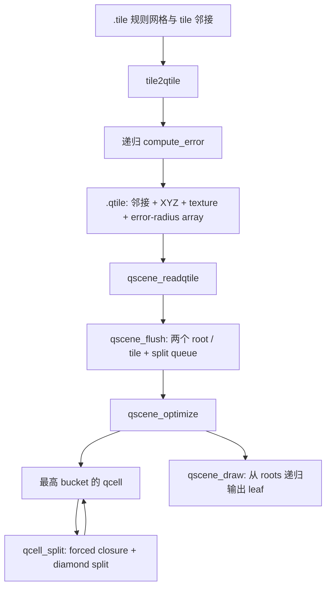

# LibGen ROAM 论文参考实现源码分析

## 1. 分析定位与结论

本文分析 `third_party/LibGenROAM010206` 中由 ROAM 论文作者 Mark Duchaineau 提供的参考源码。论文基线采用 1997 年的 [ROAMing Terrain: Real-time Optimally Adapting Meshes](roaming_terrain_paper.md)（[OSTI 原始 PDF](https://www.osti.gov/servlets/purl/632827)）。本文不把“作者源码”和“论文全部机制在这个快照中完整启用”混为一件事：论文概念以论文为准，具体行为以仓库中的 `.l` 源码为准。

最重要的结论如下：

1. **源码事实：** 真正的动态 ROAM 核心位于 [`Qscene/qscene.l`](../../third_party/LibGenROAM010206/Qscene/qscene.l)，不是名字中带有 ROAM 的离线工具 `Tile/Tileroamfix`。
2. **源码事实：** 该实现使用两个根三角形覆盖每个规则网格 tile，以 `qcell` 裸指针组成活动 Binary Triangle Tree，并保存 parent、两个 child、left/right/base neighbor。
3. **源码事实：** `Tile2qtile` 离线生成 error-radius 数组；运行时以 4096 个 bucket 组成 split priority queue，固定三角形目标 `ntrimax` 下反复拆分最高优先级 leaf。
4. **源码事实：** `qcell_split` 总是把一个 triangle 与其 base neighbor 一起拆成四个 child。base neighbor 更粗时会递归先拆它，因此实现了经典 ROAM 的 forced split 和 diamond 裂缝约束。
5. **源码事实：** 该源码声明了 merge queue 及其状态，但没有 merge 函数，也从未把节点放入 `QSTATE_MERGE_QUEUED`。每次 `qscene_optimize` 都先 `qscene_flush`，再从根重新 split；它不是论文所述的跨帧双队列增量更新。
6. **源码事实：** 当前 priority 只取离线几何误差 `q->e`，不读取相机、投影、屏幕尺寸或视锥。`QSTATE_OUT` 和 `setfrustum()` 只留下接口痕迹，没有可执行实现。
7. **疑似源码缺陷：** `compute_error` 写入 `e[bi] = max(childError) + localError`，却返回 `e1` 而不是 `e[bi]`。由于基例返回 0，可由递归归纳证明所有返回值均为 0，实际父节点不会得到深层误差传播。
8. **工程结论：** 这份代码非常适合确认论文式 bintree、bucket queue 和 diamond split 的原始数据结构；但不能直接当作“论文完整 ROAM”的可执行性能基线，因为 merge、视点相关评分、视锥、帧间增量优化和 incremental triangle stripping 在此快照中都未完成。
9. **项目口径：** 当前项目使用该源码和论文校准误差公式、拓扑关系与阶段职责，不以逐格式复刻或恢复完整最优性证明为目标。项目的持久双队列与增量 indexed Mesh 是现代工程实现，应按各阶段的真实复杂度和拓扑验证结果评价，不能借参考源码名称扩张为论文全套保证。

本文使用以下标签：

- **源码事实：** 可由当前仓库代码直接确认。
- **论文基线：** 论文描述的算法职责，不代表当前快照已实现。
- **根据实现推断：** 由控制流、数据布局或复杂度推导出的结论。
- **疑似源码缺陷：** 实际表达式与字段命名、注释或算法目标明显不一致。
- **尚无法确认：** 缺少输入、构建产物或运行记录，静态阅读不能证明。

## 2. 源码边界与文件分工

LibGen 是一套带自定义预处理器的 C 开发环境。顶层 [`README`](../../third_party/LibGenROAM010206/README) 第 46-75 行明确说明：`.l` 是真实源文件，`.c` 和 `.h` 是机器生成文件；`.l` 中主体仍是 C，只增加 `lib_public`、`lib_struct`、`lib_include`、`lib_main` 等构建和声明指令。

[`Lib/README`](../../third_party/LibGenROAM010206/Lib/README) 第 202-226 行给出了 `lib_struct` 的展开规则：

```c
lib_struct { ... } node;

// 预处理后等价于
typedef struct node_structdef node_struct, *node;
struct node_structdef { ... };
```

因此 `qscene`、`qtile`、`qcell`、`qpool` 都是指针 typedef，运行时仍是 C 裸指针对象图。

| 文件 | 关键符号 | 角色 |
| --- | --- | --- |
| [`Qscene/qscene.l`](../../third_party/LibGenROAM010206/Qscene/qscene.l) | `qscene`、`qtile`、`qcell`、`qscene_optimize`、`qcell_split` | 运行时 ROAM 核心 |
| [`Qscene/Tile2qtile/tile2qtile.l`](../../third_party/LibGenROAM010206/Qscene/Tile2qtile/tile2qtile.l) | `compute_error` | 把 `.tile` 转成带 error-radius tree 的 `.qtile` |
| [`Qscene/Qtilespin/qtilespin.l`](../../third_party/LibGenROAM010206/Qscene/Qtilespin/qtilespin.l) | `lib_main`、`spevent` | 交互测试程序，按键触发 optimize 和绘制 |
| [`Tile/tile.l`](../../third_party/LibGenROAM010206/Tile/tile.l) | `tileobj`、`tile`、`tileobj_readascii` | 规则 tile 网格及四边邻接输入 |
| [`Sys/Qpool/qpool.l`](../../third_party/LibGenROAM010206/Sys/Qpool/qpool.l) | `qpool_create`、`qpool_get`、`qpool_put` | `qcell` 固定尺寸对象池 |
| [`Sys/Fio/fio.l`](../../third_party/LibGenROAM010206/Sys/Fio/fio.l) | `fio_read`、`fio_write` | 一次性读取/写入 `.qtile` 二进制缓冲区 |
| [`Tile/Tileroamfix/tileroamfix.l`](../../third_party/LibGenROAM010206/Tile/Tileroamfix/tileroamfix.l) | 离线 remap 逻辑 | 优化 tile 参数化，不参与 `Qscene` 运行时 split |

**源码事实：** 仓库中没有 `.tile` 或 `.qtile` 示例文件，项目 CMake 也没有引用 LibGenROAM。因此本文是静态源码分析，不包含该历史程序的运行截图或性能测量。

## 3. 总体数据流

该实现分为离线转换和运行时选择两部分：



运行时伪代码可以忠实简化为：

```c
scene = qscene_create();
qscene_readqtile(scene, file); // 内部会建立 base mesh

on_user_optimize:
    qscene_flush(scene);       // 丢弃上次活动树，从 roots 重建
    while (scene->ntri < scene->ntrimax) {
        qcell_split(scene->splitq[scene->iqsmax]);
    }

on_draw:
    for each tile:
        recursively draw leaves below tile->q0 and tile->q1;
```

这条链与论文的完整运行循环有显著差异：论文使用 split/merge 双队列和帧间相干性渐进调整 active cut；当前源码每次 optimize 都从 base mesh 重建，而且 optimize 只由测试程序按键触发。

## 4. 输入地形与离线 `.qtile` 构建

### 4.1 `.tile` 输入

[`tileobj_readascii`](../../third_party/LibGenROAM010206/Tile/tile.l#L63) 读取：

- `n`：tile 数量；
- 每个 tile 四条边的 neighbor tile index 和 neighbor edge index；
- `nu × nv` 个三维位置；
- 同样数量的法线。

[`tile2qtile` 输入检查](../../third_party/LibGenROAM010206/Qscene/Tile2qtile/tile2qtile.l#L30) 要求所有 tile 都是相同的正方形，并满足：

```text
width = height = 2^ns + 1
```

代码中的 `((x - 1) & (x - 2))` 正是在检查 `x - 1` 是否为 2 的幂。随后：

```text
lmax = 2 * ns
```

原因是一次 bintree split 只沿一个方向减半，经过两层 split 才相当于规则网格两个轴都提高一级分辨率。例如 `5×5` 网格中 `ns=2`、`lmax=4`，两个 root 在第 4 层共有 `2 × 2^4 = 32` 个最细三角形，正好等于 `4×4` 个网格 cell 各两个三角形。

### 4.2 `.qtile` 格式

[`tile2qtile` 第 50-53、123-133 行](../../third_party/LibGenROAM010206/Qscene/Tile2qtile/tile2qtile.l#L50) 把每个 tile 写成原生二进制块：

```text
文件头:
    int tileCount
    int ns
    int textureSize

每个 tile:
    4 × (neighborTileIndex, neighborEdgeIndex)
    (2^ns + 1)^2 × float3 positions
    textureSize^2 × RGBA int
    (2 << lmax) × float errors
```

**源码事实：** 文件没有 magic、版本、字节序、字段长度或独立所有权信息；它直接保存本机 `int`/`float` 表示。该格式适合当时同平台工具链，不是可移植资源格式。

### 4.3 Error-radius tree 的索引

每个 tile 有两个 root：

```text
root q0: bi = 2
root q1: bi = 3
left child:  bi = parent.bi * 2
right child: bi = parent.bi * 2 + 1
```

索引 0 和 1 不使用。长度 `2 << lmax` 为两个交织的完整 bintree 提供足够空间；最细层 `l == lmax` 的 `qcell.e` 直接设为 0，不读取数组。

### 4.4 `compute_error` 的意图与实际行为

[`compute_error`](../../third_party/LibGenROAM010206/Qscene/Tile2qtile/tile2qtile.l#L141) 以当前三角形 base 两端 `(i0,j0)`、`(i1,j1)` 和 apex `(i2,j2)` 为输入。局部误差是实际 base midpoint 与线性 midpoint 的三维欧氏距离：

```text
M_actual = P[(i0+i1)/2, (j0+j1)/2]
M_linear = (P[i0,j0] + P[i1,j1]) / 2
e_local  = length(M_actual - M_linear)
```

代码写入：

```text
e[bi] = max(e_left, e_right) + e_local
```

这与本项目当前 `Roam::BuildNestedWedgieSubtree` 的公式意图一致：把本层 displacement 加到两个 child thickness 的最大值上，形成覆盖后代位移的嵌套保守半径。区别在于本项目共享实现会正确返回刚算出的 `thickness`，而该参考生成器的返回值存在下述缺陷。

但函数实际结尾是：

```c
e[bi] = e2 + e3;
return e1;
```

其中 `e1` 是右子调用的返回值。基例 `l >= lmax` 返回 0，因此：

1. 最深内部节点的左右递归都返回 0；
2. 该节点虽然写入自己的 `e_local`，但向父返回 0；
3. 对任意更高层重复同样推理，左右返回值始终为 0；
4. 所有 `e[bi]` 实际都只等于本节点 `e_local`。

**疑似源码缺陷：** 第 166 行应很可能返回 `e[bi]` 或 `e2 + e3`。当前写法使隐藏在深层、但不落在父 base midpoint 上的起伏无法传播到父优先级。这一点可由控制流静态证明，但由于仓库没有原始 `.qtile` 样例和作者测试输出，无法确认它是发布失误、未完成草稿，还是作者当时有未包含在此目录中的修订版。

## 5. 核心数据结构

### 5.1 `qscene`

[`qscene`](../../third_party/LibGenROAM010206/Qscene/qscene.l#L39) 是全局优化器状态：

| 字段 | 含义 | 实际使用情况 |
| --- | --- | --- |
| `qt0/qt1` | tile 双向链表首尾 | 已使用 |
| `ntri` | 当前带 `QSTATE_ISDRAW` 的 leaf 数 | 由 `qcell_queue` 增减 |
| `ntrimax` | 目标三角形数，默认 3000 | optimize 停止条件 |
| `qqp` | `qcell` 对象池 | 每次 flush 重建 |
| `splitq[4096]` | split bucket heads | 已使用 |
| `iqsmax` | 当前最高非空 split bucket | 已使用 |
| `mergeq[4096]` | merge bucket heads | 只有通用队列代码，算法未使用 |
| `iqmmin` | 当前最低非空 merge bucket | 同上 |
| `drawmode` | 普通纹理或叠加网格线 | 已使用 |
| `debugsplit` | 打印最后若干 split 信息 | 已使用 |

### 5.2 `qtile`

[`qtile`](../../third_party/LibGenROAM010206/Qscene/qscene.l#L53) 是一个规则参数域 patch：

- `qt[4]` / `qt_ei[4]`：四边相邻 tile 及对方 edge；
- `ns` / `lmax`：网格指数和 bintree 最大层；
- `p`：完整规则网格 XYZ；
- `e`：两个 root 交织的 error-radius 数组；
- `q0/q1`：覆盖 tile 的两个活动 root；
- texture 字段：每个 tile 的 OpenGL 纹理。

`qtile` 不拥有独立复制的 `p/e/tex_ras`。[`qscene_readqtile`](../../third_party/LibGenROAM010206/Qscene/qscene.l#L168) 一次读入整个文件，三个指针直接指向该 buffer 内部；源码第 174-175 行因此明确要求不要释放 buffer。

### 5.3 `qcell`

[`qcell`](../../third_party/LibGenROAM010206/Qscene/qscene.l#L68) 是活动 bintree triangle：

| 字段 | 语义 |
| --- | --- |
| `qt` | 所属 tile |
| `l` | bintree 层级，root 为 0 |
| `qstate` | leaf/draw/queued/out/max 组合状态 |
| `bi` | 离线误差数组索引 |
| `ij[3][2]` | 三个顶点的 tile 网格整数坐标 |
| `p[3][3]` | 创建时从 tile 复制的三个世界空间位置 |
| `uv[3][2]` | 纹理坐标 |
| `e` | `qt->e[bi]` 的缓存 |
| `iq` | 当前 bucket index |
| `qp` | parent |
| `qc0/qc1` | 两个 child；`qc0 != 0` 被当作非 leaf 判定 |
| `q0/q1/qb` | left、right、base neighbor |
| `qq0/qq1` | bucket 内双向链表指针 |

节点同时复制 `ij`、`p`、`uv`，并保存九个拓扑/队列裸指针。它是典型对象式 AoS 节点，便于直接读写拓扑，但 cache footprint 较大且不适合批量 SIMD/GPU 访问。

### 5.4 `qstate`

[`QSTATE_*`](../../third_party/LibGenROAM010206/Qscene/qscene.l#L15) 将状态压成 bit field：

- `QSTATE_LEAF_QUEUED = leaf + draw + queued`：可继续 split 的活动叶；
- `QSTATE_LEAF_MAX = leaf + draw + max`：已达最细层，绘制但不入队；
- `QSTATE_LEAF_OUT = leaf + out`：设计上表示视锥外 leaf，不绘制；当前未使用；
- `QSTATE_MERGE_QUEUED`：可 merge internal；当前未产生；
- `QSTATE_MERGE_NOT`：不可 merge internal；当前所有已 split parent 都进入该状态。

[`qcell_queue`](../../third_party/LibGenROAM010206/Qscene/qscene.l#L389) 是队列和 `ntri` 的唯一状态变更入口。它先按旧状态减少 draw triangle 数，再从旧 bucket 摘除节点，写入新状态，插入新 bucket，最后按新状态增加 draw triangle 数。

### 5.5 `qpool`

[`qpool`](../../third_party/LibGenROAM010206/Sys/Qpool/qpool.l#L16) 每次按 256 条 record 扩容。每条 `qcell` 前有一个维护 free/active 双向链表的 `qpoolref`；源码把 header 大小硬编码为 16 字节，反映其原始 32 位 ABI 假设。`qpool_get` 为 O(1) 弹出 free record；没有 free record 时分配新 block。

**源码事实：** `Qscene` 构建期间从不调用 `qpool_put`。节点只会持续增加，直到下一次 `qscene_flush` 直接 `qpool_destroy` 整个池。因此这里使用的是块式 arena 生命周期，不是支持 merge 后逐节点复用的 freelist 生命周期。

## 6. 初始化与根拓扑

### 6.1 `qscene_create`

[`qscene_create`](../../third_party/LibGenROAM010206/Qscene/qscene.l#L108) 完成：

1. 分配 `qscene`；
2. 设置 `ntrimax=3000`；
3. 创建用于网格线叠加的 128×128 line-mask texture；
4. 调用 `qscene_flush`。此时还没有 tile，因此 flush 只清空队列和计数。

### 6.2 `qscene_readqtile`

[`qscene_readqtile`](../../third_party/LibGenROAM010206/Qscene/qscene.l#L168) 完成：

1. 用 `fio_read` 把文件读入一块 LibGen managed buffer；
2. 创建全部 `qtile`，这样解析 neighbor index 时所有对象都已存在；
3. 让 `p`、`tex_ras`、`e` 指向文件 buffer 内部；
4. 创建每个 tile 的 OpenGL texture；
5. 调用 `qscene_flush` 建立 base mesh。

### 6.3 `qscene_flush`

[`qscene_flush`](../../third_party/LibGenROAM010206/Qscene/qscene.l#L270) 是拓扑重置函数：

1. 销毁整个旧 `qcell` pool；
2. 清空所有 tile root；
3. 清空 split/merge buckets，设置 `iqsmax=-1`、`iqmmin=4096`、`ntri=0`；
4. 创建新 `qpool`；
5. 为每个 tile 创建两个 root，并按 error 加入 split queue；
6. 连接 tile 内 root diamond 和跨 tile 四边邻接。

设 `k = 2^ns`，两个 root 的网格坐标是：

```text
q0 = [(0,0), (k,k), (0,k)]   bi=2
q1 = [(k,k), (0,0), (k,0)]   bi=3
```

`q0` 与 `q1` 的 base 都是方形对角线 `(0,0) <-> (k,k)`，方向相反，因此互为 `qb`。其余四条 side edge 通过 `qt[4]` 与相邻 tile 的相应 root 建立双向关系。

**拓扑前提：** loader 和 flush 都假设每条 tile 边有合法 neighbor index，并直接解引用。该实现面向可拼接的多 tile surface；边界 tile 必须在输入中提供合法拓扑约定，不能简单用空 neighbor 表示开放边界。

## 7. Split Priority Queue

### 7.1 Bucket 结构

split queue 不是 binary heap，而是 4096 个 bucket，每个 bucket 是 `qcell` 双向链表。`iqsmax` 指向最高非空 bucket：

```text
splitq[0]      最低误差
...
splitq[4095]   最高误差
```

插入和删除 bucket 链表本身是 O(1)。当最高 bucket 变空时，[`qcell_queue` 第 413-423 行](../../third_party/LibGenROAM010206/Qscene/qscene.l#L413) 向下线性寻找下一个非空 bucket，最坏扫描 4096 项。相同 bucket 内新节点插到表头，因此 tie-break 是近似 LIFO，不保证稳定几何顺序。

### 7.2 Priority 公式

[`qcell_priority`](../../third_party/LibGenROAM010206/Qscene/qscene.l#L530) 使用固定范围：

```text
emin = 0.00001
emax = 10.0
```

若 `e` 落在区间内，bucket 为：

```text
t  = (ln(e) - ln(emin)) / (ln(emax) - ln(emin))
iq = floor(0.999990 * 4096 * t + 0.000005)
```

小于 `emin` 映射到 0，大于 `emax` 映射到 4095。对数映射让多个数量级的 error radius 都能获得 bucket 分辨率。

**源码事实：** 该公式只使用 `q->e`。相机位置、view/projection、viewport、FOV、屏幕像素误差和视锥均不参与。固定 `emin/emax` 还隐含了输入几何单位和尺度应大致落在作者预期范围内。

### 7.3 固定三角形目标

[`qscene_optimize`](../../third_party/LibGenROAM010206/Qscene/qscene.l#L218) 不使用 split threshold，而是在固定 `ntrimax` 下不断取最高 priority：

```c
qscene_flush(qs);
while (qs->ntri < qs->ntrimax)
    qcell_split(qs->splitq[qs->iqsmax]);
```

所有可分 leaf 即使 error 落在 bucket 0，只要预算目标还没满足，最终也可能被 split。因此这是“固定输出规模下近似最大误差优先”，不是“误差超过阈值才细分”。

## 8. Diamond Split 与裂缝约束

### 8.1 几何拆分规则

[`qcell_split`](../../third_party/LibGenROAM010206/Qscene/qscene.l#L454) 把 `ij[0]`、`ij[1]` 之间的边视为 base，把 `ij[2]` 视为 apex。设：

```text
T = [A, B, C]
M = midpoint(A, B)
```

则两个 child 是：

```text
T0 = [C, A, M]
T1 = [B, C, M]
```

child 的 base edge 分别是父三角形的两条 side edge；共同 midpoint `M` 成为两个 child 的 apex。

### 8.2 为什么一次创建四个 child

函数令 `qb = q->qb`，同时创建：

```text
q   -> qc0,  qc1
qb  -> qbc0, qbc1
```

也就是一次提交完整 diamond，而不是只拆请求三角形。提交前 `q` 与 `qb` 是共享 base 的两个 leaf；提交后共享 base midpoint 成为四个 child 的公共新顶点，两侧边界一致，不产生 T-junction。

每个完整 diamond split 的 `ntri` 变化是：

```text
移除两个 parent leaf: -2
加入四个 child leaf:  +4
净变化:               +2
```

### 8.3 Forced split

若请求三角形的 base neighbor 更粗：

```c
if (q->qb->l < q->l)
    qcell_split(q->qb);
```

更粗的 base neighbor 会先与它自己的 base neighbor 构成 diamond 并 split。这个过程可能继续向更粗层递归；完成后，原 `q` 的邻接引用已被 `BASEATTACH` 更新到同层 child，随后才提交原 diamond。

**根据实现推断：** 正常 bintree 拓扑中，每次递归都朝更低 `l` 的 neighbor 前进，而层级下界为 0，因此会终止。源码没有显式 recursion guard、visited set 或 null check，终止性依赖邻接不变量和合法 tile 拓扑。

### 8.4 邻接更新

`BASEATTACH(Q, QCX, QX)` 做两件事：

1. `QCX->qb = Q->QX`，让 child base neighbor 指向父节点某条 side edge 的旧邻居；
2. 在旧邻居的 `q0/q1/qb` 中，把对 `Q` 的反向引用替换为 `QCX`。

四次调用分别把 `q/qb` 的 left/right side neighbors 接给四个 child。随后第 510-513 行建立 diamond 内部邻接：

```text
qc0.q0  = qc1       qc0.q1  = qbc1
qc1.q0  = qbc0      qc1.q1  = qc0
qbc0.q0 = qbc1      qbc0.q1 = qc1
qbc1.q0 = qc0       qbc1.q1 = qbc0
```

这组写入同时连接同 parent sibling 和 diamond 对侧 child。外部邻居的反向引用与内部四边连接共同恢复了活动三角网格的双向邻接。

## 9. 5×5 网格手算示例

取一个 `5×5` tile：

```text
ns   = 2
k    = 4
lmax = 4
```

根三角形：

```text
T  = q0 = [(0,0), (4,4), (0,4)]
TB = q1 = [(4,4), (0,0), (4,0)]
```

它们共享对角 base，midpoint 为 `M=(2,2)`。第一次 `qcell_split(T)` 不会只生成两个三角形，而是拆整个根 diamond：

```text
T0  = [(0,4), (0,0), (2,2)]
T1  = [(4,4), (0,4), (2,2)]
TB0 = [(4,0), (4,4), (2,2)]
TB1 = [(0,0), (4,0), (2,2)]
```

结果：

- 活动三角形由 2 增至 4；
- 两个 root 变成 non-leaf；
- 四个 child 的 `l=1`；
- `bi` 分别是 root 2 的 children 4/5，以及 root 3 的 children 6/7；
- 四个 child 都进入 split queue，因为 `l=1 < lmax=4`；
- 中心点 `(2,2)` 在 diamond 两侧共同创建，不存在一侧有 midpoint、另一侧没有的裂缝。

若后续 `T0` 想 split，而 `T0.qb` 仍比它粗，函数先递归 split `T0.qb` 所在 diamond。该递归不是为了提高请求区域本身的误差精度，而是为了让请求 edge 两侧达到兼容层级。

误差传播可用一个抽象例子说明当前缺陷：假设 root 的 base midpoint 完全在线性平面上，`e_local(root)=0`，但左后代出现 `e_local=2`。设计公式应让 root 至少得到 2；当前返回值链始终为 0，root 最终仍写 0，隐藏细节不会提高 root 的 split priority。

## 10. Merge、帧间增量与预算语义

### 10.1 Merge queue 只是骨架

源码已声明：

- `mergeq[4096]`；
- `iqmmin`；
- `QSTATE_MERGE_QUEUED`；
- `qcell_queue` 对 merge bucket 的插入、删除和最小 bucket 更新逻辑。

但全目录搜索可以确认：

- 没有 `qcell_merge` 或等价提交函数；
- `QSTATE_MERGE_QUEUED` 只出现在宏定义；
- split 后 parent 明确进入 `QSTATE_MERGE_NOT`，旁边注释写着未来才改为 `MERGE_QUEUED`；
- `qpool_put` 没有被 `Qscene` 调用。

所以降低 `ntrimax` 时，[`Qtilespin` 的 `<` 按键](../../third_party/LibGenROAM010206/Qscene/Qtilespin/qtilespin.l#L79) 不是在旧树上 merge，而是调用 `qscene_optimize`，由后者 flush 后重新 split 到更低目标。

### 10.2 不具备帧间相干性

**论文基线：** ROAM 的重要性能来源是跨帧保留 active cut 和 split/merge queues，只修改少量拓扑。

**源码事实：** 当前 `qscene_optimize` 每次都销毁整个 qcell pool、重建 roots 和 split queue。相机旋转时 `Qtilespin::do_draw` 只重画，不自动 optimize；按 `r` 或修改预算后才手动重建。

因此该快照展示的是“按优先级从 base mesh 构造一个无裂缝 bintree cut”，而不是论文完整的“每帧增量维护该 cut”。

### 10.3 `ntrimax` 不是硬上限

循环条件是 `ntri < ntrimax`，一次普通 diamond split 净增 2，forced chain 还可能在一次请求中先提交多个 diamond。因此：

- 最终 `ntri` 可以超过 `ntrimax`；
- base mesh 已大于目标时不会 merge，直接保留 base triangle 数；
- 不能像本项目 `TriangleBudget` 一样保证最终活动 leaf 不超过配置值。

**潜在正确性风险：** 当目标超过最细网格可提供的三角形数时，所有 leaf 都进入 `QSTATE_LEAF_MAX`，split queue 为空且 `iqsmax=-1`，但 while 条件仍可能成立，随后访问 `splitq[-1]`。源码没有 capacity clamp 或空队列终止条件。

## 11. 视点、视锥和误差口径

[`qscene.l` 公共接口](../../third_party/LibGenROAM010206/Qscene/qscene.l#L84) 在 `qscene_readqtile` 后留有注释 `...more: setfrustum() call`，状态位也预留了 `QSTATE_ISOUT/QSTATE_LEAF_OUT`。但当前源码中：

- 没有 `setfrustum` 实现；
- 没有 camera/view/projection 字段；
- 没有屏幕尺寸或 FOV；
- 没有节点 bounding volume 对 frustum 的测试；
- `qcell_priority` 只读取世界单位 error radius；
- `QSTATE_LEAF_OUT` 从未被赋值。

所以相机移动只改变 OpenGL 观察矩阵，不改变 LOD 决策。近处、远处、屏幕后方在相同几何误差下有相同 priority。

这与论文中“灵活的 view-dependent error metric、frustum culling 和指定 triangle count”不是同一完成度。更准确的命名是：

```text
当前 Qscene priority = log-quantized object-space error priority
```

而不是 screen-space error。

## 12. 渲染输出

[`qscene_draw`](../../third_party/LibGenROAM010206/Qscene/qscene.l#L239) 从每个 tile 的两个 root 开始；[`qscene_drawsub`](../../third_party/LibGenROAM010206/Qscene/qscene.l#L321) 以 `qc0 != null` 判断 internal，递归到两个 child，否则输出 leaf：

```c
glBegin(GL_TRIANGLE_STRIP);
for (vi = 0; vi < 3; vi++) {
    glTexCoord2fv(q->uv[vi]);
    glVertex3fv(q->p[vi]);
}
glEnd();
```

实际特点：

- 每个 leaf 单独一次 `glBegin/glEnd`；
- 三个顶点即时提交，不共享 vertex/index buffer；
- 输出顺序是 tile list、root q0/q1、child qc0/qc1 的 DFS；
- normal 不在 `qcell` 中，也未在这条 draw path 提交；
- 普通模式使用 tile texture；mesh debug 模式再递归一遍，以 line-mask texture 和 alpha blend 叠加边线；
- 没有 incremental triangle stripping，尽管论文把它列为性能优化。

裂缝避免来自拓扑 split closure，而不是渲染阶段补裙边、退化三角形或 stitch index。

## 13. 生命周期与内存管理

### 13.1 静态资源

`.qtile` 文件 buffer 由 `fio_read` 通过 `mem_get` 分配。`qtile.p/e/tex_ras` 借用其中的地址，buffer 没有显式 owner 字段，也没有 scene destructor。测试程序只读取一次，因此其预期生命周期是进程级。

### 13.2 动态拓扑

每次 `qscene_flush`：

```text
destroy old qpool blocks
create new qpool
allocate root qcells
allocate children in 256-record blocks as split progresses
```

节点地址在一个 optimize 内稳定，因为 block 不移动；裸 neighbor/parent/child 指针因此有效。下一次 flush 后所有旧 `qcell*` 同时失效。

### 13.3 风险

- `qscene_readqtile` 若被同一 scene 调用多次，会继续追加 qtile，并保留旧文件 buffer，没有清理路径；
- raw binary 中的 neighbor index、尺寸和 buffer 长度缺少完整边界验证；
- `qcell_split` 直接解引用 `q->qb` 及外部 neighbor，依赖输入和前序更新正确；
- `qpool_put` 自身注释称实现危险，但 Qscene 当前不调用它；
- 运行时没有 assert 或 topology validator。

## 14. 关键拓扑不变量

| 不变量 | 建立位置 | 依赖位置 | 破坏后后果 |
| --- | --- | --- | --- |
| 每个 tile 有两个互为 base 的 root | `qscene_flush` 303-312 | 第一次 diamond split | 空指针或错误裂缝传播 |
| leaf 同时没有 `qc0/qc1` | `qcell_create`、`qcell_split` | draw recursion | 漏绘或重复绘制 |
| non-leaf 同时拥有两个 child | `qcell_split` 497-498 | draw、后续邻接 | 半棵 bintree |
| 同层 base pair 构成合法 diamond | forced split + `BASEATTACH` | 四 child 原子创建 | T-junction 或错误 neighbor |
| 邻居对 parent 的反向引用被替换为 child | `BASEATTACH` | 后续 forced split | 悬挂到 inactive parent |
| `ntri` 等于带 `ISDRAW` 状态的活动 leaf 数 | `qcell_queue` | optimize 停止条件 | 预算失真 |
| queued leaf 的 `iq` 与所在 bucket 一致 | `qcell_queue` | 最高优先级选择 | 错误排序或链表损坏 |
| `l <= lmax` | root 创建及 child 入队条件 | error lookup、整数 midpoint | 越界或退化三角形 |
| 每条 tile 边有合法双向邻接 | `.tile` 输入和 flush | 跨 tile split | 越界、崩溃或接缝 |

当前源码没有 validator。最值得增加的检查包括 neighbor reciprocal consistency、parent/child 完整性、bucket membership、`ntri` 重算、`bi` 范围以及最终 leaf edge 的 T-junction 检测。

## 15. 性能特征

### 15.1 可直接证明

- 离线 error tree 对完整 bintree 递归，时间和空间均与最细三角形数同阶；
- 运行时每个实际 diamond split 创建四个 `qcell`，普通提交净增两个活动 leaf；
- bucket queue 插入/删除 O(1)，寻找下一个非空优先级最多扫描固定 4096 buckets；
- forced split 成本取决于 base-neighbor 兼容链长度；
- 每次 optimize 从 roots 重建，不能只按本帧变化量付费；
- draw 每帧递归遍历所有 active leaf，并为每个 leaf 发起一个 immediate-mode primitive；
- 节点通过裸指针跳转，字段为 AoS，活动遍历不是连续数组扫描。

### 15.2 根据实现推断

- 在高 triangle count 下，逐 leaf `glBegin/glEnd` 很可能比纯三角形顶点吞吐更早成为瓶颈；
- qpool 减少了逐节点系统 allocator 成本，但指针图和较大的 `qcell` 会产生明显 cache miss；
- 固定 bucket 数使 priority 操作成本可控，但牺牲精确全序；
- 由于每次 optimize 全量重建，queue 和节点创建成本会与输出规模近似线性，而不是论文期望的“与帧间变化量近似成正比”。

这些瓶颈的实际占比仍需在可运行的历史 Linux/IRIX 或兼容移植环境中 profiler 才能确认。

## 16. 与论文机制的对应关系

| 论文 ROAM 概念 | 当前源码对应 | 完成度 |
| --- | --- | --- |
| Triangle bintree | `qcell` parent/children，两个 roots/tile | 已实现 |
| 预处理误差界 | `tile2qtile::compute_error`、`qtile.e` | 结构已实现；返回值疑似使深层传播失效 |
| Split priority queue | `splitq[4096]`、`iqsmax` | 已实现，但 priority 不是 view-dependent |
| Merge priority queue | `mergeq[4096]`、`iqmmin`、状态宏 | 仅骨架，无候选产生和提交 |
| Diamond split | `qcell_split` 同时拆 `q/qb` | 已实现 |
| Forced split | base neighbor 更粗时递归 | 已实现，无显式 guard |
| Continuous triangulation | 四 child 邻接和反向引用更新 | 设计上已实现，缺少 validator |
| 固定 triangle count | `ntrimax` | 近似目标下界，不是严格计数 |
| View-dependent priority | `setfrustum` 注释、OUT 状态位 | 未实现 |
| Frustum culling | `QSTATE_LEAF_OUT` | 未实现 |
| Frame-to-frame coherence | 双队列增量修改 active cut | 未实现；每次 flush 重建 |
| Priority deferral lists | 无对应结构 | 未实现 |
| Incremental triangle strips | 无对应结构 | 未实现；逐 leaf immediate draw |
| Split/merge morphing | 无时间状态或插值 | 未实现 |
| Dynamic terrain error update | 无 error tree 更新入口 | 未实现 |

所以，“标准 ROAM 源码”在这里应理解为“作者提供、直接体现原始数据结构与核心 split closure 的参考实现”。不能据此说该 542 行 `Qscene` 已覆盖论文每一项工程优化。

## 17. 与本项目 Classic / DOD 的比较

| 维度 | LibGen Qscene | 当前 Classic CPU ROAM | 当前 DOD CPU ROAM |
| --- | --- | --- | --- |
| 输入 | 多 tile、每点 float3 XYZ、四边拓扑 | 单高度图 + terrain/height scale | 同 Classic |
| 根结构 | 每 tile 两个 root | 整幅高度图两个 root | 同 Classic |
| 节点布局 | `qcell` AoS + 裸指针 + qpool | `ClassicRoamNode` AoS + 裸指针，`unique_ptr` 拥有 | 多个连续 vector 的 SoA + index |
| 几何存储 | 每节点复制 `ij/p/uv` | 节点只存 UV domain，按需采样世界坐标 | 同 Classic domain，字段分列 |
| 误差预计算 | 离线 error-radius，疑似只剩 local midpoint | 运行前按论文公式 (1) 构建 nested wedgie tree | 与 Classic 同口径，共用公式实现 |
| Split priority | object-space error 的 4096 bucket | 像素 SSE + frustum 的持久 indexed `Q_s` | 复用 `ActiveLeafNodes` 的持久 `Q_s`，并行刷新优先级 |
| Split closure | 一次函数原子拆完整 diamond | requested split + 递归 forced base split | 同语义，索引拓扑与部分 chunk 提交 |
| Merge | 未实现，降低目标时全量重建 | 持久 `Q_m` + 动态 diamond merge | 持久 `Q_m`，每个 diamond 只入队一次；并行预提交 + 动态级联 |
| 跨帧拓扑 | 无，每次 optimize flush | 持久 child/topology 与 `Q_s/Q_m` 队列成员 | 持久 index topology 与 `Q_s/Q_m` 队列成员 |
| 预算 | `ntri >= ntrimax` 后停止，可超目标 | active leaf 硬上限 + forced token + merge-first crossover | 同硬上限；串行普通 token、并行原子 token，持续交换至队首条件收敛 |
| 视锥/FOV/屏幕 | 未进入评分 | 公式 (2)/(3) 角点保守像素 bound + 可见性 | 同 Classic；shader 同口径 |
| 输出 | OpenGL immediate mode，每 leaf 3 顶点 | 持久 dense slots + dirty ranges 的增量 indexed CPU Mesh | CPU Mesh 或 GPU snapshot，直接读 `ActiveLeafNodes` |
| 并行 | 串行 | 串行 baseline | 批量扫描及安全 chunk 并行 |
| 验证/统计 | 无 topology validator，只有 `ntri` 和 debug print | topology issue 与阶段统计 | 独立 root traversal 交叉验证活动索引 |

当前项目的 Classic 不是对 `Qscene` 的逐行移植。它保留“对象式裸指针 bintree + forced split”的经典工程角色，同时补上了这份参考快照未完成的论文公式 (1) nested wedgie 传播、公式 (2)/(3) conservative pixel bound、frustum、动态 merge、持久 dual queues、hard-budget crossover、增量 indexed Mesh 和验证。DOD 再把相同质量语义改成 SoA/index、活动索引和多线程阶段。

上述工程差异可直接定位到当前项目源码：

- [`Roam::BuildNestedWedgieSubtree`](../../src/algorithms/RoamNestedWedgie.h#L60) 使用 `max(leftThickness,rightThickness)+abs(baseMidpointDisplacement)` 把论文公式 (1) 的累计 thickness 传播到父节点；
- [`Roam::ComputeConservativeScreenDistortionPixels`](../../src/algorithms/RoamScreenProjection.h) 使用完整 `ViewProjection`、drawable width/height 和三个角点的公式 (3) 分子/分母极值，并处理 near-plane crossing；[`ClassicRoamMeshBuilder::ComputeScreenErrorScore`](../../src/algorithms/classic_roam/ClassicRoamScoring.cpp) 先执行 frustum 可见性判断，再组合 geometric bound 与独立 edge-density；
- [`ClassicRoamMeshBuilder::OptimizeWithPersistentDualQueues`](../../src/algorithms/classic_roam/ClassicRoamQueues.cpp) 跨帧维护 `Q_s/Q_m`，并在 hard budget 下执行 merge-first crossover；
- [`ClassicRoamMeshBuilder::ApplyIncrementalMeshUpdates`](../../src/algorithms/classic_roam/ClassicRoamMeshEmit.cpp) 按 split/merge edit 维护 dense slots，并将 dirty ranges 交给 OpenGL/D3D12 renderer 部分上传；
- [`DataOrientedRoamState::ActiveLeafNodes`](../../src/algorithms/data_oriented_roam/DataOrientedRoamState.h) 同时保存活动叶和持久 `Q_s` heap；
- [`RefreshPersistentSplitQueuePriorities`](../../src/algorithms/data_oriented_roam/DataOrientedRoamQueues.cpp) 与 [`RefreshPersistentMergeQueuePriorities`](../../src/algorithms/data_oriented_roam/DataOrientedRoamQueues.cpp) 并行刷新现有成员优先级；split/merge 事务只更新局部队列成员；
- [`DataOrientedRoamPipeline::BuildInternal`](../../src/algorithms/data_oriented_roam/DataOrientedRoamPipeline.cpp#L76) 在拓扑稳定后直接复用 `ActiveLeafNodes` 作为输出视图。

如果研究问题是“论文式 Classic ROAM 与 DOD+现代 CPU 优化相比如何”，合理口径应是：

1. 用 `Qscene` 证明原始架构选择：AoS 裸指针、bucket queue、对象池、diamond closure；
2. 以论文描述补齐双队列、view-dependent error 和帧间相干性的算法要求；
3. 用当前项目 Classic 作为可运行的现代等价 baseline，但明确它已经补齐并工程化了参考快照缺失的机制；
4. 比较 DOD 时保持误差、视锥、预算、merge 和输出质量一致，只把数据布局、批处理、活动索引和并行提交作为自变量。

直接拿未完成 view/merge 的 `Qscene` 与当前 DOD 跑耗时，不会得到公平或可解释的性能结论。

## 18. 源码风险与建议验证

### 18.1 高优先级

1. **`compute_error` 返回值：** 用最小合成 `5×5` tile 验证 parent error 是否包含后代误差；对比 `return e1` 和 `return e[bi]` 的完整数组。
2. **预算越界：** 把 `ntrimax` 设为超过 finest triangle count，确认是否访问 `splitq[-1]`。
3. **邻接不变量：** 每次 split 后遍历 active leaves，检查 reciprocal neighbor、共享 edge 端点和 T-junction。
4. **开放边界：** 确认原始 `.tile` 规范如何表达没有邻居的外边缘；当前代码不能接受 null。

### 18.2 中优先级

1. 测量 qpool active record 数与 `2 * internal + roots` 的关系；
2. 重新计算 `ntri` 并与 `qscene.ntri` 比较；
3. 检查同一 priority bucket 的 LIFO tie 是否导致输出不确定或空间偏置；
4. 验证跨 tile edge orientation 的 `qt_ei < 2 ? q1 : q0` 选择是否覆盖全部旋转/翻转组合；
5. 检查 raw `.qtile` 在 32/64 位、大小端和不同 `sizeof(int)` 平台上的兼容性。

### 18.3 尚无法确认

- 该目录没有 ROAM 专用 README、原始 `.tile/.qtile` 数据或预期输出图；
- 文件时间显示 `Qscene` 主体形成于 1999 年，目录版本名为 `LibGenROAM010206`，但仓库内没有发布 changelog 可说明精确版本谱系；
- 不清楚 `compute_error` 的正确返回值是否在作者其他未收录版本中修复；
- 不清楚 merge、frustum、defer list 和 incremental strip 是否存在于另一个作者内部/后续分支；
- 当前 Windows/CMake 项目未集成 Lib 预处理器，本文没有把历史程序移植后运行。

## 19. 完整符号索引

| 文件与符号 | 代码范围 | 职责 |
| --- | ---: | --- |
| [`qscene` / `qtile` / `qcell`](../../third_party/LibGenROAM010206/Qscene/qscene.l#L39) | 39-81 | 场景、tile 和活动三角形数据模型 |
| [`qscene_create`](../../third_party/LibGenROAM010206/Qscene/qscene.l#L108) | 108-166 | 创建场景和 debug line texture |
| [`qscene_readqtile`](../../third_party/LibGenROAM010206/Qscene/qscene.l#L168) | 168-216 | 读取二进制 tile、误差和纹理 |
| [`qscene_optimize`](../../third_party/LibGenROAM010206/Qscene/qscene.l#L218) | 218-232 | flush 后按最高 priority split 到目标数 |
| [`qscene_draw`](../../third_party/LibGenROAM010206/Qscene/qscene.l#L239) | 239-263 | 按 tile roots 绘制及 debug overlay |
| [`qscene_flush`](../../third_party/LibGenROAM010206/Qscene/qscene.l#L270) | 270-319 | 重建对象池、roots、queue 和邻接 |
| [`qscene_drawsub`](../../third_party/LibGenROAM010206/Qscene/qscene.l#L321) | 321-330 | 递归遍历 bintree leaf 并即时绘制 |
| [`qtile_create`](../../third_party/LibGenROAM010206/Qscene/qscene.l#L344) | 344-354 | 把 tile 加入 scene 链表 |
| [`qcell_create`](../../third_party/LibGenROAM010206/Qscene/qscene.l#L356) | 356-387 | 从 qpool 创建节点并复制几何/误差 |
| [`qcell_queue`](../../third_party/LibGenROAM010206/Qscene/qscene.l#L389) | 389-452 | 原子维护 qstate、bucket links 和 ntri |
| [`qcell_split`](../../third_party/LibGenROAM010206/Qscene/qscene.l#L454) | 454-528 | forced closure、四 child 创建和邻接修复 |
| [`qcell_priority`](../../third_party/LibGenROAM010206/Qscene/qscene.l#L530) | 530-539 | error radius 到 4096 bucket 的对数映射 |
| [`tile2qtile::lib_main`](../../third_party/LibGenROAM010206/Qscene/Tile2qtile/tile2qtile.l#L22) | 22-138 | 校验规则网格并写 `.qtile` |
| [`compute_error`](../../third_party/LibGenROAM010206/Qscene/Tile2qtile/tile2qtile.l#L141) | 141-167 | 递归计算并写 error-radius tree |
| [`Qtilespin::lib_main`](../../third_party/LibGenROAM010206/Qscene/Qtilespin/qtilespin.l#L24) | 24-41 | 创建窗口、场景并读取 qtile |
| [`Qtilespin::spevent`](../../third_party/LibGenROAM010206/Qscene/Qtilespin/qtilespin.l#L43) | 43-104 | 按键控制目标数、重建和 debug |
| [`qpool_create/get/put`](../../third_party/LibGenROAM010206/Sys/Qpool/qpool.l#L59) | 59-127 | 256-record block pool |
| [`tileobj_readascii`](../../third_party/LibGenROAM010206/Tile/tile.l#L63) | 63-116 | 读取 tile 网格、法线和边邻接 |
| [`fio_read`](../../third_party/LibGenROAM010206/Sys/Fio/fio.l#L44) | 44-77 | 把完整 `.qtile` 文件读入 managed buffer |

## 20. 最终判断

这份作者参考源码最有价值的部分不是一个可直接复用的现代 renderer，而是它以很少的代码明确展示了三件事：

1. 规则网格如何映射为两个交织的 triangle bintree；
2. 固定 bucket priority queue 如何在目标 triangle count 下选择 split；
3. base-neighbor forced recursion 和一次四 child 的 diamond commit 如何维持连续三角网格。

同时，静态源码也清楚说明它仍是一个阶段性参考实现：error-radius 传播疑似有返回值错误，merge queue 只是骨架，view/frustum 只有预留状态，每次 optimize 都全量重建，渲染则是逐 leaf immediate mode。理解这些边界后，才能正确使用它作为当前项目 Classic/DOD 研究对照的历史依据，而不是把目录名称自动等同于论文全部算法与性能主张。
